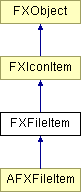

# FXFileItem

File item

### FXFileItem()

File time.

### FXFileItem(text, bi=None, mi=None, ptr=None)

Constructor.
| **Argument** | **Type** | **Default** | **Description** |
| --- | --- | --- | --- |
| text | String |  |  |
| bi | FXIcon | None |  |
| mi | FXIcon | None |  |
| ptr | String | None |  |

### getDate()

Return the date for this item.

### getSize()

Return the file size for this item.

### isBlockdev()

Return True if this is a block device item.

### isChardev()

Return True if this is a character device item.

### isDirectory()

Return True if this is a directory item.

Reimplemented in AFXFileItem.

### isExecutable()

Return True if this is an executable item.

### isFifo()

Return True if this is an FIFO item.

### isFile()

Return True if this is a file item.

### isSocket()

Return True if this is a socket.

### isSymlink()

Return True if this is a symbolic link item.

### Global flags

### **File List options**

| **FILELIST_SHOWHIDDEN** | Show hidden files or directories. |
| --- | --- |
| **FILELIST_SHOWDIRS** | Show only directories. |
| **FILELIST_NO_OWN_ASSOC** | Do not create associations for files. |

