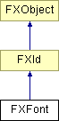

# FXFont

Font class

### FXFont(a, fontdesc)

Construct font from font description.
| **Argument** | **Type** | **Default** | **Description** |
| --- | --- | --- | --- |
| a | FXApp |  |  |
| fontdesc | FXFontDesc |  |  |

### FXFont(a, face, sz, wt=FONTWEIGHT_NORMAL, sl=FONTSLANT_REGULAR, enc=FONTENCODING_DEFAULT, setw=FONTSETWIDTH_DONTCARE, h=0)

Construct a font with given face name, size in points(pixels), weight, slant, character set encoding, setwidth, and hints.
| **Argument** | **Type** | **Default** | **Description** |
| --- | --- | --- | --- |
| a | FXApp |  |  |
| face | String |  |  |
| sz | Int |  |  |
| wt | Int | FONTWEIGHT_NORMAL |  |
| sl | Int | FONTSLANT_REGULAR |  |
| enc | Int | FONTENCODING_DEFAULT |  |
| setw | Int | FONTSETWIDTH_DONTCARE |  |
| h | Int | 0 |  |

### FXFont(a, nm)

Construct a font with given X11 font string.
| **Argument** | **Type** | **Default** | **Description** |
| --- | --- | --- | --- |
| a | FXApp |  |  |
| nm | String |  |  |

### create()

Create the font.

Reimplemented from FXId.

### destroy()

Destroy the font.

Reimplemented from FXId.

### detach()

Detach the font.

Reimplemented from FXId.

### getEncoding()

Get character set encoding.

### getFontAscent()

Ascent from baseline.

### getFontDesc(fontdesc)

Get font description.
| **Argument** | **Type** | **Default** | **Description** |
| --- | --- | --- | --- |
| fontdesc | FXFontDesc |  |  |

### getFontDescent()

Descent from baseline.

### getFontHeight()

Height of highest character in font.

### getFontLeading()

Get font leading [that is lead-ing as in Pb!].

### getFontSpacing()

Get font line spacing.

### getFontWidth()

Width of widest character in font.

### getHints()

Get hints.

### getMaxChar()

Get last character glyph in font.

### getMinChar()

Get first character glyph in font.

### getName()

Get face name.

### getSetWidth()

Get setwidth.

### getSize()

Get size in deci-points.

### getSlant()

Get slant.

### getTextHeight(text, n)

Calculate height of given text in this font.
| **Argument** | **Type** | **Default** | **Description** |
| --- | --- | --- | --- |
| text | String |  | The string whose height is being evaluated. |
| n | Int |  | The number of characters in 'text,' starting from the left end, for which the height will be returned. |

### getTextWidth(text, n)

Calculate width of given text in this font.
| **Argument** | **Type** | **Default** | **Description** |
| --- | --- | --- | --- |
| text | String |  | The string whose width is being evaluated. |
| n | Int |  | The number of characters in 'text,' starting from the left end, for which the width will be returned. |

### getWeight()

Get font weight.

### hasChar(ch)

See if font has glyph for ch.
| **Argument** | **Type** | **Default** | **Description** |
| --- | --- | --- | --- |
| ch | Int |  |  |

### isFontMono()

Find out if the font is monotype or proportional.

### leftBearing(ch)

Left bearing.
| **Argument** | **Type** | **Default** | **Description** |
| --- | --- | --- | --- |
| ch | String |  |  |

### rightBearing(ch)

Right bearing.
| **Argument** | **Type** | **Default** | **Description** |
| --- | --- | --- | --- |
| ch | String |  |  |

### setFontDesc(fontdesc)

Change font description.
| **Argument** | **Type** | **Default** | **Description** |
| --- | --- | --- | --- |
| fontdesc | FXFontDesc |  |  |

### Global flags

### **Font style hints which influence the matcher**

| **FONTPITCH_DEFAULT** | Default pitch. |
| --- | --- |
| **FONTPITCH_FIXED** | Fixed pitch, mono-spaced. |
| **FONTPITCH_VARIABLE** | Variable pitch, proportional spacing. |
| **FONTHINT_DONTCARE** | Don't care which font. |
| **FONTHINT_DECORATIVE** | Fancy fonts. |
| **FONTHINT_MODERN** | Monospace typewriter font. |
| **FONTHINT_ROMAN** | Variable width times-like font, serif. |
| **FONTHINT_SCRIPT** | Script or cursive. |
| **FONTHINT_SWISS** | Helvetica/swiss type font, sans-serif. |
| **FONTHINT_SYSTEM** | System font. |
| **FONTHINT_X11** | X11 Font string. |
| **FONTHINT_SCALABLE** | Scalable fonts. |
| **FONTHINT_POLYMORPHIC** | Polymorphic fonts. |

### **Font slant**

| **FONTSLANT_DONTCARE** | Don't care about slant. |
| --- | --- |
| **FONTSLANT_REGULAR** | Regular straight up. |
| **FONTSLANT_ITALIC** | Italics. |
| **FONTSLANT_OBLIQUE** | Oblique slant. |
| **FONTSLANT_REVERSE_ITALIC** | Reversed italic. |
| **FONTSLANT_REVERSE_OBLIQUE** | Reversed oblique. |

### **Font character set encoding**

| **FONTENCODING_DEFAULT** | Don't care character encoding. |
| --- | --- |
| **FONTENCODING_ISO_8859_5** | Cyrillic (almost obsolete). |
| **FONTENCODING_KOI8_R** | Russian. |
| **FONTENCODING_KOI8_U** | Ukrainian. |
| **FONTENCODING_LATIN1** | Latin 1 (West European). |
| **FONTENCODING_LATIN2** | Latin 2 (East European). |
| **FONTENCODING_LATIN3** | Latin 3 (South European). |
| **FONTENCODING_LATIN4** | Latin 4 (North European). |
| **FONTENCODING_LATIN5** | Latin 5 (Turkish). |
| **FONTENCODING_LATIN6** | Latin 6 (Nordic). |
| **FONTENCODING_LATIN7** | Latin 7 (Baltic Rim). |
| **FONTENCODING_LATIN8** | Latin 8 (Celtic). |
| **FONTENCODING_LATIN9** | Latin 9 AKA Latin 0. |
| **FONTENCODING_LATIN10** | Latin 10. |
| **FONTENCODING_USASCII** | Latin 1. |
| **FONTENCODING_WESTEUROPE** | Latin 1 (West European). |
| **FONTENCODING_EASTEUROPE** | Latin 2 (East European). |
| **FONTENCODING_SOUTHEUROPE** | Latin 3 (South European). |
| **FONTENCODING_NORTHEUROPE** | Latin 4 (North European). |
| **FONTENCODING_CYRILLIC** | Cyrillic. |
| **FONTENCODING_RUSSIAN** | Cyrillic. |
| **FONTENCODING_ARABIC** | Arabic. |
| **FONTENCODING_GREEK** | Greek. |
| **FONTENCODING_HEBREW** | Hebrew. |
| **FONTENCODING_TURKISH** | Latin 5 (Turkish). |
| **FONTENCODING_NORDIC** | Latin 6 (Nordic). |
| **FONTENCODING_THAI** | Thai. |
| **FONTENCODING_BALTIC** | Latin 7 (Baltic Rim). |
| **FONTENCODING_CELTIC** | Latin 8 (Celtic). |

### **Font weight**

| **FONTWEIGHT_DONTCARE** | Don't care about weight. |
| --- | --- |
| **FONTWEIGHT_THIN** | Thin. |
| **FONTWEIGHT_EXTRALIGHT** | Extra light. |
| **FONTWEIGHT_LIGHT** | Light. |
| **FONTWEIGHT_NORMAL** | Normal or regular weight. |
| **FONTWEIGHT_REGULAR** | Normal or regular weight. |
| **FONTWEIGHT_MEDIUM** | Medium bold face. |
| **FONTWEIGHT_DEMIBOLD** | Demi bold face. |
| **FONTWEIGHT_BOLD** | Bold face. |
| **FONTWEIGHT_EXTRABOLD** | Extra. |
| **FONTWEIGHT_HEAVY** | Heavy. |
| **FONTWEIGHT_BLACK** | Black. |

### **Font relative setwidth**

| **FONTSETWIDTH_DONTCARE** | Don't care about set width. |
| --- | --- |
| **FONTSETWIDTH_ULTRACONDENSED** | Ultra condensed printing. |
| **FONTSETWIDTH_EXTRACONDENSED** | Extra condensed. |
| **FONTSETWIDTH_CONDENSED** | Condensed. |
| **FONTSETWIDTH_NARROW** | Narrow. |
| **FONTSETWIDTH_COMPRESSED** | Compressed. |
| **FONTSETWIDTH_SEMICONDENSED** | Semi-condensed. |
| **FONTSETWIDTH_MEDIUM** | Medium printing. |
| **FONTSETWIDTH_NORMAL** | Normal printing. |
| **FONTSETWIDTH_REGULAR** | Regular printing. |
| **FONTSETWIDTH_SEMIEXPANDED** | Semi expanded. |
| **FONTSETWIDTH_EXPANDED** | Expanded. |
| **FONTSETWIDTH_WIDE** | Wide. |
| **FONTSETWIDTH_EXTRAEXPANDED** | Extra expanded. |
| **FONTSETWIDTH_ULTRAEXPANDED** | Ultra expanded. |

