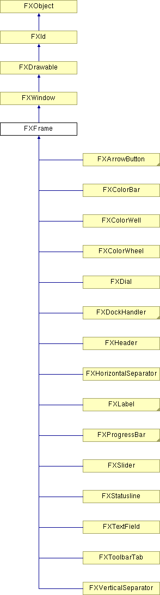

# FXFrame

Base Frame

### FXFrame(p, opts=FRAME_NORMAL, x=0, y=0, w=0, h=0, pl=DEFAULT_PAD, pr=DEFAULT_PAD, pt=DEFAULT_PAD, pb=DEFAULT_PAD)

Construct frame window.
| **Argument** | **Type** | **Default** | **Description** |
| --- | --- | --- | --- |
| p | FXComposite |  |  |
| opts | Int | FRAME_NORMAL |  |
| x | Int | 0 |  |
| y | Int | 0 |  |
| w | Int | 0 |  |
| h | Int | 0 |  |
| pl | Int | DEFAULT_PAD |  |
| pr | Int | DEFAULT_PAD |  |
| pt | Int | DEFAULT_PAD |  |
| pb | Int | DEFAULT_PAD |  |

### getBaseColor()

Get base gui color.

### getBorderColor()

Get border color.

### getBorderWidth()

Get border width.

### getDefaultHeight()

Return default height.

Reimplemented from FXWindow.

Reimplemented in FXArrowButton, FXCheckButton, FXColorBar, FXColorWell, FXColorWheel, FXDial, FXDockTitle, FXHeader, FXLabel, FXMDIDeleteButton, FXMDIRestoreButton, FXMDIMaximizeButton, FXMDIMinimizeButton, FXMDIWindowButton, FXMenuButton, FXProgressBar, FXOption, FXOptionMenu, FXRadioButton, FXHorizontalSeparator, FXVerticalSeparator, FXSlider, FXStatusline, FXTextField, FXToggleButton, FXToolbarGrip, FXToolbarTab, and AFXProgressBar.

### getDefaultWidth()

Return default width.

Reimplemented from FXWindow.

Reimplemented in FXArrowButton, FXCheckButton, FXColorBar, FXColorWell, FXColorWheel, FXDial, FXDockTitle, FXHeader, FXLabel, FXMDIDeleteButton, FXMDIRestoreButton, FXMDIMaximizeButton, FXMDIMinimizeButton, FXMDIWindowButton, FXMenuButton, FXProgressBar, FXOption, FXOptionMenu, FXRadioButton, FXHorizontalSeparator, FXVerticalSeparator, FXSlider, FXStatusline, FXTextField, FXToggleButton, FXToolbarGrip, FXToolbarTab, and AFXProgressBar.

### getFrameStyle()

Get current frame style.

### getHiliteColor()

Get highlight color.

### getPadBottom()

Get bottom interior padding.

### getPadLeft()

Get left interior padding.

### getPadRight()

Get right interior padding.

### getPadTop()

Get top interior padding.

### getShadowColor()

Get shadow color.

### setBaseColor(clr)

Change base gui color.
| **Argument** | **Type** | **Default** | **Description** |
| --- | --- | --- | --- |
| clr | FXColor |  |  |

### setBorderColor(clr)

Change border color.
| **Argument** | **Type** | **Default** | **Description** |
| --- | --- | --- | --- |
| clr | FXColor |  |  |

### setFrameStyle(style)

Change frame style.
| **Argument** | **Type** | **Default** | **Description** |
| --- | --- | --- | --- |
| style | Int |  |  |

### setHiliteColor(clr)

Change highlight color.
| **Argument** | **Type** | **Default** | **Description** |
| --- | --- | --- | --- |
| clr | FXColor |  |  |

### setPadBottom(pb)

Change bottom padding.
| **Argument** | **Type** | **Default** | **Description** |
| --- | --- | --- | --- |
| pb | Int |  |  |

### setPadLeft(pl)

Change left padding.
| **Argument** | **Type** | **Default** | **Description** |
| --- | --- | --- | --- |
| pl | Int |  |  |

### setPadRight(pr)

Change right padding.
| **Argument** | **Type** | **Default** | **Description** |
| --- | --- | --- | --- |
| pr | Int |  |  |

### setPadTop(pt)

Change top padding.
| **Argument** | **Type** | **Default** | **Description** |
| --- | --- | --- | --- |
| pt | Int |  |  |

### setShadowColor(clr)

Change shadow color.
| **Argument** | **Type** | **Default** | **Description** |
| --- | --- | --- | --- |
| clr | FXColor |  |  |

### Global flags

### **Justification modes used by certain subclasses**

| **JUSTIFY_NORMAL** | Default justification is centered text. |
| --- | --- |
| **JUSTIFY_CENTER_X** | Contents centered horizontally. |
| **JUSTIFY_LEFT** | Contents left-justified. |
| **JUSTIFY_RIGHT** | Contents right-justified. |
| **JUSTIFY_HZ_APART** | Combination of JUSTIFY_LEFT & JUSTIFY_RIGHT. |
| **JUSTIFY_CENTER_Y** | Contents centered vertically. |
| **JUSTIFY_TOP** | Contents aligned with label top. |
| **JUSTIFY_BOTTOM** | Contents aligned with label bottom. |
| **JUSTIFY_VT_APART** | Combination of JUSTIFY_TOP & JUSTIFY_BOTTOM. |

