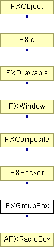

# FXGroupBox

A group box widget provides a nice raised or sunken border around a group of widgets, providing a visual delineation. Typically, a title is placed over the border to provide some clarification. Radio buttons placed inside a group box automatically assume mutually exclusive behaviour, i.e. at most one radio button will be checked at any one time.

### FXGroupBox(p, text, opts=GROUPBOX_NORMAL, x=0, y=0, w=0, h=0, pl=DEFAULT_SPACING, pr=DEFAULT_SPACING, pt=DEFAULT_SPACING, pb=DEFAULT_SPACING, hs=DEFAULT_SPACING, vs=DEFAULT_SPACING)

Construct group box layout manager.
| **Argument** | **Type** | **Default** | **Description** |
| --- | --- | --- | --- |
| p | FXComposite |  |  |
| text | String |  |  |
| opts | Int | GROUPBOX_NORMAL |  |
| x | Int | 0 |  |
| y | Int | 0 |  |
| w | Int | 0 |  |
| h | Int | 0 |  |
| pl | Int | DEFAULT_SPACING |  |
| pr | Int | DEFAULT_SPACING |  |
| pt | Int | DEFAULT_SPACING |  |
| pb | Int | DEFAULT_SPACING |  |
| hs | Int | DEFAULT_SPACING |  |
| vs | Int | DEFAULT_SPACING |  |

### create()

Create server-side resources.

Reimplemented from FXComposite.

### detach()

Detach server-side resources.

Reimplemented from FXComposite.

### disable()

Disable the window.

Reimplemented from FXWindow.

### enable()

Enable the window.

Reimplemented from FXWindow.

### getDefaultHeight()

Return default height.

Reimplemented from FXPacker.

### getDefaultWidth()

Return default width.

Reimplemented from FXPacker.

### getText()

Return current groupbox title text.

### setText(text)

Change group box title text.
| **Argument** | **Type** | **Default** | **Description** |
| --- | --- | --- | --- |
| text | String |  |  |

### Global flags

### **Group box options**

| **GROUPBOX_TITLE_LEFT** | Title is left-justified. |
| --- | --- |
| **GROUPBOX_TITLE_CENTER** | Title is centered. |
| **GROUPBOX_TITLE_RIGHT** | Title is right-justified. |

