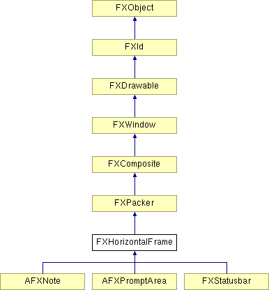

# FXHorizontalFrame

Horizontal frame layout manager widget is used to automatically place child-windows horizontally from left-to-right, or right-to-left, depending on the child window's layout hints. 

### FXHorizontalFrame(p, opts=0, x=0, y=0, w=0, h=0, pl=DEFAULT_SPACING, pr=DEFAULT_SPACING, pt=DEFAULT_SPACING, pb=DEFAULT_SPACING, hs=DEFAULT_SPACING, vs=DEFAULT_SPACING)

Construct a horizontal frame layout manager.
| **Argument** | **Type** | **Default** | **Description** |
| --- | --- | --- | --- |
| p | FXComposite |  |  |
| opts | Int | 0 |  |
| x | Int | 0 |  |
| y | Int | 0 |  |
| w | Int | 0 |  |
| h | Int | 0 |  |
| pl | Int | DEFAULT_SPACING |  |
| pr | Int | DEFAULT_SPACING |  |
| pt | Int | DEFAULT_SPACING |  |
| pb | Int | DEFAULT_SPACING |  |
| hs | Int | DEFAULT_SPACING |  |
| vs | Int | DEFAULT_SPACING |  |

### getDefaultHeight()

Return default height.

Reimplemented from FXPacker.

Reimplemented in FXStatusbar.

### getDefaultWidth()

Return default width.

Reimplemented from FXPacker.

Reimplemented in FXStatusbar.

