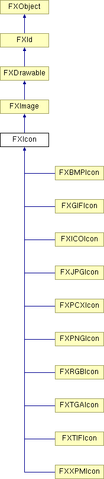

# FXIcon

Icon class.

### FXIcon(a, pix=None, clr=0, opts=0, w=1, h=1)

Create an icon with an initial pixel buffer pix, a transparent color clr, and options as in FXImage.
| **Argument** | **Type** | **Default** | **Description** |
| --- | --- | --- | --- |
| a | FXApp |  |  |
| pix |  | None |  |
| clr | FXColor | 0 |  |
| opts | Int | 0 |  |
| w | Int | 1 |  |
| h | Int | 1 |  |

### create()

Create the icon resource.

Reimplemented from FXImage.

### destroy()

Destroy the icon resource.

Reimplemented from FXImage.

### detach()

Detach the icon resource.

Reimplemented from FXImage.

### render()

Render the image from client-side pixel buffer.

Reimplemented from FXImage.

### resize(w, h)

Resize pixmap to the specified width and height.

Reimplemented from FXImage.
| **Argument** | **Type** | **Default** | **Description** |
| --- | --- | --- | --- |
| w | Int |  |  |
| h | Int |  |  |

