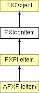

# FXIconItem

Icon item

### Global flags

### **Icon list styles**

| **ICONLIST_EXTENDEDSELECT** | Extended selection mode. |
| --- | --- |
| **ICONLIST_SINGLESELECT** | At most one selected item. |
| **ICONLIST_BROWSESELECT** | Always exactly one selected item. |
| **ICONLIST_MULTIPLESELECT** | Multiple selection mode. |
| **ICONLIST_AUTOSIZE** | Automatically size item spacing. |
| **ICONLIST_DETAILED** | List mode. |
| **ICONLIST_MINI_ICONS** | Mini Icon mode. |
| **ICONLIST_BIG_ICONS** | Big Icon mode. |
| **ICONLIST_ROWS** | Row-wise mode. |
| **ICONLIST_COLUMNS** | Column-wise mode. |

