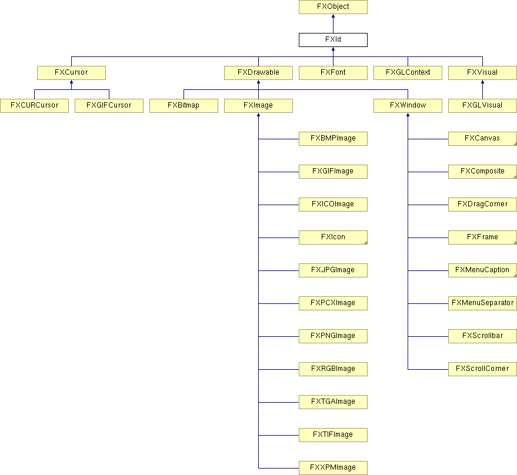

# FXId

Encapsulates server side resource.

### create()

Create resource.

Reimplemented in FXBitmap, FXColorBar, FXColorSelector, FXColorWell, FXColorWheel, FXComboBox, FXComposite, FXCursor, FXDirBox, FXDirList, FXDockTitle, FXDriveBox, FXFileList, FXFont, FXFontSelector, FXGLCanvas, FXGLContext, FXGLViewer, FXGLVisual, FXGroupBox, FXHeader, FXIcon, FXIconList, FXImage, FXImageView, FXLabel, FXList, FXListBox, FXMDIChild, FXMenuButton, FXMenuCaption, FXMenuCascade, FXProgressBar, FXMenuTitle, FXOptionMenu, FXPrintDialog, FXRootWindow, FXScrollWindow, FXShell, FXSpinner, FXStatusline, FXTabBar, FXTable, FXText, FXTextField, FXToggleButton, FXToolbarShell, FXTooltip, FXTopWindow, FXTreeList, FXTreeListBox, FXVisual, FXWindow, AFXManagerMenuPane, AFXMainWindow, AFXPromptArea, AFXBaseTable, AFXColorButton, AFXColorFlyout, AFXComboBox, AFXDialog, AFXFloatSpinner, AFXFlyoutButton, AFXListBox, AFXNote, AFXOptionTreeItem, AFXPrimFloatSpinner, AFXProgressBar, AFXSpinner, AFXTable, AFXTextField, and AFXVerticalAligner.

### destroy()

Destroy resource.

Reimplemented in FXBitmap, FXComboBox, FXComposite, FXCursor, FXDirBox, FXDirList, FXDriveBox, FXFileList, FXFont, FXGLCanvas, FXGLContext, FXGLVisual, FXIcon, FXImage, FXListBox, FXMenuCascade, FXOptionMenu, FXRootWindow, FXTreeList, FXTreeListBox, FXVisual, FXWindow, AFXManagerMenuCascade, AFXColorFlyout, and AFXTable.

### detach()

Detach resource.

Reimplemented in FXBitmap, FXColorBar, FXColorWell, FXColorWheel, FXComboBox, FXComposite, FXCursor, FXDirBox, FXDirList, FXDockTitle, FXDriveBox, FXFileList, FXFont, FXGLCanvas, FXGLContext, FXGLViewer, FXGLVisual, FXGroupBox, FXHeader, FXIcon, FXIconList, FXImage, FXImageView, FXLabel, FXList, FXListBox, FXMDIChild, FXMenuButton, FXMenuCaption, FXMenuCascade, FXProgressBar, FXMenuTitle, FXOptionMenu, FXRootWindow, FXStatusline, FXTable, FXText, FXToggleButton, FXTooltip, FXTopWindow, FXTreeList, FXTreeListBox, FXVisual, FXWindow, AFXBaseTable, AFXColorFlyout, AFXFlyoutButton, AFXNote, and AFXTable.

### getApp()

Get application.

### getUserData()

Get user data pointer.

### id()

Get XID handle.

Reimplemented in FXFont.

### setUserData(ptr)

Set user data pointer.
| **Argument** | **Type** | **Default** | **Description** |
| --- | --- | --- | --- |
| ptr | String |  |  |

