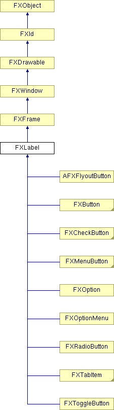

# FXLabel

A label widget can be used to place a text and/or icon for explanation purposes. The text label may have an optional tooltip and/or help string.

### FXLabel(p, text, ic=None, opts=LABEL_NORMAL, x=0, y=0, w=0, h=0, pl=DEFAULT_PAD, pr=DEFAULT_PAD, pt=DEFAULT_PAD, pb=DEFAULT_PAD)

Construct label with given text and icon.
| **Argument** | **Type** | **Default** | **Description** |
| --- | --- | --- | --- |
| p | FXComposite |  |  |
| text | String |  |  |
| ic | FXIcon | None |  |
| opts | Int | LABEL_NORMAL |  |
| x | Int | 0 |  |
| y | Int | 0 |  |
| w | Int | 0 |  |
| h | Int | 0 |  |
| pl | Int | DEFAULT_PAD |  |
| pr | Int | DEFAULT_PAD |  |
| pt | Int | DEFAULT_PAD |  |
| pb | Int | DEFAULT_PAD |  |

### create()

Create server-side resources.

Reimplemented from FXWindow.

Reimplemented in FXMenuButton, FXOptionMenu, FXToggleButton, and AFXFlyoutButton.

### detach()

Detach server-side resources.

Reimplemented from FXWindow.

Reimplemented in FXMenuButton, FXOptionMenu, FXToggleButton, and AFXFlyoutButton.

### disable()

Disable the window.

Reimplemented from FXWindow.

Reimplemented in AFXFlyoutButton.

### enable()

Enable the window.

Reimplemented from FXWindow.

Reimplemented in AFXFlyoutButton.

### getDefaultHeight()

Return default height.

Reimplemented from FXFrame.

Reimplemented in FXCheckButton, FXMDIDeleteButton, FXMDIRestoreButton, FXMDIMaximizeButton, FXMDIMinimizeButton, FXMDIWindowButton, FXMenuButton, FXOption, FXOptionMenu, FXRadioButton, and FXToggleButton.

### getDefaultWidth()

Return default width.

Reimplemented from FXFrame.

Reimplemented in FXCheckButton, FXMDIDeleteButton, FXMDIRestoreButton, FXMDIMaximizeButton, FXMDIMinimizeButton, FXMDIWindowButton, FXMenuButton, FXOption, FXOptionMenu, FXRadioButton, and FXToggleButton.

### getFont()

Get the text font.

### getHelpText()

Get the status line help text for this label.

### getIcon()

Get the icon for this label.

### getIconPosition()

Get the current icon position.

### getJustify()

Get the current text-justification mode.

### getText()

Get the text for this label.

### getTextColor()

Get the current text color.

### getTipText()

Get the tool tip message for this label.

### setFont(fnt)

Set the text font.
| **Argument** | **Type** | **Default** | **Description** |
| --- | --- | --- | --- |
| fnt | FXFont |  |  |

### setHelpText(text)

Set the status line help text for this label.

Reimplemented in AFXFlyoutItem.
| **Argument** | **Type** | **Default** | **Description** |
| --- | --- | --- | --- |
| text | String |  |  |

### setIcon(ic)

Set the icon for this label.

Reimplemented in AFXFlyoutItem.
| **Argument** | **Type** | **Default** | **Description** |
| --- | --- | --- | --- |
| ic | FXIcon |  |  |

### setIconPosition(mode)

Set the current icon position.
| **Argument** | **Type** | **Default** | **Description** |
| --- | --- | --- | --- |
| mode | Int |  |  |

### setJustify(mode)

Set the current text-justification mode.
| **Argument** | **Type** | **Default** | **Description** |
| --- | --- | --- | --- |
| mode | Int |  |  |

### setText(text)

Set the text for this label.

Reimplemented in AFXFlyoutItem.
| **Argument** | **Type** | **Default** | **Description** |
| --- | --- | --- | --- |
| text | String |  |  |

### setTextColor(clr)

Set the current text color.
| **Argument** | **Type** | **Default** | **Description** |
| --- | --- | --- | --- |
| clr | FXColor |  |  |

### setTipText(text)

Set the tool tip message for this label.

Reimplemented in AFXFlyoutItem.
| **Argument** | **Type** | **Default** | **Description** |
| --- | --- | --- | --- |
| text | String |  |  |

### Global flags

### **Relationship options for icon-labels**

| **ICON_UNDER_TEXT** | Icon appears under text. |
| --- | --- |
| **ICON_AFTER_TEXT** | Icon appears after text (to its right). |
| **ICON_BEFORE_TEXT** | Icon appears before text (to its left). |
| **ICON_ABOVE_TEXT** | Icon appears above text. |
| **ICON_BELOW_TEXT** | Icon appears below text. |
| **TEXT_OVER_ICON** | Same as ICON_UNDER_TEXT. |
| **TEXT_AFTER_ICON** | Same as ICON_BEFORE_TEXT. |
| **TEXT_BEFORE_ICON** | Same as ICON_AFTER_TEXT. |
| **TEXT_ABOVE_ICON** | Same as ICON_BELOW_TEXT. |
| **TEXT_BELOW_ICON** | Same as ICON_ABOVE_TEXT. |

### **Normal way to show label**

| **LABEL_NORMAL** | Combination of JUSTIFY_NORMAL & ICON_BEFORE_TEXT. |
| --- | --- |

