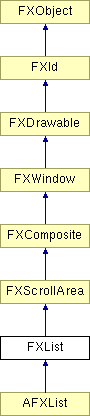

# FXList

List Widget

### FXList(p, nvis, tgt=None, sel=0, opts=LIST_NORMAL, x=0, y=0, w=0, h=0)

Construct a list with nvis visible items; the list is initially empty.
| **Argument** | **Type** | **Default** | **Description** |
| --- | --- | --- | --- |
| p | FXComposite |  |  |
| nvis | Int |  |  |
| tgt | FXObject | None |  |
| sel | Int | 0 |  |
| opts | Int | LIST_NORMAL |  |
| x | Int | 0 |  |
| y | Int | 0 |  |
| w | Int | 0 |  |
| h | Int | 0 |  |

### appendItem(text, icon=None, ptr=None, notify=False)

Append new item with given text and optional icon, and user-data pointer.
| **Argument** | **Type** | **Default** | **Description** |
| --- | --- | --- | --- |
| text | String |  |  |
| icon | FXIcon | None |  |
| ptr | String | None |  |
| notify | Bool | False |  |

### appendItem(item, notify=False)

Append a [possibly subclassed] item to the list.
| **Argument** | **Type** | **Default** | **Description** |
| --- | --- | --- | --- |
| item | FXListItem |  |  |
| notify | Bool | False |  |

### canFocus()

List widget can receive focus.

Reimplemented from FXWindow.

### clearItems(notify=False)

Remove all items from list.
| **Argument** | **Type** | **Default** | **Description** |
| --- | --- | --- | --- |
| notify | Bool | False |  |

### create()

Create server-side resources.

Reimplemented from FXComposite.

### deselectItem(index, notify=False)

Deselect item.
| **Argument** | **Type** | **Default** | **Description** |
| --- | --- | --- | --- |
| index | Int |  |  |
| notify | Bool | False |  |

### detach()

Detach server-side resources.

Reimplemented from FXComposite.

### findItem(text, start=-1, flags=SEARCH_FORWARD| SEARCH_WRAP)

Search items for item by name, starting from start item; the flags argument controls the search direction, and case sensitivity.
| **Argument** | **Type** | **Default** | **Description** |
| --- | --- | --- | --- |
| text | String |  |  |
| start | Int | -1 |  |
| flags | Int | SEARCH_FORWARD| SEARCH_WRAP |  |

### getContentHeight()

Return content height.

Reimplemented from FXScrollArea.

### getContentWidth()

Compute and return content width.

Reimplemented from FXScrollArea.

### getCurrentItem()

Return current item, if any.

### getDefaultHeight()

Return default height.

Reimplemented from FXScrollArea.

Reimplemented in AFXList.

### getDefaultWidth()

Return default width.

Reimplemented from FXScrollArea.

### getItemData(index)

Return item user-data pointer.
| **Argument** | **Type** | **Default** | **Description** |
| --- | --- | --- | --- |
| index | Int |  |  |

### getItemHeight(index)

Return item height.
| **Argument** | **Type** | **Default** | **Description** |
| --- | --- | --- | --- |
| index | Int |  |  |

### getItemIcon(index)

Return item icon, if any.
| **Argument** | **Type** | **Default** | **Description** |
| --- | --- | --- | --- |
| index | Int |  |  |

### getItemText(index)

Return item text.
| **Argument** | **Type** | **Default** | **Description** |
| --- | --- | --- | --- |
| index | Int |  |  |

### getItemWidth(index)

Return item width.
| **Argument** | **Type** | **Default** | **Description** |
| --- | --- | --- | --- |
| index | Int |  |  |

### getListStyle()

Return list style.

### getNumItems()

Return the number of items in the list.

### getNumVisible()

Return number of visible items.

### insertItem(index, text, icon=None, ptr=None, notify=False)

Insert item at index with given text, icon, and user-data pointer.
| **Argument** | **Type** | **Default** | **Description** |
| --- | --- | --- | --- |
| index | Int |  |  |
| text | String |  |  |
| icon | FXIcon | None |  |
| ptr | String | None |  |
| notify | Bool | False |  |

### insertItem(index, item, notify=False)

Insert a new [possibly subclassed] item at the give index.
| **Argument** | **Type** | **Default** | **Description** |
| --- | --- | --- | --- |
| index | Int |  |  |
| item | FXListItem |  |  |
| notify | Bool | False |  |

### isItemSelected(index)

Return True if item is selected.
| **Argument** | **Type** | **Default** | **Description** |
| --- | --- | --- | --- |
| index | Int |  |  |

### isItemVisible(index)

Return True if item is visible.
| **Argument** | **Type** | **Default** | **Description** |
| --- | --- | --- | --- |
| index | Int |  |  |

### killSelection(notify=False)

Deselect all items.
| **Argument** | **Type** | **Default** | **Description** |
| --- | --- | --- | --- |
| notify | Bool | False |  |

### makeItemVisible(index)

Scroll to bring item into view.
| **Argument** | **Type** | **Default** | **Description** |
| --- | --- | --- | --- |
| index | Int |  |  |

### recalc()

Recalculate layout.

Reimplemented from FXWindow.

### removeItem(index, notify=False)

Remove item from list.
| **Argument** | **Type** | **Default** | **Description** |
| --- | --- | --- | --- |
| index | Int |  |  |
| notify | Bool | False |  |

### replaceItem(index, text, icon=None, ptr=None, notify=False)

Replace items text, icon, and user-data pointer.
| **Argument** | **Type** | **Default** | **Description** |
| --- | --- | --- | --- |
| index | Int |  |  |
| text | String |  |  |
| icon | FXIcon | None |  |
| ptr | String | None |  |
| notify | Bool | False |  |

### replaceItem(index, item, notify=False)

Replace the item with a [possibly subclassed] item.
| **Argument** | **Type** | **Default** | **Description** |
| --- | --- | --- | --- |
| index | Int |  |  |
| item | FXListItem |  |  |
| notify | Bool | False |  |

### retrieveItem(index)

Return the item at the given index.
| **Argument** | **Type** | **Default** | **Description** |
| --- | --- | --- | --- |
| index | Int |  |  |

### selectItem(index, notify=False)

Select item.
| **Argument** | **Type** | **Default** | **Description** |
| --- | --- | --- | --- |
| index | Int |  |  |
| notify | Bool | False |  |

### setCurrentItem(index, notify=False)

Change current item.
| **Argument** | **Type** | **Default** | **Description** |
| --- | --- | --- | --- |
| index | Int |  |  |
| notify | Bool | False |  |

### setItemData(index, ptr)

Change item user-data pointer.
| **Argument** | **Type** | **Default** | **Description** |
| --- | --- | --- | --- |
| index | Int |  |  |
| ptr | String |  |  |

### setItemIcon(index, icon)

Change item icon.
| **Argument** | **Type** | **Default** | **Description** |
| --- | --- | --- | --- |
| index | Int |  |  |
| icon | FXIcon |  |  |

### setItemText(index, text)

Change item text.
| **Argument** | **Type** | **Default** | **Description** |
| --- | --- | --- | --- |
| index | Int |  |  |
| text | String |  |  |

### setListStyle(style)

Change list style.
| **Argument** | **Type** | **Default** | **Description** |
| --- | --- | --- | --- |
| style | Int |  |  |

### setNumVisible(nvis)

Change the number of visible items.
| **Argument** | **Type** | **Default** | **Description** |
| --- | --- | --- | --- |
| nvis | Int |  |  |

### Global flags

### **List styles**

| **LIST_EXTENDEDSELECT** | Extended selection mode allows for drag-selection of ranges of items. |
| --- | --- |
| **LIST_SINGLESELECT** | Single selection mode allows up to one item to be selected. |
| **LIST_BROWSESELECT** | Browse selection mode enforces one single item to be selected at all times. |
| **LIST_MULTIPLESELECT** | Multiple selection mode is used for selection of individual items. |
| **LIST_AUTOSELECT** | Automatically select under cursor. |

