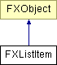

# FXListItem

List item

### Global flags

### **List styles**

| **LIST_EXTENDEDSELECT** | Extended selection mode allows for drag-selection of ranges of items. |
| --- | --- |
| **LIST_SINGLESELECT** | Single selection mode allows up to one item to be selected. |
| **LIST_BROWSESELECT** | Browse selection mode enforces one single item to be selected at all times. |
| **LIST_MULTIPLESELECT** | Multiple selection mode is used for selection of individual items. |
| **LIST_AUTOSELECT** | Automatically select under cursor. |

