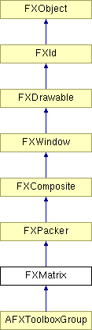

# FXMatrix

The Matrix layout manager automatically arranges its child windows in rows and columns. If the matrix style is MATRIX_BY_ROWS, then the matrix will have the given number of rows and the number of columns grows as more child windows are added; if the matrix style is MATRIX_BY_COLUMNS, then the number of columns is fixed and the number of rows grows as more children are added. If all children in a row (column) have the LAYOUT_FILL_ROW (LAYOUT_FILL_COLUMN) hint set, then the row (column) will be stretchable as the matrix layout manager itself is resized. If more than one row (column) is stretchable, the space is apportioned to each stretchable row (column) proportionally. Within each cell of the matrix, all other layout hints are observed. For example, a child having LAYOUT_CENTER_Y and LAYOUT_FILL_X hints will be centered in the Y-direction, while being stretched in the X-direction. Empty cells can be obtained by simply placing a borderless FXFrame widget as a space-holder.

### FXMatrix(p, n=1, opts=MATRIX_BY_ROWS, x=0, y=0, w=0, h=0, pl=DEFAULT_SPACING, pr=DEFAULT_SPACING, pt=DEFAULT_SPACING, pb=DEFAULT_SPACING, hs=DEFAULT_SPACING, vs=DEFAULT_SPACING)

Construct a matrix layout manager with n rows or columns.
| **Argument** | **Type** | **Default** | **Description** |
| --- | --- | --- | --- |
| p | FXComposite |  |  |
| n | Int | 1 |  |
| opts | Int | MATRIX_BY_ROWS |  |
| x | Int | 0 |  |
| y | Int | 0 |  |
| w | Int | 0 |  |
| h | Int | 0 |  |
| pl | Int | DEFAULT_SPACING |  |
| pr | Int | DEFAULT_SPACING |  |
| pt | Int | DEFAULT_SPACING |  |
| pb | Int | DEFAULT_SPACING |  |
| hs | Int | DEFAULT_SPACING |  |
| vs | Int | DEFAULT_SPACING |  |

### getDefaultHeight()

Return default height.

Reimplemented from FXPacker.

### getDefaultWidth()

Return default width.

Reimplemented from FXPacker.

### getNumColumns()

Return the number of columns.

### getNumRows()

Return the number of rows.

### setNumColumns(nc)

Change the number of columns.
| **Argument** | **Type** | **Default** | **Description** |
| --- | --- | --- | --- |
| nc | Int |  |  |

### setNumRows(nr)

Change the number of rows.
| **Argument** | **Type** | **Default** | **Description** |
| --- | --- | --- | --- |
| nr | Int |  |  |

### Global flags

### **Matrix packing options**

| **MATRIX_BY_ROWS** | Fixed number of rows, add columns as needed. |
| --- | --- |
| **MATRIX_BY_COLUMNS** | Fixed number of columns, adding rows as needed. |

