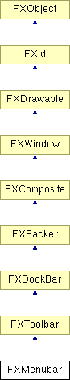

# FXMenubar

Menu bar.

### FXMenubar(p, q, opts=LAYOUT_TOP| LAYOUT_LEFT| LAYOUT_FILL_X, x=0, y=0, w=0, h=0, pl=3, pr=3, pt=2, pb=2, hs=DEFAULT_SPACING, vs=DEFAULT_SPACING)

Construct a floatable menubar Normally, the menubar is docked under window p. When floated, the menubar can be docked under window q, which is typically an FXToolbarShell window.
| **Argument** | **Type** | **Default** | **Description** |
| --- | --- | --- | --- |
| p | FXComposite |  |  |
| q | FXComposite |  |  |
| opts | Int | LAYOUT_TOP| LAYOUT_LEFT| LAYOUT_FILL_X |  |
| x | Int | 0 |  |
| y | Int | 0 |  |
| w | Int | 0 |  |
| h | Int | 0 |  |
| pl | Int | 3 |  |
| pr | Int | 3 |  |
| pt | Int | 2 |  |
| pb | Int | 2 |  |
| hs | Int | DEFAULT_SPACING |  |
| vs | Int | DEFAULT_SPACING |  |

### FXMenubar(p, opts=LAYOUT_TOP| LAYOUT_LEFT| LAYOUT_FILL_X, x=0, y=0, w=0, h=0, pl=3, pr=3, pt=2, pb=2, hs=DEFAULT_SPACING, vs=DEFAULT_SPACING)

Construct a non-floatable menubar. The menubar can not be undocked.
| **Argument** | **Type** | **Default** | **Description** |
| --- | --- | --- | --- |
| p | FXComposite |  |  |
| opts | Int | LAYOUT_TOP| LAYOUT_LEFT| LAYOUT_FILL_X |  |
| x | Int | 0 |  |
| y | Int | 0 |  |
| w | Int | 0 |  |
| h | Int | 0 |  |
| pl | Int | 3 |  |
| pr | Int | 3 |  |
| pt | Int | 2 |  |
| pb | Int | 2 |  |
| hs | Int | DEFAULT_SPACING |  |
| vs | Int | DEFAULT_SPACING |  |

