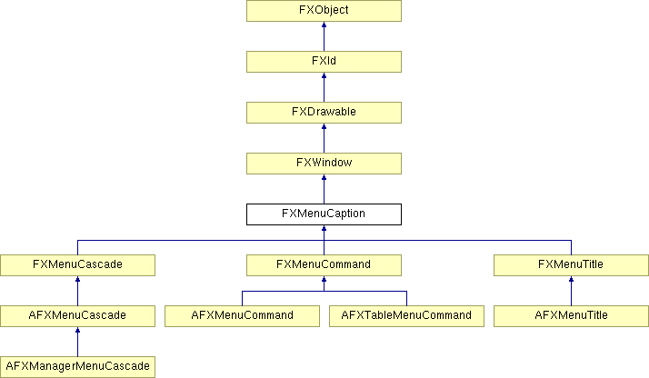

# FXMenuCaption

The menu caption is a widget which can be used as a caption above a number of menu commands in a menu.

### FXMenuCaption(p, text, ic=None, opts=0)

Construct a menu caption.
| **Argument** | **Type** | **Default** | **Description** |
| --- | --- | --- | --- |
| p | FXComposite |  |  |
| text | String |  |  |
| ic | FXIcon | None |  |
| opts | Int | 0 |  |

### create()

Create server-side resources.

Reimplemented from FXWindow.

Reimplemented in FXMenuCascade, and FXMenuTitle.

### detach()

Detach server-side resources.

Reimplemented from FXWindow.

Reimplemented in FXMenuCascade, and FXMenuTitle.

### disable()

Disable the menu.

Reimplemented from FXWindow.

### enable()

Enable the menu.

Reimplemented from FXWindow.

### getDefaultHeight()

Return default height.

Reimplemented from FXWindow.

Reimplemented in FXMenuCommand, and FXMenuTitle.

### getDefaultWidth()

Return default width.

Reimplemented from FXWindow.

Reimplemented in FXMenuCommand, and FXMenuTitle.

### getFont()

Return the text font.

### getIcon()

Get the icon for this menu.

### getText()

Get the text for this menu.

### getTextColor()

Get the current text color.

### setFont(fnt)

Set the text font.
| **Argument** | **Type** | **Default** | **Description** |
| --- | --- | --- | --- |
| fnt | FXFont |  |  |

### setIcon(ic)

Set the icon for this menu.
| **Argument** | **Type** | **Default** | **Description** |
| --- | --- | --- | --- |
| ic | FXIcon |  |  |

### setText(text)

Set the text for this menu.
| **Argument** | **Type** | **Default** | **Description** |
| --- | --- | --- | --- |
| text | String |  |  |

### setTextColor(clr)

Return the current text color.
| **Argument** | **Type** | **Default** | **Description** |
| --- | --- | --- | --- |
| clr | FXColor |  |  |

### Global flags

### **Menu Caption options**

| **MENU_AUTOGRAY** | Automatically gray out when not updated. |
| --- | --- |
| **MENU_AUTOHIDE** | Automatically hide button when not updated. |

