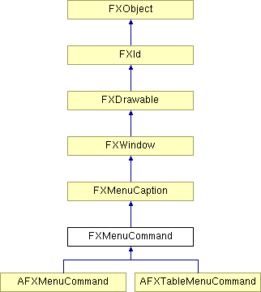

# FXMenuCommand

The menu command widget is used to invoke a command in the application from a menu. Menu commands may reflect the state of the application by graying out, becoming hidden, or by a check mark or bullit.

### FXMenuCommand(p, text, ic=None, tgt=None, sel=0, opts=0)

Construct a menu command.
| **Argument** | **Type** | **Default** | **Description** |
| --- | --- | --- | --- |
| p | FXComposite |  |  |
| text | String |  |  |
| ic | FXIcon | None |  |
| tgt | FXObject | None |  |
| sel | Int | 0 |  |
| opts | Int | 0 |  |

### canFocus()

Yes it can receive the focus.

Reimplemented from FXWindow.

### check()

Place checkmark next to text.

### checkRadio()

Place radio bullit next to text.

### getAccelText()

Return accelarator text.

### getDefaultHeight()

Return default height.

Reimplemented from FXMenuCaption.

### getDefaultWidth()

Return default width.

Reimplemented from FXMenuCaption.

### isChecked()

Return True if checked.

### isRadioChecked()

Return True if radio-checked.

### setAccelText(text)

Set accelerator text.
| **Argument** | **Type** | **Default** | **Description** |
| --- | --- | --- | --- |
| text | String |  |  |

### uncheck()

Uncheck the item.

### uncheckRadio()

Uncheck radio bullit.

### Global flags

### **States the menu command can be in**

| **MENUSTATE_NORMAL** | Normal, unchecked state. |
| --- | --- |
| **MENUSTATE_CHECKED** | Checked with a checkmark. |
| **MENUSTATE_RCHECKED** | Checked with a bullet. |

