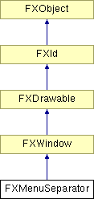

# FXMenuSeparator

The menu separator is a simple decorative groove used to delineate items in a popup menu. 

### FXMenuSeparator(p, opts=0)

Construct a menu separator.
| **Argument** | **Type** | **Default** | **Description** |
| --- | --- | --- | --- |
| p | FXComposite |  |  |
| opts | Int | 0 |  |

### getDefaultHeight()

Return default height.

Reimplemented from FXWindow.

### getDefaultWidth()

Return default width.

Reimplemented from FXWindow.

