# 1.6 有限元方法的快速回顾

本节回顾了有限元方法的基础知识。任何有限元模拟的第一步都是使用有限元的集合对结构的实际几何进行*离散化*。每个有限元代表物理结构的一个离散部分。有限元通过共享的*节点*连接。节点和有限元的集合称为*网格*。网格中每单位长度、面积或体积的单元数量称为*网格密度*。在应力分析中，节点的位移是Abaqus计算的基本变量。一旦已知节点位移，就可以轻松确定每个有限元中的应力和应变。

## 1.6.1 使用隐式方法获取节点位移

如图1-3所示的在一端约束并在另一端加载的桁架的简单示例，用于介绍本文档中使用的一些术语和约定。

**图1-3** 桁架问题。

分析的目的是找到桁架自由端的位移、桁架中的应力以及约束端处的反作用力。

在本例中，图1-3中的杆将用两个桁架单元建模。在Abaqus中，桁架单元只能承受轴向载荷。离散化模型如图1-4所示，并带有节点和单元标签。

**图1-4** 桁架问题的离散化模型。

模型的每个节点的自由体图如图1-5所示。通常，每个节点将承受施加到模型的外部载荷*P*，以及由连接到该节点的单元中的应力引起的内部载荷*I*。对于模型处于静态平衡，每个节点上作用的净力必须为零；即，每个节点处的内外载荷必须相互平衡。对于节点*a*，平衡方程可按如下方式获得。

**图1-5** 每个节点的自由体图。

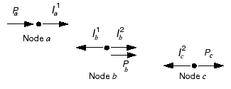

假设杆的长度变化很小，则单元1中的应变由下式给出

其中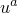和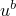分别是节点*a*和*b*的位移，*L*是单元的原始长度。

假设材料是弹性的，则杆中的应力由应变乘以杨氏模量*E*给出：

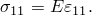

作用在端部节点上的轴力等于杆中的应力乘以其横截面积*A*。因此，获得内力、材料属性和位移之间的关系：

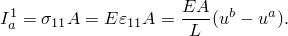

因此，节点*a*处的平衡可写为

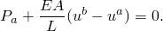

节点*b*处的平衡必须考虑从连接在该节点处的两个单元作用的内力。单元1的内力现在沿相反方向作用，因此变为负。结果方程为

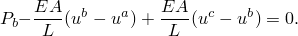

对于节点*c*，平衡方程为

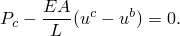

对于隐式方法，平衡方程需要同时求解以获得所有节点的位移。这一要求最好通过矩阵技术实现；因此，将内外力贡献写为矩阵。如果两个单元的属性和尺寸相同，则可以简化平衡方程，如下所示：

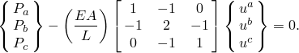

一般来说，单元刚度，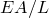项，可能因单元而异；因此，将单元刚度写为模型中两个单元的和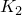。我们感兴趣的是获得平衡方程的解，其中外部施加的力*P*与内部产生的力*I*平衡。讨论收敛性和非线性时，我们将其写为

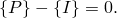

对于完整的双单元三节点结构，我们因此修改符号并重写平衡方程为

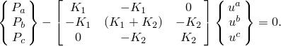

在隐式方法（如Abaqus/Standard中使用的方法）中，可以求解该方程组以获得三个未知变量的值：、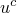和（在问题中指定为0.0）。一旦已知位移，我们就可以回头用它们来计算桁架单元中的应力。隐式有限元方法要求在每个求解增量结束时求解一组方程。

与隐式方法相比，显式方法（如Abaqus/Explicit中使用的方法）不需要求解联立方程组或计算全局刚度矩阵。相反，解是从一个增量运动地推进到下一个增量。有限元方法到显式动力学的扩展将在下一节中介绍。

## 1.6.2 应力波传播说明

本节试图提供一些概念性理解，了解当使用显式动力学方法时，力如何通过模型传播。在这个说明性示例中，我们考虑沿用三个单元建模的杆传播的应力波，如图1-6所示。我们将研究在时间递增过程中杆的状态。

**图1-6** 带有集中载荷的杆的初始配置，在自由端。

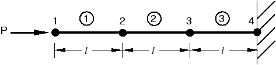

在第一个时间增量中，节点1由于施加的集中力而具有加速度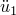。加速度导致节点1具有速度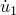，进而导致单元1中的应变率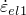。通过积分应变率穿过增量1的时间，获得单元1中的应变增量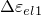。总应变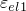是初始应变和应变增量之和。在这种情况下，初始应变为零。一旦计算出单元应变，就通过应用材料本构模型获得单元应力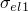。对于线性弹性材料，应力就是弹性模量乘以总应变。此过程如图1-7所示。在第一个增量中，节点2和3不移动，因为没有力施加到它们。

**图1-7** 在带有集中载荷的杆的增量1结束时配置，在自由端。

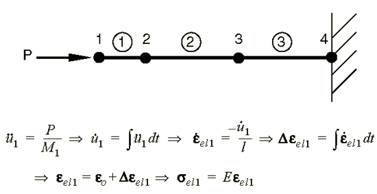

在第二个增量中，单元1中的应力将内单元力施加到与单元1关联的节点上，如图1-8所示。然后，这些单元应力用于计算节点1和2处的动态平衡。

**图1-8** 增量2开始时杆的配置。

该过程继续进行，因此在第三个增量开始时，单元1和2中都有应力，节点1、2和3上都有力，如图1-9所示。该过程继续进行，直到分析达到所需的总时间。

**图1-9** 增量3开始时杆的配置。

