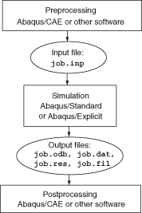

# 2 Abaqus基础

一个完整的Abaqus分析通常包括三个不同的阶段：预处理、模拟和后处理。这三个阶段通过文件连接在一起，如下所示：

**预处理（Abaqus/CAE）**

在此阶段，您必须定义物理问题的模型并创建Abaqus输入文件。模型通常使用Abaqus/CAE或其他预处理器以图形方式创建，尽管可以使用文本编辑器直接创建简单分析的Abaqus输入文件。

**模拟（Abaqus/Standard或Abaqus/Explicit）**

模拟（通常作为后台进程运行）是Abaqus/Standard或Abaqus/Explicit求解模型中定义的数值问题的阶段。应力分析输出的示例包括存储在二进制文件中准备进行后处理的位移和应力。根据所分析问题的复杂性和所使用的计算机的功能，分析运行可能需要几秒钟到几天的时间才能完成。

**后处理（Abaqus/Viewer）**

一旦模拟完成并且计算了位移、应力或其他基本变量，您就可以评估结果。评估通常使用Abaqus/Viewer或其他后处理器交互完成。Abaqus/Viewer读取中性二进制输出数据库文件，具有多种显示结果的选项，包括彩色等值线图、动画、变形形状图和*X-Y*图。
