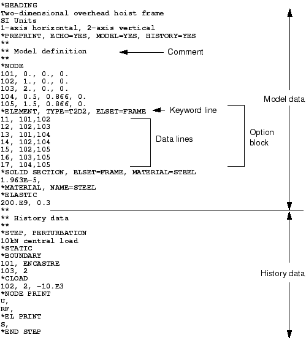

# 2.2 输入文件的格式


输入文件是预处理器（通常是 Abaqus/CAE）与分析产品（Abaqus/Standard 或 Abaqus/Explicit）之间沟通的桥梁。它包含数值模型的完整描述。输入文件是一个基于关键字的文本格式文件，因此如果需要，可以很容易地使用文本编辑器进行修改；如果使用了 Abaqus/CAE 等预处理器，则应通过它进行修改。事实上，小型分析可以直接通过键盘输入来指定输入文件。

[图 2-1](ch02s02.md#gss-schematic-hoist) 所示的架空起重机示例用于说明 Abaqus 输入文件的基本格式。起重机是一个简单的销接桁架模型，左端固定，右端安装滚轮。杆件可以在节点处自由旋转。框架被阻止离开平面。当施加 10 kN 载荷时（如图 [图 2-1](ch02s02.md#gss-schematic-hoist) 所示），进行模拟以确定结构的挠度和杆件中的峰值应力。

**图 2-1** 架空起重机示意图。


由于这个问题非常简单，Abaqus 输入文件紧凑且易于理解。该示例的完整 Abaqus 输入文件如图 [图 2-2](ch02s02.md#gss-hoist-input) 所示（也在["架空起重机框架，" 附录 A.1 节](ap01s01.md) 中），分为两个独立部分。第一部分包含**模型数据**，包括定义被分析结构所需的所有信息。第二部分包含**历史数据**，定义模型发生的情况：需要结构响应的加载或事件的序列。历史数据被划分为一系列**步骤**，每个步骤定义模拟的单独部分。例如，第一个步骤可能定义静态载荷，而第二个步骤可能定义动态载荷等。

**图 2-2** 架空起重机模型的输入。



输入文件由多个**选项块**组成，每个选项块包含描述模型一部分的数据。每个选项块以**关键字行**开头，通常后跟一个或多个**数据行**。这些行不能超过 256 个字符。

### 2.2.1 关键字行

关键字（或选项）始终以星号或 asterisk (*) 开头。例如，[*NODE](../key/key-link.md#usb-kws-mnode) 是指定节点坐标的关键字，[*ELEMENT](../key/key-link.md#usb-kws-melement) 是指定单元连接性的关键字。关键字通常后跟参数，其中一些可能是必需的。参数 TYPE 与 [*ELEMENT](../key/key-link.md#usb-kws-melement) 选项一起使用，因为定义单元时必须给出单元类型。例如，以下语句表示我们正在定义 T2D2 单元（二维两节点桁架单元）的连接性：

```
*ELEMENT, TYPE=T2D2
```
许多参数是可选的，仅在某些情况下定义。例如，以下语句表示此选项块中定义的所有节点将被放入一个名为 `PART1` 的集合中。
```
*NODE, NSET=PART1
```
虽然不是必需的，但将节点放入集合中在很多情况下很方便。

关键字和参数不区分大小写，必须使用足够多的字符以使其唯一。参数用逗号分隔。如果参数有值，则使用等号（=）将值与参数关联。

偶尔会需要太多参数，以至于无法放在一行 256 个字符的行中。在这种情况下，在行尾放置一个逗号，表示下一行是续行。例如，以下关键字和参数是一个有效关键字行：

```
*ELEMENT, TYPE = T2D2,
ELSET = FRAME
```

关键字的详细信息记录在 [](../key/key-link.md#key)[Abaqus Keywords Reference Guide](../key/key-link.md#key) 中。

### 2.2.2 数据行

关键字行后通常跟有数据行，这些数据行提供比关键字行上的参数更容易指定为列表的数据。此类数据的示例包括节点坐标、单元连接性或材料属性表（如应力-应变曲线）。特定选项块所需的数据在 [](../key/key-link.md#key)[Abaqus Keywords Reference Guide](../key/key-link.md#key) 中指定。例如，定义架空起重机模型节点的选项块为：

```
*NODE
101, 0., 0., 0.
102, 1., 0., 0.
103, 2., 0., 0.
104, 0.5, 0.866, 0.
105, 1.5, 0.866, 0.
```

每个数据行的第一个数据是定义节点号的整数。第二个、第三个和第四个条目是浮点数，指定节点的 、、 坐标。

数据可以包含整数、浮点数或字母数字值的混合。浮点值可以以多种方式输入；例如，Abaqus 将以下所有内容解释为数字四： 

| 4.0 | 4. | 4 |
| --- | --- | --- |
| 4.0E+0 | .4E+1 | 40.E1 |

数据项用逗号分隔，如[图 2-2](ch02s02.md#gss-hoist-input) 所示，这允许在数据行上相当任意地间隔输入值。如果数据行上只有一个项目，它后面必须跟一个逗号。