# 2.3 示例：创建架空起重机模型


[图 2-1](ch02s02.md#gss-schematic-hoist) 中销接架空起重机的模拟用于说明如何使用编辑器创建 Abaqus 输入文件。阅读本节时，您应该使用计算机上可用的编辑器之一将数据输入到文件中。Abaqus 输入文件必须具有 `.inp` 文件扩展名。为方便起见，将输入文件命名为 `frame.inp`。文件标识符（可用于识别分析的名称）称为 **jobname**。在这种情况下，使用 jobname "frame" 以便与名为 `frame.inp` 的输入文件关联。

本指南中所有其他示例假设您将使用预处理器（如 Abaqus/CAE）来生成网格（如果要从头开始创建模型）。所有示例的输入文件均可使用。参见[附录 A，"示例文件"](ap01.md)，获取有关如何检索这些输入文件的说明。但是，由于本示例的目的是帮助您理解 Abaqus 输入文件的结构和格式，因此您应该直接输入此输入文件，而不是使用预处理器或复制提供的输入文件。如果您希望使用 Abaqus/CAE 创建整个模型，请参阅["示例：创建架空起重机模型，" Getting Started with Abaqus: Interactive Edition 第 2.3 节](../gsa/gsa-link.md#gsa-abs-model)。

### 2.3.1 单位

在开始定义此模型或任何模型之前，您需要决定要使用的单位系统。Abaqus 没有内置的单位系统。在 Abaqus 中输入数据时不要包含单位名称或标签。所有输入数据必须以一致的单位指定。[表 2-1](ch02s03.md#gsa-abasics-table-units) 显示了一些常用的一致单位系统。 

**表 2-1** 一致单位。
| 物理量 | SI | SI (mm) | US Unit (ft) | US Unit (inch) |
| --- | --- | --- | --- | --- |
| 长度 | m | mm | ft | in |
| 力 | N | N | lbf | lbf |
| 质量 | kg | tonne (10³ kg) | slug | lbf s²/in |
| 时间 | s | s | s | s |
| 应力 | Pa (N/m²) | MPa (N/mm²) | lbf/ft² | psi (lbf/in²) |
| 能量 | J | mJ (10³ J) | ft lbf | in lbf |
| 密度 | kg/m³ | tonne/mm³ | slug/ft³ | lbf s²/in⁴ |

本指南使用 SI 单位系统。使用标注为"US Unit"的单位系统的用户应注意密度单位；通常，材料属性手册中给出的密度乘以重力加速度。

### 2.3.2 坐标系

您还需要决定使用哪个坐标系。Abaqus 中的全局坐标系是右手直角（笛卡尔）坐标系。对于此示例，定义全局 1 轴为起重机的水平轴，全局 2 轴为垂直轴（[图 2-3](ch02s03.md#gss-model)）。全局 3 轴垂直于框架平面。原点（=0，=0，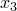=0）是框架的左下角。

**图 2-3** 模型坐标系和原点。

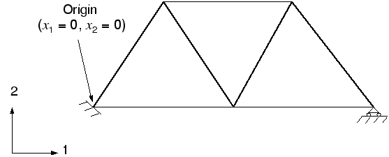

对于二维问题（如本例），Abaqus 要求模型位于与全局 1-2 平面平行的平面内。

### 2.3.3 网格

您必须选择单元类型并设计网格。为给定问题创建合适的网格需要经验。对于此示例，您将使用单个桁架单元来模拟框架的每个杆件，如图 [图 2-4](ch02s03.md#gss-finite-elem) 所示。

**图 2-4** 有限元网格。

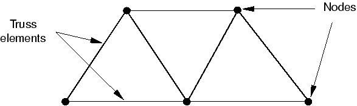

桁架单元只能承受轴向拉压载荷，非常适合模拟销接框架（如架空起重机）。桁架单元在 ["桁架单元，" 3.1.5 节](ch03s01.md#gsk-gen-elm-trusselem) 以及 [Abaqus Analysis User's Guide](../usb/usb-link.md#usb) 中有描述，后者描述了 Abaqus 中可用的所有单元。单元类型索引（[Abaqus Analysis User's Guide](../usb/usb-link.md#usb) 的"Section EI.1，Abaqus/Standard 单元索引"）使定位特定单元变得容易。当您首次使用单元时，应阅读描述，其中包括单元连接性和定义单元几何形状所需的任何单元截面属性。

架空起重机模型中使用的桁架单元的连接性如图 [图 2-5](ch02s03.md#gss-truss-elem) 所示。

**图 2-5** 2 节点桁架单元（T2D2）的连接性。

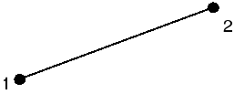

节点号和单元号仅是标识标签。它们通常由 Abaqus/CAE 或其他预处理器自动生成。节点号和单元号的唯一要求是它们必须是正整数。编号中允许有间隙，定义节点和单元的顺序无关紧要。任何已定义但未与单元关联的节点会被自动移除，不包含在模拟中。

在这种情况下，我们使用如图 [图 2-6](ch02s03.md#gss-hoist-model) 所示的节点和单元号。

**图 2-6** 起重机模型的节点和单元号。

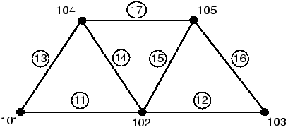

### 2.3.4 模型数据

输入文件的第一部分必须包含所有模型数据。这些数据定义被分析的结构。在架空起重机示例中，模型数据包括以下内容：
- 几何：- 节点坐标。- 单元连接性。- 单元截面属性。
- 材料属性。

**标题**

任何 Abaqus 输入文件中的第一个选项必须是 [*HEADING](../key/key-link.md#usb-kws-mheading)。[*HEADING](../key/key-link.md#usb-kws-mheading) 选项后面的数据行是描述正在模拟的问题的文本行。您应提供准确的描述，以便日后识别输入文件。此外，指定单位系统、全局坐标系方向等通常很有帮助。例如，起重机问题的 [*HEADING](../key/key-link.md#usb-kws-mheading) 选项块包含以下内容：

```
*HEADING
Two-dimensional overhead hoist frame
SI units (kg, m, s, N)
1-axis horizontal, 2-axis vertical

```

**数据文件打印选项**

默认情况下，Abaqus 不会将输入文件或模型和历史定义数据的回显打印到打印输出（`.dat`）文件中。但是，建议您在执行分析之前在 **datacheck** 运行中检查模型和历史定义。**datacheck** 运行将在本章后面讨论。

要请求打印输入文件以及模型和历史定义数据，请在输入文件中添加以下语句：

```
*PREPRINT, ECHO=YES, MODEL=YES, HISTORY=YES
```

**节点坐标**

选择网格设计和节点编号方案后，可以定义每个节点的坐标。对于此问题，使用如图 [图 2-6](ch02s03.md#gss-hoist-model) 所示的编号。节点坐标使用 [*NODE](../key/key-link.md#usb-kws-mnode) 选项定义。此选项块的每个数据行格式为

```
*<node number>*,*<**-coordinate>*,*<**-coordinate>*,*<**-coordinate>*
```
 起重机模型的节点定义如下：
```
*NODE
101, 0.,  0.,    0.
102, 1.,  0.,    0.
103, 2.,  0.,    0.
104, 0.5, 0.866, 0.
105, 1.5, 0.866, 0.
```

**单元连接性**

架空起重机的杆件用桁架单元建模。桁架单元的每个数据行格式为

```
*<element number>*, *<node 1>*, *<node 2>*
```
 其中 *node 1* 和 *node 2* 是单元两端的节点（见[图 2-5](ch02s03.md#gss-truss-elem)）。例如，单元 16 连接节点 103 和 105（见[图 2-6](ch02s03.md#gss-hoist-model)），因此定义此单元的数据行为
```
16, 103, 105
```
[*ELEMENT](../key/key-link.md#usb-kws-melement) 选项上的 TYPE 参数必须用于指定正在定义的单元类型。在这种情况下，您将使用 T2D2 桁架单元。

Abaqus 最有用的功能之一是可按名称引用节点和单元**集合**。通过在 [*ELEMENT](../key/key-link.md#usb-kws-melement) 选项上使用 ELSET 参数，选项块中定义的所有单元都被添加到名为 `FRAME` 的单元集合中。集合名称最多可包含 80 个字符，必须以字母开头。由于单元截面属性通过单元集合名称分配，模型中的所有单元必须至少属于一个单元集合。

架空起重机模型的完整 [*ELEMENT](../key/key-link.md#usb-kws-melement) 选项块（见[图 2-6](ch02s03.md#gss-hoist-model)）如下所示：

```
*ELEMENT, TYPE=T2D2, ELSET=FRAME
11, 101, 102
12, 102, 103
13, 101, 104
14, 102, 104
15, 102, 105
16, 103, 105
17, 104, 105
```

**单元截面属性**

每个单元必须引用一个单元截面属性。每个单元的适当单元截面选项以及每个单元所需的任何额外几何数据（如有）在 [Abaqus Analysis User's Guide](../usb/usb-link.md#usb) 中描述。

对于 T2D2 单元，您必须使用 [*SOLID SECTION](../key/key-link.md#usb-kws-msolidsection) 选项，并给出一行包含单元横截面积的数据。如果将数据行留空，则假定横截面积为 1.0。

在这种情况下，所有杆件都是直径为 5 mm 的圆棒。它们的横截面积为 1.963×10⁻⁵ m²。

MATERIAL 参数（大多数单元截面选项都需要）引用要与单元一起使用的材料属性定义的名称。该名称最多可包含 80 个字符，必须以字母开头。

在此示例中，所有单元具有相同的截面属性并由相同材料制成。通常，分析中会有多种不同的单元截面属性；例如，模型中的不同组件可能由不同材料制成。单元通过单元集合与材料属性关联。对于架空起重机模型，单元被添加到名为 `FRAME` 的单元集合中。然后使用单元集合 `FRAME` 作为单元截面选项上 ELSET 参数的值。将以下选项块添加到输入文件：

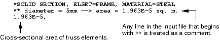

**材料**

使 Abaqus 成为真正通用有限元程序的特性之一是几乎任何材料模型都可以与任何单元一起使用。创建网格后，可以根据需要将与网格中单元相关的材料模型关联起来。

Abaqus 拥有大量材料模型，其中许多包含非线性行为。在本架空起重机示例中，我们使用最简单的材料行为形式：线性弹性。在[第 10 章，"材料"](ch10.md) 中，考虑了两种最常见的非线性材料行为形式：金属塑性和橡胶弹性。[Abaqus Analysis User's Guide](../usb/usb-link.md#usb) 中可以找到有关 Abaqus 中可用的所有材料模型的讨论。

线性弹性适用于小应变下的许多材料，特别是对于达到屈服点的金属。它以应力和应变之间的线性关系（胡克定律）为特征，如图 [图 2-7](ch02s03.md#gss-linear-elast) 所示。

**图 2-7** 线性弹性材料。

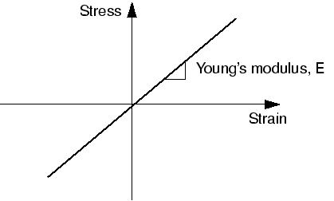

材料行为由两个常数表征：杨氏模量 *E* 和泊松比 。

Abaqus 输入文件中的材料定义从 [*MATERIAL](../key/key-link.md#usb-kws-mmaterial) 选项开始。参数 NAME 用于将材料与单元截面属性关联。例如， 

```
*SOLID SECTION, ELSET=FRAME, MATERIAL=*STEEL*
1.963E-5
*MATERIAL, NAME=*STEEL*
```

材料子选项直接跟随其关联的 [*MATERIAL](../key/key-link.md#usb-kws-mmaterial) 选项。可能需要多个子选项来完成材料定义。所有材料子选项与最近列出的 [*MATERIAL](../key/key-link.md#usb-kws-mmaterial) 选项关联的材料相关联，直到给出另一个 [*MATERIAL](../key/link.md#usb-kws-mmaterial) 选项或非材料选项块。

不考虑热膨胀效应（将使用 [*EXPANSION](../key/key-link.md#usb-kws-mexpansion) 材料子选项定义），需要一个材料子选项 [*ELASTIC](../key/key-link.md#usb-kws-melastic) 来定义线性弹性材料。此选项块的格式为

```
[*ELASTIC](../key/key-link.md#usb-kws-melastic)
*<E>,<>*
```
 因此，由钢制成的起重机杆件的完整各向同性线性弹性材料定义应按如下方式输入到输入文件中
```
*MATERIAL, NAME=STEEL
*ELASTIC
200.E9, 0.3
```

现在问题定义部分已完成，因为描述结构的所有组件都已指定。

### 2.3.5 历史数据

历史数据定义模拟的事件序列。此加载历史被划分为一系列**步骤**，每个步骤定义结构加载的不同部分。每个步骤包含以下信息：
- 模拟类型（静态、动态等）；
- 载荷和约束；和
- 所需的输出。

在此示例中，我们关注架空起重机在 10 kN 载荷作用于跨中时的静态响应，左端完全固定，右端有滚轮约束（见[图 2-1](ch02s02.md#gss-schematic-hoist)）。这是一个单一事件，因此只需一个步骤即可完成模拟。

[*STEP](../key/key-link.md#usb-kws-hstep) 选项用于标记步骤的开始。与 [*HEADING](../key/key-link.md#usb-kws-mheading) 选项一样，此选项后面可以跟包含步骤标题的数据行。在您的起重机模型中，使用以下 [*STEP](../key/key-link.md#usb-kws-hstep) 选项块：

```
*STEP, PERTURBATION
10kN central load
```

PERTURBATION 参数表示这是一个线性分析。如果省略此参数，分析可以是线性或非线性的。PERTURBATION 参数的使用在[第 11 章，"多步骤分析"](ch11.md) 中进一步讨论。

**分析过程**

**分析过程**（模拟类型）必须紧接着 [*STEP](../key/key-link.md#usb-kws-hstep) 选项块定义。在这种情况下，我们需要结构的长期静态响应。静态模拟的选项是 [*STATIC](../key/key-link.md#usb-kws-hstatic)。对于线性分析，此选项没有参数或数据行，因此将以下行添加到输入文件：

```
*STATIC
```

步骤中的其余输入数据定义边界条件（约束）、载荷和所需输出，可以按任何方便的顺序给出。

**边界条件**

边界条件应用于模型中位移已知的位置。这些部分可能在模拟期间被约束保持固定（位移为零）或可能有指定的非零位移。在任何一种情况下，约束都直接应用于模型的节点。

在某些情况下，节点可能完全受限，因此不能沿任何方向移动（例如，在我们案例中的节点 101）。在其他情况下，节点在某些方向上受到约束，但在其他方向上可以自由移动。节点可以移动的方向称为**自由度（dof）**。在我们的二维起重机情况下，每个节点可以在全局 1 和 2 方向上移动；因此，每个节点有两个自由度。如果起重机可以离开平面移动，问题将是三维的，每个节点将有三个自由度。连接到梁和壳单元的节点具有额外的代表旋转分量的自由度，因此可能有多达六个自由度。

Abaqus 中使用的自由度标签约定如下：

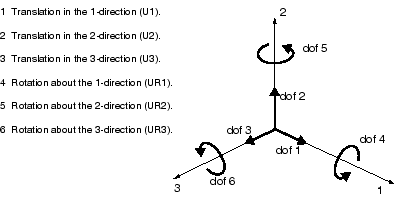

节点上活跃的自由度取决于连接到该节点的单元类型。[第 3 章，"有限元和刚体"](ch03.md) 描述了 Abaqus 中可用的一些单元的活跃自由度。二维桁架单元 T2D2 在每个节点有两个活跃的自由度——分别是 1 和 2 方向上的平移（dof 1 和 dof 2）。

使用 [*BOUNDARY](../key/key-link.md#usb-kws-hboundary) 选项并指定受约束的自由度来定义节点上的约束。每个数据行格式为：

```
*<node number>*, *<first dof>*, *<last dof>*, *<magnitude of displacement>* 
```

第一个自由度和最后一个自由度用于给出将受约束的自由度范围。例如，以下语句将节点 101 的自由度 1、2 和 3 约束为零位移（该节点不能在全局 1、2 或 3 方向上移动）：

```
101, 1, 3, 0.0
```

如果未在数据行上指定位移幅度，则假定为零。如果节点仅在一个方向上受约束，第三个字段应留空或等于第二个字段。例如，要仅约束节点 103 在 2 方向（自由度 2）上的位移，可使用以下任何数据行格式：

```
103, 2,2, 0.0
```
 或
```
103, 2,2
```
 或
```
103, 2
```

节点上的边界条件是累积的。因此，以下输入约束节点 101 在 1 和 2 两个方向上：

```
101, 1
101, 2
```

除了指定每个受约束的自由度外，一些更常见的约束可以直接使用以下命名约束给出：

| 自由度 | 描述 |
| --- | --- |
| ENCASTRE | 约束节点上的所有位移和旋转。 |
| PINNED | 约束所有平移自由度。 |
| XSYMM | 关于常数  平面的对称约束。 |
| YSYMM | 关于常数  平面的对称约束。 |
| ZSYMM | 关于常数  平面的对称约束。 |
| XASYMM | 关于常数  平面的反对称约束。 |
| YASYMM | 关于常数  平面的反对称约束。 |
| ZASYMM | 关于常数  平面的反对称约束。 |

因此，约束起重机模型中节点 101 处所有活跃自由度的另一种方法是
```
101, ENCASTRE
```

我们起重机问题的完整 [*BOUNDARY](../key/key-link.md#usb-kws-hboundary) 选项块为：

```
*BOUNDARY
101, ENCASTRE
103, 2
```

在此示例中，所有约束都在全局 1 或 2 方向上。在许多情况下，约束需要在与全局方向不对齐的方向上。在这种情况下，可以使用 [*TRANSFORM](../key/key-link.md#usb-kws-mtransform) 选项来定义用于边界条件应用的局部坐标系。[第 5 章，"使用壳单元"](ch05.md) 中的斜板示例演示了如何在这种情况下使用此选项。

**载荷**

载荷是导致结构位移或变形的任何因素，包括：
- 集中载荷，
- 压力载荷，
- 分布式牵引载荷，
- 分布式边缘载荷和壳上的力矩，
- 非零边界条件，
- 体积载荷，和
- 温度（当定义了材料的热膨胀时）。

实际上，不存在集中载荷或点载荷这样的东西；载荷始终施加在某个有限区域上。但是，如果加载区域类似于或小于该区域的单元，使用集中载荷（应用于节点）是一种合适的理想化方法。

集中载荷使用 [*CLOAD](../key/key-link.md#usb-kws-hcload) 选项指定。此选项的数据行格式为：

```
*<node number>*, *<dof>*, *<load magnitude>*
```
 在此模拟中，10 kN 的载荷以 2 方向作用于节点 102。选项块为：
```
*CLOAD
102, 2, -10.E3
```

**输出请求**

有限元分析会产生大量输出。Abaqus 允许您控制和管理此输出，以便仅生成解释模拟结果所需的数据。有四种类型的输出可用：
- 存储在用于 Abaqus/Viewer 后处理的二进制文件中的结果。此文件称为 Abaqus 输出数据库文件，扩展名为 `.odb`。
- 打印的结果表，写入 Abaqus 数据（`.dat`）文件。
- 重启数据，用于继续分析，写入 Abaqus 重启（`.res`）文件。
- 存储在二进制文件中用于后续第三方软件后处理的结果，写入 Abaqus 结果（`.fil`）文件。

您将在架空起重机模拟中使用前两种。

默认情况下，会创建输出数据库文件，其中包括给定分析类型最常用输出变量的预选集。默认输出数据库输出的预选变量列表在 [Abaqus Analysis User's Guide](../usb/usb-link.md#usb) 中给出。您不需要添加任何输出请求来接受这些默认值。对于此示例，默认输出数据库输出包括变形构型和施加的节点载荷。 

也可以将选定结果以表格形式写入 Abaqus 数据文件。默认情况下，不写入 Abaqus 数据文件的打印输出。[*NODE PRINT](../key/key-link.md#usb-kws-hnodeprint) 选项控制节点结果（如位移和反作用力）的打印，而 [*EL PRINT](../key/key-link.md#usb-kws-helprint) 选项控制单元结果的打印。可用的输出变量完整列表在 [Abaqus Analysis User's Guide](../usb/usb-link.md#usb) 中给出。

这些选项的数据行列出将出现在表列中的输出。每个数据行创建一个单独的数据表，最多可有九列。

对于此分析，我们关注节点的位移（输出变量 U）、受约束节点的反作用力（输出变量 RF）以及杆件中的应力（输出变量 S）。在输入文件中使用以下内容：

```
*NODE PRINT
U,
RF,
*EL PRINT
S,
```
 请求 Abaqus 在数据文件中生成三个输出数据表。

由于现在已经完成了步骤所需的所有数据定义，使用 [*END STEP](../key/key-link.md#usb-kws-hendstep) 选项标记步骤的结束：

```
*END STEP
```

输入文件现已完成。将您生成的输入文件与[图 2-2](ch02s02.md#gss-hoist-input) 中给出的完整输入文件进行比较。将数据保存为 `frame.inp`，然后退出编辑器。

### 2.3.6 检查模型

生成此模拟的输入文件后，您就可以运行分析了。不幸的是，由于输入错误或数据错误或缺失，输入文件中可能存在错误。您应首先执行 **datacheck** 分析，然后再运行模拟。要运行 **datacheck** 分析，请确保您位于输入文件 `frame.inp` 所在的目录中，然后键入以下命令：

```
abaqus job=frame datacheck interactive
```

如果此命令导致错误消息，则 Abaqus 安装已自定义。您应该联系系统管理员以了解运行 Abaqus 的适当命令。`job=frame` 参数指定此分析的 **jobname** 为 `frame`。与此分析关联的所有文件都将以此 **jobname** 作为标识符，以便轻松识别。

分析将交互运行，类似于以下的消息将出现在屏幕上：

```
Abaqus JOB frame
Abaqus 6.14-1
Begin Analysis Input File Processor
9/23/2010 9:26:43 AM
Run pre.exe
Abaqus License Manager checked out the following licenses:
Abaqus/Foundation checked out 3 tokens.
9/23/2010 9:26:45 AM
End Analysis Input File Processor
Begin Abaqus/Standard Datacheck
Begin Abaqus/Standard Analysis
9/23/2010 9:26:45 AM
Run standard.exe
Abaqus License Manager checked out the following licenses:
Abaqus/Foundation checked out 3 tokens.
2/23/2010 9:26:45 AM
End Abaqus/Standard Analysis
Abaqus JOB frame COMPLETED
```

当 **datacheck** 分析完成时，您会发现 Abaqus 创建了多个附加文件。如果在 **datacheck** 分析过程中遇到任何错误，消息将被写入数据文件 `frame.dat`。此数据文件是一个文本文件，可以在编辑器中查看或打印。尝试在文本编辑器中查看数据文件。该文件可以包含最多 256 个字符的行，因此编辑器应该能够容纳那么多字符。 

**标题页**

数据文件以标题页开头，其中包含用于运行分析的 Abaqus 版本信息。标题页还包含您当地办公室或代表的电话号码、地址和联系信息，他们可以提供技术支持和建议。

**输入文件回显**

标题页之后，数据文件包含输入文件的回显。输入数据回显是通过在输入文件中添加选项 [*PREPRINT](../key/key-link.md#usb-kws-mpreprint), ECHO=YES 生成的。默认情况下，参数 ECHO 设置为 NO。

```
                                         A B A Q U S   I N P U T   E C H O

                   5   10   15   20   25   30   35   40   45   50   55   60   65   70   75   80
               --------------------------------------------------------------------------------
               *HEADING
               Two-dimensional overhead hoist frame    
               SI units (kg, m, s, N)  
               1-axis horizontal, 2-axis vertical      
LINE     5     *PREPRINT, ECHO=YES, MODEL=YES, HISTORY=YES     
               **      
               ** Model definition     
               **      
               *NODE, NSET=NALL
LINE    10     101, 0.,  0.,    0.     
               102, 1.,  0.,    0.     
               103, 2.,  0.,    0.     
               104, 0.5, 0.866, 0.     
               105, 1.5, 0.866, 0.     
LINE    15     *ELEMENT, TYPE=T2D2, ELSET=FRAME
               11, 101, 102    
               12, 102, 103    
               13, 101, 104    
               14, 102, 104    
LINE    20     15, 102, 105    
               16, 103, 105    
               17, 104, 105    
               *SOLID SECTION, ELSET=FRAME, MATERIAL=STEEL     
               ** diameter = 5mm --> area = 1.963E-5 m^2       
LINE    25     1.963E-5,       
               *MATERIAL, NAME=STEEL   
               *ELASTIC
               200.E9, 0.3     
               **      
LINE    30     ** History data 
               **      
               *STEP, PERTURBATION     
               10kN central load       
               *STATIC 
LINE    35     *BOUNDARY       
               101, ENCASTRE   
               103, 2  
               *CLOAD  
               102, 2, -10.E3  
LINE    40     *NODE PRINT     
               U,      
               RF,     
               *EL PRINT       
               S,      
LINE    45     *END STEP       
               --------------------------------------------------------------------------------
                   5   10   15   20   25   30   35   40   45   50   55   60   65   70   75   80
               --------------------------------------------------------------------------------

```

**Abaqus 处理的选项**

输入数据回显之后是 Abaqus 处理的选项列表。这是出现错误和警告消息的第一个点。所有错误消息都以 ***ERROR 开头，而警告以 ***WARNING 开头。由于这些消息总是以相同的方式开头，因此在数据文件中搜索警告和错误消息很简单。当错误是语法问题时（即 Abaqus 无法理解输入时），错误消息后面跟着导致错误的输入文件中的行。

```
OPTIONS BEING PROCESSED
***************************

*HEADING
        Two-dimensional overhead hoist frame
*NODE, NSET=NALL
*ELEMENT, TYPE=T2D2, ELSET=FRAME
*MATERIAL, NAME=STEEL
*ELASTIC
*SOLID SECTION, ELSET=FRAME, MATERIAL=STEEL
*BOUNDARY
*SOLID SECTION, ELSET=FRAME, MATERIAL=STEEL
*STEP, PERTURBATION
*STEP, PERTURBATION
*STEP, PERTURBATION
10kN central load
*STATIC
*BOUNDARY
*EL PRINT
*EL FILE
*END STEP
*STEP, PERTURBATION
*STATIC
*BOUNDARY
*CLOAD
*NODE PRINT
*NODE FILE
*END STEP
```

**模型数据**

数据文件的其余部分是一系列表，包含所有模型数据和历史数据，应检查这些数据是否有任何明显错误或遗漏。这些表是通过在输入文件中包含选项 [*PREPRINT](../key/key-link.md#usb-kws-mpreprint), MODEL=YES, HISTORY=YES 生成的。但是，对于大型模型，这些表可能占用大量磁盘空间。默认情况下，参数 MODEL 和 HISTORY 设置为 NO。

模型数据部分以单元定义开始，汇总了所有模型数据。模型数据还包括材料描述。最好检查 Abaqus 是否正确解释了您在输入文件中给出的材料属性。材料属性中的错误有时会导致微妙的问题，很难从结果中检测出来。在此检查数据更容易。 

```
      E L E M E N T   D E F I N I T I O N S

NUMBER   TYPE    PROPERTY    NODES FORMING ELEMENT
                 REFERENCE

  11     T2D2        1        101       102
  12     T2D2        1        102       103
  13     T2D2        1        101       104
  14     T2D2        1        102       104
  15     T2D2        1        102       105
  16     T2D2        1        103       105
  17     T2D2        1        104       105

                              S O L I D   S E C T I O N (S)

PROPERTY NUMBER         1

   MATERIAL NAME                     STEEL
   ATTRIBUTES                         1.96300E-05   0.0000       0.0000    

   HOURGLASS CONTROL STIFFNESS    3.84615E+08

   (USED WITH LOWER ORDER REDUCED INTEGRATED SOLID ELEMENTS LIKE CPS4R,CPE4RH,C3D8R)

                       M A T E R I A L   D E S C R I P T I O N

MATERIAL NAME: STEEL

   ELASTIC         YOUNG'S    POISSON'S
                   MODULUS      RATIO
                  2.00000E+11 0.30000    

                               E L E M E N T   S E T S

SET    FRAME
MEMBERS                  11       12       13       14       15       16       17

                                  N O D E   S E T S

SET    NALL
MEMBERS                  101       102       103       104       105

                               N O D E   D E F I N I T I O N S

     NODE           COORDINATES                       SINGLE POINT CONSTRAINTS 
    NUMBER                                              TYPE    PLUS    DOF

      101     0.0000       0.0000       0.0000       ENCASTRE
      102     1.0000       0.0000       0.0000
      103     2.0000       0.0000       0.0000                    2
      104    0.50000      0.86600       0.0000
      105     1.5000      0.86600       0.0000

```

**历史数据：载荷和数据库输出**

历史数据在两个部分中显示如下。历史数据上半部分的第一行显示 10kN central load，这是 [*STEP](../key/key-link.md#usb-kws-hstep) 选项块中给出的第一行数据。此行提醒您此步骤中施加的载荷。

```
     10kN central load

     FIXED TIME INCREMENTS
     TIME INCREMENT IS                                    2.220E-16
     TIME PERIOD IS                                       2.220E-16
GLOBAL STABILIZATION CONTROL IS NOT USED

THIS IS A LINEAR PERTURBATION STEP.
ALL LOADS ARE DEFINED AS CHANGE IN LOAD TO THE REFERENCE STATE

EXTRAPOLATION WILL NOT BE USED

CHARACTERISTIC ELEMENT LENGTH      1.00    

DETAILS REGARDING ACTUAL SOLUTION WAVEFRONT REQUESTED

DETAILED OUTPUT OF DIAGNOSTICS TO DATABASE REQUESTED

PRINT OF INCREMENT NUMBER, TIME, ETC., TO THE MESSAGE FILE EVERY     1  INCREMENTS

                            D A T A B A S E   O U T P U T   G R O U P       1

THE FOLLOWING  FIELD   OUTPUT WILL BE WRITTEN EVERY        1 INCREMENT(S)

THE FOLLOWING OUTPUT WILL BE WRITTEN FOR ALL ELEMENTS OF TYPE T2D2.  OUTPUT IS AT THE
INTEGRATION POINTS.

          S         E       

 THE FOLLOWING OUTPUT WILL BE WRITTEN FOR ALL NODES

          U         RF        CF      

END OF DATABASE OUTPUT GROUP    1

                            D A T A B A S E   O U T P U T   G R O U P       2

THE FOLLOWING HISTORY  OUTPUT WILL BE WRITTEN EVERY        1 INCREMENT(S)

THE FOLLOWING ENERGY OUTPUT QUANTITIES WILL BE WRITTEN FOR THE WHOLE MODEL

         ALLKE    ALLSE    ALLWK    ALLPD    ALLCD    ALLVD    ALLKL    ALLAE    ALLQB

         ALLEE    ALLIE    ETOTAL   ALLFD    ALLJD    ALLSD    ALLDMD

END OF DATABASE OUTPUT GROUP    2

```

**历史数据：摘要**

历史数据的下半部分如下所示。本节总结单元和节点输出请求、边界条件和集中载荷。

```
                                  E L E M E N T   P R I N T

THE FOLLOWING TABLE IS PRINTED AT EVERY 1 INCREMENT FOR ALL ELEMENTS OF TYPE T2D2.  OUTPUT IS AT
THE INTEGRATION POINTS.

  SUMMARIES WILL BE PRINTED WHERE APPLICABLE

       TABLE     1  S11     

                               E L E M E N T   F I L E   O U T P U T

 THE FOLLOWING TABLE IS OUTPUT AT EVERY 1 INCREMENT FOR ALL ELEMENTS OF TYPE T2D2.  OUTPUT IS AT
 THE INTEGRATION POINTS.

          S       

                                    N O D E   P R I N T

 THE FOLLOWING TABLE IS PRINTED FOR ALL NODES AT EVERY 1 INCREMENT

   SUMMARIES WILL BE PRINTED

        TABLE  1  U1        U2      

 THE FOLLOWING TABLE IS PRINTED FOR ALL NODES AT EVERY 1 INCREMENT

   SUMMARIES WILL BE PRINTED

        TABLE  2  RF1       RF2     

                              N O D E   F I L E   O U T P U T

THE FOLLOWING TABLE IS OUTPUT FOR ALL NODES AT EVERY 1 INCREMENT

                  U         RF      

                       B O U N D A R Y   C O N D I T I O N S

NODE      DOF     AMP.    MAGNITUDE                 NODE      DOF     AMP.    MAGNITUDE
                  REF.                                                REF.

103        2     (RAMP)     0.0000               

- (RAMP) OR (STEP) - INDICATE USE OF DEFAULT AMPLITUDES ASSOCIATED WITH THE STEP

                     B O U N D A R Y   C O N D I T I O N S

NODE   TYPE        NODE    TYPE        NODE    TYPE        NODE    TYPE        NODE    TYPE

101   ENCASTRE   

                   C O N C E N T R A T E D   L O A D S

NODE  DOF   AMP.  AMPLITUDE     NODE  DOF   AMP.  AMPLITUDE    NODE  DOF   AMP.  AMPLITUDE
            REF.                            REF.                           REF.

102     2          -10000.

```

**数据文件中的其余项目**

如果在 **datacheck** 分析过程中有任何错误消息，则会在数据文件末尾列出产生的此类消息的数量。如果只有警告消息，则在请求输出的底部之后在数据文件底部列出这些消息的数量。

如果在 **datacheck** 分析过程中生成错误消息，在纠正错误消息的原因之前无法执行分析。应始终调查警告消息的原因。有时，警告消息是输入数据错误的指示；其他时候，它们是无害的，可以安全地忽略。

数据文件的最后部分（本指南中未显示）包括数值模型大小的摘要和模拟所需文件大小的估计。在分析大型模型时，使用此输出确保您有足够的磁盘空间来执行分析。

### 2.3.7 运行分析

对输入文件进行任何必要的更正。当 **datacheck** 分析完成且没有错误消息时，使用命令

```
abaqus job=frame continue interactive
```

运行分析本身。类似于以下的消息将出现在屏幕上：
```
Abaqus JOB frame
Abaqus 6.14-1
Begin Abaqus/Standard Analysis
9/23/2010 9:30:19 AM
Run standard.exe
Abaqus License Manager checked out the following licenses:
Abaqus/Foundation checked out 3 tokens.
9/23/2010 9:30:20 AM
End Abaqus/Standard Analysis
Abaqus JOB frame COMPLETED
```

您应该始终在运行模拟之前执行 **datacheck** 分析，以确保输入数据正确并检查是否有足够的磁盘空间和内存来完成分析。但是，可以通过使用命令

```
abaqus job=frame interactive
```

将模拟的 **datacheck** 和分析阶段合并。

如果预计模拟需要大量时间，通过省略 **interactive** 参数在后台运行会很方便：

```
abaqus job=frame
```

（上述命令适用于工作站上的标准 Abaqus 安装。但是，在某些计算机上，Abaqus 作业可能在批处理队列中运行。如果您有任何问题，请询问系统管理员如何在您的系统上运行 Abaqus。）

### 2.3.8 结果

分析完成后，数据文件 `frame.dat` 将包含使用 [*NODE PRINT](../key/key-link.md#usb-kws-hnodeprint) 和 [*EL PRINT](../key/key-link.md#usb-kws-helprint) 选项请求的结果表。结果表跟在 **datacheck** 分析的输出之后。架空起重机模拟的结果如下。 

**单元输出**

```
Two-dimensional overhead hoist frame                                STEP    1  INCREMENT    1
10kN central load                                          TIME COMPLETED IN THIS STEP   0.00

                   S T E P       1     S T A T I C   A N A L Y S I S

          10kN central load

          FIXED TIME INCREMENTS
          TIME INCREMENT IS                                    2.220E-16
          TIME PERIOD IS                                       2.220E-16

     LINEAR EQUATION SOLVER TYPE         DIRECT SPARSE

     THIS IS A LINEAR PERTURBATION STEP.
     ALL LOADS ARE DEFINED AS CHANGE IN LOAD TO THE REFERENCE STATE

                   M E M O R Y   E S T I M A T E

PROCESS      FLOATING PT       MINIMUM MEMORY        MEMORY TO
             OPERATIONS           REQUIRED          MINIMIZE I/O
            PER ITERATION         (MBYTES)           (MBYTES)

    1         2.65E+002               13                 20
NOTE:
     (1) THE ESTIMATE PRINTED IS THE MAXIMUM ESTIMATE FROM THE CURRENT STEP TO THE LAST STEP 
         OF THE ANALYSIS, WITH THE UNSYMMETRIC MATRIX AND SOLVER TAKEN INTO ACCOUNT IF 
         APPLICABLE. SINCE THE ESTIMATE IS BASED ON THE ACTIVE DEGREES OF FREEDOM IN THE 
         FIRST ITERATION OF THE CURRENT STEP, FOR PROBLEMS WITH SUBSTANTIAL CHANGES IN ACTIVE 
         DEGREES OF FREEDOM BETWEEN STEPS (OR EVEN WITHIN THE SAME STEP), THE MEMORY ESTIMATE 
         MIGHT BE NOTICEABLY DIFFERENT THAN THE ACTUAL USAGE. A FEW EXAMPLES ARE: PROBLEMS 
         WITH SIGNIFICANT CONTACT CHANGES, PROBLEMS WITH MODEL CHANGE, PROBLEMS WITH BOTH 
         STATIC STEP AND STEADY STATE DYNAMIC PROCEDURES, WHERE THE ACOUSTIC ELEMENTS WILL
         ONLY BE ACTIVATED IN THE STEADY STATE DYNAMIC STEPS.
     (2) THE ESTIMATE FOR THE FLOATING POINT OPERATIONS ON EACH PROCESS IS BASED 
         ON THE INITIAL LOAD SCHEDULING AND THIS MIGHT NOT REFLECT THE ACTUAL FLOATING 
         POINT OPERATIONS COMPLETED ON EACH PROCESS. DUE TO THE DYNAMIC LOAD BALANCING SCHEME, 
         THE ACTUAL LOAD BALANCE IS EXPECTED TO BE BETTER THAN THE ESTIMATE PRINTED HERE.
     (3) DEPENDING ON THE SETTING OF THE memory PARAMETER, THE DISK USAGE BY SCRATCH DATA CAN
         VARY FROM CLOSE TO ZERO TO THE ESTIMATED MEMORY TO MINIMIZE I/O.
     (4) USING RESTART, WRITE CAN GENERATE A LARGE AMOUNT OF DATA.

                                INCREMENT     1 SUMMARY

 TIME INCREMENT COMPLETED  2.220E-16,  FRACTION OF STEP COMPLETED   1.00
 STEP TIME COMPLETED       2.220E-16,  TOTAL TIME COMPLETED         0.00

                             E L E M E N T   O U T P U T

THE FOLLOWING TABLE IS PRINTED FOR ALL ELEMENTS WITH TYPE T2D2 AT THE INTEGRATION POINTS

    ELEMENT  PT FOOT-       S11     
                NOTE 

          11   1         1.4706E+08
          12   1         1.4706E+08
          13   1        -2.9412E+08
          14   1         2.9412E+08
          15   1         2.9412E+08
          16   1        -2.9412E+08
          17   1        -2.9412E+08

 MAXIMUM                2.9412E+08
 ELEMENT                    14

 MINIMUM               -2.9412E+08
 ELEMENT                    17

```

**节点输出**

```
             N O D E   O U T P U T

   THE FOLLOWING TABLE IS PRINTED FOR ALL NODES

       NODE FOOT-   U1          U2       
            NOTE

        102      7.3531E-04 -4.6698E-03 
        103      1.4706E-03   0.000     
        104      1.4706E-03 -2.5472E-03 
        105       0.000     -2.5472E-03 

 MAXIMUM         1.4706E-03   0.000    
 AT NODE               104         101

 MINIMUM          0.000     -4.6698E-03
 AT NODE               101         102

   THE FOLLOWING TABLE IS PRINTED FOR ALL NODES

       NODE FOOT-   RF1         RF2      
            NOTE

        101     -9.0949E-13   5000.     
        103       0.000       5000.     

 MAXIMUM          0.000       5000.    
 AT NODE               102         103

 MINIMUM        -9.0949E-13   0.000    
 AT NODE               101         102
```

节点位移和各个杆件中的峰值应力对于此起重机和这些施加的载荷是否合理？

始终最好检查模拟结果是否满足基本物理原理。在这种情况下，检查施加到起重机上的外力在垂直和水平方向上是否总和为零。

哪些节点有垂直力？哪些节点有水平力？您的模拟结果与此处显示的结果匹配吗？

Abaqus 在模拟过程中还会创建其他几个文件。其中一个文件——输出数据库文件 `frame.odb`——可用于使用 Abaqus/Viewer 以图形方式可视化结果。

### 2.3.9 后处理

由于模拟过程中创建的数据量很大，图形后处理非常重要。对于任何实际模型，您尝试以数据文件的表格形式解释结果是不切实际的。Abaqus/Viewer 允许您使用多种方法以图形方式查看结果，包括变形形状图、云图、矢量图、动画和 *X–Y* 图。本指南中讨论了所有这些方法。有关本指南中讨论的任何后处理功能的更多信息，请参阅 [Abaqus/CAE User's Guide](../usi/usi-link.md#usi) 中 Visualization 模块的相关部分。对于此示例，您将使用 Abaqus/Viewer 进行一些基本模型检查并显示框架的变形形状。

通过在操作系统提示符下键入以下命令来启动 Abaqus/Viewer：

```
abaqus viewer
```
 Abaqus/Viewer 窗口出现。 

要开始此练习，请打开 Abaqus/Standard 在分析过程中生成的输出数据库文件。

**打开输出数据库文件：**

1. 从主菜单栏中，选择 ****File****Open****；或使用 **File** 工具栏中的  工具。出现 **Open Database** 对话框。
2. 从可用输出数据库文件列表中，选择 `frame.odb`。
3. 点击 **OK**。**提示：**您也可以通过在操作系统提示符下键入以下命令来打开输出数据库 `frame.odb`：`abaqus viewer odb=frame`Abaqus/Viewer 打开由作业创建的输出数据库并显示未变形模型形状，如图 [图 2-8](ch02s03.md#gsa-undeformed) 所示。

**图 2-8** 未变形模型形状。

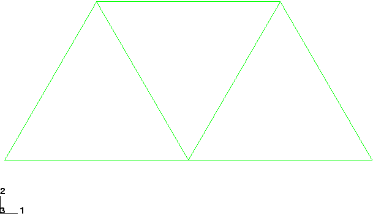

您可以选择在视口底部显示标题块和状态块；这些块在[图 2-8](ch02s03.md#gsa-undeformed) 中未显示。视口底部的标题块指示以下内容：
- 模型描述（来自作业描述）。
- 输出数据库的名称（来自分析作业的名称）。
- 用于生成输出数据库的产品名称（Abaqus/Standard 或 Abaqus/Explicit）和版本。
- 输出数据库上次修改的日期。

视口底部的状态块指示以下内容：- 当前显示的步骤。
- 步骤内的增量。
- 步骤时间。

视图方向 triad 指示模型在全局坐标系中的方向。位于视口右上角的 3D 指南针允许您直接操作视图。

您可以通过从主菜单栏中选择 ****Viewport****Viewport Annotation Options**** 来抑制和自定义标题块、状态块、视图方向 triad 和 3D 指南针的显示（例如，本指南中的许多图不包含标题块或指南针）。

**结果树**

您将使用结果树来查询模型的组件。结果树允许轻松访问输出数据库文件中包含的历史输出，以便创建 *X–Y* 图，还可以访问基于集合名称、材料和截面分配等的元素、节点和表面组，以便验证模型并控制视口显示。

**查询模型：**

1. 在结果树中，展开 **Output Databases** 容器下方在该后处理会话中打开的所有输出数据库文件。然后展开名为 `frame.odb` 的输出数据库的容器。
2. 展开 **Materials** 容器，然后点击名为 **STEEL** 的材料。所有单元都在视口中高亮显示，因为此分析中只使用了一种材料分配。

结果树将在后面的示例中更广泛地用于说明 *X–Y* 绘图功能以及使用显示组操作显示的功能。

**自定义未变形形状图**

您现在将使用绘图选项来启用节点和单元编号的显示。所有绘图类型（未变形、变形、云图、符号和材料方向）的常见绘图选项在一个对话框中设置。云图、符号和材料方向绘图类型有额外的选项，每个选项特定于给定的绘图类型。

**显示节点编号：**

1. 从主菜单栏中，选择 ****Options****Common****；或使用工具箱中的  工具。出现 **Common Plot Options** 对话框。
2. 点击 **Labels** 选项卡。
3. 切换 **Show node labels**。
4. 点击 **Apply**。Abaqus/Viewer 应用更改并保持对话框打开。

自定义未变形图如图 [图 2-9](ch02s03.md#gsk-node-plot) 所示。

**图 2-9** 节点编号图。

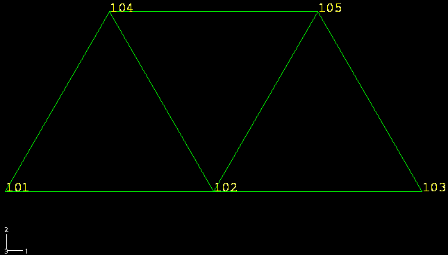

**显示单元编号：**

1. 在 **Common Plot Options** 对话框的 **Labels** 选项卡页面中，切换 **Show element labels**。
2. 点击 **OK**。Abaqus/Viewer 应用更改并关闭对话框。

结果图如图 [图 2-10](ch02s03.md#gsk-node-elem) 所示。

**图 2-10** 节点和单元编号图。

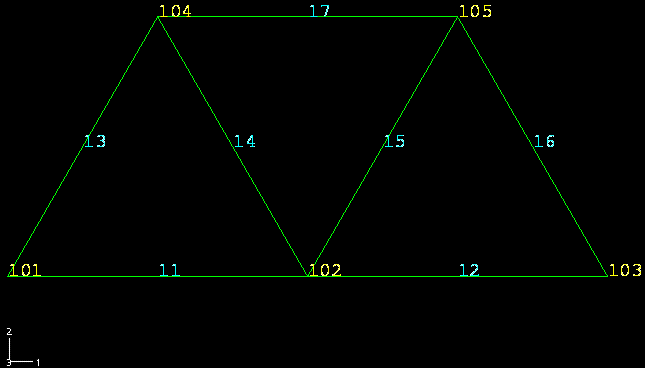

在继续之前，移除节点和单元标签。要禁用节点和单元编号的显示，请重复上述过程，并在 **Labels** 下切换 **Show node labels** 和 **Show element labels**。

**显示和自定义变形形状图**

您现在将显示变形模型形状，并使用绘图选项更改变形比例因子。您还将在变形模型形状上叠加未变形模型形状。

从主菜单栏中，选择 ****Plot****Deformed Shape****；或使用工具箱中的  工具。Abaqus/Viewer 显示变形模型形状，如图 [图 2-11](ch02s03.md#gsa-geometry) 所示。 

**图 2-11** 变形模型形状。


对于小位移分析（Abaqus/Standard 中的默认公式），位移会自动缩放以确保清晰可见。比例因子显示在状态块中。在这种情况下，位移已按 42.83 的比例因子缩放。

**更改变形比例因子：**

1. 从主菜单栏中，选择 ****Options****Common****；或使用工具箱中的  工具。
2. 如果 **Common Plot Options** 对话框尚未选择，请点击 **Basic** 选项卡。
3. 在 **Deformation Scale Factor** 区域中，切换 **Uniform** 并在 **Value** 字段中输入 `10.0`。
4. 点击 **Apply** 重新显示变形形状。状态块显示新的比例因子。
5. 要返回自动缩放位移，请重复上述过程，并在 **Deformation Scale Factor** 字段中切换 **Auto-compute**。
6. 点击 **OK** 关闭 **Common Plot Options** 对话框。

**在变形模型形状上叠加未变形模型形状：**

1. 点击工具箱中的 **Allow Multiple Plot States**  工具，以允许视口中多个绘图状态；然后点击  工具或选择 ****Plot****Undeformed Shape****，将未变形形状图添加到视口中现有的变形图中。默认情况下，Abaqus/Viewer 以绿色绘制变形模型形状，以半透明白色绘制（叠加的）未变形模型形状。
2. 叠加图像的绘图选项与主图像的绘图选项分开控制。从主菜单栏中，选择 ****Options****Superimpose****；或使用  工具来更改叠加（即未变形）图像的边缘样式。
3. 在 **Superimpose Plot Options** 对话框中，点击 **Color & Style** 选项卡。
4. 在 **Color & Style** 选项卡页面中，选择虚线边缘样式。
5. 点击 **OK** 关闭 **Superimpose Plot Options** 对话框并应用更改。

图如图 [图 2-12](ch02s03.md#gss-shapes) 所示。未变形模型形状以虚线边缘样式显示。

**图 2-12** 未变形和变形模型形状。


**使用 Abaqus/Viewer 检查模型**

您可以使用 Abaqus/Viewer 来检查模型在运行模拟之前是否正确。您已经学习了如何绘制模型图和显示节点及单元编号。这些是检查 Abaqus 是否使用正确网格的有用工具。

也可以显示和检查施加到架空起重机模型上的边界条件。 

**在未变形模型上显示边界条件：**

1. 点击工具箱中的  工具以禁用视口中的多个绘图状态。
2. 显示未变形模型形状（如果尚未显示）。
3. 从主菜单栏中，选择 ****View****ODB Display Options****。
4. 在 **ODB Display Options** 对话框中，点击 **Entity Display** 选项卡。
5. 切换 **Show boundary conditions**。
6. 点击 **OK**。Abaqus/Viewer 显示符号以指示施加的边界条件，如图 [图 2-13](ch02s03.md#gsa-overhead-hoist) 所示。

**图 2-13** 架空起重机上施加的边界条件。

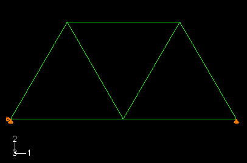

**表格数据报告**

除了上述图形功能外，Abaqus/Viewer 还允许您以表格格式将数据写入文本文件。这是将打印数据写入数据（`.dat`）文件的便捷替代方案，特别适用于复杂模型。以这种方式生成的输出有许多用途；例如，可用于书面报告。在此问题中，您将生成包含单元应力、节点位移和反作用力的报告。

**生成场数据报告：**

1. 从主菜单栏中，选择 ****Report****Field Output****。
2. 在 **Report Field Output** 对话框的 **Variable** 选项卡页面中，接受标记为 **Integration Point** 的默认位置。点击 **S: Stress components** 旁边的三角形以展开可用变量列表。从此列表中，切换 **S11**。
3. 在 **Setup** 选项卡页面中，将报告命名为 `Frame.rpt`。在页面底部的 **Data** 区域中，切换 **Column totals**。
4. 点击 **Apply**。单元应力被写入报告文件。
5. 在 **Report Field Output** 对话框的 **Variable** 选项卡页面中，将位置更改为 **Unique Nodal**。切换 **S: Stress components**，并从可用的 **U: Spatial displacement** 变量列表中选择 **U1** 和 **U2**。
6. 点击 **Apply**。节点位移被追加到报告文件。
7. 在 **Report Field Output** 对话框的 **Variable** 选项卡页面中，切换 **U: Spatial displacement**，并从可用的 **RF: Reaction force** 变量列表中选择 **RF1** 和 **RF2**。
8. 在 **Setup** 选项卡页面底部的 **Data** 区域中，切换 **Column totals**。
9. 点击 **OK**。反作用力被追加到报告文件，并且 **Report Field Output** 对话框关闭。

在文本编辑器中打开文件 `Frame.rpt`。该文件的内容如下所示。您的节点和单元编号可能不同。非常小的值也可能计算不同，这取决于您的系统。

**应力输出：**

```
Field Output Report

Source 1
---------

   ODB: frame.odb
   Step: Step-1
   Frame: Increment      1: Step Time =   2.2200E-16

Loc 1 : Integration point values from source 1

Output sorted by column "Element Label".

Field Output reported at integration points for part: PART-1-1

         Element             Int           S.S11
           Label              Pt          @Loc 1
-------------------------------------------------
              11               1     147.062E+06
              12               1     147.062E+06
              13               1    -294.118E+06
              14               1     294.118E+06
              15               1     294.118E+06
              16               1    -294.118E+06
              17               1    -294.125E+06

  Minimum                           -294.125E+06
      At Element                              17

          Int Pt                               1
  Maximum                            294.118E+06
      At Element                              15

          Int Pt                               1

```

**位移输出：**

```
Field Output Report

Source 1
---------

   ODB: frame.odb
   Step: Step-1
   Frame: Increment      1: Step Time =   2.2200E-16

Loc 1 : Nodal values from source 1

Output sorted by column "Node Label".

Field Output reported at nodes for part: PART-1-1

            Node            U.U1            U.U2
           Label          @Loc 1          @Loc 1
-------------------------------------------------
             101              0.         -5.E-33
             102     735.312E-06    -4.66977E-03
             103     1.47062E-03         -5.E-33
             104     1.47062E-03    -2.54716E-03
             105     433.681E-21    -2.54716E-03

  Minimum                     0.    -4.66977E-03

         At Node             101             102
  Maximum            1.47062E-03         -5.E-33

         At Node             104             103
```

**反作用力输出：**

```
Field Output Report

Source 1
---------

   ODB: frame.odb
   Step: Step-1
   Frame: Increment      1: Step Time =   2.2200E-16

Loc 1 : Nodal values from source 1

Output sorted by column "Node Label".

Field Output reported at nodes for part: PART-1-1

            Node          RF.RF1          RF.RF2
           Label          @Loc 1          @Loc 1
-------------------------------------------------
             101    -909.495E-15          5.E+03
             102              0.              0.
             103              0.          5.E+03
             104              0.              0.
             105              0.              0.

  Minimum           -909.495E-15              0.
         At Node             101             105

  Maximum                     0.          5.E+03
         At Node             105             103

           Total    -909.495E-15         10.E+03

```

这些表中获得的信息与之前检查数据（`.dat`）文件中打印结果时的信息相同。使用 Abaqus/Viewer 生成表格数据的优势在于您可以将其作为后处理操作来创建，而将其写入数据（`.dat`）文件则需要在输入文件中包含适当的选项（这是预处理操作）。因此，Abaqus/Viewer 为生成表格输出提供了更大的灵活性。

### 2.3.10 使用 Abaqus/Explicit 重新运行分析

为了进行比较，我们将使用 Abaqus/Explicit 重新运行相同的分析。这次我们关注起重机对跨中相同载荷突然施加的动态响应。继续之前，将 `frame.inp` 的副本保存为 `frame_xpl.inp`。对 `frame_xpl.inp` 输入文件进行所有后续更改。您需要将静态步骤替换为显式动态步骤，修改输出请求和材料定义，并更改单元库，然后才能重新提交作业。 

**修改材料定义**

由于 Abaqus/Explicit 执行动态分析，因此完整的材料定义需要您指定材料密度。对于此问题，假定密度等于 7800 kg/m³。

您可以通过在材料选项块中添加 [*DENSITY](../key/key-link.md#usb-kws-mdensity) 选项来修改材料定义。此选项的格式如下：

```
[*DENSITY](../key/key-link.md#usb-kws-mdensity)
<>,
```
 因此，起重机杆件的完整材料定义为：
```
*MATERIAL, NAME=STEEL
*ELASTIC
200.E9, 0.3
*DENSITY
7800.,
```

**替换分析步骤**

步骤定义必须更改为反映动态、显式分析。找到现有的 [*STEP](../key/key-link.md#usb-kws-hstep) 选项块，如下所示：

```
[*STEP](../key/key-link.md#usb-kws-hstep), PERTURBATION
10kN central load
```
将此选项块替换为以下内容：
```
[*STEP](../key/key-link.md#usb-kws-hstep)
10kN central load, suddenly applied
```

**分析过程**（模拟类型）必须紧接着 [*STEP](../key/key-link.md#usb-kws-hstep) 选项块定义。在 Abaqus/Explicit 中，三个分析选项是 [*DYNAMIC](../key/key-link.md#usb-kws-hdynamic), EXPLICIT；[*DYNAMIC TEMPERATURE-DISPLACEMENT](../key/key-link.md#usb-kws-hexpdynamicthermal), EXPLICIT；和 [*ANNEAL](../key/key-link.md#usb-kws-hanneal)。[*DYNAMIC TEMPERATURE-DISPLACEMENT](../key/key-link.md#usb-kws-hexpdynamicthermal) 过程模拟身体的完全耦合热机械响应，而 [*ANNEAL](../key/key-link.md#usb-kws-hanneal) 过程模拟金属加热到高温时发生的应力和塑性应变的松弛。在此模拟中，我们希望确定结构在 0.01 秒期间内的动态响应。因此，我们将使用 [*DYNAMIC](../key/key-link.md#usb-kws-hdynamic), EXPLICIT。将 [*STATIC](../key/key-link.md#usb-kws-hstatic) 选项块替换为以下内容：

```
*DYNAMIC, EXPLICIT
, 0.01
```

**修改输出请求**

因为这是一个动态分析，我们对框架的瞬态响应感兴趣，所以将中心点的位移写入历史输出是有帮助的。只能为节点集合请求位移历史输出。因此，您将创建一个包含桁架底部中心节点的节点集合。然后，您将把位移添加到历史输出请求中。

使用 [*NSET](../key/key-link.md#usb-kws-mnset) 选项创建一个名为 `CENTER` 的集合，如下所示：

```
*NSET, NSET=CENTER
102,
```
将此选项块放在输入文件的模型数据部分（例如，在节点定义之后）。

用以下内容替换现有的输出请求：

```
*OUTPUT, FIELD, VARIABLE=PRESELECT
*OUTPUT, HISTORY, VARIABLE=PRESELECT, FREQUENCY=1
*NODE OUTPUT, NSET=CENTER
U,
```

**提交新输入文件进行分析**

对 `frame_xpl` 输入文件中的输入数据进行交互式 **datacheck** 分析：

```
abaqus job=frame_xpl datacheck interactive
```
对输入文件进行任何必要的更正。当 **datacheck** 分析完成且没有错误消息时，使用命令

```
abaqus job=frame_xpl continue interactive
```

运行分析本身。

### 2.3.11 后处理动态分析结果

对于使用 Abaqus/Standard 完成的静态线性扰动分析，您检查了变形形状以及应力、位移和反作用力输出。对于 Abaqus/Explicit 分析，您同样可以检查变形形状并生成场数据报告。因为这是一个动态分析，所以您还应该检查由载荷引起的瞬态响应。您将通过为变形模型形状制作时间历史动画以及绘制桁架底部中心节点的位移历史来做到这一点。

首先使用["后处理，" 2.3.9 节](ch02s03.md#gsk-gen-abs-postprocessing) 中的说明打开 `frame_xpl` 输出数据库，然后绘制模型的变形形状。对于大位移分析（Abaqus/Explicit 中的默认公式），位移形状比例因子默认为 1。更改 **Deformation Scale Factor** 为 20，以便更清楚地看到桁架的变形。

**为变形模型形状创建时间历史动画：**

1. 从主菜单栏中，选择 ****Animate****Time History****；或使用工具箱中的  工具。时间历史动画以最快速度开始连续循环。Abaqus/Viewer 在上下文栏右侧显示电影播放器控件（就在视口上方）。
2. 从主菜单栏中，选择 ****Options****Animation****；或使用工具箱中动画选项  工具（直接位于  工具下方）。出现 **Animation Options** 对话框。
3. 将 **Mode** 更改为 **Play Once**，并通过移动 **Frame Rate** 滑块来减慢动画速度。
4. 您可以使用动画控件来启动、暂停和逐步浏览动画。从左到右如图 [图 2-14](ch02s03.md#usv-anm-moviecontrols-nls) 所示，这些控件执行以下功能：**播放/暂停**、**第一个**、**上一个**、**下一个** 和 **最后一个**。**图 2-14** 后处理动画控件。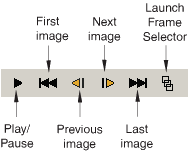

桁架对载荷做出动态响应。您可以通过绘制节点集合 `CENTER` 的垂直位移历史来确认这一点。

您可以从输出数据库（`.odb`）文件中存储的历史或场数据创建 X–Y 曲线。X–Y 曲线也可以从外部文件读取，或者可以在 Abaqus/Viewer 中交互式输入。创建曲线后，可以进一步操作其数据并以图形形式绘制到屏幕上。在此示例中，您将使用历史数据创建和绘制曲线。

**创建节点垂直位移的 X–Y 图：**

1. 在结果树中，展开名为 `frame_xpl.odb` 的输出数据库下方的 **History Output** 容器。
2. 从可用的历史输出列表中，双击 `Spatial displacement: U2 at Node 102 in NSET CENTER`。Abaqus/Viewer 绘制桁架底部中心节点在桁架跨中的垂直位移，如[图 2-15](ch02s03.md#gsa-hoist-displacement) 所示。**图 2-15** 桁架跨中的垂直位移。 **注意：**此图中已抑制图例并修改了轴标签。许多 *X–Y* 绘图选项可以直接通过双击视口的适当区域来访问。但是，要启用直接对象操作，您必须首先点击提示区域中的  以取消当前过程（如果需要）。要抑制图例，请在视口中双击它以打开 **Chart Legend Options** 对话框。在此对话框的 **Contents** 选项卡页面中，切换 **Show legend**。要修改轴标签，请双击任一轴以打开 **Axis Options** 对话框，并按[图 2-15](ch02s03.md#gsa-hoist-displacement) 中所示编辑轴标题。

**退出 Abaqus/Viewer**

保存您的模型数据库文件；然后从主菜单栏中选择 ****File****Exit**** 退出 Abaqus/Viewer。
