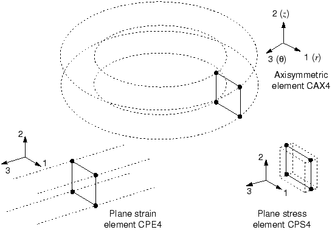
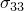

# 3.1 有限元


Abaqus 中有多种单元可供使用。这个广泛的单元库为您提供了一套解决不同问题的强大工具。Abaqus/Explicit 中可用的单元（除了少数例外）是 Abaqus/Standard 中可用单元的子集。本节向您介绍影响单元行为的五个方面。

### 3.1.1 表征单元

每个单元由以下方面表征：
- 家族
- 自由度（与单元家族直接相关）
- 节点数
- 公式
- 积分

Abaqus 中的每个单元都有唯一的名称，如 T2D2、S4R 或 C3D8I。正如您在[第 2 章，"Abaqus 基础"](ch02.md) 中的架空起重机示例中看到的，单元名称用作输入文件中 [*ELEMENT](../key/key-link.md#usb-kws-melement) 选项上 TYPE 参数的值。单元名称标识单元的五个方面。本章解释了命名约定。

**家族**

[图 3-1](ch03s01.md#gsa-elem-families) 显示了应力分析中最常用的单元家族。不同单元家族之间的主要区别之一是每个家族假设的几何类型。

**图 3-1** 常用单元家族。


本指南中您将使用的单元家族——连续体、壳、梁、桁架和刚体——在其它章节中有详细讨论。其它单元家族不在本指南范围内；如果您有兴趣在模型中使用它们，请阅读 [Abaqus Analysis User's Guide](../usb/usb-link.md#usbechapter) 的"第 VI 部分：单元"。

单元名称的首字母或前几个字母指示单元属于哪个家族。例如，S4R 中的 S 表示这是壳单元，而 C3D8I 中的 C 表示这是连续体单元。

**自由度**

自由度（dof）是分析期间计算的基本变量。对于应力/位移模拟，自由度是每个节点处的平移。一些单元家族，如梁和壳家族，也有旋转自由度。对于热传递模拟，自由度是每个节点处的温度；因此，热传递分析需要使用与应力分析不同的单元，因为自由度不同。

Abaqus 中使用的自由度编号约定如下：

| 1 | 方向 1 上的平移 |
| --- | --- |
| 2 | 方向 2 上的平移 |
| 3 | 方向 3 上的平移 |
| 4 | 绕 1 轴的旋转 |
| 5 | 绕 2 轴的旋转 |
| 6 | 绕 3 轴的旋转 |
| 7 | 开截面梁单元中的翘曲 |
| 8 | 声压、孔隙压力或静水压力 |
| 9 | 电势 |
| 10 | 连接器材料流量（长度单位） |
| 11 | 温度（或质量扩散分析中的归一化浓度），用于连续体单元或梁和壳厚度方向第一点的温度 |
| 12+ | 梁和壳厚度方向上其它点的温度 |

方向 1、2 和 3 分别对应全局 1、2 和 3 方向，除非在节点处定义了局部坐标系。

轴对称单元是例外，其位移和旋转自由度如下：

| 1 | *r* 方向的平移 |
| --- | --- |
| 2 | *z* 方向的平移 |
| 6 | *r*–*z* 平面内的旋转 |

方向 *r*（径向）和 *z*（轴向）分别对应全局 1 和 2 方向，除非在节点处定义了局部坐标系。有关在节点处定义局部坐标系的讨论，请参阅[第 5 章，"使用壳单元"](ch05.md)。

在本指南中，我们的注意力仅限于结构应用。因此，只讨论具有平移和旋转自由度的单元。有关其它类型单元（如热传递单元）的信息，请参阅 [Abaqus Analysis User's Guide](../usb/usb-link.md#usb)。

默认情况下，Abaqus/CAE 对标签视图方向 triad 使用字母选项 *x-y-z*。通常，本指南采用数字选项 1-2-3，以允许与自由度和输出标签直接对应。有关轴标签的更多信息，请参阅 ["Customizing the view triad," Abaqus/CAE User's Guide 第 5.4 节](../usi/usi-link.md#uss-dsp-gen-triad)。

**节点数——插值阶数**

上节中提到的位移、旋转、温度和其它自由度仅在单元的节点处计算。在单元中的任何其它点，位移通过从节点位移插值获得。通常，插值阶数由单元中使用的节点数决定，如[图 3-2](ch03s01.md#gsa-brickelem) 中的示例所示。 

**图 3-2** 线性六面体、二次六面体和改进的四面体单元。


- 仅在角落有节点的单元（如[图 3-2](ch03s01.md#gsa-brickelem)(a) 所示的 8 节点六面体）在每个方向上使用线性插值，通常称为线性单元或一阶单元。
- 具有边中节点的单元（如[图 3-2](ch03s01.md#gsa-brickelem)(b) 所示的 20 节点六面体）使用二次插值，通常称为二次单元或二阶单元。
- 具有边中节点的改进三角形或四面体单元（如[图 3-2](ch03s01.md#gsa-brickelem)(c) 所示的 10 节点四面体）使用改进的二阶插值，通常称为改进单元或改进二阶单元。

Abaqus/Standard 提供多种线性单元和二次单元。Abaqus/Explicit 仅提供线性单元，二次梁和改进的四面体和三角形单元除外。

通常，单元名称中清楚标识了单元中的节点数。正如您所见，8 节点六面体单元称为 C3D8；8 节点通用壳单元称为 S8R。梁单元家族使用略有不同的约定：插值阶数在名称中标识。因此，一阶三维梁单元称为 B31，而二阶三维梁单元称为 B32。轴对称壳和膜单元使用类似的约定。

**公式**

单元的公式是指用于定义单元行为的数学理论。在没有自适应网格划分的情况下，Abaqus 中所有应力/位移单元都基于**拉格朗日**或**材料**描述：与单元关联的材料在整个分析过程中保持与该单元关联，材料不能跨越单元边界流动。在替代的**欧拉**或**空间**描述中，单元固定在空间中，材料流过它们。欧拉方法通常用于流体力学模拟。Abaqus/Standard 使用欧拉单元来模拟对流热传递。自适应网格划分结合了纯拉格朗日和欧拉分析的特征，并允许单元运动独立于材料。本指南不讨论欧拉单元和自适应网格划分。

为适应不同类型的行为，Abaqus 中的一些单元家族包含具有多种不同公式的单元。例如，壳单元家族有三个类：一个适合通用壳分析，另一个适合薄壳，还有一个适合厚壳。（[第 5 章，"使用壳单元"](ch05.md) 中解释了这些壳单元公式。）

一些 Abaqus/Standard 单元家族除了标准公式外还有替代公式。具有替代公式的单元通过在单元名称末尾添加额外字符来标识。例如，连续体、梁和桁架单元家族包括具有混合公式的成员，其中压力（连续体单元）或轴力（梁和桁架单元）被视为额外未知数；这些单元通过名称末尾的字母"H"标识（如 C3D8H 或 B31H）。

一些单元公式允许求解耦合场问题。例如，以字母 C 开头和字母 T 结尾的单元名称（如 C3D8T）同时具有机械和热自由度，旨在用于耦合热机械模拟。

本指南后面将详细讨论一些最常用的单元公式。

**积分**

Abaqus 使用数值技术来积分每个单元体积上的各种量。对于大多数单元，Abaqus 使用高斯积分来评估每个单元中每个积分点处的材料响应。Abaqus 中的一些单元可以使用完全积分或减缩积分，这种选择对给定问题的单元精度可能有重大影响，正如 ["单元公式和积分，" 4.1 节"](ch04s01.md) 中详细讨论的那样。

Abaqus 使用单元名称末尾的字母"R"来区分减缩积分单元（除非它们也是混合单元，在这种情况下单元名称以字母"RH"结尾）。例如，CAX4 是 4 节点、完全积分、线性、轴对称实体单元；CAX4R 是相同单元的减缩积分版本。

Abaqus/Standard 同时提供完全积分和减缩积分单元；Abaqus/Explicit 仅提供减缩积分单元，但改进的四面体和三角形单元以及完全积分的一阶壳、膜和六面体单元除外。

### 3.1.2 连续体单元

在不同单元家族中，连续体或实体单元可用于模拟最广泛的组件。概念上，连续体单元简单地模拟组件中的小块材料。由于它们可以连接到任何面上的其它单元，连续体单元，像建筑中的砖块或马赛克中的瓷砖一样，可用于构建几乎任何形状、承受几乎任何载荷的模型。Abaqus 有应力/位移、非结构和耦合场连续体单元；本指南仅讨论应力/位移单元。

Abaqus 中的连续体应力/位移单元名称以字母"C"开头。接下来两个字母表示维数，通常（但并非总是）表示单元中的活跃自由度。字母"3D"表示三维单元；"AX"表示轴对称单元；"PE"表示平面应变单元；"PS"表示平面应力单元。

连续体单元的使用在[第 4 章，"使用连续体单元"](ch04.md) 中进一步讨论。

**三维连续体单元库**

三维连续体单元可以是六面体（砖块）、楔形或四面体。三维连续体单元和每种类型的节点连接的完整清单可在 ["Three-dimensional solid element library," Abaqus Analysis User's Guide 第 28.1.4 节](../usb/usb-link.md#usb-elm-e3delem) 中找到。

尽可能应在 Abaqus 中使用六面体单元或二阶四面体单元。一阶四面体（C3D4）具有简单的常应变公式，需要非常精细的网格才能获得准确的结果。

**二维连续体单元库**

Abaqus 有多种二维连续体单元，它们在面外行为上彼此不同。二维单元可以是四边形或三角形。[图 3-3](ch03s01.md#gsa-plane-axielem) 显示了最常用的三类。

**图 3-3** 无扭曲的平面应变、平面应力和轴对称单元。



平面应变单元假定面外应变  为零；它们可用于模拟厚结构。

平面应力单元假定面外应力  为零；它们适合模拟薄结构。

无扭曲的轴对称单元（"CAX"类单元）模拟 360° 环；它们适合分析具有轴对称几何形状和轴对称载荷的结构。

Abaqus/Standard 还提供广义平面应变单元、带扭曲的轴对称单元和非对称变形的轴对称单元。
- 广义平面应变单元增加了额外的广义化，即面外应变可能随模型平面中的位置线性变化。此公式特别适合厚截面的热应力分析。
- 带扭曲的轴对称单元模拟初始轴对称几何形状，可以围绕对称轴扭曲。这些单元用于模拟圆柱结构的扭转，如轴对称橡胶衬套。
- 非对称变形的轴对称单元模拟初始轴对称几何形状，可以非对称变形（通常是弯曲的结果）。它们用于模拟问题，如承受剪切载荷的轴对称橡胶支架。

后三类二维连续体单元不在本指南中讨论。

二维实体单元必须定义在 1-2 平面中，以便节点顺序围绕单元周长逆时针方向，如[图 3-4](ch03s01.md#gsa-two-dimensional) 所示。 

**图 3-4** 二维单元的正确节点连接。


使用预处理器生成网格时，确保单元法线都指向与正的全局 3 轴相同的方向。未能提供正确的单元连接将导致 Abaqus 发出错误消息，指出单元面积为负。

**自由度**

所有应力/位移连续体单元在每个节点处都有平移自由度相应地，三维单元中自由度 1、2 和 3 是活跃的，而平面应变单元、平面应力单元和无扭曲轴对称单元中只有自由度 1 和 2 是活跃的。要找到其它类二维实体单元中的活跃自由度，请参阅 ["Two-dimensional solid element library," Abaqus Analysis User's Guide 第 28.1.3 节](../usb/usb-link.md#usb-elm-e2delem)。

**单元属性**

[*SOLID SECTION](../key/key-link.md#usb-kws-msolidsection) 选项定义与一组连续体单元关联的材料和任何额外的几何数据。对于三维和轴对称单元，不需要额外的几何信息：节点坐标完全定义单元几何形状。对于平面应力和平面应变单元，必须在数据行上指定单元的厚度。例如，如果单元厚度为 0.2 m，则单元属性定义如下：

```
[*SOLID SECTION](../key/key-link.md#usb-kws-msolidsection), ELSET=*<element set name>*, MATERIAL=*<material name>*
0.2,
```

**公式和积分**

Abaqus/Standard 中连续体单元家族可用的替代公式包括**不兼容模式**公式（单元名称中的最后一个或倒数第二个字母为 I）和**混合**单元公式（单元名称中的最后一个字母为 H），两者都在本指南后面详细讨论。 

在 Abaqus/Standard 中，您可以为四边形和六面体（砖块）单元选择完全积分或减缩积分。在 Abaqus/Explicit 中，您可以为六面体（砖块）单元选择完全积分或减缩积分；但是，四边形一阶单元仅提供减缩积分。公式和积分类型都可能对应变单元的精度产生重大影响，如 ["单元公式和积分，" 4.1 节"](ch04s01.md) 中所讨论。

**单元输出变量**

默认情况下，单元输出变量（如应力和应变）参考全局笛卡尔坐标系。因此，[图 3-5](ch03s01.md#gsa-continuum-elem)(a) 中积分点处的  应力分量作用于全局 1 方向。即使在大位移模拟期间单元旋转时（如图 [图 3-5](ch03s01.md#gsa-continuum-elem)(b) 所示），默认仍使用全局笛卡尔系统作为定义单元变量的基础。 

**图 3-5** 连续体单元的默认材料方向。


但是，Abaqus 允许您为单元变量定义局部坐标系（见["示例：斜板，" 5.5 节"](ch05s05.md)）。此局部坐标系在大位移模拟中随单元运动旋转。如果被建模的对象具有一些自然材料方向（如复合材料中的纤维方向），局部坐标系可能非常有用。

### 3.1.3 壳单元

壳单元用于模拟一个维度（厚度）明显小于其它维度且厚度方向应力可忽略的结构。

Abaqus 中壳单元的名称以字母"S"开头。轴对称壳都以"SAX"开头。Abaqus/Standard 还提供以"SAXA"开头的非对称变形轴对称壳。壳单元名称中的第一个数字表示单元中的节点数，但轴对称壳除外，对于轴对称壳，第一个数字表示插值阶数。

Abaqus 中有两种壳单元可用：常规壳单元和连续体壳单元。常规壳单元通过定义单元的平面尺寸、表面法线和初始曲率来离散化参考曲面。另一方面，连续体壳单元类似于三维实体单元，因为它们离散整个三维体，但公式化的运动学和本构行为与常规壳单元相似。在本指南中仅讨论常规壳单元。因此，此后我们将其简称为"壳单元"。有关连续体壳单元的更多信息，请参阅 ["Shell elements: overview," Abaqus Analysis User's Guide 第 29.6.1 节](../usb/usb-link.md#usb-elm-eshelloverview)。

壳单元的使用在[第 5 章，"使用壳单元"](ch05.md) 中详细讨论。

**壳单元库**

Abaqus/Standard 中有三类通用三维壳单元可用：通用、仅薄和仅厚。通用壳和具有非对称变形的轴对称壳考虑有限的膜应变和任意大的旋转。三维"厚"和"薄"单元类型提供任意大的旋转，但仅限小应变。通用壳允许壳厚度随单元变形而变化。所有其它壳单元假设小应变且壳厚度不变，即使单元节点可能经历有限旋转。可提供线性和二次插值的三角形和四边形单元。可提供线性和二次轴对称壳单元。所有四边形壳单元（除 S4 外）和三角形壳单元 S3/S3R 使用减缩积分。S4 单元和其它三角形壳单元使用完全积分。[表 3-1](ch03s01.md#gsa-elementintro-table1) 总结了 Abaqus/Standard 中可用的壳单元。

**表 3-1** Abaqus/Standard 中的三类壳单元。
| 通用壳 | 仅薄壳 | 仅厚壳 |
| --- | --- | --- |
| S4, S4R, S3/S3R, SAX1, SAX2, SAX2T, SC6R, SC8R | STRI3, STRI65, S4R5, S8R5, S9R5, SAXA | S8R, S8RT |

Abaqus/Explicit 中的所有壳单元都是通用型的。可提供有限膜应变和小膜应变公式。可提供线性插值的三角形和四边形单元。也可提供线性轴对称壳单元。[表 3-2](ch03s01.md#gsa-elementintro-table2) 总结了 Abaqus/Explicit 中可用的壳单元。

**表 3-2** Abaqus/Explicit 中的两类壳单元。
| 有限应变壳 | 小应变壳 |
| --- | --- |
| S4, S4R, S3/S3R, SAX1 | S4RS, S4RSW, S3RS |

对于大多数显式分析，有限应变壳单元是合适的。但是，如果分析涉及小膜应变和任意大的旋转，则小应变壳单元在计算上更高效。S4RS 和 S3RS 单元不考虑翘曲，而 S4RSW 单元考虑。

Abaqus 中可用的壳公式在[第 5 章，"使用壳单元"](ch05.md) 中详细讨论。

**自由度**

Abaqus/Standard 中名称以数字"5"结尾的三维单元（如 S4R5、STRI65）在每个节点处有 5 个自由度：三个平移和两个面内旋转（即，无关于壳法线的旋转）。但是，如果需要，所有六个自由度都在节点处激活；例如，如果施加旋转边界条件，或者如果节点位于壳的折叠线上。

其余三维壳单元在每个节点处有六个自由度（三个平移和三个旋转）。

轴对称壳在每个节点处有三个关联的自由度：

| 1 | *r* 方向的平移。 |
| --- | --- |
| 2 | *z* 方向的平移。 |
| 6 | *r*–*z* 平面内的旋转。 |

**单元属性**

使用 [*SHELL GENERAL SECTION](../key/key-link.md#usb-kws-mshellgensect) 或 [*SHELL SECTION](../key/key-link.md#usb-kws-mshellsection) 选项来定义一组壳单元的厚度和材料特性。这两个选项格式相似：

```
[*SHELL SECTION](../key/key-link.md#usb-kws-mshellsection), ELSET=*<element set name>*, MATERIAL=*<material name>*
*<thickness>*,*<number of section points>*
```
 或
```
[*SHELL GENERAL SECTION](../key/key-link.md#usb-kws-mshellgensect), ELSET=*<element set name>*,
MATERIAL=*<material name>*
*<thickness>*
```

如果指定 [*SHELL SECTION](../key/key-link.md#usb-kws-mshellsection) 选项，Abaqus 使用数值积分来计算壳厚度上每个截面点（积分点）处的应力和应变，从而允许非线性材料行为。例如，弹塑性壳可能在外部截面点屈服，而内部截面点保持弹性。如[图 3-6](ch03s01.md#gsa-shell-sect-pts) 所示，S4R（4 节点、减缩积分）单元中单个积分点的位置和穿过壳厚度的截面点配置。

**图 3-6** 壳单元厚度方向的截面点。


您可以使用 [*SHELL SECTION](../key/key-link.md#usb-kws-mshellsection) 选项指定穿过壳厚度的任意奇数个截面点。默认情况下，Abaqus 对均匀壳使用五个穿过厚度的截面点，这对于大多数非线性设计问题已足够。但是，在某些复杂模拟中应使用更多截面点，特别是当您预期反向塑性弯曲时（通常九个就够了）。对于线性问题，三个截面点提供穿过厚度的精确积分。但是，[*SHELL GENERAL SECTION](../key/key-link.md#usb-kws-mshellgensect) 选项对线性弹性壳更高效。

如果使用 [*SHELL GENERAL SECTION](../key/key-link.md#usb-kws-mshellgensect) 选项，材料行为必须是线性弹性的，因为截面刚度仅在模拟开始时计算一次。在这种情况下，所有计算都以整个截面上的合力和力矩给出。如果您请求应力或应变输出，Abaqus 提供底面、中面和顶面的默认输出。

**参考曲面偏移**

壳的参考曲面由壳单元的节点和法线定义。当使用壳单元建模时，参考曲面通常与壳的中面重合。但是，在许多情况下，将参考曲面定义为与壳中面偏移会更方便。例如，CAD 包中创建的曲面通常代表壳体的顶部或底部表面。在这种情况下，将参考曲面定义为与 CAD 曲面重合（因此与壳中面偏移）可能更容易。

壳偏移也可用于为接触问题定义更精确的曲面几何，其中壳厚度很重要。当建模厚度连续变化的壳时，偏移与中面的偏移也可能很重要。在这种情况下，在壳中面定义节点可能很困难。如果一个表面光滑而另一个表面粗糙（如某些飞机结构中），使用壳偏移在中滑表面定义节点最容易。

可以通过使用 [*SHELL SECTION](../key/key-link.md#usb-kws-mshellsection) 和 [*SHELL GENERAL SECTION](../key/key-link.md#usb-kws-mshellgensect) 选项上的 OFFSET 参数引入偏移。偏移值定义为从壳的中面到包含单元节点的参考曲面的距离（以壳厚度的分数表示）。偏移值为正时在正法线方向上。当偏移设置为 0.5 或 SPOS 时，壳的顶面是参考曲面。当偏移设置为 –0.5 或 SNEG 时，底面是参考曲面。默认偏移为 0，表示壳的中面是参考曲面。这三个参考曲面偏移设置如图 [图 5-4](ch05s01.md#gss-shelloffset) 所示，其中调整了节点位置以保持中面的位置不变。

**图 3-7** 参考曲面偏移示意图（偏移值 0、–0.5 和 +0.5）。


 壳的自由度与参考曲面关联。单元的面积和所有运动量在那里计算。对于弯曲壳，大的偏移值可能导致面积积分误差，影响壳截面的刚度、质量和转动惯量。为了稳定性，Abaqus/Explicit 还会自动增加用于壳单元的转动惯量，增幅与偏移的平方成比例，这可能导致大偏移时动态误差。当需要偏离中面的大偏移时，使用多点约束或刚体约束代替。

**单元输出变量**

壳的单元输出变量根据位于每个壳单元表面上的局部材料方向定义。在所有大位移模拟中，这些轴随单元变形的平均运动旋转。您也可以定义在大位移分析中随单元变形而旋转的局部材料坐标系。 

### 3.1.4 梁单元

梁单元用于建模一个维度（长度）明显大于其它两个维度且仅沿梁轴方向的应力重要的组件。

Abaqus 中梁单元的名称以字母"B"开头。下一个字符表示单元的维数："2"表示二维梁，"3"表示三维梁。第三个字符表示所用的插值："1"表示线性插值，"2"表示二次插值，"3"表示三次插值。

梁单元的使用在[第 6 章，"使用梁单元"](ch06.md) 中讨论。

**梁单元库**

二维和三维都有线性、二次和三次梁可用。Abaqus/Explicit 中没有三次梁。

**自由度**

三维梁在每个节点处有六个自由度：三个平移自由度（1-3）和三个旋转自由度（4-6）。"开截面"型梁（如 B31OS）在 Abaqus/Standard 中可用，具有额外的自由度（7）代表梁横截面的翘曲。

二维梁在每个节点处有三个自由度：两个平移自由度（1 和 2）和一个关于模型平面法线的旋转自由度（6）。

**单元属性**

使用 [*BEAM SECTION](../key/key-link.md#usb-kws-mbeamsection) 或 [*BEAM GENERAL SECTION](../key/key-link.md#usb-kws-mbeamgensect) 选项来定义梁截面的几何形状；节点坐标仅定义长度。

如果指定 [*BEAM SECTION](../key/key-link.md#usb-kws-mbeamsection) 选项，则几何定义梁横截面，MATERIAL 参数引用材料属性定义。Abaqus 通过对横截面进行数值积分来计算梁的横截面行为，允许线性和非线性材料行为。

[*BEAM GENERAL SECTION](../key/key-link.md#usb-kws-mbeamgensect) 选项允许您以多种通用方式定义横截面行为以建模线性或非线性行为。由于 Abaqus 使用此选项直接以截面工程量（面积、惯性矩等）建模梁的横截面行为，因此无需对单元横截面进行任何量的积分。因此，[*BEAM GENERAL SECTION](../key/key-link.md#usb-kws-mbeamgensect) 在计算上比 [*BEAM SECTION](../key/key-link.md#usb-kws-mbeamsection) 便宜。响应以力和力矩合量的形式计算；仅在请求输出时才计算应力和应变。

在 Abaqus/Standard 中，您还可以定义具有线性锥形截面的梁。支持线性响应的通用梁截面和标准库截面。

**公式和积分**

线性梁（B21 和 B31）和二次梁（B22 和 B32）可剪切变形并考虑有限轴向应变；因此，它们适合建模细长和短粗梁。Abaqus/Standard 中的三次梁单元（B23 和 B33）不考虑剪切柔度并假设小轴向应变，尽管梁的大位移和旋转是有效的。因此，它们适合建模细长梁。 

Abaqus/Standard 提供适合建模薄壁开截面梁（ B31OS 和 B32OS）的线性梁和二次梁变体。这些单元模拟扭转和开截面（如 I 梁或 U 截面通道）中的翘曲效应。本指南不讨论开截面梁。

Abaqus/Standard 也有混合梁单元，用于建模非常细长的构件（如海上石油设施的柔性立管）或非常硬的连杆。本指南不讨论混合梁。

**单元输出变量**

三维剪切可变形梁单元的应力分量是轴向应力（）和扭转引起的剪切应力（）。剪切应力作用于薄壁截面的截面壁上。也可提供相应的应变度量。剪切可变形梁还提供横截面上横向剪切力的估计。Abaqus/Standard 中的细长（三次）梁只有轴向变量作为输出。空间中的开截面梁也只有轴向变量作为输出，因为此时扭转剪切应力可以忽略。

所有二维梁仅使用轴向应力和应变。

也可以为输出请求轴向力、关于局部梁轴的弯矩和曲率。对于具有哪些单元可用哪些分量的详细信息，请参阅 ["Beam modeling: overview," Abaqus Analysis User's Guide 第 29.3.1 节](../usb/usb-link.md#usb-elm-ebeamoverview)。[第 6 章，"使用梁单元"](ch06.md) 中给出了局部梁轴是如何定义的详细信息。

### 3.1.5 桁架单元

桁架单元是只能承受拉伸或压缩载荷的杆。它们没有弯曲阻力；因此，它们适用于模拟销接框架。此外，桁架单元可用作电缆或弦的近似（例如，在网球拍中）。桁架有时也用于表示其它单元中的钢筋。[第 2 章，"Abaqus 基础"](ch02.md) 中的架空起重机模型使用了桁架单元。

所有桁架单元名称都以字母"T"开头。接下来两个字符表示单元的维数——"2D"表示二维桁架，"3D"表示三维桁架。最后一个字符表示单元中的节点数。

**桁架单元库**

二维和三维都有线性和二次桁架可用。Abaqus/Explicit 中没有二次桁架。

**自由度**

桁架单元在每个节点处只有平移自由度。三维桁架单元具有自由度 1、2 和 3，而二维桁架单元具有自由度 1 和 2。

**单元属性**

[*SOLID SECTION](../key/key-link.md#usb-kws-msolidsection) 选项用于指定与给定一组桁架单元关联的材料属性定义的名称。横截面积在数据行上给出：

```
[*SOLID SECTION](../key/key-link.md#usb-kws-msolidsection), ELSET=*<element set name>*, MATERIAL=*<material>*
*<cross-sectional area>*
```

**公式和积分**

除了标准公式外，Abaqus/Standard 中还提供混合桁架单元公式。它适用于建模刚度远大于整体结构刚度的非常硬的连杆。

**单元输出变量**

桁架单元的轴向应力和应变可用作输出。