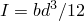
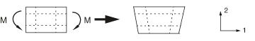
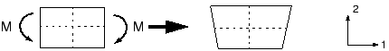
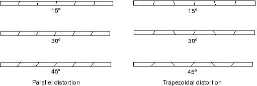

# 4.1 单元公式和积分

将通过考虑如图 [图 4-1](ch04s01.md#gss-pointload) 所示的悬臂梁的静态分析来演示单元阶数（线性或二次）、单元公式和积分级别对结构模拟准确性的影响。 

**图 4-1** 自由端受点载荷 *P* 作用的悬臂梁。

这是一个用于评估给定有限元行为的经典测试。由于梁相对细长，我们通常会用梁单元建模。但是，它在这里用于帮助评估各种实体单元的有效性。

梁长 150 mm，宽 2.5 mm，深 5 mm；一端固定；自由端承受 5 N 的尖端载荷。材料的杨氏模量 *E* 为 70 GPa，泊松比为 0.0。使用梁理论，载荷 *P* 作用下梁尖端的静挠度为 

其中 ，*l* 是长度，*b* 是宽度，*d* 是梁的深度。

对于  5 N，尖端挠度为 3.09 mm。

### 4.1.1 完全积分

"完全积分"一词指的是在单元具有规则形状时精确积分单元刚度矩阵中多项式项所需的高斯点数量。对于六面体和四边形单元，"规则形状"意味着边缘是直的且成直角相交，任何边缘节点位于边缘的中点。完全积分的线性单元在每个方向使用两个积分点。因此，三维单元 C3D8 在单元中使用 2×2×2 积分点阵列。完全积分的二次单元（仅在 Abaqus/Standard 中可用）在每个方向使用三个积分点。完全积分的二维四边形单元中积分点的位置如图 [图 4-2](ch04s01.md#gss-linear-quad) 所示。

**图 4-2** 完全积分的二维四边形单元中的积分点。

在 Abaqus/Standard 悬臂梁问题模拟中使用了多种不同的有限元网格，如图 [图 4-3](ch04s01.md#gss-four-meshes) 所示。这些模拟使用线性或二次完全积分单元，并说明单元阶数（一阶对二阶）和网格密度对结果准确性的影响。

**图 4-3** 悬臂梁模拟使用的网格。

各种模拟的尖端位移与 3.09 mm 梁理论值之比在[表 4-1](ch04s01.md#gss-continuum-table-beam) 中给出。

**表 4-1** 完全积分单元的归一化尖端位移。
| 单元 | 网格尺寸（深度×长度） |
| --- | --- |
| 1×6 | 2×12 | 4×12 | 8×24 |
| CPS4 | 0.074 | 0.242 | 0.242 | 0.561 |
| CPS8 | 0.994 | 1.000 | 1.000 | 1.000 |
| C3D8 | 0.077 | 0.248 | 0.243 | 0.563 |
| C3D20 | 0.994 | 1.000 | 1.000 | 1.000 |

线性单元 CPS4 和 C3D8 严重低估了挠度，结果无法使用。粗糙网格的准确性最低，但即使精细网格（8×24）预测的尖端位移也只有理论值的 56%。请注意，对于线性完全积分单元，单元穿过梁厚度的数量没有区别。尖端挠度的低估是由**剪切锁定**引起的，这是所有完全积分、一阶实体单元的问题。

正如我们所看到的，剪切锁定导致单元在弯曲时过于僵硬。解释如下。考虑结构中承受纯弯曲的一小块材料。材料将如图 [图 4-4](ch04s01.md#gss-deform) 所示变形。 

**图 4-4** 承受弯矩 *M* 变形的材料。

最初平行于水平轴的线呈恒定曲率，穿过厚度的线保持直线。水平和垂直线之间的角度保持为 90°。

线性单元的边缘无法弯曲；因此，如果使用单个单元对该小块材料建模，其变形形状如图 [图 4-5](ch04s01.md#gss-linear-elem) 所示。

**图 4-5** 承受弯矩 *M* 变形的完全积分线性单元。

为可视化，绘制了穿过积分点的虚线。很明显，上线长度增加了，表明 1 方向的正应力  是拉伸的。同样，下虚线的长度减小了，表明  是压缩的。垂直虚线的长度没有变化（假设位移很小）；因此，所有积分点处的  为零。所有这些与一小块材料承受纯弯曲时的预期应力状态一致。但是，在每个积分点处，垂直线和水平线之间的角度（最初为 90°）发生了变化。这表明这些点处的剪切应力  不为零。这是不正确的：纯弯曲材料中的剪切应力为零。

这种虚假剪切应力产生是因为单元边缘无法弯曲。它的存在意味着应变能产生剪切变形而不是预期的弯曲变形，因此整体挠度较小：单元过于僵硬。

剪切锁定仅影响承受弯曲载荷的完全积分线性单元的性能。这些单元在直接载荷或剪切载荷下表现良好。剪切锁定不是二次单元的问题，因为它们的边缘可以弯曲（见[图 4-6](ch04s01.md#gss-quad-elem)）。[表 4-1](ch04s01.md#gss-continuum-table-beam) 中所示二次单元预测的尖端位移接近理论值。但是，如果二次单元变形或弯曲应力有梯度，它们也会表现出一些锁定，这两者都可能在实际问题中发生。

**图 4-6** 承受弯矩 *M* 变形的完全积分二次单元。

完全积分线性单元应仅在您相当确定载荷将在模型中产生最小弯曲时使用。如果您对载荷将产生的变形类型有疑问，请使用不同单元类型。完全积分二次单元在复杂应力状态下也可能锁定；因此，如果它们在模型中单独使用，您应仔细检查结果。但是，它们可用于建模存在局部应力集中的区域。

**体积锁定**是另一种形式的过度约束，发生在材料行为（几乎）不可压缩时的完全积分单元中。它导致应该不引起体积变化的变形出现过度僵硬行为。相关内容在[第 10 章，"材料"](ch10.md) 中进一步讨论。

### 4.1.2 减缩积分

只有四边形和六面体单元可以使用减缩积分方案；所有楔形、四面体和三角形实体单元使用完全积分，尽管它们可以与减缩积分六面体或四边形单元在同一网格中使用。

减缩积分单元在每个方向使用的积分点比完全积分单元少一个。减缩积分线性单元只有一个位于单元形心的积分点。（实际上，Abaqus 中的这些一阶单元使用更准确的"均匀应变"公式，其中计算单元应变分量的平均值。这个区别对于本次讨论不重要。）减缩积分四边形单元中积分点的位置如图 [图 4-7](ch04s01.md#gss-reduced) 所示。

**图 4-7** 减缩积分二维单元中的积分点。

使用之前使用的相同四种单元的减缩积分版本以及如图 [图 4-3](ch04s01.md#gss-four-meshes) 所示的四种有限元网格对悬臂梁问题进行了 Abaqus 模拟。这些模拟的结果在[表 4-2](ch04s01.md#gss-continuum-table-mesh) 中给出。

**表 4-2** 减缩积分单元的归一化尖端位移。
| 单元 | 网格尺寸（深度×长度） |
| --- | --- |
| 1×6 | 2×12 | 4×12 | 8×24 |
| CPS4R | 20.3* | 1.308 | 1.051 | 1.012 |
| CPS8R | 1.000 | 1.000 | 1.000 | 1.000 |
| C3D8R | 70.1* | 1.323 | 1.063 | 1.015 |
| C3D20R | 0.999** | 1.000 | 1.000 | 1.000 |
| * 没有刚度抵抗施加的载荷，** 宽度方向两个单元 |

线性减缩积分单元往往过于柔软，因为它们遭受称为**沙漏**的自身数值问题。再次考虑一个承受纯弯曲的单个减缩积分单元建模的一小块材料（见[图 4-8](ch04s01.md#gss-reduced-integration)）。

**图 4-8** 承受弯矩 *M* 变形的减缩积分线性单元。

两条虚线可视化线都没有改变长度，它们之间的角度也没有改变，这意味着单元单个积分点处的所有应力分量为零。因此，这种弯曲模式变形是一种零能模式，因为此单元变形不产生应变能。该单元无法抵抗这种变形，因为它在此模式下没有刚度。在粗糙网格中，这种零能模式可以通过网格传播，产生无意义的结果。

在 Abaqus 中，在一阶减缩积分单元中引入少量人工"沙漏刚度"以限制沙漏模式的传播。当模型中使用更多单元时，此刚度在限制沙漏模式方面更有效，这意味着只要使用相当精细的网格，线性减缩积分单元可以给出可接受的结果。线性减缩积分单元精细网格中看到的误差（见[表 4-2](ch04s01.md#gss-continuum-table-mesh)）在许多应用中在可接受范围内。结果表明，在使用此类单元建模任何承受弯曲载荷的结构时，至少应使用四个单元穿过厚度。当使用单个线性减缩积分单元穿过梁厚度时，所有积分点都位于中性轴上，模型无法抵抗弯曲载荷。（这些情况在[表 4-2](ch04s01.md#gss-continuum-table-mesh) 中用 * 标记。）

线性减缩积分单元对变形非常容忍；因此，在任何可能具有非常高变形水平的模拟中使用这些单元的精细网格。

Abaqus/Standard 中可用的二次减缩积分单元也有沙漏模式。但是，这些模式在正常网格中几乎不可能传播，如果网格足够精细，很少成为问题。C3D20R 单元的 1×6 网格除非宽度方向使用两个单元，否则会因沙漏而无法收敛，但更精细的网格即使宽度方向仅使用一个单元也不会失败。二次减缩积分单元不易锁定，即使在复杂应力状态下。因此，这些单元通常是大多数一般应力/位移模拟的最佳选择，大位移模拟涉及非常大应变以及某些类型的接触分析除外。

### 4.1.3 不兼容模式单元

不兼容模式单元（在 Abaqus/Standard 中主要可用）是克服完全积分一阶单元剪切锁定问题的尝试。由于剪切锁定是由单元位移场无法模拟与弯曲相关的运动学引起的，因此将增强单元变形梯度的额外自由度引入一阶单元。这些变形梯度增强使一阶单元能够在线单元域上具有变形的线性变化梯度（见[图 4-9](ch04s01.md#gss-deform-gradient)(a)）。标准单元公式导致单元域上恒定的变形梯度（见[图 4-9](ch04s01.md#gss-deform-gradient)(b)），导致与剪切锁定相关的非零剪切应力。

**图 4-9** (a) 不兼容模式（增强变形梯度）单元和 (b) 使用标准公式的一阶单元中变形梯度的变化。

 这些变形梯度增强完全在单元内部，不与沿单元边缘定位的节点关联。与直接增强位移场的公式不同，Abaqus 中使用的公式不会导致两个单元边界之间的材料重叠或孔洞（见[图 4-10](ch04s01.md#gss-kinematic)）。 

**图 4-10** 使用增强位移场而非增强变形梯度的不兼容模式单元之间潜在的运动学不相容性。Abaqus 对其不兼容模式单元使用后者公式。

此外，Abaqus 中使用的公式易于扩展到非线性、有限应变模拟，而这对于增强位移场单元来说不那么容易。

不兼容模式单元可以以显著较低的计算成本产生与二次单元相当的结果。但是，它们对单元变形敏感。[图 4-11](ch04s01.md#gss-distort-mesh) 显示了故意变形的，不兼容模式单元建模的悬臂梁：一种情况是"平行"变形，另一种是"梯形"变形。

**图 4-11** 不兼容模式单元的变形网格。

[图 4-12](ch04s01.md#gss-mode-elem) 显示了悬臂梁模型的尖端位移。尖端位移针对解析解归一化，并相对于单元变形水平绘制。 

**图 4-12** 不兼容模式单元平行和梯形变形的影响。

比较了 Abaqus/Standard 中的三类平面应力单元：完全积分线性单元；减缩积分二次单元；和一阶不兼容模式单元。完全积分线性单元在所有情况下都产生较差的结果，正如预期的那样。另一方面，减缩积分二次单元给出非常好的结果，直到单元严重变形才会恶化。

当不兼容模式单元是矩形时，即使厚度仅有一个单元的网格也给出非常接近理论值的结果。但是，即使相当小的梯形变形也会使单元过于僵硬。平行变形也降低单元的准确性，但程度较小。

不兼容模式单元有用，因为如果使用得当，它们可以以低成本提供高精度。但是，必须小心确保单元变形很小，这在网格划分复杂几何时可能很困难；因此，在具有此类几何的模型中，您应该再次考虑使用减缩积分二次单元，因为它们对网格变形显示出更小的敏感性。然而，在严重变形的网格中，仅仅更改单元类型通常不会产生准确的结果。应尽可能减少网格变形以提高结果的准确性。

### 4.1.4 混合单元

混合单元公式可用于 Abaqus/Standard 中的几乎每种连续体单元类型，包括所有减缩积分和不兼容模式单元。Abaqus/Explicit 中没有混合单元。使用此公式的单元名称中有字母"H"。

当材料行为不可压缩（泊松比 = 0.5）或非常接近不可压缩（泊松比 > 0.475）时，使用混合单元。橡胶是具有不可压缩材料行为的材料示例。不可压缩材料响应无法用常规单元建模（平面应力情况除外），因为单元中的压力应力是不确定的。考虑均匀静水压力下的单元（[图 4-13](ch04s01.md#gss-hydrostatic)）。 

**图 4-13** 承受静水压力的单元。

如果材料不可压缩，其体积在此载荷下无法改变。因此，压力应力无法从节点位移计算；因此，纯位移公式对于任何具有不可压缩材料行为的单元都是不充分的。

混合单元包括额外的自由度，直接确定单元中的压力应力。节点位移仅用于计算偏斜（剪切）应变和应力。

橡胶材料分析的更详细描述在[第 10 章，"材料"](ch10.md) 中给出。