# 4.3 示例：连接耳片


在此示例中，您将使用三维连续体单元对如图 [图 4-14](ch04s03.md#gss-connecting-lug) 所示的连接耳片进行建模。

**图 4-14** 连接耳片草图。

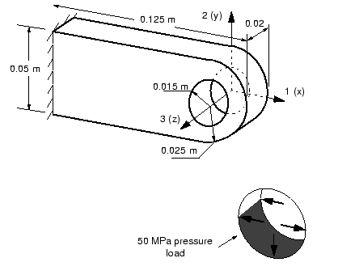

耳片一端牢固焊接在大型结构上。另一端包含一个孔。当投入使用时，螺栓将穿过耳片的孔。您被要求确定当螺栓在负 2 方向施加 30 kN 载荷时耳片的静态挠度。因为此分析的目的是检查耳片的静态响应，所以您应该使用 Abaqus/Standard 作为您的分析产品。您决定通过以下假设简化此问题：
- 您将使用孔下半部分的分布式压力来对连接耳片加载（见[图 4-14](ch04s03.md#gss-connecting-lug)），而不是在模型中包含复杂的螺栓-耳片相互作用。
- 您将忽略孔周围压力大小的变化，并使用均匀压力。
- 施加的均匀压力大小将为 50 MPa：30 kN / (2 × 0.015 m × 0.02 m)。

检查耳片的静态响应后，您将修改模型并使用 Abaqus/Explicit 研究突然加载耳片产生的瞬态动力学效应。

### 4.3.1 坐标系

在模型中，定义全局 1 轴沿耳片长度，全局 2 轴垂直，全局 3 轴沿厚度方向。将全局坐标系的原点（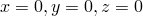）放置在  面孔的中心（见[图 4-14](ch04s03.md#gss-connecting-lug)）。 

### 4.3.2 网格设计

在开始为特定问题构建网格之前，您需要考虑将使用的单元类型。适合二次单元的网格设计在切换到线性减缩积分单元时可能非常不适合。对于此示例，使用 20 节点减缩积分六面体单元（C3D20R）。选择单元类型后，您可以为连接耳片设计网格。关于此应用网格设计最重要的决定是在耳片孔周围使用多少单元。如图 [图 4-15](ch04s03.md#gss-lug-mesh-c) 所示是一种可能的连接耳片网格；您的模型应该与之相似。

**图 4-15** 连接耳片模型建议的 C3D20R 单元网格。

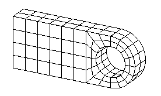

设计网格时需要考虑的另一件事是您想从模拟中获得什么结果。[图 4-15](ch04s03.md#gss-lug-mesh-c) 中的网格相当粗糙，因此不太可能产生准确的应力。对于此类问题，每 90° 使用四个二次单元是最少应该考虑的；建议使用两倍的数量以获得相当准确的应力结果。但是，此网格应该足以预测耳片在施加载荷下的整体变形水平，这正是您被要求确定的。增加此模拟中网格密度的影响在["网格收敛，" 4.4 节](ch04s04.md) 中讨论。

您需要决定在模型中使用的单位制。建议使用米、秒和千克的 SI 系统，但如果您愿意可以使用另一系统。

### 4.3.3 预处理——创建模型

[第 2 章，"Abaqus 基础"](ch02.md) 中架空起重机的模型足够简单，可以直接将输入输入到文本编辑器中创建 Abaqus 输入文件。这种方法对于大多数实际问题显然不切实际；相反，此示例和本指南中所有后续示例指向示例的完成输入文件，示例中的步骤说明了 Abaqus 输入文件中模型和历史数据的语法。此示例的完整输入文件 `lug.inp` 可在 ["连接耳片，" A.2 节](ap01s02.md) 中获得。

此示例使用如图 [图 4-16](ch04s03.md#gss-elementsets) 所示的网格、节点和单元集，以及如图 [图 4-14](ch04s03.md#gss-connecting-lug) 所示的压力载荷和边界条件。 

**图 4-16** 连接耳片模拟有用的节点和单元集。

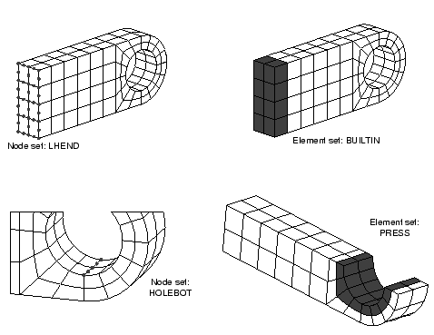

后续步骤将添加模型所需的其他数据，以描述 Abaqus 输入文件的格式。如果您希望调整网格且没有预处理器，请使用 ["连接耳片，" A.2 节](ap01s02.md) 中的 Abaqus 网格生成选项。如果您希望使用 Abaqus/CAE 创建整个模型，请参阅 ["示例：连接耳片，" Getting Started with Abaqus: Interactive Edition 第 4.3 节](../gsa/gsa-link.md#gsa-ctm-connectlug)。

在此模拟的以下描述中，使用的节点和单元号来自 ["连接耳片，" A.2 节](ap01s02.md) 中的模型。这些节点和单元号如图 [图 4-17](ch04s03.md#gss-node-plane) 和[图 4-18](ch04s03.md#gss-elem-plane) 所示。如果您使用预处理器，模型中的节点和单元编号几乎肯定与此处显示的不同。在修改输入文件时，请记住使用模型中的节点和单元编号，而不是此处给出的编号。

**图 4-17**  平面中的节点编号。

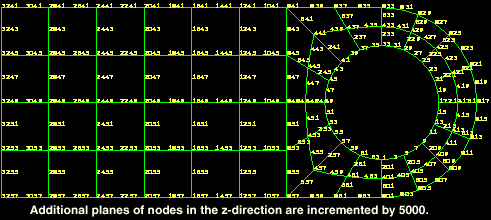

**图 4-18**  平面中的单元编号。

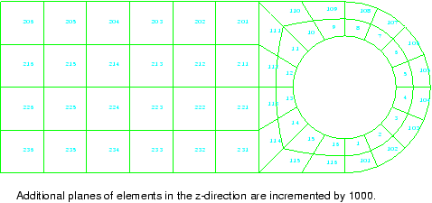

### 4.3.4 检查输入文件——模型数据

以下各节讨论模型数据，包括节点和单元定义、集定义以及截面和材料属性。

**模型描述**

Abaqus 输入文件始终以 [*HEADING](../key/key-link.md#usb-kws-mheading) 选项开头。预处理器在此选项中给出的描述通常信息量不大，尽管它可能给出生成文件的日期和时间。您应该在些选项的数据行上提供合适的标题，以便查看此文件的人能够判断正在建模的内容以及您使用的单位。`lug.inp` 中使用的 [*HEADING](../key/key-link.md#usb-kws-mheading) 选项块如下：

```
*HEADING
Linear Elastic Steel Connecting Lug
S.I. Units (N, kg, m, s)
```

**节点坐标和单元连接性**

在预处理器创建的输入文件中，模型的节点坐标通常在一个大的 [*NODE](../key/key-link.md#usb-kws-mnode) 选项块中，为每个节点单独指定坐标。

预处理器生成的单元定义通常包含在多个 [*ELEMENT](../key/key-link.md#usb-kws-melement) 选项块中。通常，每个块包含具有相同单元截面和材料属性的单元。在连接耳片模型中仅使用了一种单元类型，所有单元具有相同的属性。因此，输入文件中可能只有一个 [*ELEMENT](../key/key-link.md#usb-kws-melement) 选项块。它看起来类似于

```
*ELEMENT, TYPE=C3D20R, ELSET=LUG
   1,     1,   401,   405,     5, 10001, 10401, 10405, 10005, 
 201,   403,   205,     3, 10201, 10403, 10205, 10003,
5001,  5401,  5405,  5005
   2,     5,   405,   409,     9, 10005, 10405, 10409, 10009, 
 205,   407,   209,     7, 10205, 10407, 10209, 10007,      
5005,  5405,  5409,  5009
.......
```

此处使用三个数据行来完全定义一个 C3D20R 单元的连接性（最少需要两个）。如果 [*ELEMENT](../key/key-link.md#usb-kws-melement) 选项块中的数据行以逗号结尾，则表示下一数据行包含定义当前单元的更多节点。参数 `ELSET=LUG` 表示以下数据行中定义的所有单元将存储在名为 `LUG` 的单元集中。如果您的模型在 [*ELEMENT](../key/key-link.md#usb-kws-melement) 选项中没有描述性单元集名称，请将其更改为 `LUG`。

**节点集和单元集**

节点集和单元集是 Abaqus 输入文件的重要组件，因为它们允许您有效地分配载荷、边界条件和材料属性。它们还在定义模拟将产生的输出方面提供了很大的灵活性，并使输入文件更容易理解。

一些预处理器（如 Abaqus/CAE）将允许您在构建模型时选择和命名实体组（如节点和单元）；创建 Abaqus 输入文件时，会从这些组生成节点集和单元集。

您可以使用输入文件中的 [*NSET](../key/key-link.md#usb-kws-mnset) 和 [*ELSET](../key/key-link.md#usb-kws-melset) 选项定义集合。集合的名称使用 NSET 或 ELSET 参数指定。数据行列出集合中包含的节点或单元。每个数据行最多可包含 16 个数字，可以有任意数量的数据行。例如，节点集 `LHEND`（见[图 4-16](ch04s03.md#gss-elementsets)）可定义为

```
*NSET, NSET=LHEND
 3241,  3243,  3245,  3247,  3249,  3251,  3253,  3255, 3257,
 8241,  8245,  8249,  8253,  8257, 13241, 13243, 13245, 13247,
13249, 13251, 13253, 13255, 13257, 18241, 18245, 18249, 18253,
18257, 23241, 23243, 23245, 23247, 23249, 23251, 23253, 23255,
23257
```

如果您使用编辑器向输入文件添加节点或单元集，且标识号遵循规律模式，则 GENERATE 参数允许通过指定开始节点号、结束节点号和节点号增量来包含节点范围。例如，节点集 `LHEND` 可定义为

```
*NSET, NSET=LHEND, GENERATE
 3241,  3257, 2
 8241,  8257, 4
13241, 13257, 2
18241, 18257, 4
23241, 23257, 2
```

集合也可以通过引用其他集合来创建。如果您的预处理器没有创建如图 [图 4-16](ch04s03.md#gss-elementsets) 所示的单元集 `BUILTIN` 或节点集 `HOLEBOT`，请使用编辑器将它们添加到输入文件；它们在限制模拟期间的输出方面至关重要。您还应该创建如图 [图 4-16](ch04s03.md#gss-elementsets) 所示的单元集 `PRESS`。请记住，使用模型中的节点和单元编号，而不是图中显示的编号。

**截面属性**

在 [Abaqus Analysis User's Guide](../usb/usb-link.md#usbcontinuum) 的"第 28 章，连续体单元"中查找 C3D20R 单元，以确定正确的单元截面选项以及必须为此单元指定的数据。您会发现 C3D20R 单元使用 [*SOLID SECTION](../key/key-link.md#usb-kws-msolidsection) 选项定义单元的截面属性。因为这是三维单元，Abaqus 不需要单元截面的额外几何数据。

单元集 `LUG` 包含所有单元，因此此单元集适合此示例。以下单元截面选项语句用于此示例：

```
*SOLID SECTION, ELSET=LUG, MATERIAL=STEEL
```

如果您没有使用名称 `LUG` 定义单元集，请使用模型中包含所有单元的任何单元集的名称作为 ELSET 参数的值。模型中的材料属性定义名称为 `STEEL`。

**材料**

连接耳片由软钢制成，因此在施加的载荷下具有各向同性线性弹性材料行为。假设 *E* = 200 GPa， = 0.3。这些在 [*ELASTIC](../key/key-link.md#usb-kws-melastic) 选项的数据行上给出（记住[第 2 章，"Abaqus 基础"](ch02.md) 中的架空起重机示例）。以下材料属性定义在输入文件中指定这些属性：

```
*MATERIAL, NAME=STEEL
*ELASTIC
200.E9, 0.3
```

[*MATERIAL](../key/key-link.md#usb-kws-mmaterial) 选项上 NAME 参数的值必须与 [*SOLID SECTION](../key/key-link.md#usb-kws-msolidsection) 选项上的 MATERIAL 参数的值匹配。

### 4.3.5 检查输入文件——历史数据

输入文件的历史数据部分从第一个 [*STEP](../key/key-link.md#usb-kws-hstep) 选项开始。许多预处理器默认在输入文件中创建线性静态步骤。此示例将使用通用静态步骤。以下选项定义步骤：

```
*STEP
<*possibly a title describing this step*>
*STATIC
```

 如果这些选项不在您的输入文件中，请将它们添加到现有数据的末尾。如果您在 [*STEP](../key/key-link.md#usb-kws-hstep) 选项后使用数据行添加描述步骤中模拟事件的合适标题，对其他人来说更容易理解您的模型。

**边界条件**

在连接耳片模型中，所有节点都需要在与父结构连接的左端在所有三个方向上受约束（见[图 4-19](ch04s03.md#gss-lug)）。 

**图 4-19** 连接耳片上的边界条件。

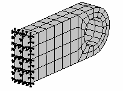

在此示例中，在 [*BOUNDARY](../key/key-link.md#usb-kws-hboundary) 选项块中单独指定每个受约束的自由度，如下所示：

```
*BOUNDARY
3241, 1,1
3241, 2,2
3241, 3,3
......
```

如果大量节点受到约束，这些数据可能占用大量内存。当许多节点具有相同的边界条件时，更有效的方法是将约束直接应用于包含所有节点的节点集。因此，在耳片模型中，我们更愿意创建节点集 `LHEND` 来指定约束：

```
*BOUNDARY
LHEND, ENCASTRE
```

如果您认为边界条件定义不正确，可以在 Abaqus/Viewer 中显示它们，并与如图 [图 4-19](ch04s03.md#gss-lug) 中所示的边界条件进行比较。["后处理，" 2.3.9 节"](ch02s03.md#gsk-gen-abs-postprocessing) 末尾给出的后处理说明讨论了如何执行此操作。

**载荷**

耳片承受分布在孔下半部分的 50 MPa 压力。压力载荷可以通过选择施加载荷的单元面来方便地使用预处理器定义。在连接耳片输入文件中，这些载荷将显示为 [*DLOAD](../key/key-link.md#usb-kws-hdload) 选项块。例如，连接耳片的 [*DLOAD](../key/key-link.md#usb-kws-hdload) 选项块可能看起来像

```
*DLOAD
   1,  P6, 5.E+07
   2,  P6, 5.E+07
   3,  P6, 5.E+07
   4,  P6, 5.E+07
  13,  P6, 5.E+07
...

1015,  P6, 5.E+07
1016,  P6, 5.E+07
```
每个数据行的格式为
```
*<element or element set name>*, *<load ID>*, *<load magnitude>*
```
在这种情况下，"load ID"由字母"P"后跟施加压力的单元面编号组成。面编号取决于单元的连接性，每种单元类型在 [Abaqus Analysis User's Guide](../usb/usb-link.md#usb) 中定义。对于此示例使用的三维六面体单元，面编号如图 [图 4-20](ch04s03.md#gss-hexahedral) 所示。 

**图 4-20** 六面体单元上的面编号。

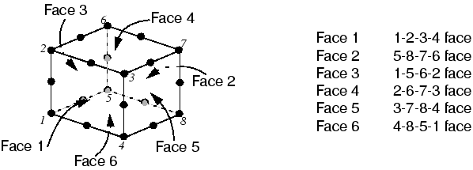

在 ["连接耳片，" A.2 节](ap01s02.md) 中定义的模型中，压力施加到孔底部周围单元的面 6 上，因此 load ID 为"P6"。

对于使用预处理器生成的网格，面编号，从而 load ID，取决于网格的生成方式。一些预处理器（如 Abaqus/CAE）可以自动确定正确的 load ID；这使得在复杂网格上指定压力载荷变得非常容易。但是，此方法往往在输入文件中产生大量数据行。在模型中使用相同的 load ID 和载荷幅度时，您可以使用单元集（这更有效）来施加压力载荷。例如，在此模型中 [*DLOAD](../key/key-link.md#usb-kws-hdload) 选项块可能显示为

```
*DLOAD
PRESS,  P6, 5.E+07
```
其中我们利用了如图 [图 4-16](ch04s03.md#gss-elementsets) 所示其成员的单元集 `PRESS`。

**输出请求**

默认情况下，许多预处理器会创建包含大量输出请求选项的 Abaqus 输入文件。这些请求是 Abaqus 自动生成的输出数据库文件请求的补充。如果在编辑输入文件时发现创建了这些附加输出选项，请删除它们，因为它们通常会产生过多不必要的输出。

您被要求确定加载时连接耳片的挠度。获取此结果的简单方法是打印模型中的所有位移。但是，耳片上最大位移的位置可能在孔底部，这是加载的位置。此外，只有 2 方向（U2）的位移会令人感兴趣。您应该已经创建了包含孔底部这些节点的节点集 `HOLEBOT`。使用该集将请求的位移限制为仅孔底部的五个节点，并将输出限制为仅垂直位移。

```
*NODE PRINT, NSET=HOLEBOT
U2,
```

检查约束处的反作用力与施加的载荷平衡是良好实践。可以通过指定变量 RF 来打印节点处的所有反作用力。我们再次使用节点集 `LHEND` 将输出限制为那些受约束的节点。

```
*NODE PRINT, NSET=LHEND, TOTAL=YES, SUMMARY=NO
RF,
```

您可以定义多个 [*NODE PRINT](../key/key-link.md#usb-kws-hnodeprint) 和 [*EL PRINT](../key/key-link.md#usb-kws-helprint) 选项。参数 TOTALS=YES 导致打印节点集中所有节点的反作用力总和。SUMMARY=NO 参数防止在表中打印最小值和最大值。

以下命令打印约束端（单元集 `BUILTIN`）处单元的应力张量（变量 S）和 Mises 应力（变量 MISES）：

```
*EL PRINT, ELSET=BUILTIN
S, MISES
```

您将使用 NFORC 输出变量在 ["后处理——可视化结果，" 4.3.8 节"](ch04s03.md#gsk-gen-ctm-postprocessing) 中创建和显示自由体切割。以下选项将单元应力导致的节点力写入输出数据库，同时写入默认输出：

```
*OUTPUT, FIELD, VARIABLE=PRESELECT
*ELEMENT OUTPUT
NFORC,
*OUTPUT, HISTORY, VARIABLE=PRESELECT
```

步骤的结束用以下选项表示

```
*END STEP
```
此输入选项必须是模型中的最后一个选项。

### 4.3.6 运行分析

如果修改了任何输入数据，请将输入存储在名为 `lug.inp` 的文件中（示例文件列在 ["连接耳片，" A.2 节](ap01s02.md) 中）。然后，使用命令运行模拟：

```
abaqus job=lug interactive
```

作业完成时，检查数据文件 `lug.dat` 中是否有任何错误或警告。如果有任何错误，请更正输入文件并再次运行模拟。如果您在校正错误时遇到困难，请尝试将您的输入文件与 ["连接耳片，" A.2 节"](ap01s02.md) 中给出的文件进行比较。检查每个输入选项的参数是否正确。

### 4.3.7 结果

作业成功完成后，查看您请求的三个输出表。它们将在数据文件末尾找到。元素应力表的一部分如图 [图 4-21](ch04s03.md#gss-c4-int-results-inp) 所示。约束端的最大 Mises 应力约为 306 MPa。

**图 4-21** 数据文件中的单元应力表。

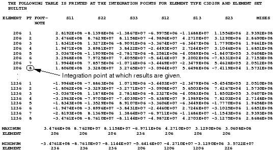

显示孔底部节点位移和受约束节点反作用力的表分别如图 [图 4-22](ch04s03.md#gss-c4-node-results-inp) 和[图 4-23](ch04s03.md#gss-c4-tot-react-inp) 所示。 

**图 4-22** 数据文件中的节点位移表。

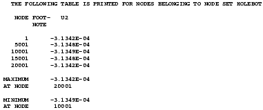

**图 4-23** 数据文件中的反作用力表。

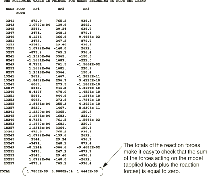

耳片孔底部已位移约 0.3 mm。约束节点在 2 方向的总反作用力等于并相反于该方向施加的 30 kN 载荷。

### 4.3.8 后处理——可视化结果

在数据文件中查看结果后，通过在操作系统提示符下键入以下命令启动 Abaqus/Viewer：

```
abaqus viewer odb=lug
```

**绘制变形形状**

从主菜单栏中，选择 ****Plot****Deformed Shape****；或使用工具箱中的  工具。图 [图 4-24](ch04s03.md#gsa-displacedshape-c) 显示了分析结束时变形的模型形状。位移放大水平是多少？

**图 4-24** 连接耳片的变形模型形状（着色）。

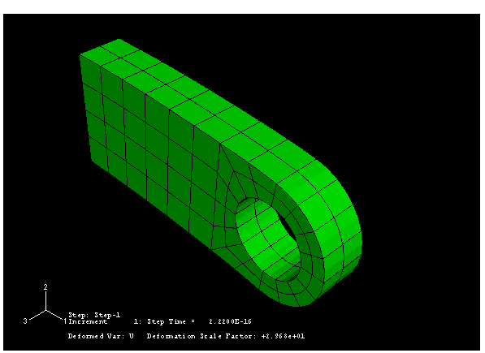

**更改视图**

默认视图是等轴测的。您可以使用视图菜单中的选项或视图操作工具栏中的视图工具更改视图。您还可以通过输入旋转角度、视点、缩放因子或视口平移分数来指定视图。也可以使用 3D 指南针进行直接视图操作。

**使用 3D 指南针操作视图：**

- 单击并拖动 3D 指南针的直轴之一可沿轴平移。
- 单击并拖动 3D 指南针的任一四分之一圆形面可沿平面平移。
- 单击并拖动 3D 指南针周边三个弧之一可绕垂直于包含该弧平面的轴旋转模型。
- 单击并拖动 3D 指南针上的自由旋转手柄（3D 指南针顶部的点）可绕其支点自由旋转模型。
- 单击 3D 指南针上任一轴的标签以选择预定义视图（所选轴垂直于视口平面）。
- 双击 3D 指南针上的任意位置以指定视图。

本指南中的大多数视图是直接指定的。这是为了让您能够通过对照指南中的图像检查来确认模型的状态。但是，我们鼓励您按照自己的判断练习使用上述方法操作视图。

**指定视图：**

1. 从主菜单栏中，选择 ****View****Specify****（或双击 3D 指南针）。出现 **Specify View** 对话框。
2. 从可用方法列表中，选择 **Viewpoint**。在 **Viewpoint** 方法中，您输入三个值，代表观察者的 *X*、*Y* 和 *Z* 位置。您还可以指定向上向量。Abaqus 将您的模型定位，使此向量指向上方。
3. 输入视点向量的 *X*、*Y* 和 *Z* 坐标为 `1, 1, 3`，向上向量的坐标为 `0, 1, 0`。
4. 点击 **OK**。Abaqus/Viewer 以指定视图显示您的模型，如图 [图 4-25](ch04s03.md#gss-shaded-plot-c) 所示。**图 4-25** 从指定视点查看的变形模型形状。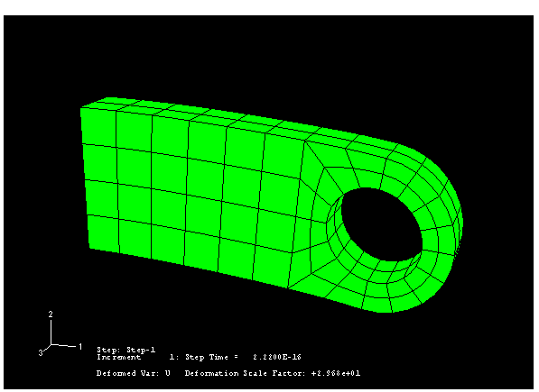

**可见边缘**

有多个选项可用于选择模型显示中哪些边缘可见。之前的图显示了模型的所有外边缘；[图 4-26](ch04s03.md#gss-wireframe-c) 仅显示特征边缘。

**图 4-26** 仅可见特征边缘的变形形状。


**仅显示特征边缘：**

1. 从主菜单栏中，选择 ****Options****Common****。出现 **Common Plot Options** 对话框。
2. 如果尚未选择，请点击 **Basic** 选项卡。
3. 从 **Visible Edges** 选项中，选择 **Feature edges**。
4. 点击 **Apply**。当前视口中的变形图变为仅显示特征边缘，如图 [图 4-26](ch04s03.md#gss-wireframe-c) 所示。

**渲染样式**

着色图是一种填充图，其中光源似乎指向模型。这是默认渲染样式，在查看复杂三维模型时非常有用。还有三种其他渲染样式提供额外的显示选项：线框、消隐和填充。您可以从 **Common Plot Options** 对话框或渲染样式工具栏中的工具中选择渲染样式：线框 、消隐 、填充  和着色 。要显示如图 [图 4-27](ch04s03.md#gss-wireframe-all-c) 所示的线框图，请在 **Common Plot Options** 对话框中选择 **Exterior edges**，点击 **OK** 关闭对话框，然后通过点击  工具选择线框绘图。所有后续图将以线框渲染样式显示，直到您选择其他渲染样式。 

**图 4-27** 线框图。

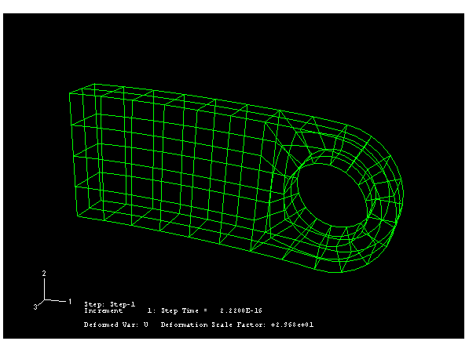

显示内部边缘的线框模型在查看复杂三维模型时可能令人困惑。您可以使用其他渲染样式工具来选择隐藏线和填充渲染样式，分别如图 [图 4-28](ch04s03.md#gss-lineplot-c) 和[图 4-29](ch04s03.md#gss-elem-plot-c) 所示。这些渲染样式在查看复杂三维模型时更有用。

**图 4-28** 消隐图。

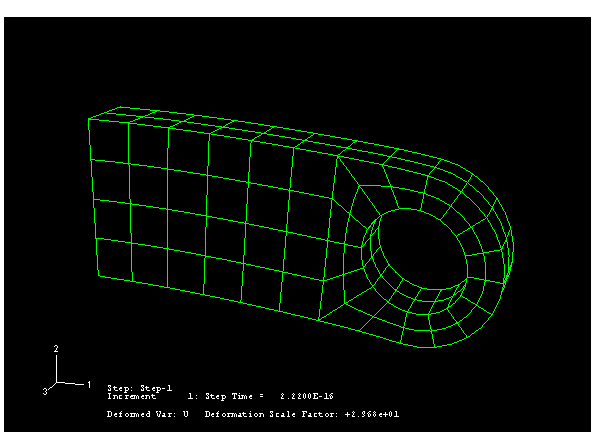

**图 4-29** 填充单元图。

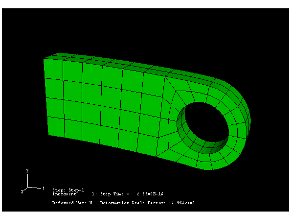

**云图**

云图显示变量在模型表面的变化。您可以从输出数据库创建场输出结果的填充或着色云图。

**生成 Mises 应力的云图：**

1. 从主菜单栏中，选择 ****Plot****Contours****On Deformed Shape****。出现如图 [图 4-30](ch04s03.md#gss-mises-filled-v) 所示的填充云图。图例标题中指示的 Mises 应力 `S Mises` 是 Abaqus 为此分析选择的默认变量。您可以选择不同的变量来绘图。**图 4-30** Mises 应力填充云图。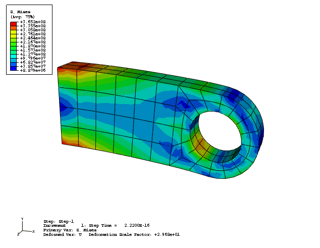
2. 从主菜单栏中，选择 ****Result****Field Output****。出现 **Field Output** 对话框；默认选择 **Primary Variable** 选项卡。
3. 从可用输出变量列表中，选择要绘制的新变量。
4. 点击 **OK**。当前视口中的云图更改为您选择的内容。

**提示：**您也可以使用视口上方的 **Field Output** 工具栏更改显示的场输出变量。更多信息，请参阅 ["Using the field output toolbar," Abaqus/CAE User's Guide 第 42.5.2 节](../usi/usi-link.md#usv-res-foutputtoolbar)。

Abaqus/Viewer 提供了许多自定义云图的选项。查看可用选项，请点击工具箱中的 **Contour Options**  工具。默认情况下，Abaqus/Viewer 自动计算云图中显示的最小值和最大值，并将此范围内的值均匀划分为 12 个间隔。您可以控制 Abaqus/Viewer 显示的最小值和最大值（例如，要在固定边界内检查变化）以及间隔数。 

**生成自定义云图：**

1. 在 **Contour Plot Options** 对话框的 **Basic** 选项卡页面中，拖动 **Contour Intervals** 滑块将间隔数更改为 9。
2. 在 **Contour Plot Options** 对话框的 **Limits** 选项卡页面中，在 **Max** 旁边选择 **Specify**；然后输入最大值 `400E+6`。
3. 在 **Min** 旁边选择 **Specify**；然后输入最小值 `60E+6`。
4. 点击 **OK**。Abaqus/Viewer 使用指定的云图选项设置显示您的模型，如图 [图 4-31](ch04s03.md#gss-mises-custom-v) 所示（此图显示 Mises 应力；您的图将显示您选择的输出变量）。这些设置对所有后续云图保持有效，直到您更改它们或将其重置为默认值。

**图 4-31** Mises 应力自定义图。

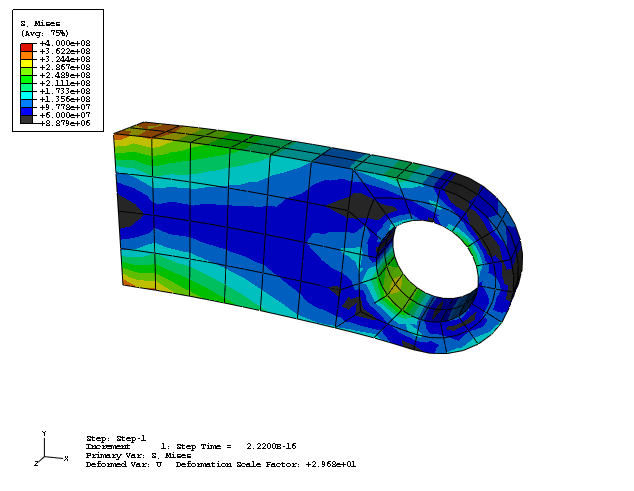

**在内部表面上显示云图结果**

您可以切割模型，使内部表面可见。例如，您可能希望检查零件内部应力分布。在这种情况下，可以创建视图切割以达到此目的。在此，一个简单的平面切割穿过耳片，以查看零件厚度方向的 Mises 应力分布。

**创建视图切割：**

1. 从主菜单栏中，选择 ****Tools****View Cut****Create****。
2. 在出现的对话框中，接受默认名称和形状。输入 `0,0,0` 作为平面的 **Origin**（即平面将经过的点），`1,0,1` 作为平面的 **Normal axis**，`0,1,0` 作为平面的 **Axis 2**。
3. 点击 **OK** 关闭对话框并创建视图切割。视图如图 [图 4-32](ch04s03.md#gsa-cutting-plane) 所示。**图 4-32** 穿过耳片厚度的 Mises 应力。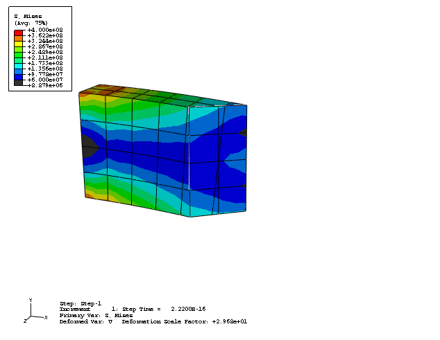
从主菜单栏中，选择 ****Tools****View Cut****Manager**** 打开 **View Cut Manager**。默认情况下，显示切割处和切割下方的区域（如 **on cut**  和 **below cut**  符号下的勾选所示）。要平移或旋转切割，请从可用运动列表中选择 **Translate** 或 **Rotate**，并在 **View Cut Manager** 底部的字段中输入值或拖动滑块。
4. 要再次查看完整模型，请在 **View Cut Manager** 中切换关闭 **Cut-4**。有关视图切割的更多信息，请参阅 [Abaqus/CAE User's Guide](../usi/usi-link.md#uss-cut) 中的"第 80 章，穿过模型切割"。

**最大值和最小值**

可以轻松确定模型中变量的最大值和最小值。 

**显示云图变量的最小值和最大值：**

1. 从主菜单栏中，选择 ****Viewport****Viewport Annotation Options****；然后在出现的对话框中点击 **Legend** 选项卡。**Legend** 选项变得可用。
2. 切换 **Show min/max values**。
3. 点击 **OK**。云图图例更改为报告最小值和最大值。

此示例的目标之一是确定耳片在负 2 方向的挠度。您可以对耳片 2 方向的位移分量进行云图绘制，以按如下方式确定其在垂直方向上的峰值位移。在 **Contour Plot Options** 对话框中，点击 **Defaults** 以在继续之前将最小值和最大值以及间隔数重置为其默认值。

**对连接耳片 2 方向的位移进行云图绘制：**

1. 从 **Field Output** 工具栏左侧的变量类型列表中，如果尚未选择，请选择 **Primary**。**提示：**您可以点击 **Field Output** 工具栏左侧的 ，而不是工具栏，从 **Field Output** 对话框中进行选择。如果您使用对话框，必须点击 **Apply** 或 **OK** 以使 Abaqus/Viewer 在视口中显示您的选择。
2. 从工具栏中央的可用输出变量列表中，选择输出变量 **U**。
3. 从工具栏右侧的可用分量和不变量列表中，选择 **U2**。

负 2 方向的最大位移值是多少？

**显示模型子集**

默认情况下，Abaqus/Viewer 显示您的整个模型；但是，您可以选择显示称为显示组的模型子集。此子集可以包含当前模型或输出数据库中任何组合的零件实例、几何体（单元、面或边缘）、单元、节点和表面。对于连接耳片模型，您将创建一个由孔底部单元组成的显示组。由于压力载荷施加到此区域，Abaqus 创建了一个可用于可视化目的的内部集。

**显示模型子集：**

1. 在结果树中，双击 **Display Groups**。出现 **Create Display Group** 对话框。
2. 从 **Item** 列表中，选择 **Elements**。从 **Method** 列表中，选择 **Internal sets**。选择这些项目后，**Create Display Group** 对话框右侧的列表显示可用选择。
3. 使用此列表，识别包含孔底部单元的集合。切换 **Highlight items in viewport** 下面的选项，使所选集合中单元的轮廓在视口中以红色高亮显示。
4. 当高亮集合对应孔底部的单元组时，点击 **Replace**  以使用此单元集替换当前模型显示。Abaqus/Viewer 显示模型的指定子集。
5. 点击 **Dismiss** 关闭 **Create Display Group** 对话框。

创建 Abaqus 模型时，您可能需要确定实体单元的面标签。例如，当施加压力载荷或定义接触表面时，您可能希望验证正确的 load ID 是否被使用。在这种情况下，您可以在运行创建输出数据库文件的 **datacheck** 分析后使用 Visualization 模块显示网格。

**在未变形模型形状上显示面标识标签和单元编号：**

1. 从主菜单栏中，选择 ****Options****Common****。出现 **Common Plot Options** 对话框。
2. 将渲染样式设置为填充；将为方便起见显示所有可见单元边缘。1. 在 **Render Style** 下切换 **Filled**。2. 在 **Visible Edges** 下切换 **All edges**。
3. 点击 **Labels** 选项卡，并切换 **Show element labels** 和 **Show face labels**。
4. 点击 **Apply** 应用绘图选项。
5. 从主菜单栏中，选择 ****Plot****Undeformed Shape****；或使用工具箱中的  工具。Abaqus/Viewer 在当前显示组中显示单元和面标识标签。
6. 在 **Common Plot Options** 对话框中点击 **Defaults** 以恢复默认绘图设置，然后点击 **OK** 关闭对话框。

**显示自由体切割**

您可以定义自由体切割，以查看在模型所选表面上传递的合力和力矩。力矢量用单个箭头显示，力矩矢量用双箭头显示。

**创建自由体切割：**

1. 要在视口中显示整个模型，从主菜单栏中选择 ****Tools****Display Group****Plot****All****。
2. 从主菜单栏中，选择 ****Tools****Free Body Cut****Manager****。
3. 在 **Free Body Cut Manager** 中点击 **Create**。
4. 从出现的对话框中，选择 **3D element faces** 作为 **Selection method**，然后点击 **Continue**。
5. 在 **Free Body Cross-Section** 对话框中，选择 **Surfaces** 作为 **Item**，**Pick from viewport** 作为 **Method**。
6. 在提示区域中，将选择方法设置为 **by angle**，并接受默认角度。
7. 选择高亮的表面，定义自由体切割横截面。1. 从 **Selection** 工具栏中，关闭 **Select the Entity Closest to the Screen** 工具 ，并确保选择了 **Select From All Entities** 工具 。2. 当您在视口中移动光标时，Abaqus/CAE 高亮所有潜在选择，并在光标箭头旁边添加省略号（...）以指示模糊选择。将光标定位为使所需表面的一个面高亮，然后点击显示第一个表面选择。**图 4-33** 自由体横截面选定的面。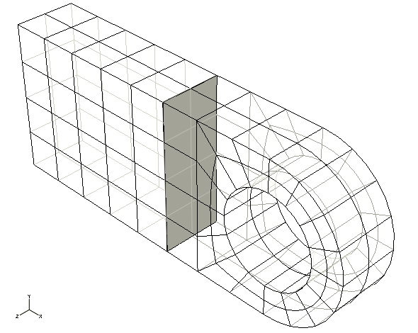3. 使用 **Next** 和 **Previous** 按钮循环浏览可能的选择，直到适当垂直表面高亮，然后点击 **OK**。
8. 在提示区域中点击 **Done** 表示您的选择已完成。在 **Free Body Cross-Section** 对话框中点击 **OK**。
9. 在 **Edit Free Body Cut** 对话框中，接受 **Summation Point** 和 **Component Resolution** 的默认设置。点击 **OK** 关闭对话框。
10. 在 **Free Body Cut Manager** 中点击 **Options**。
11. 在 **Free Body Plot Options** 对话框中，在 **Color & Style** 选项卡页面中选择 **Force** 选项卡。点击结果颜色样本  以更改合力箭头的颜色。
12. 为合力箭头选择新颜色后，在 **Free Body Plot Options** 对话框中点击 **OK**，并在 **Free Body Cut Manager** 中点击 **Dismiss**。自由体切割显示在视口中，如图 [图 4-34](ch04s03.md#gss-fbd-result) 所示。**图 4-34** 连接耳片上显示的自由体切割。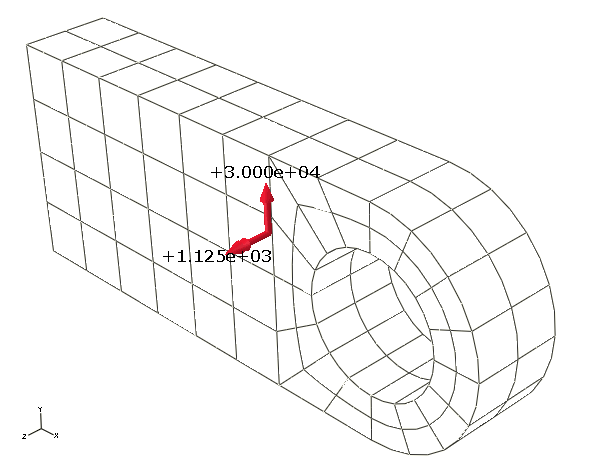

**为模型子集生成表格数据报告**

之前为此模型使用打印输出请求生成了表格输出数据。但是，对于复杂模型，使用 Abaqus/Viewer 为模型选定区域编写这些数据很方便。这是通过将显示组与报告生成功能结合使用实现的。对于连接耳片问题，我们将生成以下表格数据报告： 
- 耳片约束端的单元应力（确定耳片中的最大应力）
- 约束端的反作用力（检查约束处的反作用力与施加的载荷平衡）
- 孔底部的垂直位移（确定加载时耳片的挠度）

每个报告将使用在视口中选择的显示组内容生成。因此，首先为每个感兴趣的区域创建并保存显示组。

**创建并保存包含约束端单元的显示组：**

1. 在结果树中，在 **Display Groups** 容器下方点击鼠标按钮 3 在 **built-in elements** 上。在出现的菜单中，选择 **Plot** 使其成为当前显示组。
2. 从主菜单栏中，选择 ****Report****Field Output****。
3. 在 **Report Field Output** 对话框的 **Variable** 选项卡页面中，接受标记为 **Integration Point** 的默认位置。点击 **S: Stress components** 旁边的三角形以展开可用变量列表。从此列表中，选择 **Mises** 和六个单独的应力分量：**S11**、**S22**、**S33**、**S12**、**S13** 和 **S23**。
4. 在 **Setup** 选项卡页面中，将报告命名为 `Lug.rpt`。在页面底部的 **Data** 区域中，切换 **Column totals**。
5. 点击 **Apply**。
6. 在结果树中，在 **Display Groups** 容器下方点击鼠标按钮 3 在 **built-in nodes** 上。在出现的菜单中，选择 **Plot** 使其成为当前显示组。（要查看节点，请在 **Common Plot Options** 对话框中切换 **Show node symbols**。）
7. 在 **Report Field Output** 对话框的 **Variable** 选项卡页面中，将位置更改为 **Unique Nodal**。切换 **S: Stress components**，并从可用的 **RF: Reaction force** 变量列表中选择 **RF1**、**RF2** 和 **RF3**。
8. 在 **Setup** 选项卡页面底部的 **Data** 区域中，切换 **Column totals**。
9. 点击 **Apply**。
10. 在结果树中，在 **Display Groups** 容器下方点击鼠标按钮 3 在 **nodes at hole bottom** 上。在出现的菜单中，选择 **Plot** 使其成为当前显示组。
11. 在 **Report Field Output** 对话框的 **Variable** 选项卡页面中，切换 **RF: Reaction force**，并从可用的 **U: Spatial displacement** 变量列表中选择 **U2**。
12. 在 **Setup** 选项卡页面底部的 **Data** 区域中，切换 **Column totals**。
13. 点击 **OK**。

在文本编辑器中打开文件 `Lug.rpt`。单元应力表的一部分如下所示。单元数据在单元积分点给出。与给定单元关联的积分点在标记为 `Int Pt` 的列下注明。表底部包含此单元组中最大和最小应力值的信息。结果表明，约束端的最大 Mises 应力约为 330 MPa。如果您的网格与此处使用的不完全相同，您的结果可能略有不同。

```
Field Output Report

Source 1
---------

   ODB: lug.odb
   Step: Step-1
   Frame: Increment      1: Step Time =   2.2200E-16

Loc 1 : Integration point values from source 1

Output sorted by column "Element Label".

Field Output reported at nodes for part: PART-1-1

Element   Int      S.Mises        S.S11        S.S22        S.S33        S.S12
Label     Pt        @Loc 1       @Loc 1       @Loc 1       @Loc 1       @Loc 1
------------------------------------------------------------------------------
        S.S13        S.S23
       @Loc 1       @Loc 1
--------------------------
  206     1    293.921E+06  281.921E+06  -8.1398E+06 -13.8667E+06 -6.99752E+06
 -11.6881E+06  1.15564E+06
  206     2      286.9E+06  347.661E+06  87.6292E+06  81.1577E+06 -49.8957E+06
  42.7097E+06  3.12903E+06
  206     3    196.605E+06  183.407E+06  1.32717E+06 -8.90914E+06  -33.674E+06
 -6.34469E+06  1.77895E+06
  206     4    168.508E+06  194.713E+06  38.9812E+06  38.4224E+06 -24.4931E+06
  27.2442E+06  3.10456E+06
  206     5    306.077E+06  303.672E+06 -1.19087E+06 -2.78165E+06  -8.2581E+06
 -4.05888E+06  -184.07E+03
  206     6    271.531E+06   329.68E+06  79.7248E+06  74.0551E+06 -56.4163E+06
  9.20019E+06 -78.3313E+03
  206     7    205.123E+06  199.438E+06  7.85751E+06 -1.07157E+06 -34.4693E+06
 -2.34785E+06  546.279E+03
  206     8    157.315E+06  180.601E+06  33.2797E+06  32.7648E+06 -30.9435E+06
  5.64979E+06 -74.1186E+03
    .
    .
 1236    1    205.096E+06 -199.458E+06 -7.88628E+06  1.07185E+06 -34.4032E+06
  -2.3479E+06 -545.449E+03
 1236    2    157.301E+06 -180.618E+06 -33.2934E+06 -32.7715E+06 -30.9083E+06
  5.65027E+06  74.2669E+03
 1236    3    306.071E+06  -303.67E+06  1.18777E+06  2.78175E+06  -8.2327E+06
 -4.05827E+06  185.017E+03
 1236    4     271.48E+06 -329.625E+06 -79.7048E+06 -74.0391E+06 -56.3889E+06
  9.19885E+06  78.2027E+03
 1236    5    196.584E+06 -183.433E+06 -1.35291E+06  8.91071E+06 -33.6059E+06
 -6.34491E+06 -1.77698E+06
 1236    6    168.507E+06 -194.738E+06  -38.996E+06 -38.4311E+06 -24.4598E+06
  27.2461E+06 -3.10252E+06
 1236    7    293.927E+06 -281.931E+06  8.13693E+06  13.8641E+06 -6.97109E+06
 -11.6862E+06 -1.15429E+06
 1236    8    286.857E+06 -347.614E+06 -87.6102E+06 -81.1438E+06 -49.8721E+06
  42.7034E+06 -3.12746E+06

  Minimum      35.7223E+06 -347.614E+06 -87.6102E+06 -81.1438E+06 -56.4163E+06
 -42.7097E+06 -3.12903E+06
      At Element       226          236          236         1236         1206
         1206         1206
          Int Pt         2            4            4            8            2
            6            6
  Maximum      306.077E+06  347.661E+06  87.6292E+06  81.1577E+06 -6.97109E+06
  42.7097E+06  3.12903E+06
      At Element       206         1206         1206          206         1236
          206          206
          Int Pt         5            6            6            2            7
            2            2
```

Mises 应力最大值与之前生成的云图中报告的值如何比较？两个最大值对应于模型中的同一点吗？云图中显示的 Mises 应力已外推到节点，而写入此问题的报告文件的应力对应于单元积分点。因此，报告文件中最大 Mises 应力的位置与云图中最大 Mises 应力的位置不完全相同。如果请求写入报告文件中节点的应力输出（从单元积分点外推并平均到包含给定节点的所有单元），则可以解决此差异。如果差异大到令人担忧的程度，则表明网格可能太粗糙。

约束节点处反作用力表如下所示。表底部的 `Total` 条目包含此节点组的净反作用力分量。结果确认，约束节点在 2 方向的总反作用力等于并相反于该方向施加的 30 kN 载荷。 

```
Field Output Report

Source 1
---------

   ODB: lug.odb
   Step: Step-1
   Frame: Increment      1: Step Time =   2.2200E-16

Loc 1 : Nodal values from source 1

Output sorted by column "Node Label".

Field Output reported at nodes for part: PART-1-1

            Node          RF.RF1          RF.RF2          RF.RF3
           Label          @Loc 1          @Loc 1          @Loc 1
-----------------------------------------------------------------
            3241         872.912          765.17        -936.541
            3243    -10.7924E+03        -139.598    -2.69241E+03
            3245      2.5436E+03         29.2367        -636.668
            3247    -3.47143E+03         248.065        -879.401
            3249    -124.431E-03         -366.58     94.6864E-03
     .
     .
           23249    -124.431E-03         -366.58    -94.6864E-03
           23251     3.47251E+03         247.215        -879.699
           23253    -2.54332E+03         29.3956        -636.906
           23255     10.7918E+03        -139.991    -2.69226E+03
           23257        -873.161         765.137        -936.363

  Minimum           -18.4323E+03        -470.038    -2.69241E+03
         At Node           13243           13249            3243

  Maximum             18.431E+03      3.3654E+03     2.69241E+03
         At Node           13255            8241           23243

           Total     600.502E-06     30.0000E+03    -454.747E-12
```
孔底部节点位移表（如下所示）表明，耳片孔底部已位移约 0.3 mm。 

```
Field Output Report

Source 1
---------

   ODB: lug.odb
   Step: Step-1
   Frame: Increment      1: Step Time =   2.2200E-16

Loc 1 : Nodal values from source 1

Output sorted by column "Node Label".

Field Output reported at nodes for part: PART-1-1

            Node            U.U2
           Label          @Loc 1
---------------------------------
               1    -313.425E-06
           10001    -313.494E-06
           20001    -313.425E-06

  Minimum           -313.494E-06

         At Node           10001
  Maximum           -313.425E-06

         At Node           20001
```

### 4.3.9 使用 Abaqus/Explicit 重新运行分析

您现在将评估相同载荷突然施加时耳片的动态响应。特别感兴趣的是耳片的瞬态响应。您将需要修改模型以进行 Abaqus/Explicit 分析。继续之前，将现有输入文件复制到名为 `lug_xpl.inp` 的输入文件。对 `lug_xpl.inp` 输入文件进行所有后续更改。在运行显式分析之前，您需要更改单元类型、在材料模型中添加密度，以及更改步骤类型。此外，您应该修改场输出请求。

**更改单元类型**

Abaqus/Explicit 单元库中没有二次六面体单元。因此，您需要将 [*ELEMENT](../key/key-link.md#usb-kws-melement) 选项上指定的单元类型从 C3D20R 更改为 C3D8R。此更改还需要编辑单元节点连接性，以便为每个单元仅指定八个节点。例如，以下 [*ELEMENT](../key/key-link.md#usb-kws-melement) 选项块用于定义 `lug.inp` 中的一个单元：

```
*ELEMENT, TYPE=C3D20R
   1,     1,   401,   405,     5, 10001, 10401, 10405, 10005, 
 201,   403,   205,     3, 10201, 10403, 10205, 10003,
5001,  5401,  5405,  5005
```
在 `lug_xpl.inp` 中，此选项块有两处更改：单元类型已更改为 C3D8R，节点连接性由原始列表中的前八个节点组成，这些节点定义单元的角节点。
```
*ELEMENT, TYPE=C3D8R
   1,     1,   401,   405,     5, 10001, 10401, 10405, 10005

```

因为 C3D8R 单元采用减缩积分，使用增强应变算法来控制沙漏。您可以使用 [*SECTION CONTROLS](../key/key-link.md#usb-kws-msectioncontrols) 选项指定增强沙漏：

```
*SOLID SECTION, ELSET=LUG, MATERIAL=STEEL, CONTROLS=EC-1
*SECTION CONTROLS, NAME=EC-1, HOURGLASS=ENHANCED

```

**编辑材料定义**

因为 Abaqus/Explicit 执行动态分析，完整的材料定义需要您指定材料密度。对于此问题，假定密度等于 7800 kg/m³。

您可以通过在材料选项块中添加 [*DENSITY](../key/key-link.md#usb-kws-mdensity) 选项来修改材料定义。连接耳片的完整材料定义为：

```
*MATERIAL, NAME=STEEL
*ELASTIC
200.E9, 0.3
*DENSITY
7800.,
```

**将静态步骤替换为动态、显式步骤**

修改步骤定义以检查 0.005 秒期间内耳片的动态响应。此更改需要您更改 [*STEP](../key/key-link.md#usb-kws-hstep) 选项块，对于静态分析，该选项块如下所示：

```
[*STEP](../key/key-link.md#usb-kws-hstep)
Apply uniform pressure to the hole
[*STATIC](../key/key-link.md#usb-kws-hstatic)
```
将此选项块替换为以下内容：
```
[*STEP](../key/key-link.md#usb-kws-hstep)
Dynamic lug loading
*DYNAMIC, EXPLICIT
, 0.005
```

**请求均匀间隔的场输出和默认历史输出**

以 125 个均匀间隔写入场输出，并写入默认历史输出。您可以通过在 [*OUTPUT](../key/key-link.md#usb-kws-houtput) 选项块上附加 NUMBER INTERVAL 参数来指定均匀间隔的输出。用以下内容替换现有的输出请求：

```
*OUTPUT, FIELD, NUMBER INTERVAL=125
*NODE OUTPUT
RF, U
*ELEMENT OUTPUT, DIRECTIONS=YES
S,
*OUTPUT, HISTORY, VARIABLE=PRESELECT 
```

将更改保存到名为 `lug_xpl.inp` 的输入文件。然后使用命令运行模拟：

```
abaqus job=lug_xpl
```

### 4.3.10 后处理动态分析结果

在使用 Abaqus/Standard 进行的静态分析中，您检查了耳片的变形形状以及应力和位移输出。对于 Abaqus/Explicit 分析，您同样可以检查耳片中的变形形状、应力和位移。因为突然加载可能导致瞬态动态效应，所以您还应该检查内部能和动能、位移以及 Mises 应力的时间历史。

打开此作业创建的输出数据库（`.odb`）文件。 

**绘制变形形状**

从主菜单栏中，选择 ****Plot****Deformed Shape****；或使用工具箱中的  工具。图 [图 4-36](ch04s03.md#gsa-displaced-exp) 显示了分析结束时变形的模型形状。 

**图 4-36** 显式分析的变形模型形状（着色）。

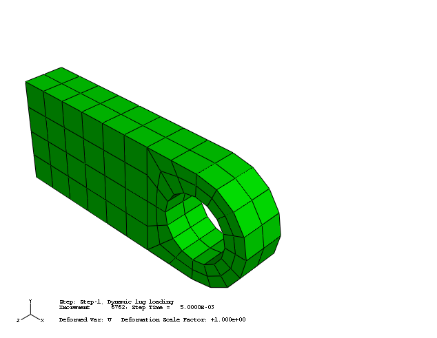

如前所述，Abaqus/Explicit 默认假设大变形理论；因此，变形比例因子自动设置为 1。如果位移太小而看不见，可以应用缩放以帮助研究响应。

为了更清楚地看到耳片中的振动，将变形比例因子更改为 50。此外，制作耳片变形形状的时间历史动画，并降低时间历史动画的帧率。

耳片变形形状的时间历史动画显示，突然施加的载荷会在耳片中引起振动。通过绘制内部能、动能、位移以及耳片中应力随时间变化的图表，可以获得关于此类加载下耳片行为的更多洞察。一些需要考虑的问题是：

1. 能量是否守恒？
2. 对于此分析是否需要大变形理论？
3. 峰值应力是否合理？材料会屈服吗？

**X–Y 绘图**

X–Y 图可以显示变量随时间的变化。您可以从场和历史输出创建 X–Y 图。

**创建内部能和动能随时间变化的 X–Y 图：**

1. 在结果树中，展开名为 `lug_xpl.odb` 的输出数据库下方的 **History Output** 容器。
2. 输出数据库历史部分中所有变量的列表出现；这些是您可以绘制的唯一历史输出变量。从可用输出变量列表中，双击 **ALLIE** 以绘制整个模型的内部能。Abaqus 从输出数据库文件中读取曲线数据并绘制如图 [图 4-37](ch04s03.md#gsa-lugexp-allie) 所示的图。**图 4-37** 整个模型的内部能。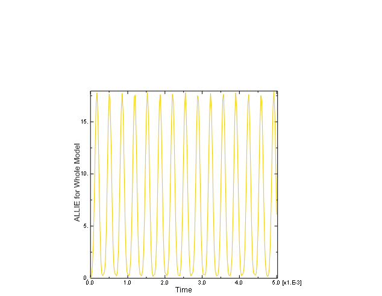
3. 重复此过程以绘制整个模型的动能 **ALLKE**（如图 [图 4-38](ch04s03.md#gsa-lugexp-allke) 所示）。**图 4-38** 整个模型的动能。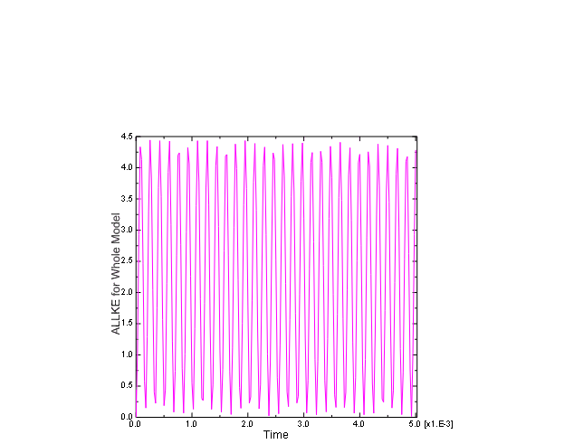
内部能和动能都显示出反映耳片振动的振荡。在整个模拟过程中，动能转化为内部（应变）能，反之亦然。因为材料是线性弹性的，总能量守恒。可以通过将系统的总能量 `ETOTAL` 与 `ALLIE` 和 `ALLKE` 一起绘制来看到。`ETOTAL` 的值在整个分析过程中大约为零。动态分析中的能量平衡在[第 9 章，"非线性显式动力学"](ch09.md) 中进一步讨论。

我们将检查耳片孔底部的节点位移，以评估几何非线性效应在此模拟中的重要性。

**生成位移随时间变化的图：**

1. 绘制耳片的变形形状。在结果树中，双击 **XY Data**。
2. 在出现的 **Create XY Data** 对话框中，选择 **ODB field output** 作为源，然后点击 **Continue**。
3. 在出现的 **XY Data from ODB Field Output** 对话框中，选择 **Unique Nodal** 作为应从中读取 *X–Y* 数据的位置类型。
4. 点击 **U: Spatial displacement** 旁边的箭头，并切换 **U2** 作为 *X–Y* 数据的位移变量。
5. 选择 **Elements/Nodes** 选项卡。选择 **Pick from viewport** 作为选择方法，以识别您想要 *X–Y* 数据的节点。
6. 点击 **Edit Selection**。在视口中，选择孔底部的一个节点（如图 [图 4-39](ch04s03.md#gsa-lugexp-node) 所示；如有必要，更改渲染样式以便于选择）。在提示区域中点击 **Done**。**图 4-39** 孔底部选定的节点。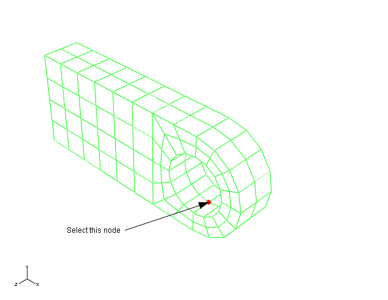
7. 在 **XY Data from ODB Field Output** 对话框中点击 **Plot**，以绘制节点位移随时间变化的图。振荡历史（如图 [图 4-40](ch04s03.md#gsa-lugexp-nodaldisp) 所示）表明位移很小（相对于结构尺寸）。**图 4-40** 孔底部节点的位移。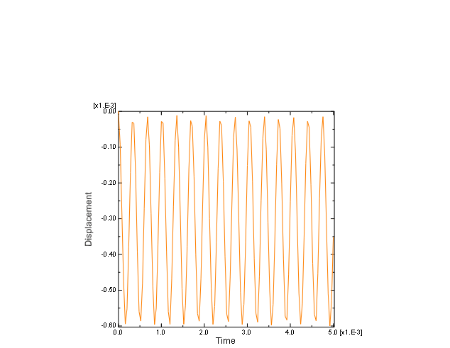
因此，此问题使用小变形理论可以足够充分地解决。这将降低模拟的计算成本，而不会显著影响结果。几何非线性效应在[第 8 章，"非线性"](ch08.md) 中进一步讨论。

我们还对连接耳片的应力历史感兴趣。耳片靠近约束端的区域特别感兴趣，因为预期在那里发生的峰值应力可能导致材料屈服。

**生成 Mises 应力随时间变化的图：**

1. 再次绘制耳片的变形形状。
2. 在 **XY Data from ODB Field Output** 对话框中选择 **Variables** 选项卡。取消选择 **U2** 作为 *X–Y* 数据图的变量。
3. 将 **Position** 字段更改为 **Integration Point**。
4. 点击 **S: Stress components** 旁边的箭头，并切换 **Mises** 作为 *X–Y* 数据的应力变量。
5. 选择 **Elements/Nodes** 选项卡。选择 **Pick from viewport** 作为选择方法，以识别您想要 X–Y 数据的单元。
6. 点击 **Edit Selection**。在视口中，选择靠近耳片约束端的单元之一（如图 [图 4-41](ch04s03.md#gsa-lugexp-elem) 所示）。在提示区域中点击 **Done**。**图 4-41** 靠近耳片约束端选定的单元（隐藏）。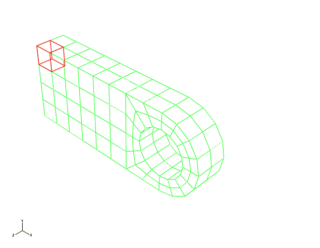
7. 在 **XY Data from ODB Field Output** 对话框中点击 **Plot**，以绘制所选单元处 Mises 应力随时间变化的图。

峰值 Mises 应力约为 550 MPa，如图 [图 4-42](ch04s03.md#gsk-lugexp-stresshist) 所示。此值大于典型钢的屈服强度。因此，材料在此类大应力下会屈服。材料非线性在[第 10 章，"材料"](ch10.md) 中进一步讨论。

**图 4-42** 耳片约束端附近的 Mises 应力。

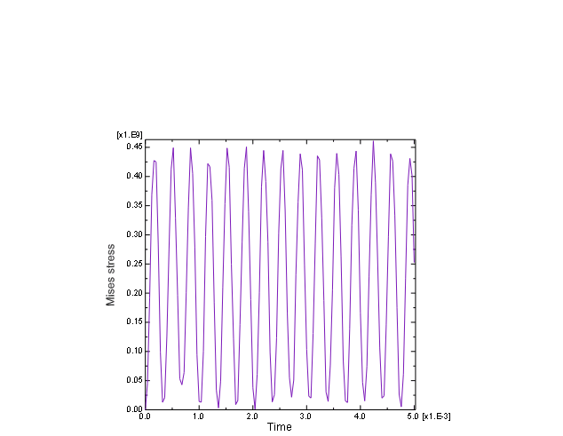