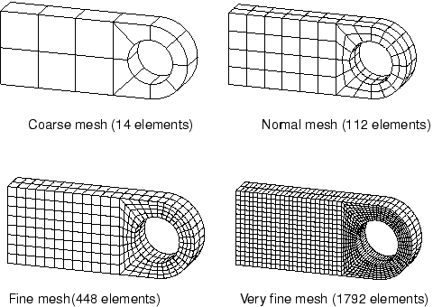
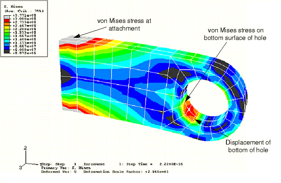
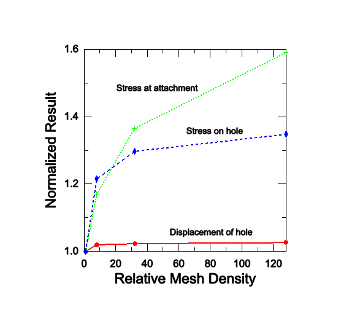
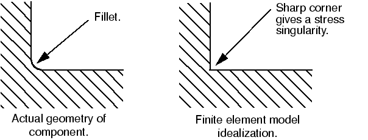
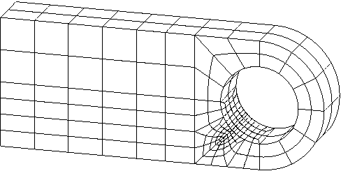

# 4.4 网格收敛

确保 Abaqus 模拟结果足够重要的是使用足够精细的网格。粗糙网格在使用隐式或显式方法的分析中可能产生不准确的结果。随着网格密度的增加，您的模型提供的数值解将趋于唯一值。运行模拟所需的计算机资源也随着网格细化而增加。当进一步细化网格对解产生可忽略的变化时，网格被称为收敛。

随着您获得经验，您将学会判断什么样的细化水平产生适合的网格以给出大多数模拟可接受的结果。但是，执行网格收敛研究始终是良好实践，其中您使用更精细的网格模拟相同问题并比较结果。如果两个网格给出基本相同的结果，您可以相信您的模型正在产生数学上准确的解。

网格收敛在 Abaqus/Standard 和 Abaqus/Explicit 中都是重要考虑因素。连接耳片将用作通过使用四种不同网格密度（[图 4-43](ch04s04.md#gsa-diff-mesh)）在 Abaqus/Standard 中进一步分析连接耳片的网格细化研究示例。图中年示了每个网格使用的单元数。

**图 4-43** 连接耳片问题的不同网格。

我们考虑网格密度对模型三个特定结果的影响：
- 孔底部的位移。
- 孔底部表面应力集中处的峰值 Mises 应力。
- 耳片连接到父结构处的峰值 Mises 应力。

比较结果的位置如图 [图 4-44](ch04s04.md#gss-mises-annotated-c) 所示。 

**图 4-44** 网格细化研究中比较结果的位置。

[表 4-3](ch04s04.md#gss-continuum-table-study) 中比较了四种网格密度的结果，以及运行每个模拟所需的 CPU 时间。

**表 4-3** 网格细化研究结果。
| 网格 | 孔底部位移 | 孔底部应力 | 连接处应力 | 相对 CPU 时间 |
| --- | --- | --- | --- | --- |
| 粗糙 | 3.07E4 | 256.E6 | 312.E6 | 0.83 |
| 正常 | 3.13E4 | 311.E6 | 365.E6 | 1.0 |
| 精细 | 3.14E4 | 332.E6 | 426.E6 | 3.2 |
| 非常精细 | 3.15E4 | 345.E6 | 496.E6 | 13.3 |

粗糙网格预测孔底部位移的准确性较低，但正常、精细和非常精细的网格都预测了相似的结果。因此，就位移而言，正常网格是收敛的。[图 4-45](ch04s04.md#gss-mesh-refinement-v) 中绘制了结果收敛图。

**图 4-45** 网格细化研究结果的收敛。

所有结果都相对于粗糙网格预测的值归一化。孔底部的峰值应力比位移收敛慢得多，因为应力和应变是从位移梯度计算的；因此，需要比计算准确位移精细得多的网格来预测准确的位移梯度。

网格细化显著改变了连接耳片连接处计算的应力；它随持续网格细化而继续增加。在耳片连接到父结构的角落存在应力奇点。理论上该位置的应力是无限的；因此，增加网格密度不会在该位置产生收敛的应力值。此奇点产生是因为有限元模型中使用的理想化。耳片与父结构之间的连接被建模为尖角，而父结构被建模为刚体。这些理想化导致应力奇点。现实中，耳片和父结构之间可能会有一个小的圆角，而父结构是变形的，不是刚性的。如果需要该位置的确切应力，则必须准确地对组件之间的圆角建模（见[图 4-46](ch04s04.md#gss-fillet)），还必须考虑父结构的刚度。

**图 4-46** 将圆角理想化为尖角。

通常，从有限元模型中省略小的细节（如圆角半径）以简化分析并保持模型大小合理。但是，向模型引入任何尖角都会在该位置导致应力奇点。这通常对模型的总体响应影响可忽略，但接近奇点的预测应力将不准确。

对于复杂的二维模拟，可用计算机资源通常决定了您可以使用的网格密度的实际限制。在这种情况下，您必须谨慎使用分析结果。粗糙网格通常足以预测趋势并比较不同概念的行为。然而，您应该谨慎使用粗糙网格计算的位移和应力的实际大小。

在整个被分析结构中几乎没有必要使用均匀精细的网格。您应该主要在高应力梯度区域使用精细网格，在低应力梯度区域或应力大小不重要的区域使用粗糙网格。例如，[图 4-47](ch04s04.md#gss-mesh-refine) 显示了一个网格，旨在对孔底部提供准确的应力集中预测。 

**图 4-47** 孔周围细化的网格。

仅在高应力梯度区域使用精细网格，其他地方使用粗糙网格。Abaqus/Standard 模拟的局部细化网格结果在[表 4-4](ch04s04.md#gss-continuum-table-refine) 中显示。此表显示结果与非常精细网格的结果相当，但局部细化网格的模拟比非常精细网格的分析需要少得多的 CPU 时间。

**表 4-4** 非常精细和局部细化网格的比较。
| 网格 | 孔底部位移 | 孔底部应力 | 相对 CPU 时间 |
| --- | --- | --- | --- |
| 非常精细 | 3.15E4 | 345.E6 | 22.5 |
| 局部细化 | 3.14E4 | 346.E6 | 3.44 |

您通常可以使用类似组件的知识或手工计算来预测模型高应力区域的位置——从而预测需要精细网格的区域。也可以通过初始使用粗糙网格来获得此信息，以识别高应力区域，然后在这些区域细化网格。后一种程序使用 Abaqus/CAE 等预处理器很容易执行，其中完整的数值模型（材料属性、边界条件、载荷等）可以基于结构几何定义。可以对几何进行粗糙网格划分以进行初始模拟，然后在粗模拟结果的指示下在适当区域细化网格，这是简单的。

Abaqus 提供了一种称为子模型的高级功能，允许您获取结构中感兴趣区域的更详细（和准确）的结果。来自整个结构粗糙网格的解用于"驱动"使用该感兴趣区域精细网格的详细局部分析。（此主题超出本指南范围。详见 ["Submodeling: overview," Abaqus Analysis User's Guide 第 10.2.1 节](../usb/usb-link.md#usb-anl-asubmodeloverview)。）