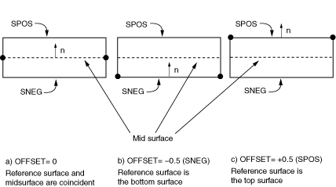

# 5.1 单元几何

Abaqus 中有两种壳单元可用：常规壳单元和连续体壳单元。常规壳单元通过定义单元的平面尺寸、表面法线和初始曲率来离散化参考曲面。然而，常规壳单元的节点不定义壳厚度；厚度通过截面属性定义。另一方面，连续体壳单元类似于三维实体单元，因为它们离散整个三维体，但公式化的运动学和本构行为与常规壳单元相似。连续体壳单元在接触建模中比常规壳单元更准确，因为它们采用双侧接触，考虑厚度变化。然而，对于薄壳应用，常规壳单元提供优越性能。

在本指南中仅讨论常规壳单元。因此，此后我们将其简称为"壳单元"。有关连续体壳单元的更多信息，请参阅 ["Shell elements: overview," Abaqus Analysis User's Guide 第 29.6.1 节](../usb/usb-link.md#usb-elm-eshelloverview)。

### 5.1.1 壳厚度和截面点

需要壳厚度来描述壳截面，必须指定。此外，除了指定壳厚度外，您可以选择让截面刚度在分析期间计算或在分析开始时计算一次。使用 [*SHELL SECTION](../key/key-link.md#usb-kws-mshellsection) 或 [*SHELL GENERAL SECTION](../key/key-link.md#usb-kws-mshellgensect) 选项定义壳厚度。 

如果使用 [*SHELL SECTION](../key/key-link.md#usb-kws-mshellsection) 选项，Abaqus 使用数值积分来独立计算壳厚度上每个截面点（积分点）处的应力和应变，从而允许非线性材料行为。例如，弹塑性壳可能在外部截面点屈服，而内部截面点保持弹性。如[图 5-1](ch05s01.md#gss-integrated-shell) 中所示 S4R（4 节点、减缩积分）单元中单个积分点的位置和穿过壳厚度的截面点配置。

**图 5-1** 数值积分壳中截面点的配置。

您可以使用 [*SHELL SECTION](../key/key-link.md#usb-kws-mshellsection) 选项指定穿过壳厚度的任意奇数个截面点。默认情况下，Abaqus 对均匀壳使用五个穿过厚度的截面点，这对于大多数非线性设计问题已足够。但是，在某些复杂模拟中应使用更多截面点，特别是当您预期反向塑性弯曲时（通常九个就够了）。对于线性问题，三个截面点提供穿过厚度的精确积分。但是，[*SHELL GENERAL SECTION](../key/key-link.md#usb-kws-mshellgensect) 选项对线性弹性壳更高效。

如果使用 [*SHELL GENERAL SECTION](../key/key-link.md#usb-kws-mshellgensect) 选项，材料行为必须是线性弹性的，因为截面刚度仅在模拟开始时计算一次。在这种情况下，所有计算都以整个截面上的合力和力矩给出。如果您请求应力或应变输出，Abaqus 提供底面、中面和顶面的默认输出。

### 5.1.2 壳法线和壳表面

壳单元的连接性定义了正法线方向，如[图 5-2](ch05s01.md#gss-posi-normals) 所示。

**图 5-2** 壳的正法线。

对于轴对称壳单元，正法线方向定义为从节点 1 到节点 2 的方向逆时针旋转 90°。对于三维壳单元，正法线由围绕单元定义中节点出现的顺序用右手定则给出。

壳的"顶"表面是正法线方向上的表面，称为 SPOS 面用于接触定义。"底"表面是沿法线负方向的表面，称为 SNEG 面用于接触定义。相邻壳单元之间的法线应一致。

正法线方向定义了元素表面压力载荷施加和穿过壳厚度变化的量的约定。施加到壳单元上的正值元素表面压力载荷产生的载荷沿正法线方向作用。（壳单元的元素表面压力载荷约定与连续体单元的约定相反；壳和连续体单元的表面压力载荷约定相同。有关元素表面和表面分布式载荷之间差异的更多信息，请参阅 ["Distributed loads," Abaqus Analysis User's Guide 第 34.4.3 节](../usb/usb-link.md#usb-prc-ploaddistributed)。）

### 5.1.3 初始壳曲率

Abaqus 中的壳（元素类型 S3/S3R、S3RS、S4R、S4RS、S4RSW 和 STRI3 除外）被公式化为真正的曲壳；真正的曲壳需要特别注意以准确计算初始表面曲率。Abaqus 自动计算每个壳单元节点处的表面法线以估计壳的初始曲率。每个节点处的表面法线使用相当复杂的算法确定，这在 ["Defining the initial geometry of conventional shell elements," Abaqus Analysis User's Guide 第 29.6.3 节](../usb/usb-link.md#usb-elm-eshellgeometry) 中有详细讨论。

使用如图 [图 5-3](ch05s01.md#gss-refine) 所示的粗糙网格，Abaqus 可能为相邻单元在同一节点处确定多个独立的表面法线。物理上，单个节点处的多个法线意味着在共享节点的单元之间存在折叠线。虽然您可能打算建模此类结构，但更可能您打算建模平滑曲壳；Abaqus 将尝试通过在节点处创建平均法线来平滑壳。

**图 5-3** 网格细化对节点表面法线的影响。

使用的基本平滑算法如下：如果每个壳单元在节点处的法线在 20° 以内，则法线将被平均。平均法线将用于该节点处共享该节点的所有单元。如果 Abaqus 无法平滑壳，将在数据（`.dat`）文件中发出警告消息。

您可以覆盖默认算法。要将折叠线引入曲壳或用粗糙网格建模曲壳，请使用 [*NODE](../key/key-link.md#usb-kws-mnode) 和 [*NORMAL](../key/key-link.md#usb-kws-mnormal) 选项手动定义法线。使用 [*NODE](../key/key-link.md#usb-kws-mnode) 选项，您可以在数据行上节点坐标后指定第 4、第 5 和第 6 个值作为节点处的表面法线。使用 [*NODE](../key/key-link.md#usb-kws-mnode) 定义的法线用于共享该节点的所有单元，除非也使用了 [*NORMAL](../key/key-link.md#usb-kws-mnormal)。使用 [*NORMAL](../key/key-link.md#usb-kws-mnormal) 选项可为所选单元在节点处指定法线。使用 [*NORMAL](../key/key-link.md#usb-kws-mnormal) 定义的法线覆盖使用 [*NODE](../key/key-link.md#usb-kws-mnode) 定义的法线。详见 ["Defining the initial geometry of conventional shell elements," Abaqus Analysis User's Guide 第 29.6.3 节](../usb/usb-link.md#usb-elm-eshellgeometry)。

### 5.1.4 参考曲面偏移

壳的参考曲面由壳单元的节点和法线定义。当使用壳单元建模时，参考曲面通常与壳的中面重合。但是，在许多情况下，将参考曲面定义为与壳中面偏移会更方便。例如，CAD 包中创建的曲面通常代表壳体的顶部或底部表面。在这种情况下，将参考曲面定义为与 CAD 曲面重合（因此与壳中面偏移）可能更容易。

壳偏移也可用于为接触问题定义更精确的表面几何，其中壳厚度很重要。另一个偏移可能重要的情形是当建模厚度连续变化的壳时。在这种情况下，在壳中面定义节点可能很困难。如果一个表面光滑而另一个表面粗糙（如某些飞机结构中），使用壳偏移在中滑表面定义节点最容易。

可以通过指定偏移值来引入偏移，偏移值定义为从壳的中面到包含单元节点的参考曲面的距离（以壳厚度的分数表示）。偏移值为正时在正法线方向上。当偏移设置为 0.5 或 SPOS 时，壳的顶面是参考曲面。当偏移设置为 –0.5 或 SNEG 时，底面是参考曲面。默认偏移为 0，表示壳的中面是参考曲面。这三个参考曲面偏移设置如图 [图 5-4](ch05s01.md#gss-shelloffset) 所示，其中调整了节点位置以保持中面的位置不变。

**图 5-4** 偏移值 0、–0.5 和 +0.5 的壳偏移示意图。

 壳的自由度与参考曲面关联。单元的面积和所有运动量在那里计算。对于弯曲壳，大的偏移值可能导致面积积分误差，影响壳截面的刚度、质量和转动惯量。为了稳定性，Abaqus/Explicit 还会自动增加用于壳单元的转动惯量，增幅与偏移的平方成比例，这可能导致大偏移时动态误差。当需要偏离中面的大偏移时，使用多点约束或刚体约束代替。