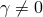

# 5.2 壳公式——厚或薄

### 5.2 壳公式——厚或薄

壳问题通常属于两类之一：薄壳问题和厚壳问题。厚壳问题假设横向剪切变形对求解很重要。另一方面，薄壳问题假设横向剪切变形小到可以忽略。[图 5-5](ch05s02.md#gss-transhellsect-shell)(a) 说明了薄壳的横向剪切行为：最初垂直于壳表面的材料线在变形过程中保持直线并垂直。因此，假定横向剪切应变为零（）。[图 5-5](ch05s02.md#gss-transhellsect-shell)(b) 说明了厚壳的横向剪切行为：最初垂直于壳表面的材料线在变形过程中不一定保持垂直于表面，从而增加横向剪切柔度（）。

**图 5-5** (a) 薄壳和 (b) 厚壳中横向壳截面的行为。

Abaqus 提供多类壳单元，区别在于单元对薄壳和厚壳问题的适用性。通用壳单元对厚壳和薄壳问题都有效。在某些情况下，对于特定应用，可以通过对 Abaqus/Standard 中可用的专用壳单元获得增强性能。 

专用壳单元分为两类：仅薄壳单元和仅厚壳单元。所有专用壳单元提供任意大的旋转，但仅限小应变。仅薄壳单元强制执行 Kirchhoff 约束；即，垂直于壳中面的平面截面保持垂直于中面。Kirchhoff 约束在单元公式中分析性地强制执行（STRI3），或通过惩罚约束数值强制执行。仅厚壳单元是二次四边形，可以比通用壳单元在应变小且加载使解在整个壳跨度上平滑变化的应用中获得更准确的结果。

要判断给定应用是薄壳还是厚壳问题，我们可以提供一些指南。对于厚壳，横向剪切柔度很重要，而对于薄壳它可以忽略。壳中横向剪切的重要性可以通过其厚度与跨度比来估计。厚度比大于 1/15 的单各向同性材料制成的壳被认为是"厚"的；如果比小于 1/15，则认为壳是"薄"的。这些估计是近似的；您应始终检查模型中的横向剪切效应以验证假定的壳行为。由于横向剪切柔度在层压复合壳结构中可能很重要，因此对于"薄"壳理论适用，此比例应小得多。具有非常软内层（所谓的"夹层"复合）的复合壳具有非常低的横向剪切刚度，几乎始终应使用"厚"壳建模；如果违反平面截面保持平面的假设，应使用连续体单元。详见 ["Shell section behavior," Abaqus Analysis User's Guide 第 29.6.4 节](../usb/usb-link.md#usb-elm-eshellsectionbehavior)，了解检查使用壳理论有效性的详细信息。

横向剪切力和应变可用于通用壳单元和仅厚壳单元。对于三维单元，提供横向剪切应力的估计。这些应力的计算忽略弯曲和扭转变形之间的耦合，并假定材料属性和弯矩的空间梯度较小。