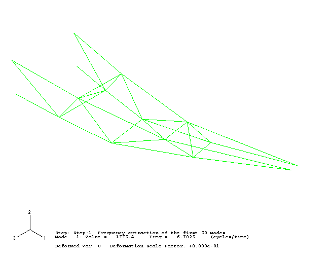
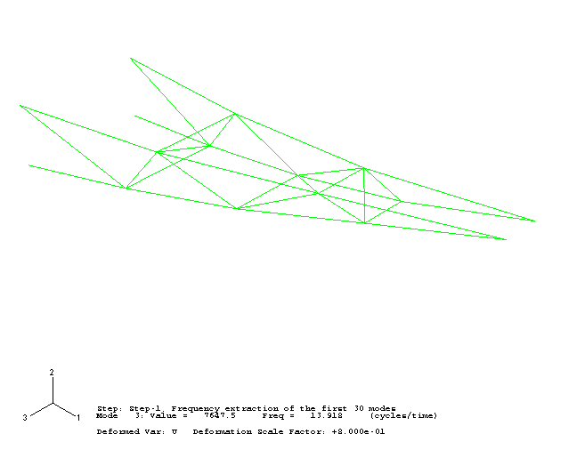
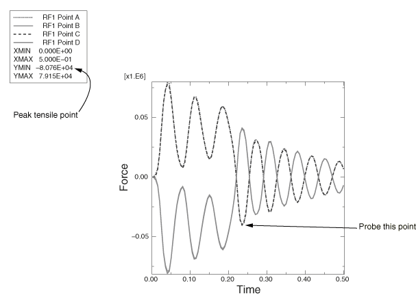

# 7.5 示例：动态载荷下的货运吊车


此示例使用您在"示例：货运吊车"第 6.4 节中分析过的同一台货运吊车，但现在您需要研究当 10 kN 的载荷在 0.2 秒内落到吊钩上时会发生什么。*A*、*B*、*C* 和 *D* 点处的连接（参见图 7-5）只能承受 100 kN 的最大拉出力。您必须判断这些连接是否会断裂。

**图 7-5** 货运吊车。


载荷的短持续时间意味着惯性效应可能很重要，动力分析是必不可少的。您没有获得任何关于结构阻尼的信息。由于桁架和交叉支撑之间存在螺栓连接，摩擦效应引起的能量吸收可能是显著的。因此，基于经验，您选择每个模态 5% 的临界阻尼。

施加载荷的幅度与时间的关系如图 7-6 所示。

**图 7-6** 载荷-时间特性。


以下步骤假定您可以访问此示例的完整输入文件。此输入文件 `dynamics.inp` 在"货运吊车——动态载荷"第 A.5 节中提供。获取和运行脚本的说明在附录 A"示例文件"中给出。

如果您希望使用 Abaqus/CAE 交互式创建此示例，请参阅《Abaqus 入门：交互版》第 7.5 节的"示例：动态载荷下的货运吊车"。

### 7.5.1 修改输入文件——模型数据

模型数据与静态分析相同，但有以下修改。这些修改最好使用编辑器进行，尽管如果您愿意，也可以更改预处理器中的模型。

**材料**

在动力学模拟中，必须指定每种材料的密度，以便形成质量矩阵。吊车中钢的密度为 7800 kg/m³。梁单元属性是使用 [*BEAM GENERAL SECTION](../key/key-link.md#usb-kws-mbeamgensect) 选项定义的，因此此输入文件中没有材料属性定义。密度必须使用 [*BEAM GENERAL SECTION](../key/key-link.md#usb-kws-mbeamgensect) 选项上的 DENSITY 参数指定。例如，

```
*BEAM GENERAL SECTION, SECTION=BOX, ELSET=OUTA, DENSITY=7800.
0.10,0.05,0.005,0.005,0.005,0.005
-0.1118, 0.0, -0.9936
200.E9,80.E9
```
DENSITY 参数已添加到所有单元属性选项。

如果使用 [*MATERIAL](../key/key-link.md#usb-kws-mmaterial) 选项定义材料数据，则通过使用 [*DENSITY](../key/key-link.md#usb-kws-mdensity) 选项并在数据行上给出质量密度来包含密度。例如，

```
[*MATERIAL](../key/key-link.md#usb-kws-mmaterial), NAME=STEEL
[*ELASTIC](../key/key-link.md#usb-kws-melastic)
*<弹性模量>*,*<泊松比>*
[*DENSITY](../key/key-link.md#usb-kws-mdensity)
*<密度>*,
```

**初始条件**

在此示例中，结构没有初始速度或加速度，这是默认值。但是，如果要定义初始速度，可以使用以下选项：

```
[*INITIAL CONDITIONS](../key/key-link.md#usb-kws-minitialcond), TYPE=VELOCITY
```
在数据行上指定节点（或节点集）、方向和速度的大小，如下所示：
```
*<节点或节点集>*,*<自由度>, <速度>*
```

例如：

```
[*INITIAL CONDITIONS](../key/key-link.md#usb-kws-minitialcond), TYPE=VELOCITY
NALL, 1, 10.0
```
会将节点集 `NALL` 中所有节点在 1 方向上的速度设置为 10 m/s。

**载荷的时间变化**

施加在吊车尖端上的载荷大小随时间变化，如图 7-6 所示。载荷的时间依赖性使用 [*AMPLITUDE](../key/key-link.md#usb-kws-mamplitude) 选项定义。[*AMPLITUDE](../key/key-link.md#usb-kws-mamplitude) 选项必须作为模型数据的一部分出现，即使引用它的 [*CLOAD](../key/key-link.md#usb-kws-hcload) 选项是历史数据的一部分。

[*AMPLITUDE](../key/key-link.md#usb-kws-mamplitude) 选项的每行数据给出四对时间和幅度数据，并使用 NAME 参数为幅度曲线分配名称。对于您的模拟，定义幅度曲线的选项块应类似于以下内容：

```
*AMPLITUDE, NAME=BOUNCE, VALUE=RELATIVE, SMOOTH=0.25
0.0, 0.0, 0.01, 1.0, 0.2, 1.0, 0.21, 0.0
```

曲线的名称 `BOUNCE` 将用于引用加载选项（[*CLOAD](../key/key-link.md#usb-kws-hcload)）到此幅度曲线。实际施加的载荷将是加载选项上的幅度与 `BOUNCE` 曲线上幅度的乘积。参数 VALUE=RELATIVE 用于指示此方法。您可以选择使用 VALUE=ABSOLUTE 在 [*AMPLITUDE](../key/key-link.md#usb-kws-mamplitude) 选项上定义载荷的绝对大小。

### 7.5.2 修改输入文件——历史数据**

历史定义与静态分析中的完全不同。因此，删除整个静态步，并添加新的历史部分，如下所述。

此分析需要两个步。第一步计算结构的固有频率和振型。第二步然后使用这些数据计算吊钩的瞬态动力响应。如果您想在模拟中建模任何非线性，必须使用 [*DYNAMIC](../key/key-link.md#usb-kws-hdynamic) 过程。在此分析中，我们将假定一切都是线性的。

**步骤 1 - 模态和频率**

[*FREQUENCY](../key/key-link.md#usb-kws-hfrequency) 过程用于计算固有频率和振型。Abaqus 提供了 Lanczos 和子空间迭代特征值提取方法。Lanczos 方法是默认方法；当需要大量特征模态且系统具有许多自由度时，它通常更快。当只需要少数（少于 20 个）特征模态时，子空间迭代方法可能更快。

在此分析中，我们使用默认的 Lanczos 特征值求解器。在 [*FREQUENCY](../key/key-link.md#usb-kws-hfrequency) 选项的数据行上指定所需的模态数。或者，可以指定感兴趣的最小和最大频率，这样一旦 Abaqus 找到指定范围内的所有特征值，步就会完成。也可以指定一个移位点，以便提取最接近移位点的特征值。默认情况下，不使用最小或最大频率或移位。如果结构没有相对于刚体模态进行约束，则应将移位值设置为一个小的负值，以消除与刚体运动相关的数值问题。

[*FREQUENCY](../key/key-link.md#usb-kws-hfrequency) 选项块的形式为

```
[*FREQUENCY](../key/key-link.md#usb-kws-hfrequency)
*<特征值数量>*,*< 最小频率>*,*< 最大频率>*,*<移位点>*
```

此模拟的步和过程选项块为

```
*STEP, PERTURBATION
Frequency extraction of the first 30 modes
*FREQUENCY
30,
```

在结构动力学分析中，响应通常与低阶模态相关。但是，应提取足够的模态以提供结构动力响应的良好表示。检查是否提取了足够数量特征值的一种方法是查看每个自由度上的总有效质量，这表明每个提取模态在每个方向上有多少质量是活跃的。有效质量在特征值输出下的数据文件中以表格形式列出。理想情况下，每个方向上每个模态的模态有效质量之和至少应为总质量的 90%。这在"模态数量的影响"第 7.6 节中进一步讨论。

**边界条件**

边界条件与静态分析中的相同。

**输出**

默认情况下，Abaqus 将振型写入输出数据库（`.odb`）文件，以便可以使用 Abaqus/Viewer 绘制它们。每个振型的节点位移被归一化，使得最大位移为 1。因此，这些结果以及相应的应力和应变在物理上不是有意义的：它们只应用于相对比较。

步以下列方式终止

```
*END STEP
```

**步骤 2 - 瞬态动力学**

[*MODAL DYNAMIC](../key/key-link.md#usb-kws-hmodaldyn) 过程用于瞬态模态动力学分析。固定时间增量和总步时间在此选项的数据行上给出。模拟的总时间为 0.5 秒，固定增量为 0.005 秒。此数据行的格式与 [*STATIC](../key/key-link.md#usb-kws-hstatic) 的格式基本相同。但是，在这种情况下，我们必须小心确保给出真实的时间值；在动力学分析中，时间是一个真实的物理量。

[*STEP](../key/key-link.md#usb-kws-hstep) 和 [*MODAL DYNAMIC](../key/key-link.md#usb-kws-hmodaldyn) 选项块的形式应为

```
*STEP, PERTURBATION
Crane Response to Dropped Load
*MODAL DYNAMIC
0.005, 0.5
```

**阻尼**

应在第一步中提取的所有 30 个模态中使用 5% 的临界阻尼。此输入在以下 [*MODAL DAMPING](../key/key-link.md#usb-kws-hmodaldamp) 选项块中指定：

```
*MODAL DAMPING, VISCOUS=FRACTION OF CRITICAL DAMPING
1, 30, 0.05
```

**选择特征模态**

如果使用了 [*MODAL DAMPING](../key/key-link.md#usb-kws-hmodaldamp)，则在基于模态的动力过程中使用的特征模态必须使用 [*SELECT EIGENMODES](../key/key-link.md#usb-kws-hselecteigenmodes) 选项进行选择。对于此示例，此选项的形式为：

```
*SELECT EIGENMODES, GENERATE
1, 30, 1
```

**载荷**

在负全局 2 方向上向吊车尖端节点 104 施加集中力。自由度 2 中节点 104 和 204 之间的 [*EQUATION](../key/key-link.md#usb-kws-mequation) 约束意味着载荷将由两个节点平均承担，因此由吊车的两半承担。集中力使用 [*CLOAD](../key/key-link.md#usb-kws-hcload) 选项定义。此示例使用参数 AMPLITUDE=BOUNCE 来指示应使用名为 `BOUNCE` 的幅度曲线（先前在模型数据中定义）来定义步期间载荷随时间变化的大小：

```
*CLOAD, AMPLITUDE=BOUNCE
104, 2, -1.0E4
```

在任何时刻施加的载荷的实际大小是通过将 [*CLOAD](../key/key-link.md#usb-kws-hcload) 选项上的大小（10,000 N）与该时刻 `BOUNCE` 幅度曲线的值相乘得到的。

**边界条件**

第一步中应用的相同边界条件在此步中仍然有效。由于边界条件不能在 [*FREQUENCY](../key/key-link.md#usb-kws-hfrequency) 步和任何后续模态动力学步之间更改，因此不应指定任何边界条件。

**输出**

动力学分析通常比静态分析需要更多的增量才能完成。因此，动力学分析的输出量可能非常大，您应该控制输出请求以将输出文件保持在合理的大小。

您可以使用数据分析期间在数据文件底部附近给出的近似大小来估计重启文件的大小。

在此示例中，请求在每第五个增量结束时将变形形状输出到输出数据库文件。步中将有 100 个增量（0.5/0.005）；因此，将有 20 帧输出。

```
*OUTPUT, FIELD, FREQUENCY=5, VARIABLE=PRESELECT
```

独立尖端节点（分配给名为 `TIP` 的节点集）的位移和固定节点（分组到名为 `ATTACH` 的节点集）的反作用力作为历史数据写入输出数据库文件，每个增量都写入，以便这些数据具有更高的分辨率。在动力学分析中，我们还关心模型中的能量分布以及能量的形式。动能作为质量运动的结果存在于模型中；应变能作为结构位移的结果存在；能量也通过阻尼耗散。我们可以输出动能（ALLKE）、应变能（ALLSE）、通过阻尼耗散的能量（ALLVD）、整个模型上的外功（ALLWK）以及模型中的总能量平衡（ETOTAL）。输出的历史部分编写如下：

```
*NSET, NSET=TIP
104,
*OUTPUT, HISTORY, FREQUENCY=1
*NODE OUTPUT, NSET=TIP
U,
*NODE OUTPUT, NSET=ATTACH
RF,
*ENERGY OUTPUT
ALLKE, ALLSE, ALLVD, ALLWK, ETOTAL
```
步以下列方式终止：
```
*END STEP
```

### 7.5.3 运行分析

输入文件名为 `dynamics.inp`（示例列在"货运吊车——动态载荷"第 A.5 节中）。使用以下命令在后台运行分析：

```
abaqus job=dynamics
```

### 7.5.4 结果

检查状态（`.sta`）文件和打印输出数据（`.dat`）文件以评估分析结果。

**状态文件**

查看状态文件 `dynamics.sta` 的内容，我们可以看到与步骤 1 中单个增量相关的时间增量非常小。[*FREQUENCY](../key/key-link.md#usb-kws-hfrequency) 步不使用时间，因为时间在频率提取步骤中不相关。状态文件的内容如下所示。

```
 SUMMARY OF JOB INFORMATION:
 STEP  INC ATT SEVERE EQUIL TOTAL  TOTAL      STEP       INC OF       DOF    IF
               DISCON ITERS ITERS  TIME/    TIME/LPF    TIME/LPF    MONITOR RIKS
               ITERS               FREQ
   1     1   1     0     0     0  0.000      1.00e-036  1.000e-036
   2     1   1     0     0     0  0.000      0.00500    0.005000
   2     2   1     0     0     0  0.000      0.0100     0.005000
   2     3   1     0     0     0  0.000      0.0150     0.005000
   2     4   1     0     0     0  0.000      0.0200     0.005000
   2     5   1     0     0     0  0.000      0.0250     0.005000
   2     6   1     0     0     0  0.000      0.0300     0.005000
....
   2    94   1     0     0     0  0.000      0.470      0.005000
   2    95   1     0     0     0  0.000      0.475      0.005000
   2    96   1     0     0     0  0.000      0.480      0.005000
   2    97   1     0     0     0  0.000      0.485      0.005000
   2    98   1     0     0     0  0.000      0.490      0.005000
   2    99   1     0     0     0  0.000      0.495      0.005000
   2   100   1     0     0     0  0.000      0.500      0.005000

```

步骤 2 的状态文件输出显示，时间增量大小在整个步骤中是恒定的，并且每个增量只需要一次迭代。由于模态动力学分析涉及振型的线性叠加，因此不需要迭代。出于同样的原因，消息文件不包含关于平衡或残差的信息。

**数据文件**

步骤 1 的主要结果是提取的特征值、参与因子和有效质量，如下所示。

```
                              E I G E N V A L U E    O U T P U T

 MODE NO    EIGENVALUE       FREQUENCY           GENERALIZED MASS  COMPOSITE MODAL DAMPING
                        (RAD/TIME) (CYCLES/TIME)

       1       1773.4     42.112     6.7023       151.92           0.0000
       2       7016.8     83.766     13.332       30.206           0.0000
       3       7644.1     87.430     13.915       90.401           0.0000
       4       22999.     151.65     24.136       250.63           0.0000
       5       24714.     157.21     25.020       275.90           0.0000
       6       34811.     186.58     29.695       493.16           0.0000
       7       42748.     206.76     32.906       1107.1           0.0000
....
      25    2.26885E+05   476.32     75.809       207.47           0.0000
      26    2.42800E+05   492.75     78.423       127.02           0.0000
      27    2.84057E+05   532.97     84.825       1240.8           0.0000
      28    2.92452E+05   540.79     86.069       330.69           0.0000
      29    3.13943E+05   560.31     89.175       272.41           0.0000
      30    3.64774E+05   603.96     96.124       64.980           0.0000

```

提取的最高频率为 96 Hz。与此频率相关的周期为 0.0104 秒，与固定时间增量 0.005 秒相当。提取周期远小于所用时间增量的模态没有意义。相反，时间增量必须能够解析感兴趣的最高频率。

广义质量列列出与该模态关联的单自由度系统的质量。

参与因子表指示模态主要作用的方向，如下所示。

```
          P A R T I C I P A T I O N   F A C T O R S

 MODE NO    X-COMPONENT    Y-COMPONENT    Z-COMPONENT    X-ROTATION     Y-ROTATION     Z-ROTATION

       1     -6.11690E-04   -6.14531E-03     1.4284         1.4276        -6.0252       -3.34721E-02
       2      0.18470       -0.25678        8.31883E-04    2.09977E-03   -6.05062E-03    -1.7751
       3     -0.17440         1.5515        4.88139E-03   -5.59953E-03    3.24483E-02     9.3618
       4     -8.69482E-05   -9.61288E-03    8.23644E-02    0.25721         1.2335       -2.97485E-02
       5     -3.80669E-03    1.13896E-03   -3.04330E-02   -0.60741         1.7592       -2.01080E-02
       6      3.71619E-02   -0.35674        6.05207E-03   -1.37690E-02    6.71471E-03   -0.98290
       7     -2.48375E-03   -1.58340E-03    6.19483E-02    8.18701E-02   -0.29885        5.73966E-04
 ....
      25     -8.25367E-02   -0.22220       -3.54513E-02    1.61838E-02   -2.18156E-02   -0.14563
      26     -1.98899E-02   -0.35108        4.61344E-02    1.80975E-03   -1.27588E-02   -0.17942
      27      1.71767E-02    2.51338E-02    2.26535E-02    1.06724E-03   -4.31578E-02    1.92991E-02
      28      4.73374E-02    2.79248E-02   -0.11861       -7.32078E-03    0.24177       -2.37795E-02
      29      9.83570E-03   -3.64867E-03    4.65417E-03   -8.45350E-04   -1.56687E-02   -7.74623E-03
      30      4.83653E-02    1.85437E-02    0.13423        4.49321E-02   -0.35873       -4.29368E-02

```
模态 1 主要在 3 方向作用。

有效质量表指示任何单个模态中每个自由度上活跃的质量，如下所示。模型的总质量早些时候在数据文件中给出，为 414.34 kg。

```
                    E F F E C T I V E   M A S S

 MODE NO    X-COMPONENT    Y-COMPONENT    Z-COMPONENT    X-ROTATION     Y-ROTATION     Z-ROTATION

       1      5.68446E-05    5.73740E-03     309.98         309.61         5515.3        0.17021
       2       1.0304         1.9917        2.09036E-05    1.33181E-04    1.10585E-03     95.175
       3       2.7495         217.62        2.15407E-03    2.83449E-03    9.51822E-02     7923.1
       4      1.89478E-06    2.31603E-02     1.7003         16.582         381.34        0.22180
       5      3.99800E-03    3.57904E-04    0.25553         101.79         853.85        0.11155
       6      0.68105         62.760        1.80631E-02    9.34950E-02    2.22352E-02     476.44
       7      6.82949E-03    2.77557E-03     4.2485         7.4203         98.873        3.64709E-04
....
      25       1.4134         10.244        0.26075        5.43401E-02    9.87406E-02     4.4000
      26      5.02489E-02     15.656        0.27034        4.16008E-04    2.06766E-02     4.0887
      27      0.36609        0.78385        0.63677        1.41330E-03     2.3112        0.46216
      28      0.74103        0.25787         4.6522        1.77231E-02     19.329        0.18700
      29      2.63530E-02    3.62651E-03    5.90071E-03    1.94668E-04    6.68780E-02    1.63456E-02
      30      0.15200        2.23444E-02     1.1708        0.13119         8.3622        0.11979

 TOTAL         22.198         378.26         373.68         558.02         8348.4         8695.0

```

为确保使用了足够数量的模态，每个方向上的总有效质量应是模型质量的很大一部分（比如 90%）。但是，模型的一些质量与被约束的节点相关联。此约束质量大约为连接到约束节点的所有单元质量的三分之一，在本例中约为 28 kg。因此，模型可以运动的质量为 385 kg。x、y 和 z 方向的有效质量分别是可以运动质量的 6%、98% 和 97%。2 和 3 方向的总有效质量远高于前面建议的 90%；1 方向的总有效质量要低得多。然而，由于载荷施加在 2 方向，1 方向的响应不重要。

数据文件不包含模态动力学步的任何结果，因为所有数据文件输出请求都被关闭了。

### 7.5.5 后处理

当您在包含输出数据库文件 `dynamics.odb` 的目录中时，在操作系统提示符下键入以下命令：

```
abaqus viewer odb=dynamics
```

**绘制振型**

您可以通过绘制与给定固有频率相关联的变形模式来可视化该频率的振型。

**选择模态并绘制相应振型：**

1. 在上下文栏中，点击帧选择器工具 。出现**帧选择器**对话框。拖动对话框的底部角落将其放大，使两个步名称清晰可见。
2. 拖动帧滑块选择**步骤 1** 中的帧 `1`。这是第一特征模态。
3. 从主菜单栏，选择****绘图****变形形状****；或使用工具箱中的  工具。Abaqus/Viewer 显示与第一振动模态相关的变形模型形状，如图 7-7 所示。
**图 7-7** 模态 1。

4. 从**帧选择器**对话框中选择第三模态（**步骤 1** 中的帧 `3`）。之后，关闭对话框。Abaqus/Viewer 显示如图 7-8 所示的第三振型。
**图 7-8** 模态 3。

**注意：**可用帧的完整列表在**步骤/帧**对话框中给出（****结果****步骤/帧****）。此对话框提供了切换帧的替代方法。

**结果动画**

您将为分析结果创建动画。首先，创建第三特征模态的比例因子动画。然后，创建瞬态结果的时间历史动画。

**创建特征模态的比例因子动画：**

1. 从主菜单栏，选择****动画****比例因子****；或使用工具箱中的  工具。Abaqus/Viewer 显示第三振型，并逐步执行从 0 到 1 的不同变形比例因子。Abaqus/Viewer 还在上下文栏右侧显示电影播放器控件。
2. 在上下文栏中，点击  暂停动画。

**创建瞬态结果的时间历史动画：**

1. 从主菜单栏，选择****结果****活动步/帧****以选择将在历史动画中活动的帧。Abaqus/Viewer 显示**活动步/帧**对话框。
2. 切换步名称，以便仅选择第二步（**步骤 2**）。
3. 点击**确定**接受选择并关闭对话框。
4. 从主菜单栏，选择****动画****时间历史****；或使用工具箱中的  工具。Abaqus/Viewer 逐步执行第二步的每个可用帧。状态块在整个动画过程中指示当前步和增量。到达此步的最后增量后，动画过程重复自身。
5. 您可以在动画运行时自定义变形形状图。
   1. 显示**常规绘图选项**对话框。
   2. 从**变形比例因子**字段中选择**统一**。
   3. 输入 `15.0` 作为变形比例因子值。
   4. 点击**应用**应用您的更改。Abaqus/Viewer 现在以 `15.0` 的变形比例因子逐步执行第二步中的帧。
   5. 从**变形比例因子**字段中选择**自动计算**。
   6. 点击**确定**应用您的更改并关闭**常规绘图选项**对话框。Abaqus/Viewer 现在以默认变形比例因子 `0.8` 逐步执行第二步中的帧。

**确定峰值拉出力**

要找到连接点处的峰值拉出力，创建附着节点在 1 方向（变量 RF1）上的反作用力的 X-Y 图。这涉及同时绘制多条曲线。

**绘制多条曲线：**

1. 在结果树中，在名为 `dynamics.odb` 的输出数据库的**历史输出**上点击鼠标按钮 3。从出现的菜单中选择**筛选**。
2. 在筛选字段中，输入 `*RF1*` 以将历史输出限制为仅 1 方向的反作用力分量。
3. 从可用的历史输出列表中，选择具有以下形式的四条曲线（使用 **[Ctrl]****+点击**）：`Reaction Force: RF1 PI: TRUSS-1 Node *xxx* in NSET ATTACH`
4. 点击鼠标按钮 3，并从出现的菜单中选择**绘图**。Abaqus/Viewer 显示选定的曲线。
5. 点击提示区域中的  取消当前过程。

**定位网格：**

1. 双击绘图打开**图表选项**对话框。
2. 在此对话框中，切换到**网格区域**标签页。
3. 在此页的**大小**区域中，选择**正方形**选项。
4. 使用滑块将大小设置为 **75**。
5. 在此页的**位置**区域中，选择**自动对齐**选项。
6. 从可用的对齐选项中，选择最后一个（将网格定位在视口右下角）。
7. 点击**关闭**。

**定位图例：**

1. 双击图例打开**图表图例选项**对话框。
2. 在此对话框中，切换到**区域**标签页。
3. 在**位置**区域中，切换到**嵌入**。
4. 要在图例中显示最小值和最大值，请切换到对话框的**内容**标签页。在**数字**区域中，切换到**显示最小值/最大值**。
5. 点击**关闭**。
6. 在视口中拖动图例以重新定位。

结果图（已自定义）如图 7-9 所示。两个桁架结构顶部每个节点（点 B 和 C）的曲线与每个桁架结构底部节点（点 A 和 D）的曲线几乎是镜像的。

**注意：**要修改曲线样式，请在 Visualization 工具箱中点击  打开**曲线选项**对话框。

**图 7-9** 附着节点的反作用力历史。



在每个桁架结构顶部的附着点，峰值拉力约为 80 kN，低于连接 100 kN 的承载能力。请记住，1 方向上的负反作用力意味着构件正在被拉离墙壁。下部附着件在施加载荷时处于压力（正反作用力）下，但在载荷移除后在拉力和压力之间振荡。峰值拉力约为 40 kN，远低于允许值。要找到此值，请探测 X-Y 图。

**查询 X-Y 图：**

1. 从主菜单栏，选择****工具****查询****。出现**查询**对话框。
2. 在**可视化模块查询**字段中点击**探测值**。出现**探测值**对话框。
3. 选择图 7-9 中指示的点。此点的 Y 坐标为 -40.30 kN，对应于 1 方向反作用力的值。


