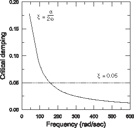

# 7.8 与直接时间积分的比较


由于这是瞬态动力学分析，自然要考虑结果与使用运动方程直接积分获得的结果的比较。直接积分可以使用隐式（Abaqus/Standard）或显式（Abaqus/Explicit）方法执行。在这里，我们将分析扩展到使用显式动力学过程。

与前面给出的结果进行直接比较是不可能的，因为 B33 单元类型和直接模态阻尼在 Abaqus/Explicit 中不可用。因此，在 Abaqus/Explicit 分析中，单元类型更改为 B31，并使用 Rayleigh 阻尼代替直接模态阻尼。

将 `dynamics.inp` 的副本保存为 `dynamics_xpl.inp`。所有后续更改应针对 `dynamics_xpl.inp` 进行。

**修改模型：**

1. 将所有单元的单元类型更改为 B31。您可以通过修改 [*ELEMENT](../key/key-link.md#usb-kws-melement) 选项上的 TYPE 参数来执行此更改：
```
*ELEMENT, TYPE=B31
```
2. 向支撑截面属性添加质量比例阻尼。为此，请在支撑截面的材料数据选项块末尾添加以下 [*DAMPING](../key/key-link.md#usb-kws-mdamping) 选项：
```
*DAMPING, ALPHA=15.
```
此语句指定 alpha 阻尼值为 15，其余阻尼量为 0。这些值在结构低频和高频的临界阻尼值之间产生了合理的权衡。对于三个最低固有频率， 的有效值大于 0.05，但如图 7-10 所示，前两个模态对响应没有显著贡献。对于其余模态， 的值小于 0.05。[图 7-12](ch07s08.md#gsa-dyncrane-damping) 显示了作为固有频率函数的  变化。
**图 7-12** 阻尼对结果的影响。

3. 对主要构件截面属性重复上一步。
4. 删除两个分析步。
5. 创建一个显式动力学步，并指定 `0.5` 秒的时间周期。此外，编辑步以通过在 [*STEP](../key/key-link.md#usb-kws-hstep) 选项上设置 NLGEOM=NO 来使用线性几何（这将导致线性分析）。对于您的模拟，定义显式动力学步的选项块应类似于以下内容：
```
*STEP, NLGEOM=NO
Direct integration transient dynamic analysis
*DYNAMIC, EXPLICIT , 0.5
*BULK VISCOSITY
0.06, 1.2
```
6. 重新定义尖端载荷。此模拟的 [*CLOAD](../key/key-link.md#usb-kws-hcload) 选项块为：
```
*CLOAD, AMPLITUDE=BOUNCE
104, 2, -1.0E4
```
7. 重新定义节点集 `TIP`，仅包含节点 104。创建默认字段输出请求和两个历史输出请求。在第一个中，请求节点集 `TIP` 的位移历史；在第二个中，请求节点集 `ATTACH` 的反作用力历史。对于您的模拟，定义输出请求的选项块应类似于以下内容：
```
*NSET, NSET=TIP
104,
*OUTPUT, FIELD, VARIABLE=PRESELECT
*OUTPUT, HISTORY, VARIABLE=PRESELECT
*NODE OUTPUT, NSET=TIP
U,
*NODE OUTPUT, NSET=ATTACH
RF,
```
使用以下内容终止步：
```
*END STEP
```
8. 将输入文件保存为 `dynamics_xpl.inp` 并提交分析：
```
abaqus job=dynamics_xpl.inp
```

当作业完成时，导航到包含输出数据库文件 `dynamics_xpl.odb` 的目录，并在操作系统提示符下键入命令

```
abaqus viewer odb=dynamics_xpl
```
以在 Abaqus/Viewer 中检查结果。特别是，将之前从 Abaqus/Standard 获得的尖端位移历史与从 Abaqus/Explicit 获得的结果进行比较。如 [图 7-13](ch07s08.md#gsa-dyncrane-compare) 所示，响应存在微小差异。这些差异是由于用于模态动力学分析的不同单元和阻尼类型造成的。事实上，如果将 Abaqus/Standard 分析修改为使用 B31 单元和质量比例阻尼，则两个分析产品产生的结果几乎无法区分（参见[图 7-13](ch07s08.md#gsa-dyncrane-compare)），这确认了模态动力学过程的准确性。

**图 7-13** 从 Abaqus/Standard 和 Abaqus/Explicit 获得的尖端位移的比较。


