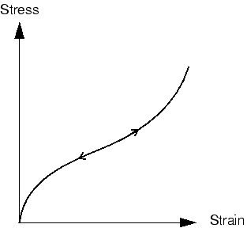

# 8.1 非线性的来源

结构力学模拟中有三个非线性来源：
- 材料非线性。
- 边界非线性。
- 几何非线性。

### 8.1.1 材料非线性

这种非线性可能是您最熟悉的，在第 10 章"材料"中有更深入的讨论。大多数金属在低应变值下具有相当线性的应力/应变关系；但在较高应变下，材料屈服，此时响应变得非线性和不可逆（参见[图 8-2](ch08s01.md#gss-elastplast)）。

**图 8-2** 弹性-塑性材料在单轴拉伸下的应力-应变曲线。

橡胶材料可以用非线性、可逆（弹性）响应来近似（参见[图 8-3](ch08s01.md#gss-rubbertype)）。

**图 8-3** 橡胶类材料的应力-应变曲线。

材料非线性可能与应变以外的因子相关。应变率相关材料数据和材料失效都是材料非线性的形式。材料特性也可以是温度和其他预定义场的函数。

### 8.1.2 边界非线性

如果边界条件在分析过程中发生变化，则发生边界非线性。考虑如图 8-4 所示的悬臂梁，它在施加的载荷下偏转直到碰到"挡块"。

**图 8-4** 碰到挡块的悬臂梁。

在接触挡块之前，尖端的垂直挠度与载荷呈线性关系（如果挠度很小）。然后，尖端边界条件突然发生变化，阻止任何进一步的垂直挠度，因此梁的响应不再是线性的。边界非线性是极度不连续的：当在模拟过程中发生接触时，结构的响应会发生很大且即时的变化。

边界非线性的另一个例子是将一片材料吹入模具中。片材在施加的压力下相对容易膨胀，直到开始接触模具。从那时起，必须增加压力以继续成型片材，因为边界条件发生了变化。

边界非线性在第 12 章"接触"中讨论。

### 8.1.3 几何非线性

第三个非线性来源与分析过程中结构几何形状的变化有关。当位移的大小影响结构的响应时，就会发生几何非线性。这可能是由以下原因引起的：
- 大挠度或大旋转。
- "跳跃通过"。
- 初始应力或载荷刚化。

例如，考虑在尖端承受垂直载荷的悬臂梁（参见[图 8-5](ch08s01.md#gss-deflection)）。

**图 8-5** 悬臂梁的大挠度。

如果尖端挠度很小，则可以将分析视为近似线性。然而，如果尖端挠度很大，结构的形状及其刚度会发生变化。此外，如果载荷不保持垂直于梁，则载荷对结构的作用会发生显著变化。随着悬臂梁偏转，载荷可以分解为垂直于梁的分量和沿梁长度方向作用的分量。这两种效应都有助于悬臂梁的非线性响应（即梁承载的载荷增加时其刚度的变化）。

人们期望大挠度和大旋转对结构承载载荷的方式产生显著影响。然而，位移不一定必须相对于结构的尺寸很大，几何非线性才重要。考虑如图 8-6 所示具有浅曲率的大型面板在施加压力下的"跳跃通过"。

**图 8-6** 大型浅面板的跳跃通过。

在此示例中，面板变形时刚度发生显著变化。当面板"跳跃通过"时，刚度变为负。因此，尽管相对于面板尺寸的位移幅度很小，但在模拟中存在显著的几何非线性，必须予以考虑。

这里应注意分析产品之间一个重要区别：默认情况下，Abaqus/Standard 假定小变形，而 Abaqus/Explicit 假定大变形。

