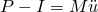
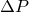
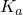
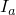
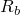
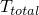
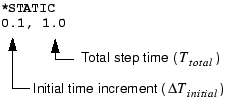
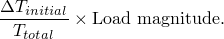

# 8.2 非线性问题的求解


结构的非线性载荷-位移曲线如图 8-7 所示。

**图 8-7** 非线性载荷-位移曲线。


分析的目的是确定此响应。考虑作用在物体上的外力 *P* 和内力（节点力）*I*（分别参见[图 8-8](ch08s02.md#gss-loads)(a) 和[图 8-8](ch08s02.md#gss-loads)(b)）。

**图 8-8** 物体上的内力和外力。


作用在节点上的内力是由包含该节点的单元中的应力引起的。

为了使物体处于静态平衡，作用在每个节点上的净力必须为零。因此，静态平衡的基本表述是：内力 *I* 和外力 *P* 必须相互平衡：


Abaqus/Standard 使用 Newton-Raphson 方法获得非线性问题的解。在非线性分析中，解通常不能通过求解单个方程组来计算（如线性问题中那样）。相反，解是通过逐渐施加指定载荷并逐步推向最终解来找到的。因此，Abaqus/Standard 将模拟分解为多个*载荷增量*，并找到每个载荷增量结束时的近似平衡构型。Abaqus/Standard 通常需要多次迭代才能确定给定载荷增量的可接受解。所有增量响应的总和是非线性分析的近似解。因此，Abaqus/Standard 结合增量法和迭代法来求解非线性问题。

Abaqus/Explicit 通过从上一增量结束时的运动状态显式推进来确定动态平衡方程  的解，无需迭代。求解显式问题不需要形成切线刚度矩阵。显式中心差分算子在增量开始时 *t* 满足动态平衡方程，在时间 *t* 计算的加速度用于将速度解推进到时间 ，并将位移解推进到时间 。对于线性和非线性问题，显式方法都需要一个小的时间增量大小，仅取决于模型的最高固有频率，与载荷的类型和持续时间无关。模拟通常需要大量增量；然而，由于在每个增量中不求解全局方程组，显式方法每个增量的成本比隐式方法小得多。显式动力学方法的小增量特征使 Abaqus/Explicit 非常适合非线性分析。

### 8.2.1 步、增量和迭代

本节介绍一些用于描述分析各个部分的新术语。重要的是，您清楚理解分析*步*、载荷*增量*和*迭代*之间的区别。
- 模拟的载荷历史由一个或多个步组成。您定义步，它们通常包括分析过程选项、载荷选项和输出请求选项。不同的载荷、边界条件、分析过程选项和输出请求可用于每个步。例如：
  - 步 1：将板夹在刚性夹爪之间。
  - 步 2：添加载荷使板变形。
  - 步 3：找到变形板的固有频率。
- 增量是步的一部分。在非线性分析中，步中施加的总载荷被分解成更小的增量，以便遵循非线性解路径。在 Abaqus/Standard 中，您建议第一个增量的大小，Abaqus/Standard 自动选择后续增量的大小。在 Abaqus/Explicit 中，默认时间推进是完全自动的，不需要用户干预。由于显式方法是有条件稳定的，因此存在稳定时间增量的限制。稳定时间增量在第 9 章"非线性显式动力学"中讨论。在每个增量结束时，结构处于（近似）平衡，并且可以将结果写入输出数据库、重启、数据或结果文件。您选择写入输出数据库文件的增量称为*帧*。Abaqus/Standard 和 Abaqus/Explicit 分析中与时间推进相关的问题差异很大，因为 Abaqus/Explicit 中的时间增量通常小得多。
- 迭代是在使用隐式方法求解增量时寻找平衡解的尝试。如果模型在迭代结束时不在平衡状态，Abaqus/Standard 会尝试另一次迭代。每次迭代，Abaqus/Standard 获得的解应该更接近平衡；有时 Abaqus/Standard 可能需要多次迭代才能获得平衡解。当获得平衡解时，增量完成。只能在增量结束时请求结果。Abaqus/Explicit 不需要迭代来获得增量中的解。

### 8.2.2 Abaqus/Standard 中的平衡迭代和收敛

结构对小幅载荷增量  的非线性响应如图 8-9 所示。Abaqus/Standard 使用结构的初始刚度 （基于其在  时的构型）和  来计算结构的*位移修正* 。使用 ，将结构的构型更新为 。

**图 8-9** 增量中的第一次迭代。


**收敛**

Abaqus/Standard 基于更新的构型  为结构形成新的刚度 。Abaqus/Standard 还在此更新构型中计算 。总施加载荷 *P* 与  之间的差异现在可以计算为：


其中  是迭代的*力残差*。

如果  在模型中每个自由度上都为零，则[图 8-9](ch08s02.md#gss-first-iteration) 中的点 *a* 将位于载荷-挠度曲线上，并且结构处于平衡状态。在非线性问题中，使  等于零几乎是不可能的，因此 Abaqus/Standard 将其与容差值进行比较。如果  小于此力残差容差，Abaqus/Standard 接受结构的更新构型作为平衡解。默认情况下，此容差值设置为结构中平均力的 0.5%，在整个模拟过程中对时间和空间进行平均。Abaqus/Standard 自动计算整个模拟过程中的此空间和时间平均力。

如果  小于当前容差值，*P* 和  处于平衡状态， 是结构在施加载荷下的有效平衡构型。但是，在 Abaqus/Standard 接受解之前，它还检查位移修正  相对于总增量位移  是否很小。如果  大于增量位移的 1%，Abaqus/Standard 将执行另一次迭代。在说该载荷增量的解已*收敛*之前，必须满足两个收敛检查。此规则的一个例外是*线性*增量的情况，线性增量定义为最大力残差小于时间平均力 10⁸ 倍的任何增量。任何通过如此严格的最大力残差与时间平均力比较的情况都被认为是线性的，不需要对位移修正大小进行进一步检查。接受解而不检查位移修正大小。

如果迭代的解未收敛，Abaqus/Standard 执行另一次迭代，尝试使内力和外力达到平衡。这第二次迭代使用在前一次迭代结束时计算的刚度  以及  来确定另一个位移修正 ，使系统更接近平衡（[图 8-10](ch08s02.md#gss-second-iteration) 中的点 *b*）。

**图 8-10** 第二次迭代。


Abaqus/Standard 使用结构新构型  中的内力计算新的力残差 。同样，任意自由度上的最大力残差  与力残差容差进行比较，第二次迭代的位移修正  与位移增量  进行比较。如果需要，Abaqus/Standard 执行进一步迭代。

对于非线性分析中的每次迭代，Abaqus/Standard 形成模型刚度矩阵并求解方程组。这意味着每次迭代在计算成本上相当于执行一次完整的线性分析。现在应该清楚，Abaqus/Standard 中非线性分析的计算费用可能是线性分析的多倍。

在 Abaqus/Standard 中，可以保存每个收敛增量的结果。因此，非线性模拟可用的输出数据量可能是相同几何形状线性分析可用输出数据的许多倍。在规划计算机资源时，请同时考虑这两个因素以及您想要执行的非线性模拟类型。

### 8.2.3 Abaqus/Standard 中的自动增量控制

Abaqus/Standard 自动调整载荷增量的大小，以便轻松高效地求解非线性问题。您只需要在模拟的每个步中建议第一个增量的大小。此后，Abaqus/Standard 自动调整增量的大小。如果您不提供建议的初始增量大小，Abaqus/Standard 将尝试在第一个增量中施加步中定义的所有载荷。在高度非线性问题中，Abaqus/Standard 将不得不反复减小增量大小，导致浪费 CPU 时间。一般来说，提供合理的初始增量大小对您有利（参见"修改输入文件——历史数据"第 8.4.1 节中的示例）；只有在非常轻微的非线性问题中，才能在单个增量中施加步中的所有载荷。

找到载荷增量收敛解所需的迭代次数将根据系统的非线性程度而变化。默认情况下，如果解似乎发散，Abaqus/Standard 会放弃该增量，并将增量大小设置为其先前值的 25% 开始重试。然后尝试使用这个较小的载荷增量找到收敛解。如果增量仍然无法收敛，Abaqus/Standard 再次减小增量大小。默认情况下，Abaqus/Standard 允许在增量中最多进行五次减小，然后停止分析。

在 Abaqus/Standard 中，您还可以添加 INC 参数来指定步中允许的最大增量数。如果需要比此限制更多的增量来完成步，Abaqus/Standard 将终止分析并显示错误消息。步的默认增量数为 100；如果模拟中存在显著非线性，分析可能需要更多增量。INC 参数指定 Abaqus/Standard 可以使用的增量上限，而不是必须使用的增量数。例如，涉及几何非线性的最大 150 个增量的步应指定为：

```
[*STEP](../key/key-link.md#usb-kws-hstep), NLGEOM=YES, INC=150
```

在非线性分析中，步发生在有限的"时间"内，尽管这个"时间"在没有惯性效应或率相关行为的情况下没有物理意义。在 Abaqus/Standard 中，您在步中使用的过程选项的数据行上指定初始时间增量  和总步时间 。例如，



定义了一个在 1.0 单位时间内发生的静态分析，初始增量为 0.1。初始时间增量与步时间的比率指定在第一个增量中施加载荷的比例。初始载荷增量由下式给出



初始时间增量的选择对于某些非线性模拟可能是关键的，但对于大多数分析，初始增量大小通常是总步时间的 5% 到 10% 就足够了。在静态模拟中，总步时间通常设置为 1.0 以方便，除非例如在模型中包含率相关材料效应或粘壶。在总步时间为 1.0 时，施加载荷的比例始终等于当前步时间；即当步时间为 0.5 时施加总载荷的 50%。

虽然在 Abaqus/Standard 中必须指定初始增量大小，但 Abaqus/Standard 自动控制后续增量的大小。这种自动增量大小控制适用于使用 Abaqus/Standard 执行的大多数非线性模拟，尽管可以使用对增量大小的进一步控制。如果由于收敛问题导致的过度减小将增量大小降低到最小值以下，Abaqus/Standard 将终止分析。默认允许的最小时间增量  为总步时间的 10⁻⁵ 倍。默认情况下，Abaqus/Standard 对增量大小  没有上限，但总步时间除外。根据您的 Abaqus/Standard 模拟，您可能需要指定不同的最小和/或最大允许增量大小。例如，如果您知道如果施加过大的载荷增量，模拟可能难以获得解，也许是因为模型可能发生塑性变形，您可能希望减小 。

如果增量在少于五次迭代中收敛，这表明解相当容易找到。因此，如果两个连续增量需要少于五次迭代来获得收敛解，Abaqus/Standard 会自动将增量大小增加 50%。

自动载荷增量控制方案的详细信息在消息文件中给出，如"结果"第 8.4.3 节中更详细地所示。


