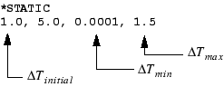

# 8.3 在 Abaqus 分析中包含非线性

现在我们讨论如何在 Abaqus 分析中考虑非线性。主要关注点是几何非线性。

### 8.3.1 几何非线性

在分析中包含几何非线性效应只需要对 Abaqus/Standard 模型进行少量更改。您需要确保步定义通过在 [*STEP](../key/key-link.md#usb-kws-hstep) 选项上将 NLGEOM 参数设置为 YES 来考虑几何非线性效应。这在 Abaqus/Explicit 中是默认设置。您还需要设置时间推进参数，如"自动增量控制"第 8.2.3 节中所讨论。

以下输入描述了在一个时间单位内施加载荷的静态分析，初始时间增量为 1 个时间单位；最小和最大时间增量分别设置为 0.0001 和 1.5：

Abaqus 将在第一个增量中施加总载荷的 20%（1.0/5.0），如果收敛困难并需要小于 0.0001 的增量，它将终止分析。如果由于解容易收敛而使时间增量增加，Abaqus 可以使用的最大时间增量为 1.5。

**局部方向**

在几何非线性分析中，局部材料方向可能随每个单元中的变形而旋转。对于壳、梁和桁架单元，局部材料方向始终随变形旋转。对于实体单元，局部材料方向仅在单元引用 [*ORIENTATION](../key/key-link.md#usb-kws-morientation) 选项时才随变形旋转；否则，默认局部材料方向在整个分析过程中保持不变。

通过使用 [*TRANSFORM](../key/key-link.md#usb-kws-mtransform) 选项在节点处定义的局部方向在整个分析过程中保持固定；它们不会随变形旋转。详见《Abaqus 分析用户指南》第 2.1.5 节"变换坐标系"。

**对后续步的影响**

一旦在步中包含几何非线性，它会在所有后续步中被考虑。如果在后续步中未请求非线性几何效应，Abaqus 将发出警告，说明它们仍被包含在该步中。

**其他几何非线性效应**

当激活几何非线性时，模型中的大变形并不是唯一被考虑的重要效应。Abaqus/Standard 还在单元刚度计算中包含由施加载荷引起的项，即所谓的载荷刚度。这些项改善收敛行为。此外，壳中的膜载荷和电缆及梁中的轴向载荷在响应横向载荷时贡献了这些结构的大部分刚度。通过包含几何非线性，也会考虑响应横向载荷时的膜刚度。

### 8.3.2 材料非线性**

在 Abaqus 模型中添加材料非线性在第 10 章"材料"中讨论。

### 8.3.3 边界非线性**

边界非线性的引入在第 12 章"接触"中讨论。

