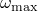
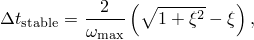
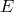

# 9.3 自动时间增量和稳定性

稳定性极限决定了 Abaqus/Explicit 求解器使用的最大时间增量。它是 Abaqus/Explicit 性能的关键因素。以下部分描述了稳定性极限，并讨论了 Abaqus/Explicit 如何确定此值。还讨论了影响稳定性极限的模型设计参数问题。这些模型参数包括模型质量、材料和网格。

### 9.3.1 显式方法的条件稳定性

对于显式方法，模型的状态通过一个时间增量，，从前一个增量开始时的模型状态，，推进。状态可以推进的时间量并保持作为问题的准确表示，通常相当短。如果时间增量大于这个最大时间量，则称该增量超过了*稳定性极限*。超过稳定性极限的一个可能影响是数值不稳定，可能导致无界解。通常不可能精确确定稳定性极限，因此使用保守估计。稳定性极限对可靠性和准确性有很大影响，因此必须一致且保守地确定。为了计算效率，Abaqus/Explicit 选择时间增量尽可能接近稳定性极限而不超过它。

### 9.3.2 稳定性极限的定义

稳定性极限用系统中最高频率（）来定义。无阻尼时，稳定性极限由以下表达式定义

有阻尼时，由以下表达式定义

其中是最高频率模式中临界阻尼的分数。（回想一下，临界阻尼定义了自由阻尼振动中振荡和非振荡运动之间的极限。Abaqus/Explicit 总是以体积粘度的形式引入少量阻尼来控制高频振荡。）可能与工程直觉相反，阻尼总是降低稳定性极限。

系统中实际的最高频率基于一组复杂的相互作用因素，计算其精确值是不可行的。相反，我们使用一个简单、高效且保守的估计。我们不是查看全局模型，而是估计模型中每个单独单元的最高频率，它总是与膨胀模式相关。可以证明，按单元确定的最高单元频率总是高于组装有限元模型中的最高频率。

基于按单元估计，稳定性极限可以用单元长度，，和材料的应力波速，重新定义：

对于大多数单元类型——例如，扭曲的四边形单元——上面的方程只是实际按单元稳定性极限的估计，因为不清楚如何确定单元长度。作为近似，可以使用最短单元距离，但结果估计并不总是保守的。单元长度越短，稳定性极限越小。应力波速是材料的属性。对于泊松比为零的线性弹性材料

其中是杨氏模量，是质量密度。材料越硬，应力波速越高，导致稳定性极限越小。密度越高，应力波速越低，导致稳定性极限越大。

我们简化的稳定性极限定义提供了一些直观的理解。稳定性极限是膨胀波穿过由特征单元长度定义的距离的传播时间。如果我们知道最小单元维度和材料的应力波速，我们可以估计稳定性极限。例如，如果最小单元维度是 5 mm，膨胀波速是 5000 m/s，稳定时间增量大约为 1 × 10⁻⁶ s。

### 9.3.3 Abaqus/Explicit 中的全自动时间增量与固定时间增量

Abaqus/Explicit 使用前面讨论的方程来调整整个分析中的时间增量大小，以便基于模型的当前状态永远不会超过稳定性极限。时间增量是自动的，不需要用户干预，甚至不需要建议的初始时间增量。稳定性极限是数值模型产生的数学概念。由于有限元程序具有所有相关细节，它可以确定有效且保守的稳定性极限。但是，如果需要，Abaqus/Explicit 确实允许用户覆盖自动时间增量。

显式分析中使用的时间增量必须小于中心差分算子的稳定性极限。如果不使用足够小的时间增量，将导致不稳定解。当解变得不稳定时，位移等解变量的时间历史响应通常会以增大的幅度振荡。总能量平衡也会显著改变。如果模型只包含一种材料类型，初始时间增量与网格中最小单元的大小成正比。如果网格包含均匀大小的单元但包含多种材料描述，则具有最高应力波速的单元将决定初始时间增量。

在非线性问题中——那些具有大变形和/或非线性材料响应的问题——模型的最高频率会不断变化，从而改变稳定性极限。Abaqus/Explicit 有两种时间增量控制策略：全自动时间增量（代码考虑稳定性极限的变化）和固定时间增量。

使用两种类型的估计来确定稳定性极限：按单元和全局估计。分析总是从使用按单元估计方法开始，并在某些情况下可能切换到全局估计方法。

按单元估计是保守的；它将给出比基于整个模型最大频率的真实稳定性极限更小的稳定时间增量。通常，边界条件和支持联系人等约束具有压缩特征值谱的效果，而按单元估计没有考虑这一点。

自适应全局估计算法使用当前膨胀波速确定整个模型的最大频率。该算法持续更新最大频率的估计。全局估计器通常允许超过按单元值的时间增量。

固定时间增量方案也可在 Abaqus/Explicit 中使用。固定时间增量大小由该步骤的初始按单元稳定性估计或用户直接指定的时间增量决定。当需要更准确地表示问题的高阶模态响应时，固定时间增量可能有用。在这种情况下，可以使用比按单元估计更小的时间增量。当使用固定时间增量时，Abaqus/Explicit 不会检查该步骤期间计算的响应是否稳定。用户应通过仔细检查能量历史和其他响应变量来确保获得有效响应。

### 9.3.4 质量缩放以控制时间增量

由于质量密度影响稳定性极限，在某些情况下，缩放质量密度可以提高分析效率。例如，由于许多模型的复杂离散化，通常存在包含非常小或形状不良单元的区域，这些单元控制着稳定性极限。这些控制单元通常数量很少，可能存在于局部区域。通过仅增加这些控制单元的质量，可以显著增加稳定性极限，而对模型整体动态行为的影响可以忽略不计。

Abaqus/Explicit 中的自动质量缩放功能可以防止有害单元阻碍稳定性极限。质量缩放有两种基本方法：直接定义缩放因子，或为要缩放质量的单元定义所需的按单元稳定时间增量。这两种方法在["质量缩放，" Abaqus Analysis User's Guide 第 11.6.1 节](../usb/usb-link.md#usb-anl-amassscaling)中有详细描述，允许用户对稳定性极限进行额外控制。但是，使用质量缩放时要小心，因为显著改变模型质量可能会改变问题的物理性质。

### 9.3.5 材料对稳定性极限的影响

材料模型通过其对膨胀波速的影响来影响稳定性极限。在线性材料中，波速是恒定的；因此，分析过程中稳定性极限的唯一变化来自分析过程中最小单元维度的变化。在非线性材料中，如具有塑性的金属，波速随材料屈服和刚度变化而变化。Abaqus/Explicit 在整个分析过程中监控模型中的有效波速，并使用每个单元的当前材料状态进行稳定性估计。屈服后，刚度降低，波速降低，从而增加稳定性极限。

### 9.3.6 网格对稳定性极限的影响

由于稳定性极限大致与最短单元维度成正比，因此保持单元尺寸尽可能大是有利的。不幸的是，为了准确分析，通常需要细网格。为了在使用所需网格细化的同时获得尽可能高的稳定性极限，最好的方法是使用尽可能均匀的网格。由于稳定性极限基于模型中最小单元维度，即使一个小的或形状不良的单元也会急剧降低稳定性极限。出于诊断目的，Abaqus/Explicit 在状态（`.sta`）文件中提供网格中稳定性极限最低的 10 个单元的列表。如果模型中某些单元的稳定性极限远低于网格其余部分的单元，重新网格化模型使其更均匀可能是值得的。

### 9.3.7 数值不稳定

Abaqus/Explicit 在大多数情况下和大多数单元中保持稳定。然而，可以定义弹簧和阻尼器单元，使它们在分析过程中变得不稳定。因此，有必要能够识别分析中发生的数值不稳定。如果确实发生，结果通常将是无界的、非物理的，并且通常以振荡解为特征。
