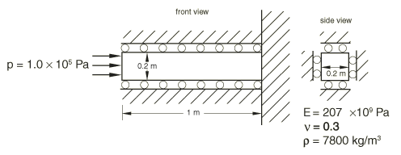
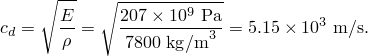
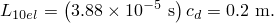
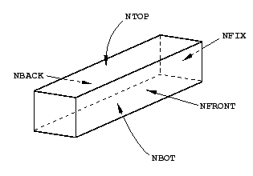
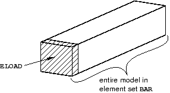
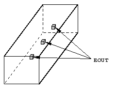
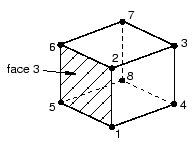
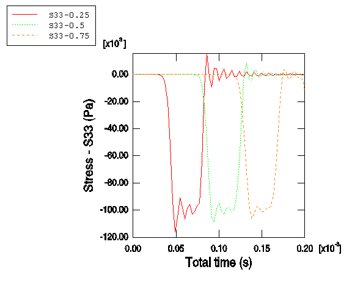
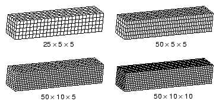
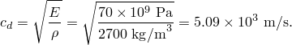

# 9.4 示例：杆中的应力波传播


本示例演示了前面在[第 2 章，"Abaqus 基础"](ch02.md)中描述的显式动力学的一些基本概念。它还说明了稳定性极限以及网格细化和材料特性对求解时间的影响。

杆的尺寸如图 [Figure 9--1](ch09s04.md#gxi-probdescwaveprp) 所示。

**图 9–1** 波在杆中传播的示意图。



为了使问题成为一维应变问题，所有四个侧面都在滚子上；因此，三维模型模拟了一维问题。材料是钢，特性如图 [Figure 9--1](ch09s04.md#gxi-probdescwaveprp) 所示。杆的自由端承受 1.0 × 10⁵ Pa 大小、持续时间为 3.88 × 10⁻⁵ s 的爆炸载荷。归一化载荷与时间的关系如图 [Figure 9--2](ch09s04.md#gxi-blast-amp-time-v) 所示。

**图 9–2** 爆炸幅度与时间的关系。


使用材料特性（忽略泊松比），我们可以使用前面介绍的方程计算材料的波速。



以这个速度，波在 1.94 × 10⁻⁴ s 内传到杆的固定端。由于我们对沿杆长度方向的应力传播随时间的变化感兴趣，我们需要一个足够细化的网格来准确捕获应力波。我们假设爆炸载荷将发生在 10 个单元的跨度上。为了确定这 10 个单元的长度，将爆炸持续时间乘以波速：



10 个单元的长度为 0.2 m。由于杆的总长度为 1.0 m，我们沿长度方向有 50 个单元。为了保持网格均匀，我们将在每个横向方向上也放置 10 个单元，使网格为 50 × 10 × 10。此网格如图 [Figure 9--3](ch09s04.md#gsx-mesh) 所示。

**图 9–3** 50 × 10 × 10 网格。


在您的预处理器中创建此网格。使用如图 [Figure 9--3](ch09s04.md#gsx-mesh) 所示的坐标系。

### 9.4.1 节点集和单元集

本示例定义了节点集和单元集，用于施加载荷和边界条件以及可视化输出。节点集定义在各自的面上，如图 [Figure 9--4](ch09s04.md#gsx-node-sets) 所示。

**图 9–4** 节点集。



单元集定义如图 [Figure 9--5](ch09s04.md#gsx-elemsetsmodel) 所示。

**图 9–5** 建模用的单元集。



此外，本示例定义了一个包含杆中心三个单元的单元集。您可以通过选择这些单元来手动定义此单元集，使它们最接近自由端的面的距离分别为 0.25 m、0.5 m 和 0.75 m（从自由端开始），如图 [Figure 9--6](ch09s04.md#gsx-elemsetspost) 所示。这些单元将用于后处理。

**图 9–6** 后处理用的单元集。



### 9.4.2 检查输入文件——模型数据

在本节中，您将检查输入文件并包含额外信息。

**模型描述**

对于此模拟，以下是 [*HEADING*](../key/key-link.md#usb-kws-mheading) 选项中的合适描述：

```
*HEADING
Stress wave propagation in a bar -- 50x10x10 elements
SI units (kg, m, s, N)
```

**单元连接性**

如果您使用预处理器创建输入文件，请检查以确保使用了正确的单元类型（C3D8R）。预处理器可能错误地指定了单元类型。此模型中的 [*ELEMENT*](../key/key-link.md#usb-kws-melement) 选项块从以下内容开始：

```
*ELEMENT, TYPE=C3D8R, ELSET=BAR
```

如果您使用预处理器创建了此输入文件，您的模型中 ELSET 参数的名称可能不是 `BAR`。如有必要，将名称更改为 `BAR`。

**截面特性**

所有单元的截面特性相同。在以下选项语句中，单元集 `BAR` 用于为单元分配材料特性。

```
*SOLID SECTION, ELSET=BAR, MATERIAL=STEEL
```

**材料特性**

杆由钢制成，我们假设其为线性弹性，杨氏模量为 207 × 10⁹ Pa，泊松比为 0.3，密度为 7800 kg/m³。以下材料选项块指定了这些值：

```
*MATERIAL, NAME=STEEL
*ELASTIC
207.0E9, 0.3
*DENSITY
7800.0,
```

**固定边界条件**

在此模型中，我们固定杆内置端右侧所有方向的平移，然后约束杆的前、后、顶和底面，使这些面在滚子上，应变为单轴。使用之前定义的节点集，此模型使用以下边界条件：

```
*BOUNDARY
NFIX, 1, 3
NFRONT, 1, 1
NBACK, 1, 1
NTOP, 2, 2
NBOT, 2, 2
```

**幅值定义**

爆炸载荷以最大值瞬间施加，并在 3.88 × 10⁻⁵ s 内保持恒定。然后载荷突然移除并在零处保持恒定。[*AMPLITUDE*](../key/key-link.md#usb-kws-mamplitude) 选项用于定义载荷和边界条件的时间变化。在 [*AMPLITUDE*](../key/key-link.md#usb-kws-mamplitude) 选项后面的数据行上，以以下形式给出数据对：

```
*<time>, <amplitude>, <time>, <amplitude>, etc*.
```
每条数据行最多可输入四对数据。Abaqus 认为幅值在最后给出的幅值之后保持恒定。以下 [*AMPLITUDE*](../key/key-link.md#usb-kws-mamplitude) 选项块定义了爆炸载荷的幅值：
```
*AMPLITUDE, NAME=BLAST
0., 1., 3.88E-5, 1., 3.89E-5, 0, 3.90E-5, 0.
```

### 9.4.3 检查输入文件——历史数据

我们现在将检查与此问题相关的历史数据，包括步骤定义、加载、体积粘度和输出请求。

**步骤定义**

步骤定义表明这是持续时间为 2.0 × 10⁻⁴ s 的显式动力学分析。您还可以为步骤包含描述性标题。

```
*STEP
Blast loading
*DYNAMIC, EXPLICIT
, 2.0E-4
```

**加载**

将值为 1.0 × 10⁵ Pa 的压力载荷施加到杆的自由面，您之前将其定义为名为 `ELOAD` 的单元集中。任意给定时间的压力载荷是 [*DLOAD*](../key/key-link.md#usb-kws-hdload) 选项下指定的值乘以从幅值曲线插值的值。为了正确施加载荷，您需要确定自由单元面的面标识符。对于 ["应力波在杆中的传播，" 第 A.7 节](ap01s07.md) 中定义的模型，自由面是 3 号面，对应于压力标识符 P3。面标识符取决于 [*ELEMENT*](../key/key-link.md#usb-kws-melement) 选项上定义节点的顺序，如图 [Figure 9--7](ch09s04.md#gsx-c3d8r-label-ident) 所示。施加压力载荷时使用名为 `BLAST` 的幅值。

```
*DLOAD, AMPLITUDE=BLAST
ELOAD, *<P1, P2, P3, P4, P5, or P6>*, 1.0E5
```

如果您在预处理器中定义压力载荷，正确的面标识符应该自动确定。

**图 9–7** C3D8R 单元的面标签标识符。



**体积粘度**

为了使应力波尽可能尖锐，二次体积粘度（参见 ["体积粘度，" 第 9.5.1 节](ch09s05.md#gsk-gen-ovw-bulkvisc)）设置为零。

```
*BULK VISCOSITY
0.06, 0.0
```

**输出请求**

默认情况下，许多预处理器会创建具有大量输出请求选项的 Abaqus 输入文件。如果您使用预处理器创建了输入文件并发现创建了这些默认输出选项，请删除它们，因为它们通常会产生过多输出。

您希望分析期间创建输出数据库文件，以便可以使用 Abaqus/Viewer 对结果进行后处理。四个输出数据库帧（向输出数据库写入数据的间隔）足以显示应力波通过网格传播。本示例在 [*OUTPUT*](../key/key-link.md#usb-kws-houtput)，FIELD 选项上设置参数 VARIABLE=PRESELECT，以将 [*DYNAMIC*](../key/k](key-link.md#usb-kws-hdynamic)，EXPLICIT 程序的默认场数据写入输出数据库文件。此外，为单元集 `EOUT` 中的每个增量请求应力（S）历史输出。

```
*OUTPUT, FIELD, VARIABLE=PRESELECT, NUMBER INTERVAL=4
*OUTPUT, HISTORY, FREQUENCY=1
*ELEMENT OUTPUT, ELSET=EOUT 
S,
*END STEP
```

### 9.4.4 运行分析

将输入存储在名为 `wave_50x10x10.inp` 的文件中后，使用以下命令运行分析：

```
abaqus job=wave_50x10x10
```
如果您的分析未完成，请检查数据文件 `wave_50x10x10.dat` 和状态文件 `wave_50x10x10.sta` 中的错误消息。修改输入文件以消除错误。如果您仍然在运行分析时遇到困难，请将您的输入文件与 ["应力波在杆中的传播，" 第 A.7 节](ap01s07.md) 中给出的进行比较。

**状态文件**

状态文件 `wave_50x10x10.sta` 包含转动惯量信息，然后是关于初始稳定性极限的信息。以等级顺序列出了 10 个稳定性时间极限最低的单元。

```
   Most critical elements:
    Element number   Rank    Time increment   Increment ratio
   ----------------------------------------------------------
           1          1        2.237266E-06      1.000000E+00
          19          2        2.237266E-06      1.000000E+00
         201          3        2.237266E-06      1.000000E+00
         219          4        2.237266E-06      1.000000E+00
         301          5        2.237266E-06      1.000000E+00
         319          6        2.237266E-06      1.000000E+00
         501          7        2.237266E-06      1.000000E+00
         519          8        2.237266E-06      1.000000E+00
         601          9        2.237266E-06      1.000000E+00
         619         10        2.237266E-06      1.000000E+00

```

状态文件继续包含有关求解进度信息。

```
 STEP 1  ORIGIN 0.0000

  Total memory used for step 1 is approximately 7.1 megabytes.
  Global time estimation algorithm will be used.
  Scaling factor:  1.0000
  Variable mass scaling factor at zero increment:  1.0000

              STEP     TOTAL       CPU      STABLE    CRITICAL    KINETIC      TOTAL
INCREMENT     TIME      TIME      TIME   INCREMENT     ELEMENT     ENERGY     ENERGY
        0  0.000E+00 0.000E+00  00:00:00 1.819E-06           1  0.000E+00  0.000E+00
Results number 0 at increment zero.
ODB Field Frame Number      0 of      4 requested intervals at increment zero.
ODB Field Frame Number      0 of      2 requested intervals at increment zero.
        5  1.119E-05 1.119E-05  00:00:00 2.237E-06         619  4.504E-05 -1.963E-06
       10  2.237E-05 2.237E-05  00:00:00 2.237E-06       20015  9.189E-05 -2.218E-06
       15  3.401E-05 3.401E-05  00:00:00 2.907E-06       20311  1.406E-04 -2.252E-06
       19  4.560E-05 4.560E-05  00:00:00 2.888E-06       20311  1.577E-04  1.009E-06
       21  5.137E-05 5.137E-05  00:00:00 2.882E-06       20911  1.556E-04  2.239E-06
ODB Field Frame Number      1 of      4 requested intervals at  5.137395E-05
       25  6.289E-05 6.289E-05  00:00:00 2.873E-06       20803  1.539E-04  1.713E-07.
.
.
```

### 9.4.5 后处理

通过在操作系统提示符下输入以下命令启动 Abaqus/Viewer：

```
abaqus viewer odb=wave_50x10x10
```

**绘制沿路径的应力**

我们有兴趣观察应力分布沿杆长度方向随时间的变化方式。为此，我们将查看分析过程中三个不同时间的应力分布。

为输出数据库文件的前三个帧中的每一个创建沿杆轴线的 3 方向（S33）应力变化曲线。要创建这些图，您首先需要沿杆轴线定义一条直线路径。

**创建沿杆中心的点列表路径：**

1. 在结果树中，双击 **Paths**。出现 **Create Path** 对话框。
2. 将路径命名为 `Center`。选择 **Point list** 作为路径类型，然后点击 **Continue**。出现 **Edit Point List Path** 对话框。
3. 在 **Point Coordinates** 表中，输入杆两端中心的坐标。输入指定从第一点到第二点的路径，如模型的全局坐标系中所定义。**注意：**如果您使用之前描述的过程生成了几何和网格，表条目为 `0, 0, 1` 和 `0, 0, 0`。如果您使用替代程序生成杆几何，可以使用 **Query** 工具栏中的  工具来确定杆每端中心的坐标。
4. 完成后，点击 **OK** 关闭 **Edit Point List Path** 对话框。

**保存三个不同时间沿路径的应力 X-Y 图：**

1. 在结果树中，双击 **XYData**。出现 **Create XY Data** 对话框。
2. 选择 **Path** 作为 *X–Y* 数据源，然后点击 **Continue**。出现 **XY Data from Path** 对话框，您创建的路径在可用路径列表中可见。如果当前显示的是未变形模型形状，您选择的路径会在图中高亮显示。
3. 在 **Point Locations** 下切换 **Include intersections**。
4. 在对话框 **X Values** 区域接受 **True distance** 作为选择。
5. 在对话框 **Y Values** 区域点击 **Field Output** 打开 **Field Output** 对话框。
6. 选择 S33 应力分量，然后点击 **OK**。**XY Data from Path** 对话框中的场输出变量会发生变化，指示将创建 3 方向（S33）的应力数据。**注意：**Abaqus/Viewer 可能会警告您场输出变量不会影响当前图像。将绘图状态保持为 **As is**，然后点击 **OK** 继续。
7. 在 **XY Data from Path** 对话框 **Y Values** 区域点击 **Step/Frame**。
8. 在出现的 **Step/Frame** 对话框中，选择帧 1，这是五个记录帧中的第二个。（列出的第一帧，帧 0，是步骤开始时模型的基态。）点击 **OK**。**XY Data from Path** 对话框的 **Y Values** 区域发生变化，指示将创建步骤 1、帧 1 的数据。
9. 要保存 *X–Y* 数据，点击 **Save As**。出现 **Save XY Data As** 对话框。
10. 将 *X–Y* 数据命名为 `S33_T1`，然后点击 **OK**。`S33_T1` 出现在结果树的 **XYData** 容器中。
11. 重复步骤 7 到 9 为帧 2 和 3 创建 *X–Y* 数据。分别将数据集命名为 `S33_T2` 和 `S33_T3`。
12. 要关闭 **XY Data from Path** 对话框，点击 **Cancel**。

**绘制应力曲线：**

1. 在 **XYData** 容器中，拖动光标选择所有三个 *X–Y* 数据集。
2. 点击鼠标按钮 3，并从出现的菜单中选择 **Plot**。Abaqus/Viewer 绘制了帧 1、2 和 3 沿杆中心的 3 方向应力，分别对应于约 5 × 10⁻⁵ s、1 × 10⁻⁴ s 和 1.5 × 10⁻⁴ s 的近似模拟时间。
3. 点击提示区域的  取消当前过程。

**自定义 X–Y 图：**

1. 双击 *Y* 轴。出现 **Axis Options** 对话框。**Y Axis** 被选中。
2. 在 **Scale** 选项卡页面的 **Tick Mode** 区域，选择 **By increment** 并指定 *Y* 轴主刻度为 `20E3` Pa 增量。您还可以自定义轴标题。
3. 切换到 **Title** 选项卡页面。
4. 输入 `Stress - S33 (Pa)` 作为 *Y* 轴标题。
5. 要编辑 *X* 轴，在对话框的 **X Axis** 字段中选择轴标签。在对话框的 **Title** 选项卡页面，输入 `Distance along bar (m)` 作为 *X* 轴标题。
6. 点击 **Dismiss** 关闭 **Axis Options** 对话框。

**自定义 X–Y 图中曲线的外观：**

1. 在可视化工具箱中，点击  打开 **Curve Options** 对话框。
2. 在 **Curves** 字段中，选择 `S33_T2`。
3. 为 `S33_T2` 曲线选择点划线样式。`S33_T2` 曲线变为点划线。
4. 重复步骤 2 和 3 使 `S33_T3` 曲线为虚线。
5. 关闭 **Curve Options** 对话框。自定义图表如图 [Figure 9--8](ch09s04.md#gxi-stressbar-v) 所示。（为清晰起见，已更改默认网格和图例位置。）**图 9–8** 三个不同时间实例沿杆的应力（S33）。

我们可以看到，在三个曲线中，应力波影响的杆长度约为 0.2 m。这个距离应该对应于爆炸波在其施加期间传播的距离，这可以通过简单计算来验证。如果波前长度为 0.2 m，波速为 5.15 × 10³ m/s，波传播 0.2 m 所需时间为 3.88 × 10⁻⁵ s。正如所料，这就是我们施加的爆炸载荷的持续时间。应力波在沿杆传播时并不完全是方形的。特别是，在应力突然变化后面有"振铃"或振荡。本章后面讨论的线性体积粘度会阻尼振铃，使其不会对结果产生不利影响。

**创建历史图**

研究结果的另一种方法是查看杆内三个不同点处应力随时间的历史。

**绘制应力历史：**

1. 在结果树中，点击 **History Output** 的鼠标按钮 3，并从出现的菜单中取消选择 **Group Children**。
2. 选择三个单元的数据。使用 **[Ctrl]** **+Click** 选择多个 *X–Y* 数据集。
3. 点击鼠标按钮 3，并从出现的菜单中选择 **Plot**。Abaqus/Viewer 显示每个单元中沿杆方向应力与时间的关系图。
4. 点击提示区域的  取消当前过程。

和之前一样，您可以自定义图表的外观。

**自定义 X–Y 图：**

1. 双击 *X* 轴。出现 **Axis Options** 对话框。
2. 切换到 **Title** 选项卡页面。
3. 指定 `Total time (s)` 作为 *X* 轴标题。
4. 点击 **Dismiss** 关闭对话框。

**自定义 X–Y 图中曲线的外观：**

1. 在可视化工具箱中，点击  打开 **Curve Options** 对话框。
2. 在 **Curves** 字段中，选择对应于最接近杆自由端的单元的临时 *X–Y* 数据标签。（在此集合中，这个单元首先受到应力波的影响。）
3. 输入 `S33-0.25` 作为曲线图例文本。
4. 在 **Curves** 字段中，选择对应于杆中间单元的临时 *X–Y* 数据标签。（这是下一个受应力波影响的单元。）
5. 指定 `S33-0.5` 作为曲线图例文本，并将曲线样式更改为点划线。
6. 在 **Curves** 字段中，选择对应于最接近杆固定端的单元的临时 *X–Y* 数据标签。（这是最后一个受应力波影响的单元。）
7. 指定 `S33-0.75` 作为曲线图例文本，并将曲线样式更改为虚线。
8. 点击 **Dismiss** 关闭对话框。自定义图表如图 [Figure 9--9](ch09s04.md#gxi-stressbartimehis-v) 所示。（为清晰起见，已更改默认网格和图例位置。）**图 9–9** 沿杆长度三个点（0.25 m、0.5 m 和 0.75 m）处应力（S33）随时间的历史。

在历史图中，我们可以看到给定点的应力随着应力波通过该点而增加。一旦应力波完全通过该点，该点的应力就会在零附近振荡。

### 9.4.6 网格如何影响稳定时间增量和 CPU 时间

在 ["自动时间增量和稳定性，" 第 9.3 节](ch09s03.md) 中，我们讨论了网格细化如何影响稳定性极限和 CPU 时间。这里我们将用波传播问题说明这种效果。我们从一个相当精细的网格开始，沿长度方向有 50 个单元，两个横向方向各 10 个单元。为了说明目的，我们现在使用 25 × 5 × 5 单元的粗网格，并观察沿各个方向细化网格如何改变 CPU 时间。四个网格如图 [Figure 9--10](ch09s04.md#gxi-meshrefine) 所示。

**图 9–10** 从最粗到最细的网格。



[表 9–1](ch09s04.md#gxi-table1) 显示了 CPU 时间（相对于粗网格模型结果归一化）如何随此问题的网格细化而变化。表的第一半提供了基于本指南中给出的简化稳定性方程的预期结果；第二半提供了在桌面工作站上使用 Abaqus/Explicit 运行分析获得的结果。

**表 9–1** 网格细化和求解时间。
| 网格 | 简化理论 | 实际 |
| --- | --- | --- |
|  (s) | 单元数 | CPU 时间 (s) | 最大  (s) | 单元数 | 归一化 CPU 时间 |
| 25 × 5 × 5 | A | B | C | 5.754E-06 | 625 | 1 |
| 50 × 5 × 5 | A/2 | 2B | 4C | 2.954E-06 | 1250 | 4 |
| 50 × 10 × 5 | A/2 | 4B | 8C | 2.933E-06 | 2500 | 8.33 |
| 50 × 10 × 10 | A/2 | 8B | 16C | 2.907E-06 | 5000 | 16.67 |

对于理论结果，我们选择最粗的网格 25 × 5 × 5 作为基态，并将稳定时间增量、单元数和 CPU 时间定义为变量 A、B 和 C。随着网格细化，两件事发生：最小单元维度减小，网格中的单元数增加。每个效果都会增加 CPU 时间。在第一层细化中，50 × 5 × 5 网格，最小单元维度减半，单元数加倍，使 CPU 时间比前一个网格增加四倍。然而，进一步将网格加倍到 50 × 10 × 5 不会改变最小单元维度；它只会使单元数加倍。因此，CPU 时间仅比 50 × 5 × 5 网格增加一倍。进一步细化网格使单元在 50 × 10 × 10 网格中均匀且为方形，再次使单元数和 CPU 时间加倍。

这个简化的计算很好地预测了网格细化如何影响稳定时间增量和 CPU 时间的趋势。但是，我们没有比较预测和实际稳定时间增量值的原因有几个。首先，回想一下我们近似地认为稳定时间增量为


然后我们假设特征单元长度，，是最小单元维度，而 Abaqus/Explicit 实际上根据单元的整体大小和形状来确定特征单元长度。另一个复杂因素是 Abaqus/Explicit 使用全局稳定性估计器，允许使用更大的稳定时间增量。这些因素使得在运行分析之前难以准确预测稳定时间增量。然而，由于趋势很好地遵循简化理论，预测稳定时间增量如何随网格细化而变化是直接的。

### 9.4.7 材料如何影响稳定时间增量和 CPU 时间

对不同材料执行相同的波传播分析需要不同的 CPU 时间，具体取决于材料的波速。例如，如果我们将材料从钢改为铝，波速将从 5.15 × 10³ m/s 变为



从铝到钢的变化对稳定时间增量影响很小，因为刚度和密度差异大致相同。对于铅，差异更为显著，因为波速降低到


约为钢波速的五分之一。铅杆的稳定时间增量将是钢杆稳定时间增量的五倍。
