# 9.6 能量平衡

能量输出通常是 Abaqus/Explicit 分析的重要组成部分。各种能量分量之间的比较可用于帮助评估分析是否产生适当的响应。

### 9.6.1 能量平衡陈述

整个模型的能量平衡可以写成

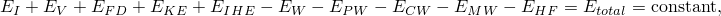

其中 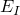 是内能， 是粘性能量耗散， 是摩擦能量耗散， 是动能， 是内部热能， 是外部施加载荷所做的功，、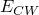 和  分别是接触惩罚、约束惩罚和推动附加质量所做的功。 是通过外部通量的外部热能。这些能量分量的总和是 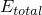，它应该是恒定的。在数值模型中  仅近似恒定，通常误差小于 1%。

**内能**

内能是可恢复的弹性应变能，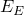；通过非弹性过程（如塑性）耗散的能量，；通过粘弹性或蠕变耗散的能量，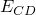；人工应变能，；通过损伤耗散的能量，；通过畸变控制耗散的能量，；和流体腔能量，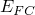：

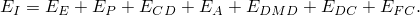

人工应变能包括储存在壳和梁单元中沙漏阻力和横向剪切中的能量。人工应变能的大值表明需要网格细化或对网格进行其他更改。

**粘性能量**

粘性能量是通过阻尼机制耗散的能量，包括体积粘度阻尼和材料阻尼。作为全局能量平衡的基本变量，粘性能量不是通过粘弹性或非弹性过程耗散的能量的一部分。

**施加力的外部功**

外部功连续向前积分，完全由节点力（力矩）和位移（旋转）定义。规定的边界条件也对外功有贡献。

### 9.6.2 能量平衡的输出

每个能量值都可以被请求作为输出，可以绘制为整个模型、特定单元集、单个单元或每个单元内能量密度的随时间变化的历史。对于整个模型或单元集求和的能量分量，相关变量名称如表 [Table 9--2](ch09s06.md#gxi-table2) 所列。

**表 9–2** 整体模型能量输出变量。
| 变量名称 | 能量值 |
| --- | --- |
| ALLIE | 内能，：ALLIE = ALLSE + ALLPD + ALLCD + ALLAE + ALLDMD + ALLDC + ALLFC。 |
| ALLKE | 动能，。 |
| ALLVD | 粘性耗散能量，。 |
| ALLFD | 摩擦耗散能量，。 |
| ALLCD | 通过粘弹性耗散的能量，。 |
| ALLWK | 外部力的功，。 |
| ALLPW | 接触惩罚所做的功，。 |
| ALLCW | 约束惩罚所做的功，。 |
| ALLMW | 推动附加质量（由于质量缩放）所做的功，。 |
| ALLSE | 弹性应变能，。 |
| ALLPD | 非弹性耗散能量，。 |
| ALLAE | 人工应变能，。 |
| ALLIHE | 内部热能，。 |
| ALLHF | 通过外部通量的外部热能，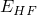。 |
| ALLDMD | 通过损伤在单元中耗散的能量，。 |
| ALLDC | 通过畸变控制在单元中耗散的能量，。 |
| ALLFC | 流体腔能量（流体腔所做功的负值），。 |
| ETOTAL | 能量平衡：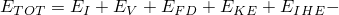 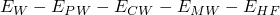。 |

此外，Abaqus/Explicit 可以产生单元级能量输出和能量密度输出，如表 [Table 9--3](ch09s06.md#gxi-xpl-table3) 所列。

**表 9–3** 单元能量输出变量。
| 变量名称 | 单元能量值 |
| --- | --- |
| ELSE | 弹性应变能。 |
| ELPD | 塑性耗散能量。 |
| ELCD | 蠕变耗散能量。 |
| ELVD | 粘性耗散能量。 |
| ELASE | 人工能量 = 钻孔能量 + 沙漏能量。 |
| EKEDEN | 单元中的动能密度。 |
| ESEDEN | 单元中的弹性应变能密度。 |
| EPDDEN | 单元中耗散的塑性能量密度。 |
| EASEDEN | 单元中的人工应变能密度。 |
| ECDDEN | 单元中耗散的蠕变应变能密度。 |
| EVDDEN | 单元中耗散的粘性能量密度。 |
| ELDMD | 单元中通过损伤耗散的能量。 |
