# 10.5 示例：加筋板上的爆炸载荷


前面的示例说明了在使用隐式方法求解涉及非线性材料响应的问题时可能遇到的收敛困难。我们现在将关注使用显式动力学求解塑性问题的技巧。正如将很快看到的，在这种情况下收敛困难不是问题，因为显式方法不需要迭代。

在此示例中，您将评估加筋方形板在 Abaqus/Explicit 中承受爆炸载荷的响应。板四面固定，有三个等间距的加筋与其焊接。板由 25 mm 厚的钢制成，尺寸为 2 m × 2 m。加筋由 12.5 mm 厚的板制成，深度为 100 mm。[图 10--18](ch10s05.md#gxi-blast-load) 显示了板的几何形状和材料特性更详细的信息。由于板厚度显著小于任何其他整体尺寸，壳单元可用于对板进行建模。

**图 10–18** 加筋板上的爆炸载荷问题描述。


本示例的目的是确定板的响应，并观察随着材料模型复杂程度的增加，响应如何变化。最初，我们使用标准弹塑性材料模型分析行为。随后，我们研究包括材料阻尼和率相关材料特性的影响。

### 10.5.1 坐标系

此模型使用默认矩形坐标系，板位于 1–3 平面中。由于板厚度显著小于任何其他整体尺寸，我们可以使用 S4R 型壳单元进行建模。

### 10.5.2 网格设计

此模型中的网格基于[图 10--19](ch10s05.md#gsx-stiff-plate-mesh) 中所示的设计，它是板中 20 × 20 个单元和每个加筋中 2 × 20 个单元的相对粗网格。此网格对应于 ["加筋板上的爆炸载荷，" 第 A.9 节](ap01s09.md) 中所示的输入文件。它在保持求解时间最少的同时提供了适度的准确性。定义网格，使板的单元法线都指向正 2 方向。这样做可确保加筋位于板的 SPOS 面上，这在定义单元特性和壳偏移时很重要。

**图 10–19** 加筋板网格设计。

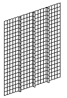

### 10.5.3 节点和单元集

以下步骤假设您可以访问此示例的完整输入文件。此输入文件 `blast_base.inp` 在 ["示例：加筋板上的爆炸载荷，" 第 10.5 节](ch10s05.md) 中提供。获取和运行脚本的说明在 [附录 A，"示例文件"](ap01.md) 中给出。

如果您希望使用 Abaqus/CAE 创建整个模型，请参阅 ["示例：加筋板上的爆炸载荷，" Getting Started with Abaqus: Interactive Edition 第 10.5 节](../gsa/gsa-link.md#gsa-mat-exablastload)。

[图 10--20](ch10s05.md#gsx-node-elemsets) 显示了施加单元特性、载荷和边界条件所需的所有集合。

**图 10–20** 节点和单元集。

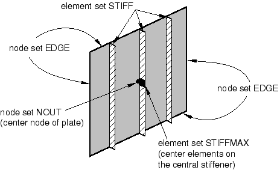

此模型包括板上周边所有节点的名为 `EDGE` 的节点集。这些节点将具有完全固定的边界条件。对于输出目的，创建了名为 `NOUT` 的节点集，其中包含板中心的节点。板单元包含在名为 `PLATE` 的单元集中，加筋单元在名为 `STIFF` 的单元集中。此外，中心加筋上的四个中心单元包含在名为 `STIFFMAX` 的单元集中；此单元集用于输出。这些中心单元将承受加筋中最大的弯曲应力。

### 10.5.4 检查输入文件——模型数据

我们现在检查此问题的模型数据，包括模型描述、节点和单元定义、单元特性和壳偏移、材料特性、边界条件和爆炸载荷的幅值定义。

**模型描述**

[*HEADING*](../key/key-link.md#usb-kws-mheading) 选项用于在输入文件中包含标题和模型描述。标题可用于将来参考，可能包含有关模型修订和复杂模型演化的信息。它可以是多行的，但只有第一行将作为输出页面上的标题打印。以下是用于此分析的 [*HEADING*](../key/key-link.md#usb-kws-mheading) 定义。

```
*HEADING
Blast load on a flat plate with stiffeners
S4R elements (20x20 mesh)
Normal stiffeners (20x2)
SI units (kg, m, s, N)
```

**节点坐标和单元连接性**

网格如图 [Figure 10--19](ch10s05.md#gsx-stiff-plate-mesh) 所示，集合如图 [Figure 10--20](ch10s05.md#gsx-node-elemsets) 所示。

**单元特性和壳偏移**

模型中每个单元集的截面特性如下。为了确保每个单元集引用材料定义，在每个 [*SHELL SECTION*](../key/key-link.md#usb-kws-mshellsection) 选项上包含了适当的 MATERIAL 参数：

```
*SHELL SECTION, MATERIAL=STEEL, ELSET=PLATE, OFFSET=SPOS
0.025,
*SHELL SECTION, MATERIAL=STEEL, ELSET=STIFF
0.0125,
```

名为 `STEEL` 的材料将在下一节中定义。将 OFFSET 设置为 SPOS 将板的中间表面从节点偏移半个壳厚度。这样做是为了使 `PLATE` 节点位于 SPOS 壳面上，而不是壳中间表面上。在这种情况下使用壳偏移的目的是允许加筋与板对接而不与板的任何材料重叠。[图 10--21](ch10s05.md#gsx-midsurf-joint) 显示了使用 OFFSET 参数时加筋和面板之间关节的横截面。

**图 10–21** 板的中间表面从其节点偏移的加筋关节。

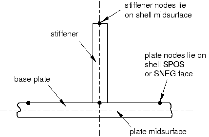

如果加筋和底板单元在它们的中间表面的公共节点处连接，材料会重叠，如图 [Figure 10--22](ch10s05.md#gsx-overlap-mat) 所示。

**图 10–22** 如果不使用 OFFSET 时的材料重叠。

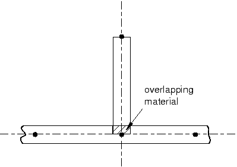

如果板和加筋的厚度与结构整体尺寸相比较小，则此重叠材料和它将创建的额外刚度对分析结果影响很小。但是，如果加筋的宽度相对于底板的宽度或厚度较小，则重叠材料的额外刚度可能影响整个结构的响应。

**材料特性**

假设板和加筋都由钢制成（杨氏模量为 210.0 GPa，泊松比为 0.3）。在此阶段我们不知道是否会有任何塑性变形，但我们知道此钢的屈服应力和后屈服行为细节。我们将在材料定义中的 [*PLASTIC*](../key/key-link.md#usb-kws-mplastic) 选项上添加这些信息。初始屈服应力为 300 MPa，屈服应力在塑性应变 35% 时增加到 400 MPa。塑性数据如下，塑性应力-应变曲线如图 [Figure 10--23](ch10s05.md#gsx-yield) 所示。

```
*MATERIAL, NAME=STEEL
*ELASTIC
210.0E9, .3
*PLASTIC
300.0E6, 0.000
350.0E6, 0.025
375.0E6, 0.100
394.0E6, 0.200
400.0E6, 0.350
*DENSITY
7800.0,
```

**图 10–23** 屈服应力与塑性应变的关系。


在分析过程中，Abaqus 根据塑性应变的当前值计算屈服应力值。如前所述，当应力-应变数据处于等间距的塑性应变值时，查找和插值过程最有效。为了避免用户输入规则数据，Abaqus/Explicit 会自动规则化数据。在这种情况下，数据由 Abaqus/Explicit 通过扩展到 15 个等间距点来规则化，增量为 0.025。

为了说明当 Abaqus/Explicit 无法规则化材料数据时产生的错误消息，请将规则化容差 RTOL 设置为 0.001 并包含一对额外的数据点，如下所示：

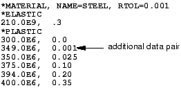

低容差值（RTOL=0.001）和用户定义数据中的小间隔的组合导致规则化此材料定义困难。在状态（`.sta`）文件中产生以下错误消息：
```
 ***ERROR: Failed to regularize material data. Please check
 your input data to see if they meet both criteria as 
 explained in the "MATERIAL DATA DEFINITION" section of the
Abaqus Analysis User's Guide. In general, regularization is
 more difficult if the smallest interval defined by the user
 is small compared to the range of the independent variable.
```
继续之前，将规则化容差设置回默认值（0.03）并移除额外的数据点对。

**边界条件**

板的边缘使用之前定义的节点集 `EDGE` 进行完全约束。

```
*BOUNDARY
EDGE, ENCASTRE
```
 或者，您可以按编号指定自由度。
```
*BOUNDARY
EDGE, 1, 6
```

**爆炸载荷的幅值定义**

由于板将承受随时间变化的载荷，您必须定义适当的幅值曲线来描述变化。[图 10--24](ch10s05.md#gsx-pressure-load) 中所示的幅值曲线可定义如下：

```
*AMPLITUDE, NAME=BLAST
0.0, 0.0, 1.0E-3, 7.0E5, 10E-3, 7.0E5, 20E-3, 0.0
50E-3, 0.0
```

**图 10–24** 压力载荷与时间的关系。


压力从分析开始时的零迅速增加到 1 ms 时的最大值 7.0 × 10⁵ Pa，然后在 9 ms 内保持恒定，然后再在 10 ms 内降至零。然后在分析剩余时间内保持在零。

### 10.5.5 检查输入文件——历史数据

历史数据从 [*STEP*](../key/key-link.md#usb-kws-hstep) 选项开始，紧接着是步骤标题。标题之后，此步骤被定义为持续时间为 50 ms 的 [*DYNAMIC*](../key/key-link.md#usb-kws-hdynamic)，EXPLICIT 过程。

```
*STEP
Apply blast loading
** Explicit analysis with a time duration of 50 ms
*DYNAMIC, EXPLICIT
, 50E-03
```

**施加爆炸载荷**

[*DLOAD*](../key/key-link.md#usb-kws-hdload) 选项用于将爆炸载荷施加到板上。确保压力载荷沿正确方向施加是很重要的。正压力定义为沿正壳法线方向作用。对于壳单元，正法线方向使用关于单元节点的右手定则获得，如图 [Figure 10--25](ch10s05.md#gsx-posi-pressload) 所示。由于载荷大小已在 `BLAST` 幅值定义中定义，我们只需要在 [*DLOAD*](../key/key-link.md#usb-kws-hdload) 下施加单位压力。此压力被施加为推动板的顶部（加筋在板的底部）。这种压力载荷将使加筋的外层纤维处于拉伸状态。完整选项如下所示：

```
*DLOAD, AMPLITUDE=BLAST
PLATE, P, 1.0
```

**图 10–25** 正压力载荷的定义。

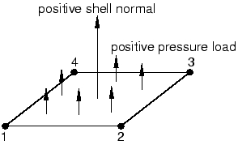

**输出请求**

要检查求解进度，使用 [*MONITOR*](../key/key-link.md#usb-kws-hmonitor) 选项在分析期间监控板中心节点的偏转。在本示例中，我们通过将以下命令添加到输入文件来监控中心节点的面外位移：

```
*MONITOR, NODE=*<center node number>*, DOF=2
```
对于 ["加筋板上的爆炸载荷，" 第 A.9 节](ap01s09.md) 中所示的输入文件，板中心的节点号为 `411`。

将分析期间向输出数据库文件（ODB）写入场数据的间隔数设置为 25。由于步骤总时间为 50 ms，这确保每 2 ms 写入一次选定的数据输出。一般来说，您应该尝试限制分析期间写入的帧数，以保持输出数据库文件的大小合理。在此分析中每 2 ms 保存一次信息应该足以在视觉上研究结构的响应。此模型请求应力、塑性应变和节点位移的场输出。

```
*OUTPUT, FIELD, NUMBER INTERVAL=25
*ELEMENT OUTPUT
S,PE
*NODE OUTPUT
U

```

可以通过使用 [*OUTPUT*](../key/key-link.md#usb-kws-houtput)，HISTORY 选项为模型的选定部分保存更详细的一组输出。将 TIME INTERVAL 参数设置为 1.0E4 秒，以在分析期间以 500 个点写入所需的数据。写出单元集 `STIFFMAX` 中单元的 von Mises 应力（MISES）、等效塑性应变（PEEQ）和体积应变率（ERV）。由于将发生最大位移的节点在板中心，使用节点集 `NOUT` 输出位移和速度历史数据用于板中心。此外，保存以下能量变量：动能（ALLKE）、可恢复应变能（ALLSE）、所做功（ALLWK）、塑性耗散中损失的能耗（ALLPD）、总内能（ALLIE）、粘性耗散中损失的能耗（ALLVD）、人工能耗（ALLAE）和能量平衡（ETOTAL）。

```
*OUTPUT, HISTORY, TIME INTERVAL=1.0E-4
*ELEMENT OUTPUT, ELSET=STIFFMAX
PEEQ, MISES
*NODE OUTPUT, NSET=NOUT
U, V
*ENERGY OUTPUT
ALLKE, ALLSE, ALLWK, ALLPD, ALLIE, ALLVD, ALLAE, ETOTAL
*END STEP
```
将输入保存到名为 `blast_base.inp` 的文件中，因为这些结果将作为比较后续分析的基准状态。使用以下命令运行分析：
```
abaqus job=blast_base
```

### 10.5.6 输出

我们现在检查状态（`.sta`）文件中包含的输出信息。

**状态文件**

有关模型信息（如总质量和质心）以及初始稳定时间增量的信息可以在状态文件顶部找到。以等级顺序排列的 10 个最关键单元（即导致最小时间增量的单元）也显示在这里。如果您的模型包含一些比其他单元小得多的单元，这些小单元将是最关键单元，并将控制稳定时间增量。状态文件中的稳定时间增量信息可以指示对稳定时间增量产生不利影响的单元，允许您更改网格以改善情况（如果需要）。理想情况下，网格应由大致均匀大小的单元组成。在此示例中，网格是均匀的；因此，10 个最关键单元共享相同的最小时间增量。状态文件的开头如下所示。

```
-------------------------------------------------------------------------------
 MODEL INFORMATION (IN GLOBAL X-Y COORDINATES)
-------------------------------------------------------------------------------

   Total mass in model = 838.50
   Center of mass of model = ( 1.000000E+00, 3.488372E-03, 1.000000E+00)

    Moments of Inertia :
                 About Center of Mass              About Origin
      I(XX)          2.849002E+02                  1.123410E+03
      I(YY)          5.519482E+02                  2.228948E+03
      I(ZZ)          2.712609E+02                  1.109771E+03
      I(XY)         -8.881784E-16                 -2.925000E+00
      I(YZ)         -8.881784E-16                 -2.925000E+00
      I(ZX)         -2.273737E-13                 -8.385000E+02

-------------------------------------------------------------------------------
 STABLE TIME INCREMENT INFORMATION
-------------------------------------------------------------------------------

  The stable time increment estimate for each element is based on
  linearization about the initial state.

   Initial time increment = 8.18646E-06

   Statistics for all elements:
      Mean = 1.30938E-05
      Standard deviation = 2.69043E-06

   Most critical elements :
    Element number   Rank    Time increment   Increment ratio
   ----------------------------------------------------------
        1022          1       8.186462E-06      1.000000E+00
        1024          2       8.186462E-06      1.000000E+00
        1027          3       8.186462E-06      1.000000E+00
        1029          4       8.186462E-06      1.000000E+00
        1033          5       8.186462E-06      1.000000E+00
        1038          6       8.186462E-06      1.000000E+00
        2022          7       8.186462E-06      1.000000E+00
        2024          8       8.186462E-06      1.000000E+00
        2027          9       8.186462E-06      1.000000E+00
        2029         10       8.186462E-06      1.000000E+00

```
在分析期间可以查看状态文件以监控分析进度。下面显示了状态文件求解进度部分的开头。您会看到，与 Abaqus/Standard 分析相比，执行了更多增量，并且每 2 ms 写入一次输出数据库文件。

```
-------------------------------------------------------------------------------
 SOLUTION PROGRESS
-------------------------------------------------------------------------------

 STEP 1  ORIGIN 0.0000

  Total memory used for step 1 is approximately 1.7 megabytes.
  Global time estimation algorithm will be used.
  Scaling factor:  1.0000
  Variable mass scaling factor at zero increment:  1.0000
              STEP     TOTAL        CPU      STABLE   CRITICAL     KINETIC
INCREMENT     TIME      TIME       TIME   INCREMENT    ELEMENT      ENERGY   MONITOR
        0  0.000E+00 0.000E+00   00:00:00 8.186E-06       1024   0.000E+00 0.000E+00
ODB Field Frame Number      0 of     25 requested intervals at increment zero.
ODB Field Frame Number      0 of      5 requested intervals at increment zero.
      244  2.005E-03 2.005E-03   00:00:00 8.182E-06       2035   4.499E+03 4.224E-03
ODB Field Frame Number      1 of     25 requested intervals at  2.005236E-03
      488  4.001E-03 4.001E-03   00:00:01 8.181E-06       2018   1.105E+04 2.506E-02
ODB Field Frame Number      2 of     25 requested intervals at  4.001393E-03
      733  6.005E-03 6.005E-03   00:00:01 8.138E-06       2030   5.879E+03 4.555E-02
ODB Field Frame Number      3 of     25 requested intervals at  6.004539E-03
      978  8.003E-03 8.003E-03   00:00:02 8.133E-06       2030   1.727E+02 4.976E-02
     1224  1.000E-02 1.000E-02   00:00:02 8.139E-06       2030   2.299E+03 4.461E-02
ODB Field Frame Number      5 of     25 requested intervals at  1.000000E-02

```
[*MONITOR*](../key/key-link.md#usb-kws-hmonitor) 选项所引用的节点的输出也包含在此文件中。

### 10.5.7 后处理

通过在操作系统提示符下输入以下命令运行 Abaqus/Viewer：

```
abaqus viewer odb=blast_base
```

**更改视图**

默认视图是等轴测，这不能特别清晰地显示板。要改善视点，使用 **View** 菜单中的选项或 **View Manipulation** 工具栏中的工具旋转视图。指定视图并选择旋转视图的视点方法。将视点向量的 *X*、*Y* 和 *Z* 坐标输入为 `1,0.5,1`，将向上向量的坐标输入为 `0,1,0`。

**验证壳截面分配**

您还可以在后处理结果时可视化截面分配和壳厚度。例如，可以对具有公共截面分配的区域进行颜色编码以验证特性是否正确分配（从 **Color Code** 工具栏选择 **Sections** 以根据截面分配对网格进行着色）。要渲染壳厚度，从主菜单栏选择 ****View****ODB Display Options****。在 **ODB Display Options** 对话框中，切换 **Render shell thickness** 并点击 **Apply**。如果模型看起来正确（如图 [Figure 10--26](ch10s05.md#gsx-blast-shell-thick) 所示），在继续进行其余后处理说明之前，关闭此选项并点击 **OK**。否则，纠正截面分配并重新运行作业。

**图 10–26** 显示壳厚度的板。


**结果动画**

如前几个示例中所述，为结果添加动画将提供板在爆炸载荷下动态响应的一般理解。首先，绘制变形模型形状。然后，创建变形形状的时间历史动画。使用 **Animation Options** 对话框将模式更改为 **Play once**。

您将从动画中看到，随着爆炸载荷的施加，板开始偏转。在载荷持续期间，板开始振动，并在爆炸载荷降至零后继续振动。最大位移发生在约 8 ms 时，该状态的变形图如图 [Figure 10--27](ch10s05.md#gxi-disp-shape-1ms) 所示。

**图 10–27** 8 ms 时的变形形状。

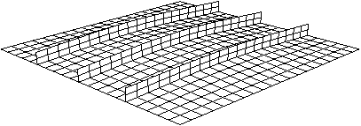

动画图像可以保存到文件以供以后播放。

**保存动画：**

1. 从主菜单栏，选择 ****Animate****Save As****。出现 **Save Image Animation** 对话框。
2. 在 **Settings** 字段中，输入文件名 `blast_base`。动画格式可以指定为 AVI、QuickTime、VRML 或压缩 VRML。
3. 选择 **QuickTime** 格式，然后点击 **OK**。动画作为 `blast_base.mov` 保存在当前目录中。保存后，可以使用行业标准动画软件在 Abaqus/Viewer 外部播放动画。

**历史输出**

由于从变形图中不容易看出板的变形，因此需要以图形形式查看中心节点偏转响应。板中心节点的位移尤其令人关注，因为该节点发生最大偏转。

显示中心节点的位移历史（以毫米为单位），如图 [Figure 10--28](ch10s05.md#gxi-central-disp) 所示。

**图 10–28** 中心节点位移与时间的关系。


**生成中心节点位移的历史图：**

1. 在结果树中，双击输出数据库中名为 `NOUT` 的集合中板中心节点的 **History Output** 数据 `Spatial displacement: U2`。
2. 保存当前的 *X--Y* 数据：在结果树中，点击数据名称的鼠标按钮 3，并从出现的菜单中选择 **Save As**。将数据命名为 `DISP`。此图中位移的单位是米。通过创建一个新数据对象来修改数据，以创建以毫米为单位的位移与时间的关系图。
3. 在结果树中，展开 **XYData** 容器。`DISP` 数据列在其下方。
4. 在结果树中，双击 **XYData**；然后在 **Create XY Data** 对话框中选择 **Operate on XY data**。点击 **Continue**。
5. 在 **Operate on XY Data** 对话框中，将 `DISP` 乘以 1000，以毫米为单位而不是米创建图表。对话框顶部的表达式应显示为：`"DISP" * 1000`
6. 点击 **Plot Expression** 查看修改后的 *X--Y* 数据。将数据保存为 `U2_BASE`。
7. 关闭 **Operate on XY Data** 对话框。
8. 点击工具箱中的 **Axis Options**  工具。在 **Axis Options** 对话框中，将 *X* 轴标题更改为 `Time (s)`，将 *Y* 轴标题更改为 `Displacement (mm)`。点击 **OK** 关闭对话框。结果图如图 [Figure 10--28](ch10s05.md#gxi-central-disp) 所示。该图显示位移在 7.7 ms 时达到最大值 50.2 mm，然后在爆炸载荷移除后振荡。

保存为历史输出的其他量是模型的总能量。能量历史可以帮助识别模型的潜在缺点，也可以突出重要的物理效应。显示五个不同能量输出变量——ALLAE、ALLIE、ALLKE、ALLPD 和 ALLSE——的历史。

**生成模型能量的历史图：**

1. 将 ALLAE、ALLIE、ALLKE、ALLPD 和 ALLSE 输出变量的历史结果保存为 *X--Y* 数据。为每条曲线给出默认名称；根据其输出变量名称分别重命名为 `ALLAE`、`ALLKE` 等。
2. 在结果树中，展开 **XYData** 容器。`ALLAE`、`ALLIE`、`ALLKE`、`ALLPD` 和 `ALLSE` *X--Y* 数据对象列在其下方。
3. 使用 **[Ctrl]** **+Click** 选择 `ALLAE`、`ALLIE`、`ALLKE`、`ALLPD` 和 `ALLSE`；点击鼠标按钮 3，并从出现的菜单中选择 **Plot** 来绘制能量曲线。
4. 要更清楚地区分图中不同的曲线，打开 **Curve Options** 对话框并更改它们的线型。
   - 对于曲线 `ALLSE`，选择虚线线型。
   - 对于曲线 `ALLPD`，选择点划线线型。
   - 对于曲线 `ALLAE`，选择链虚线线型。
   - 对于曲线 `ALLIE`，选择第二细线型。
5. 要更改图例的位置，打开 **Chart Legend Options** 对话框并切换到 **Area** 选项卡页面。
6. 在此页面的 **Position** 区域，切换 **Inset** 并点击 **Dismiss**。在视口中拖动图例使其适合网格中，如图 [Figure 10--29](ch10s05.md#gxi-energy-terms) 所示。**图 10–29** 能量与时间的关系。

我们可以看到，一旦载荷移除且板自由振动，动能随着应变能的减少而增加。当板处于最大偏转时，因此具有最大应变能，它几乎完全静止，导致动能处于最小值。

塑性应变能上升到平台期，然后再次上升。从动能图中我们可以看到，塑性应变能的第二次上升发生在板从最大位移弹回并向相反方向移动时。因此，我们在冲击脉冲后弹回时看到塑性变形。

尽管没有迹象表明沙漏是此分析中的问题，但研究人工应变能以确保。正如第 4 章"使用连续体单元"](ch04.md) 中所讨论的，人工应变能或"沙漏刚度"是用于控制沙漏变形的能量，输出变量 ALLAE 是累积的人工应变能。关于沙漏控制的讨论同样适用于壳单元。由于能量随着板的变形而作为塑性变形耗散，因此总内能远大于单独的弹性应变能。因此，在此分析中，将人工应变能与包含耗散能量以及弹性应变能的能量量进行比较是最有意义的。这样的变量是总内能 ALLIE，它是所有内能的总和。人工应变能约为总内能的 2%，表明沙漏不是问题。

从变形形状我们可以注意到，中心加筋几乎承受纯面内弯曲。使用两个一阶减缩积分单元穿过加筋深度不足以模拟面内弯曲行为。虽然此粗网格的解看起来是足够的，因为几乎没有沙漏，但为了完整起见，我们将研究细化加筋网格时解的变化。当您细化网格时要小心，因为网格细化会增加单元数并减小单元大小，从而增加求解时间。

["加筋板上的爆炸载荷，" 第 A.9 节](ap01s09.md) 中包含了一个具有细化加筋网格的模型的输入文件（`blast_refined.inp`）；使用四个单元穿过加筋深度而不是两个。单元数的增加使求解时间增加约 20%。此外，由于加筋中最小单元维度的减小，稳定时间增量减少约一半。由于求解时间的总增加是两个因素的组合，细化网格的求解时间比原始网格增加约 1.2 × 2（即 2.4）倍。

[图 10--30](ch10s05.md#gxi-art-energy) 显示了原始网格和细化加筋网格的人工能量历史。细化网格中的人工能量略低。因此，我们预计结果不会与原始到细化网格有显著变化。

**图 10–30** 原始和细化网格中的人工能量。

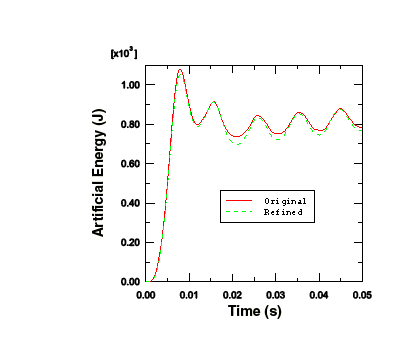

[图 10--31](ch10s05.md#gxi-cent-disp-meshes) 显示板中心节点的位移在两种情况下几乎相同，表明原始网格足以捕获整体响应。然而，细化网格的一个优点是它更好地捕获了加筋中应力和塑性应变的变化。

**图 10–31** 原始和细化网格的中心节点位移历史。

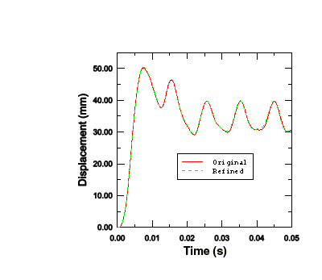

**等值线图**

在本节中，您将使用 Abaqus/Viewer 的等值线绘图功能来显示板中的 von Mises 应力和等效塑性应变分布。使用具有细化加筋网格的模型创建图。

**生成 von Mises 应力和等效塑性应变的等值线图：**

1. 从 **Field Output** 工具栏左侧的变量类型列表中，选择 **Primary**。
2. 从中心附近的输出变量列表中，选择 **S**。应力不变量和分量在右侧下一个列表中可用。选择 **Mises** 应力不变量。
3. 从主菜单栏，选择 ****Result****Section Points****。
4. 在出现的 **Section Points** 对话框中，选择 **Top and bottom** 作为活动位置，然后点击 **OK**。
5. 选择 ****Plot****Contours****On Deformed Shape****，或使用工具箱中的  工具。Abaqus 在每个壳单元的顶面和底面上绘制 von Mises 应力等值线。要更清楚地看到这一点，在视口中旋转模型。您应该更改之前为动画练习设置的视图，以使应力分布更清晰。
6. 使用 **Views** 工具栏中的  工具将视图更改回默认等轴测视图。**提示：**如果 **Views** 工具栏不可见，从主菜单栏选择 ****View****Toolbars****Views****。[图 10--32](ch10s05.md#gxi-cont-plot-mises) 显示了分析结束时 von Mises 应力的等值线图。**图 10–32** 50 ms 时 von Mises 应力等值线图。
7. 同样，对等效塑性应变进行等值线。从 **Field Output** 工具栏左侧的变量类型列表中选择 **Primary**，并从相邻的输出变量列表中选择 **PEEQ**。[图 10--33](ch10s05.md#gxi-equivaplast) 显示了分析结束时等效塑性应变的等值线图。**图 10–33** 50 ms 时等效塑性应变等值线图。

### 10.5.8 审查分析

本分析的目的是研究板在承受爆炸载荷时的变形以及结构各部分的应力。为了判断分析的准确性，您需要考虑所做的假设和近似值，并识别模型的一些局限性。

**阻尼**

无阻尼结构以恒定幅度继续振动。在此 50 ms 模拟中，振荡频率约为 100 Hz。恒定幅度振动不是实际中预期的响应，因为这种结构的振动会随着时间的推移而消失，并在 5-10 次振荡后基本消失。能量损失通常通过各种机制发生，包括支撑处的摩擦效应和空气阻尼。

因此，我们需要考虑分析中存在阻尼以模拟这种能量损失。粘性效应耗散的能量 ALLVD 在分析中为非零，表明已经存在一些阻尼。默认情况下，始终存在*体积粘度*阻尼（参见 [第 9 章"非线性显式动力学"](ch09.md)），其目的是改善高速事件的建模。

在此壳模型中仅存在线性阻尼。使用默认值，振荡最终会消失，但需要很长时间，因为体积粘度阻尼非常小。应使用材料阻尼来引入更真实的结构响应。修改材料数据块以包含阻尼，将质量比例阻尼设置为 50.0。

```
*DAMPING, ALPHA=50.0, BETA=0.0
```
BETA 是控制刚度比例阻尼的参数，在此阶段我们将保持为零。

板的振荡持续时间约为 30 ms，因此我们需要增加分析周期以允许足够的时间来阻尼振动。因此，将分析周期增加到 150 ms。

阻尼分析的结果清楚地显示了质量比例阻尼的影响。[图 10--34](ch10s05.md#gxi-damp-disp-hist) 显示了阻尼和未阻尼分析两者的中心节点位移历史。（我们已将未阻尼模型的分析时间延长至 150 ms 以更有效地比较数据。）由于阻尼，峰值响应也降低了。在阻尼分析结束时，振荡已衰减到接近静态条件。

**图 10–34** 阻尼和未阻尼位移历史。

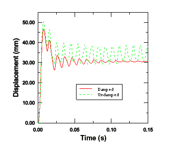

**率相关性**

某些材料（如软钢）在应变率增加时表现出屈服应力增加。在本示例中，加载率很高，因此应变率相关性可能很重要。[*RATE DEPENDENT*](../key/key-link.md#usb-kws-mratedependent) 选项与 [*PLASTIC*](../key/key-link.md#usb-kws-mplastic) 选项结合使用以引入应变率相关性。

将以下内容添加到 [*MATERIAL*](../key/key-link.md#usb-kws-mmaterial) 选项块中 [*PLASTIC*](../key/key-link.md#usb-kws-mplastic) 选项下方：

```
*RATE DEPENDENT
40.0, 5.0
```

对于此率相关行为定义，动态屈服应力与静态屈服应力（）的比值对于等效塑性应变率（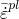），根据方程  给出，其中  和  是材料常数（本例中为 40 和 5）。

当包含 [*RATE DEPENDENT*](../key/key-link.md#usb-kws-mratedependent) 选项时，屈服应力随着应变率的增加而有效增加。因此，由于弹性模量高于塑性模量，我们预计包含率相关性的分析中响应更刚硬。[图 10--35](ch10s05.md#gxi-disp-central-node) 中显示的板中心部分的位移历史和[图 10--36](ch10s05.md#gxi-plas-strain-energy) 中显示的塑性应变历史都证实，当包含率相关性时，响应确实更刚硬。

**图 10–35** 有无率相关性的中心节点位移（未阻尼）。


**图 10–36** 有无率相关性的塑性应变能（未阻尼）。


