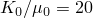
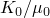
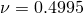
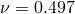
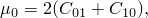
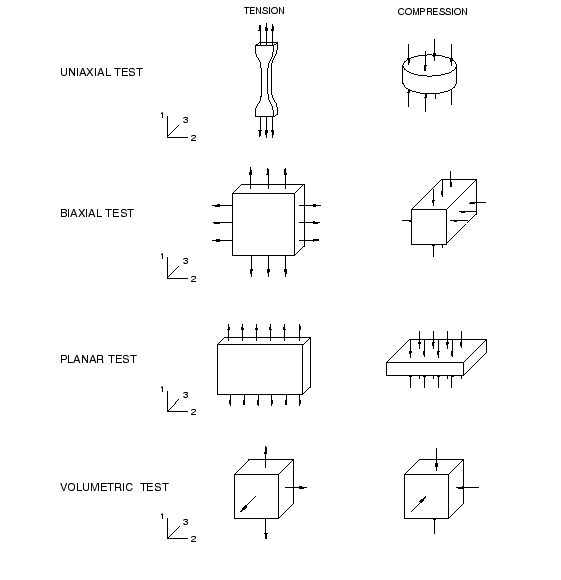

# 10.6 超弹性

我们现在关注另一类材料非线性，即橡胶材料表现出的非线性弹性响应。

### 10.6.1 简介

典型橡胶材料的应力-应变行为如图 [Figure 10--37](ch10s06.md#gss-rubber) 所示，是弹性但高度非线性的。

**图 10–37** 橡胶的典型应力-应变曲线。

这种材料行为称为*超弹性*。超弹性材料（如橡胶）的变形在应变值很大时（通常远超过 100%）仍保持弹性。

Abaqus 在对超弹性材料进行建模时做出以下假设：
- 材料行为是弹性的。
- 材料行为是各向同性的。
- 模拟将包括非线性几何效应（将使用 NLGEOM=YES）。

此外，Abaqus/Standard 默认假定超弹性材料是不可压缩的。Abaqus/Explicit 假定材料几乎是不可压缩的（默认泊松比为 0.475）。

弹性体泡沫是另一类高度非线性弹性材料。它们与橡胶材料的区别在于在承受压缩载荷时表现出非常可压缩的行为。它们在 Abaqus 中使用单独的材料模型进行建模，本指南中不详细讨论。

### 10.6.2 可压缩性

大多数固体橡胶材料与其剪切柔量相比几乎没有可压缩性。这种行为对于平面应力、壳或膜单元不是问题。但是，当使用其他单元（如平面应变、轴对称和三维实体单元）时，这可能是个问题。例如，在材料没有高度约束的应用中，假定材料是完全不可压缩的（体积不能改变，除了热膨胀）是相当令人满意的。在材料高度约束的情况下（如用作密封件的 O 形圈），必须正确地对可压缩性进行建模以获得准确结果。

Abaqus/Standard 有一类特殊的"混合"单元，必须用于对超弹性材料中看到的完全不可压缩行为进行建模。这些"混合"单元通过其名称中的字母"H"识别；例如，8 节点砖块的混合形式称为 C3D8H。

除了平面应力和单轴情况外，在 Abaqus/Explicit 中假定材料完全不可压缩是不可能的，因为程序没有在每个材料计算点强制执行这种约束的机制。不可压缩材料也具有无限波速，导致时间增量为零。因此，我们必须提供一些可压缩性。困难在于，在许多情况下，实际材料行为提供的可压缩性太少，算法无法有效工作。因此，除了平面应力和单轴情况外，用户必须提供足够的可压缩性以使代码工作，但要知道这使得模型的体积行为比实际材料更软。因此，需要一些判断来决定解是否足够准确，或者由于这个数值限制，使用 Abaqus/Explicit 建模问题是否完全可行。我们可以通过其初始体积模量与初始剪切模量的比来评估材料的相对可压缩性，，到 。泊松比，，也提供了可压缩性的度量，因为它定义为

[表 10--2](ch10s06.md#gxi-chp-material-table2) 提供了一些代表性值。

**表 10–2** 可压缩性与泊松比的关系。
|  | 泊松比 |
| --- | --- |
| 10 | 0.452 |
| 20 | 0.475 |
| 50 | 0.490 |
| 100 | 0.495 |
| 1,000 | 0.4995 |
| 10,000 | 0.49995 |

如果没有为材料可压缩性提供值，Abaqus/Explicit 默认假定 ，对应于 0.475 的泊松比。由于典型未填充弹性体的  比值在 1,000 到 10,000 之间（ 到 ），填充弹性体的  比值在 50 到 200 之间（ 到 ），此默认值比大多数弹性体中可用的可压缩性大得多。然而，如果弹性体相对无约束，这种更软的建模材料体积行为通常提供相当准确的结果。不幸的是，在材料高度约束的情况下——例如当它与刚性金属零件接触并且具有非常小的自由表面，特别是当加载高度压缩时——使用 Abaqus/Explicit 可能无法获得准确的结果。

如果您在 Abaqus/Explicit 中定义可压缩性而不是接受默认值，建议对  的比值设置上限为 100。更大的比值会将高频噪声引入动态解，并需要使用过小的时间增量。

### 10.6.3 应变能势

Abaqus 使用*应变能势*（*U*），而不是杨氏模量和泊松比，来关联超弹性材料中的应力和应变。几种不同的应变能势可用：多项式模型、Ogden 模型、Arruda-Boyce 模型、Marlow 模型和 van der Waals 模型。多项式模型的更简单形式也可用，包括 Mooney-Rivlin、neo-Hookean、减缩多项式和 Yeoh 模型。

应变能势的多项式形式是常用的一种。其形式为

其中 *U* 是应变能势； 是弹性体积比； 和  是材料中畸变的度量；*N*、 和  是材料参数，可以是温度的函数。 参数描述材料的剪切行为， 参数引入可压缩性。如果材料完全不可压缩（在 Abaqus/Explicit 中不允许的条件），所有  值都设置为零，上面显示的方程的第二部分可以忽略。如果项数 *N* 为 1，初始剪切模量，，和体积模量，，由

和

给出。

如果材料也是不可压缩的，应变能密度的方程为

这个表达式通常称为*Mooney-Rivlin* 材料模型。如果  也为零，则材料称为 *neo-Hookean*。

其他超弹性模型在概念上类似，在 ["超弹性，" Abaqus Analysis User's Guide 第 22.5 节](../usb/usb-link.md#usbhyperelast) 中有描述。

您必须向 Abaqus 提供相关材料参数以使用超弹性材料。对于多项式形式，这些是  和 。在建模超弹性材料时可能已为您提供了这些参数；然而，更可能的是，您将获得您必须建模的材料的测试数据。幸运的是，Abaqus 可以直接接受测试数据并为您计算材料参数（使用最小二乘法）。

### 10.6.4 使用测试数据定义超弹性行为

定义超弹性材料的方便方法是向 Abaqus 提供实验测试数据。然后 Abaqus 使用最小二乘法计算常数。Abaqus 可以拟合以下实验测试的数据：
- 单轴拉伸和压缩
- 等双轴拉伸和压缩
- 平面拉伸和压缩（纯剪切）
- 体积拉伸和压缩

这些测试中看到的变形模式以及用于定义每个数据的 Abaqus 输入选项如图 [Figure 10--38](ch10s06.md#gss-hyperelastic) 所示。

**图 10–38** 定义超弹性材料行为的各种实验测试的变形模式和 Abaqus 输入选项。

与塑性数据不同，超弹性材料的测试数据必须以公称应力和公称应变值提供给 Abaqus。

仅当材料可压缩性重要时才需要给出体积压缩数据。在 Abaqus/Standard 中这通常不重要，使用默认完全不可压缩行为。如前所述，Abaqus/Explicit 如果没有给出体积测试数据，则假定少量可压缩性。

**从数据获取最佳材料模型**

使用超弹性材料的模拟结果质量很大程度上取决于您提供给 Abaqus 的材料测试数据。典型测试如图 [Figure 10--38](ch10s06.md#gss-hyperelastic) 所示。您可以执行以下操作来帮助 Abaqus 计算最佳可能的材料参数。

尽可能从多种变形状态获取实验测试数据——这允许 Abaqus 形成更准确和稳定的材料模型。但是，如图 [Figure 10--38](ch10s06.md#gss-hyperelastic) 所示，某些测试对不可压缩材料产生等效变形模式。以下是不可压缩材料的等效测试：
- 单轴拉伸 ↔ 等双轴压缩
- 单轴压缩 ↔ 等双轴拉伸
- 平面拉伸 ↔ 平面压缩

如果您已有来自另一个建模特定变形模式的测试数据，则不需要包含来自特定测试的数据。

此外，以下可以改善您的超弹性材料模型：
- 获取可能发生在模拟中的变形模式的测试数据。例如，如果您的组件在压缩中加载，请确保您的测试数据包括压缩而非拉伸加载。
- 允许拉伸和压缩数据，压缩应力和应变输入为负值。如果可能，根据应用使用压缩或拉伸数据，因为将单一材料模型拟合到拉伸和压缩数据通常比每个单独测试的拟合准确度更低。
- 尝试包含平面测试的测试数据。此测试测量剪切行为，这可能非常重要。
- 在您期望材料在模拟中承受的应变幅度处提供更多数据。例如，如果材料将只有小的拉伸应变，比如说低于 50%，则不需要在较高应变值（超过 100%）处提供太多（如果有的话）测试数据。
- 执行实验测试的单单元模拟，并将 Abaqus 计算的结果与实验数据进行比较。如果特定变形模式的计算结果较差，而该模式对您很重要，请尝试获取该变形模式的更多实验数据。这些单单元模拟在 Abaqus/CAE 中非常容易执行。请参阅 [Abaqus/CAE User's Guide](../usi/usi-link.md#usi) 了解详细信息。

**材料模型的稳定性**

从测试数据确定的材料模型在某些应变幅度处通常不稳定。Abaqus 执行稳定性检查以确定将发生不稳定行为的应变幅度，并在数据（`.dat`）文件中打印警告消息。您应该仔细检查此信息，因为如果模型任何部分经历的应变超过稳定性极限，您的模拟可能不会收敛。稳定性检查是针对特定变形进行的，因此，如果变形更复杂，材料在低于指示的应变水平处可能不稳定。在 Abaqus/Standard 中，如果模型某部分超过稳定性极限，您的模拟可能不会收敛。

请参阅 ["橡胶样材料的超弹性行为，" Abaqus Analysis User's Guide 第 22.5.1 节](../usb/usb-link.md#usb-mat-chyperelastic)，了解改善测试数据拟合的准确性和稳定性的建议。
