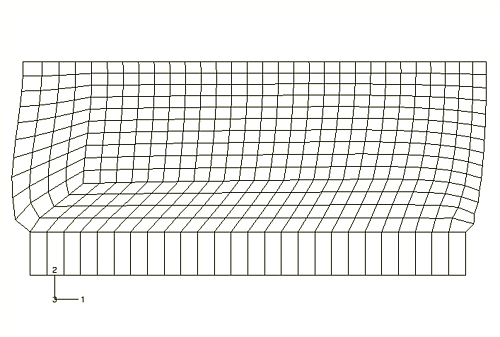
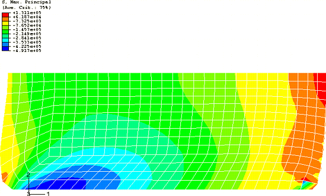

# 10.8 大变形的网格设计

我们知道橡胶支架角落的单元变形是不可取的。这些区域的结果不可靠；如果增加载荷，分析可能会失败。这些问题可以通过使用更好的网格设计来纠正。图 [Figure 10--56](ch10s08.md#gss-simulation) 显示了一个可能用于减少橡胶模型左下角单元变形的替代网格设计示例。

**图 10–56** 修改网格以最小化橡胶模型左下角在模拟过程中的单元变形。

对面角落网格变形周围的问题在 ["减少体积锁定的技术，" 第 10.9 节](ch10s09.md) 中解决。左下角区域的单元在初始未变形配置中现在变形更严重。然而，随着分析进行和单元变形，它们的形状实际上得到了改善。变形形状图如图 [Figure 10--57](ch10s08.md#gss-displaced) 所示，说明了该区域单元变形的减少量；但是，橡胶模型右下角的网格变形仍然显著。

**图 10–57** 修改网格的变形形状。

最大主应力等值线（[Figure 10--58](ch10s08.md#modified-mesh)）显示，该角落非常局部的应力仅略微减少。

**图 10–58** 修改网格中最大主应力等值线。

大变形的网格设计比小位移问题更困难。必须生成一个在分析整个过程中单元形状都合理的网格，而不仅仅是开始时。您必须使用经验、手计算或粗有限元模型的结果来估计模型将如何变形。
