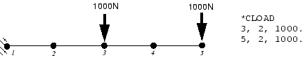
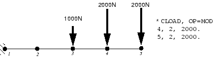
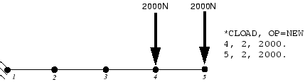

# 11.1 一般分析过程

每个一般步骤的起点是上一个一般步骤结束时的变形状态。因此，模型的状态在一系列一般步骤中演变，因为它响应每个步骤中定义的载荷。任何初始条件（使用 [*INITIAL CONDITIONS*](../key/key-link.md#usb-kws-minitialcond) 选项指定）定义了模拟中第一个一般步骤的起点。

所有一般分析过程共享相同的加载和应用"时间"的概念。

### 11.1.1 一般分析步骤中的时间

Abaqus 在模拟中有两种时间度量。*总时间*在整个所有一般步骤中增加，是每个一般步骤的总步骤时间的累积。每个步骤也有自己的时间刻度（称为*步骤时间*），每个步骤从零开始。时间变化的载荷和边界条件可以根据任一时间刻度指定。历史分为三个步骤（每个 100 秒长）的分析的时间刻度如图 [Figure 11--1](ch11s01.md#gss-total-time) 所示。

**图 11–1** 模拟的步骤和总时间。

### 11.1.2 在一般步骤中指定载荷

在一般步骤中，必须将载荷指定为总值，而非增量值。例如，如果第一个步骤中集中载荷值为 1000 N，在第二个一般步骤中增加到 3000 N，则在两个步骤中的 [*CLOAD*](../key/key-link.md#usb-kws-hcload) 选项上指定的幅度应为 1000 N 和 3000 N，而非 1000 N 和 2000 N。

**从步骤到步骤修改载荷**

在 Abaqus 中施加载荷不仅仅是提供其大小和方向。您还必须指定这些新载荷如何与之前一般步骤中定义的相同类型的现有载荷和边界条件相互作用。所有加载和边界条件选项——如 [*BOUNDARY*](../key/key-link.md#usb-kws-hboundary)、[*CLOAD*](../key/key-link.md#usb-kws-hcload) 和 [*DLOAD*](../key/key-link.md#usb-kws-hdload)——使用 OP 参数来指示它们定义的载荷如何与先前一般步骤中已施加的相同类型载荷相互作用。参数可以设置为 OP=MOD 或 OP=NEW。如果未为 OP 参数提供值，Abaqus 假定为 OP=MOD。

使用 OP=MOD 会导致当前一般步骤中定义的载荷修改先前一般步骤中已施加到模型的相同类型的载荷。任何在当前步骤中未明确修改的载荷继续遵循其关联的幅值定义，前提是幅值曲线以总时间定义；否则，载荷保持在最后一个一般步骤结束时的幅度。例如，考虑一个由两个 B22 单元建模的悬臂梁（参见[图 11--2](ch11s01.md#gsa-step-1)），在第一个一般步骤中将 1000 N 的集中载荷施加到节点 3 和 5。

**图 11–2** 在第一个一般步骤中施加到梁上的载荷（步骤 1）。

在下一个一般步骤（步骤 2）中，使用 OP=MOD 参数在节点 4 和 5 上指定 2000 N 的载荷。因此，这些载荷修改步骤 1 中施加的载荷。步骤 2 结束时施加到模型上的载荷如图 [Figure 11--3](ch11s01.md#gsa-step2-mod) 所示。

**图 11–3** 使用 OP=MOD 在步骤 2 中施加的载荷。

使用 OP=NEW 会导致 Abaqus 移除该类型的所有现有载荷，仅将当前步骤中指定的载荷施加到模型。如果在 [*CLOAD*](../key/key-link.md#usb-kws-hcload) 选项的步骤 2 上指定了 OP=NEW，则我们示例梁上的载荷如图 [Figure 11--4](ch11s01.md#gsa-step2-new) 所示。

**图 11–4** 使用 OP=NEW 在步骤 2 中施加的载荷。

当您使用 [*BOUNDARY*](../key/key-link.md#usb-kws-hboundary) 选项上的 OP=NEW 参数从模型中移除边界约束时，请非常小心。所有边界约束都会从模型中移除，而不仅仅是您想要移除的那个；因此，您必须重新指定应保持在模型中的所有边界条件。请记住，您指定的边界条件必须提供足够的约束以防止所有组件中的刚体运动。如果不这样做，将导致 Abaqus 发出数值奇异性警告并导致过度位移。
