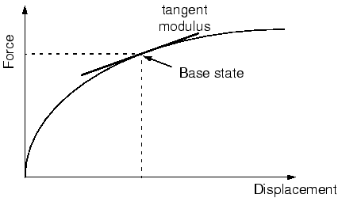
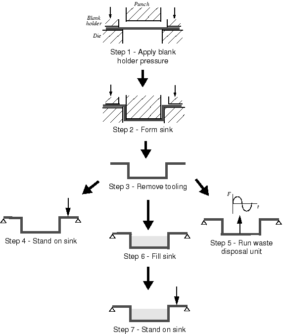

# 11.2 线性摄动分析

线性摄动分析步骤仅在 Abaqus/Standard 中可用。

线性摄动步骤的起点称为模型的基态。如果模拟中的第一个步骤是线性摄动步骤，则基态是使用 [*INITIAL CONDITIONS*](../key/key-link.md#usb-kws-minitialcond) 选项指定的模型状态。否则，基态是线性摄动步骤之前最后一个一般步骤结束时的模拟状态。虽然步骤期间的响应按定义是线性的，但模型可能在先前的一般步骤中具有非线性响应。对于在先前一般步骤中具有非线性响应的模型，Abaqus/Standard 使用当前弹性模量作为摄动过程的线性刚度。此模量是弹塑性材料的初始弹性模量和超弹性材料的切线模量（参见[图 11--5](ch11s02.md#gss-tangentmod)）；其他材料模型的模量在 ["一般和线性摄动过程，" Abaqus Analysis User's Guide 第 6.1.3 节](../usb/usb-link.md#usb-anl-alinearnonlinear) 中描述。

**图 11–5** 对于超弹性材料，使用切线模量作为一般非线性步骤之后的线性摄动步骤中的刚度。

摄动步骤中的载荷应足够小，以至于模型的响应不会与使用切线模量预测的响应有很大偏差。如果模拟包含接触，则接触状态在摄动步骤期间不会改变：在基态中闭合的点保持闭合，打开的点保持打开。

### 11.2.1 线性摄动步骤中的时间

如果另一个一般步骤跟随摄动步骤，Abaqus/Standard 使用最后一个一般步骤结束时的模型状态作为其起点，而不是摄动步骤结束时的模型状态。因此，线性摄动步骤的响应对模拟没有永久影响。因此，Abaqus/Standard 不将线性摄动步骤的步骤时间包含在分析的总时间中。实际上，Abaqus/Standard 所做的是将摄动步骤的步骤时间定义为非常小（10⁻³⁶），以便当添加到累积总时间时它没有影响。此规则的例外是 [*MODAL DYNAMIC*](../key/key-link.md#usb-kws-hmodaldyn) 过程。

### 11.2.2 在线性摄动步骤中指定载荷

线性摄动步骤中给出的载荷和规定的边界条件始终是该步骤的局部。线性摄动步骤中给出的载荷幅度（包括规定的边界条件的幅度）始终是载荷的摄动（增量），而非总幅度。同样，任何解变量的值都输出为仅是摄动值——不包括基态中变量值的输出。

作为包含一般和摄动步骤混合的简单载荷历史的示例，考虑如图 [Figure 11--6](ch11s02.md#iusing-bow-arrow) 所示的弓和箭。

**图 11–6** 简单的弓和箭。

步骤 1 可能给弓上弦——预张紧弓弦。步骤 2 然后接着拉弓弦与箭，从而在系统中存储更多应变能。步骤 3 然后可能是线性摄动分析步骤：特征值频率分析，以研究负载系统的固有频率。这样的步骤也可以包含在步骤 1 和 2 之间，以找到仅在弓弦预张紧后但被拉回射击之前的固有频率。步骤 4 然后是非线性动态分析，其中弓弦被释放，因此通过在步骤 2 中拉弓弦存储在系统中的应变能赋予箭动能并导致它离开弓。此步骤因此继续发展系统的非线性响应，但现在包含动态效应。

在这种情况下，显然每个非线性一般分析步骤必须使用前一个非线性一般分析步骤结束时的状态作为其初始条件。例如，历史的动态部分没有载荷——动态响应是由在静态步骤中存储的一些应变能的释放引起的。这种效果在模型中引入了自然顺序依赖：非线性一般分析步骤按照它们定义的事件发生的顺序彼此跟随，线性摄动分析步骤插入到此序列中的适当时间，以研究系统在这些时间的线性行为。

更复杂的载荷历史如图 [Figure 11--7](ch11s02.md#gss-sink) 所示，显示了不锈钢水槽制造和使用步骤的示意图。

**图 11–7** 水槽的制造和使用步骤。

水槽由使用冲头、模具和压料板成形的薄板钢制成。此成形模拟将包含多个一般步骤。通常，第一步可能涉及压料板压力的施加，第二步模拟冲压操作。第三步将涉及模具的移除，允许水槽弹回到其最终形状。每个步骤都是一个一般步骤，因为它们共同模拟顺序载荷历史，其中每个步骤的开始条件是前一步骤的结束条件。这些步骤显然包含许多非线性效应（塑性、接触、大变形）。在第三步结束时，水槽将包含由成形过程引起的残余应力和非弹性应变。其厚度也将作为制造过程的结果而变化。

然后安装水槽：边界条件将施加在水槽边缘周围连接到手盆的地方。可能需要模拟水槽对许多不同载荷条件的响应。例如，可能需要执行模拟以确保如果有人站在上面，水槽不会破裂。因此，步骤 4 将是线性摄动步骤，分析水槽对局部压力载荷的静态响应。请记住，步骤 4 的结果将是成形过程结束状态下的摄动；例如，如果水槽从成形模拟开始变形远大于此步骤中的 2 mm，请不要感到惊讶。这种假设的 2 mm 偏转只是从成形过程结束时的最终配置（即步骤 3 结束）由人的重量引起的附加变形。测量的从未变形薄板配置的总偏转是此 2 mm 和步骤 3 结束时偏转的总和。

水槽也可以安装垃圾处理器，因此必须模拟其在某些频率下承受谐载荷的稳态动态响应。步骤 5 将是第二个线性摄动步骤，使用 [*STEADY STATE DYNAMICS*](../key/key-link.md#usb-kws-hsteadystdyn)，DIRECT 过程，在处置单元连接点处施加载荷。此步骤的基态是前一个一般步骤（即成形过程）结束时的状态（步骤 3）。前一个摄动步骤（步骤 4）中的响应被忽略。因此，两个摄动步骤是独立的，是对模型基态上载荷的水槽响应的独立模拟。

如果分析中包含另一个一般步骤，则步骤开始时结构的条件是前一个一般步骤（步骤 3）结束时的条件。因此，步骤 6 可以是一般步骤，其载荷模拟水槽充满水。 此步骤中的响应可以是线性的或非线性的。在这个一般步骤之后，步骤 7 可以是重复步骤 4 中执行的分析。然而，在这种情况下，基态（前一个一般步骤结束时的结构状态）是步骤 6 结束时的模型状态。因此，响应将是一个充满水的水槽的响应，而不是空水槽的响应。执行另一个稳态动态模拟会产生不准确的结果，因为没有考虑水的质量，这将显著改变响应。

Abaqus/Standard 中以下过程始终是线性摄动步骤：
- [*BUCKLE*](../key/key-link.md#usb-kws-hbuckle)，
- [*FREQUENCY*](../key/key-link.md#usb-kws-hfrequency)，
- [*MODAL DYNAMIC*](../key/key-link.md#usb-kws-hmodaldyn)，
- [*RANDOM RESPONSE*](../key/key-link.md#usb-kws-hrandomresp)，
- [*RESPONSE SPECTRUM*](../key/key-link.md#usb-kws-hresponspec)，和
- [*STEADY STATE DYNAMICS*](../key/key-link.md#usb-kws-hsteadystdyn)。

[*STATIC*](../key/key-link.md#usb-kws-hstatic) 过程可以是一般或线性摄动过程。在 [*STEP*](../key/key-link.md#usb-kws-hstep) 选项上包含 PERTURBATION 参数，以使静态步骤成为线性摄动过程。
