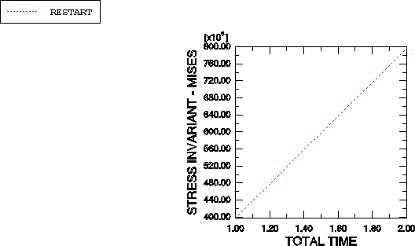

# 11.5 示例：重启管道振动分析


为了演示如何重启分析，以 ["示例：管道系统振动，" 第 11.3 节](ch11s03.md) 中的管道段示例为例，重启模拟，添加两个额外的载荷历史步骤。第一次模拟预测管道段在轴向拉伸时容易发生共振；您现在必须确定多少额外的轴向载荷会将管道的最低振动频率提高到可接受的水平。

步骤 3 将是增加管道轴向载荷到 8 MN 的一般步骤，步骤 4 将再次计算特征模态和特征频率。

创建一个名为 `pipe-2.inp` 的新输入文件，并添加下面讨论的选项块。如果您希望使用 Abaqus/CAE 创建整个模型，请参阅 ["示例：重启管道振动分析，" Getting Started with Abaqus: Interactive Edition 第 11.5 节](../gsa/gsa-link.md#gsa-stp-exapipevibanal)。

### 11.5.1 检查输入文件——模型数据

所需的唯一模型数据是 [*HEADING*](../key/key-link.md#usb-kws-mheading) 选项和 [*RESTART*](../key/key-link.md#usb-kws-mrestart) 选项，以从先前分析结束时读取重启数据。Abaqus 从重启文件读取所有其他模型数据，如节点和单元定义。将以下选项块添加到您的新输入文件：

```
*HEADING
Increase tensile load on the piping system 
and determine lowest frequency.
*RESTART, READ
```
在 [*RESTART*](../key/key-link.md#usb-kws-mrestart)，READ 选项上不包含 INCREMENT 或 STEP 参数，因为默认情况下 Abaqus 将读取写入重启文件的最后增量的数据。由于您正在从先前分析的结束处继续模拟，因此不需要参数。

### 11.5.2 检查输入文件——历史数据

历史数据由两个步骤组成。在步骤 3 中向管道段施加拉伸载荷（8 MN）。以下选项块必须放在步骤 3 中：

```
*CLOAD
RIGHT, 1, 8.0E6
```

在步骤 3 中将初始时间增量设置为总步骤时间的 1/10，应为 1.0。步骤 4 是先前分析中步骤 2 的精确副本。定义此重启分析所需的所有载荷历史选项块如下所示。

```
*STEP, NLGEOM=YES
Apply 8 MN axial tensile load
*STATIC
0.1, 1.
*CLOAD
RIGHT, 1, 8.0E6
*RESTART, WRITE, FREQUENCY=10
*OUTPUT, FIELD, FREQUENCY=10, VARIABLE=PRESELECT
*OUTPUT, HISTORY
*ELEMENT OUTPUT, ELSET=ELEMENT25
S, SINV
*END STEP
*STEP, PERTURBATION
Extract modes and frequencies
*FREQUENCY
8,
*RESTART, WRITE
*OUTPUT, FIELD, VARIABLE=PRESELECT
*END STEP
```
此重启分析的完整输入文件在 ["管道系统振动，" 第 A.12 节](ap01s12.md) 中列出。

### 11.5.3 运行分析

当运行将需要从重启文件读取数据的模拟时，必须在 Abaqus 命令行上使用 oldjob 参数指定重启文件名，不带 `.res` 扩展名。因此，使用以下命令运行此重启分析：

```
abaqus job=pipe-2 oldjob=pipe
```

### 11.5.4 状态文件

同样，在作业运行时检查状态文件。当分析完成时，状态文件的内容将类似于

```
 SUMMARY OF JOB INFORMATION:
 STEP  INC ATT SEVERE EQUIL TOTAL  TOTAL      STEP       INC OF       DOF    IF
               DISCON ITERS ITERS  TIME/    TIME/LPF    TIME/LPF    MONITOR RIKS
               ITERS               FREQ
   3     1   1     0     1     1  1.10       0.100      0.1000    
   3     2   1     0     1     1  1.20       0.200      0.1000    
   3     3   1     0     1     1  1.35       0.350      0.1500    
   3     4   1     0     1     1  1.58       0.575      0.2250    
   3     5   1     0     1     1  1.91       0.913      0.3375    
   3     6   1     0     1     1  2.00       1.00       0.08750   
   4     1   1     0     6     0  2.00       1.00e-36   1.000e-36 
```

此分析从步骤 3 开始，因为步骤 1 和 2 在先前分析中已完成。现在有两个与此模拟关联的输出数据库（`.odb`）文件。步骤 1 和 2 的数据在文件 `pipe.odb` 中；步骤 3 和 4 的数据在文件 `pipe-2.odb` 中。在 Abaqus/Viewer 中绘制结果时，您需要记住每个文件中存储了哪些结果，并且需要确保 Abaqus/Viewer 使用正确的输出数据库文件。

### 11.5.5 后处理重启分析结果

启动 Abaqus/Viewer 并通过给出以下命令指定应使用重启分析的输出数据库文件：

```
abaqus viewer odb=pipe-2
```

**绘制管道的特征模态**

绘制此模拟与原始分析中绘制的相同六个管道段特征模态形状。可以使用与原始分析中描述的相同过程绘制特征模态。这些特征模态及其固有频率如图 [Figure 11--12](ch11s05.md#gss-internalpress) 所示；同样，相应的模态形状位于相互正交的平面中。

**图 11–12** 8 MN 拉伸载荷下特征模态 1 到 6 的形状和频率。


在 8 MN 轴向载荷下，最低模态现在为 53.1 Hz，大于所需的最低 50 Hz。如果您想找到最低模态恰好高于 50 Hz 的确切载荷，可以重复此重启分析并更ce 施加载荷的值。

**从所选步骤的场数据绘制 X–Y 图**

使用输出数据库文件 `pipe.odb` 和 `pipe-2.odb` 中存储的场数据，绘制整个模拟过程中管道轴向应力的历史图。

**生成重启分析中管道轴向应力历史图：**

1. 在结果树中，双击 **XYData**。出现 **Create XY Data** 对话框。
2. 从此对话框中选择 **ODB field output**，然后点击 **Continue** 继续。出现 **XY Data from ODB Field Output** 对话框。
3. 在对话框的 **Variables** 选项卡页面中，接受变量位置的默认选择 `Integration Point`，并从可用应力分量列表中选择 **S11**。
4. 在对话框底部，为截面点切换 **Select**，然后点击 **Settings** 选择截面点。
5. 在出现的 **Field Report Section Point Settings** 对话框中，选择 `beam` 类别，并为管道横截面选择任何可用的截面点。点击 **OK** 退出此对话框。
6. 在 **XY Data from ODB Field Output** 对话框的 **Elements/Nodes** 选项卡页面中，选择 **Element labels** 作为选择 **Method**。模型中有 30 个单元，它们从 1 到 30 连续编号。在 **Element labels** 文本字段中输入任何单元编号（例如 `25`）。
7. 点击 **Active Steps/Frames**，并选择 `Step-3` 作为提取数据的唯一步骤。
8. 点击 **XY Data from ODB Field Output** 对话框底部的 **Plot**，查看该单元中轴向应力在重启分析中的历史。

该图跟踪重启分析中该单元每个积分点处的轴向应力历史。由于重启是先前作业的延续，因此查看整个（原始和重启）分析的结果通常很有用。

**生成整个分析中管道轴向应力历史图：**

1. 通过点击 **Save** 保存当前图。保存了两条曲线（每个积分点一条），并为曲线提供了默认名称。
2. 将任一曲线重命名为 `RESTART`，并删除另一条曲线。
3. 从主菜单栏，选择 ****File****Open****；或使用 **File** 工具栏中的  工具打开文件 `pipe.odb`。
4. 按照上面概述的过程，保存相同单元和积分/截面点的轴向应力历史图。将此图命名为 `ORIGINAL`。
5. 在结果树中，展开 **XYData** 容器。`ORIGINAL` 和 `RESTART` 曲线列在其下方。
6. 使用 **[Ctrl]** **+Click** 选择两个图。点击鼠标按钮 3，并从出现的菜单中选择 **Plot**，以创建整个模拟中管道轴向应力历史图。
7. 要更改线型，打开 **Curve Options** 对话框。
8. 对于 `RESTART` 曲线，选择点划线线型。
9. 点击 **Dismiss** 关闭对话框。
10. 要更改轴标题，打开 **Axis Options** 对话框。在此对话框中，切换到 **Title** 选项卡页面。
11. 将 *X* 轴标题更改为 `TOTAL TIME`，并将 *Y* 轴标题更改为 `STRESS S11`。
12. 点击 **Dismiss** 关闭对话框。

这些命令创建的图如图 [Figure 11--13](ch11s05.md#gss-history-v) 所示。步骤 3 期间相同单元的轴向应力历史可以单独绘制，方法仅选择 `RESTART` 曲线（参见[图 11--14](ch11s05.md#gss-hist-step3-v)）。

**图 11–13** 管道中轴向应力的历史。


**图 11–14** 步骤 3 期间管道中轴向应力的历史。


