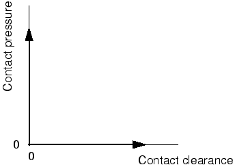
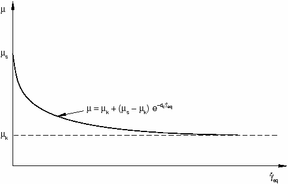

# 12.2 表面之间的相互作用

接触表面之间的相互作用由两个分量组成：一个垂直于表面，一个切向于表面。切向分量包括表面的相对运动（滑动），可能还有摩擦剪切应力。每个接触相互作用都可以引用一个接触属性，该属性指定接触表面之间相互作用的模型。Abaqus 中有多种接触相互作用模型可用；默认模型是无摩擦且无粘结的接触。

### 12.2.1 垂直于表面的行为

分隔两个表面的距离称为间隙。当两个表面之间的间隙变为零时，Abaqus 会施加接触约束。接触公式对两个表面之间传递的接触压力大小没有限制。当接触压力变为零或负值时，表面分离，约束被移除。这种行为称为"硬"接触，是 Abaqus 中的默认接触行为，总结在如图 12-1 所示的接触压力-间隙关系中。

**图 12-1** "硬"接触的接触压力-间隙关系。

默认情况下，在 Abaqus/Standard 中使用接触对时会直接强制执行"硬"接触。当接触条件从"开放"（正间隙）变为"闭合"（间隙为零）时，接触压力会发生剧烈变化，有时会使 Abaqus/Standard 中的接触模拟难以完成；对于 Abaqus/Explicit 并非如此，因为显式方法不需要迭代。对于接触对，有替代的强制方法（例如，罚函数），如 ["Abaqus/Standard 中的接触约束强制方法，" Abaqus 分析用户指南第 38.1.2 节](../usb/usb-link.md#usb-cni-acontactconstraints) 中所讨论的。对于通用接触，罚函数强制是唯一可用的选项。其他信息来源包括 ["与 Abaqus/Standard 中接触建模相关的常见困难，" Abaqus 分析用户指南第 39.1.2 节](../usb/usb-link.md#usb-cni-acontacttrouble)；["与在 Abaqus/Explicit 中使用接触对的接触建模相关的常见困难，" Abaqus 分析用户指南第 39.2.2 节](../usb/usb-link.md#usb-cni-aexpcontacttrouble)；"使用 Abaqus/Standard 建模接触"讲义；以及"高级主题：Abaqus/Explicit"讲义。

### 12.2.2 表面的滑动

除了确定接触是否发生在特定点外，Abaqus 分析还必须计算两个表面的相对滑动。这可能是一个非常复杂的计算；因此，Abaqus 将滑动量小和滑动量可能为有限值的情况区分开来。建模表面之间滑动较小的问题在计算上要便宜得多。什么构成"小滑动"通常很难定义，但一个通用指导原则是，如果接触表面的点滑过典型单元尺寸的一小部分，则问题可以使用"小滑动"近似。

通用接触不可用小滑动。

### 12.2.3 摩擦模型

当表面接触时，它们通常会在其界面上传递剪切以及法向力。因此，分析可能需要考虑抵抗表面相对滑动的摩擦力。*库仑摩擦*是用于描述接触表面相互作用的常用摩擦模型。该模型使用摩擦系数表征表面之间的摩擦行为，。

默认摩擦系数为零。在表面牵引力达到临界剪切应力值之前，切向运动为零，临界剪切应力值取决于法向接触压力，由以下方程给出：

其中  是摩擦系数， 是两个表面之间的接触压力。该方程给出了接触表面的极限摩擦剪切应力。在界面上的剪切应力等于极限摩擦剪切应力  之前，接触表面不会滑动（相对于彼此滑动）。对于大多数表面， 通常小于 1。库仑摩擦可以用  或  定义。图 12-2 中的实线总结了库仑摩擦模型的行为：当表面处于粘着状态时（剪切应力低于 ），表面相对运动（滑动）为零。可选地，如果两个接触表面都是基于单元的表面，则可以指定摩擦应力极限。

**图 12-2** 摩擦行为。

在 Abaqus/Standard 中，粘着或滑动两种状态之间的不连续可能导致模拟过程中出现收敛问题。只有当摩擦对模型响应有重大影响时，才应在 Abaqus/Standard 模拟中包含摩擦。如果您的带摩擦接触模拟遇到收敛问题，在诊断困难时首先应尝试的修改之一是重新运行不带摩擦的分析。一般来说，摩擦对 Abaqus/Explicit 没有额外的计算困难。

模拟理想摩擦行为可能非常困难；因此，在大多数情况下，默认情况下 Abaqus 使用带有允许"弹性滑动"的罚摩擦公式，如图 12-2 中的虚线所示。"弹性滑动"是当表面应该粘着时发生在表面之间的少量相对运动。Abaqus 自动选择罚函数刚度（虚线的斜率），使得这个允许的"弹性滑动"是特征单元长度的一小部分。罚摩擦公式适用于大多数问题，包括大多数金属成形应用。

在那些必须包含理想粘滑摩擦行为的问题中，可以在 Abaqus/Standard 中使用"拉格朗日"摩擦公式，在 Abaqus/Explicit 中可以使用运动摩擦公式。"拉格朗日"摩擦公式在计算资源方面更昂贵，因为 Abaqus/Standard 对每个有摩擦接触的表面节点使用额外的变量。此外，解收敛得更慢，因此通常需要额外的迭代。本指南不讨论这种摩擦公式。

通常，从粘着状态开始滑动时的摩擦系数与稳态滑动期间的摩擦系数不同。前者通常称为静摩擦系数，后者称为动摩擦系数。在 Abaqus 中，可以使用指数衰减定律来模拟静摩擦和动摩擦之间的转换（见图 12-3）。本指南不讨论这种摩擦公式。

**图 12-3** 指数衰减摩擦模型。

在 Abaqus/Standard 中，在模型中包含摩擦会在求解的方程组中添加非对称项。如果  小于约 0.2，这些项的大小和影响非常小，常规对称求解器效果很好（除非接触表面具有高曲率）。对于较高的摩擦系数，系统会自动调用非对称求解器，因为它会提高收敛速度。非对称求解器需要比对称求解器多一倍的计算机内存和临时磁盘空间。可以通过在 [*STEP](../key/key-link.md#usb-kws-hstep) 选项上包含 UNSYMM=YES 参数来选择非对称求解器。 的大值通常不会在 Abaqus/Explicit 中引起任何困难。

### 12.2.4 其他接触相互作用选项

Abaqus 中可用的其他接触相互作用模型取决于分析产品和所使用的算法，可能包括粘附接触行为、软化接触行为、紧固件（例如，点焊）和粘性接触阻尼。本指南不讨论这些选项。有关它们的详细信息，请参阅 [Abaqus 分析用户指南](../usb/usb-link.md#usb)。

### 12.2.5 基于表面的约束

绑定约束用于在模拟期间将两个表面绑在一起。从属表面上的每个节点被约束为具有与其最近的主表面上的点相同的运动。对于结构分析，这意味着平动（以及可选的转动）自由度被约束。

Abaqus 使用模型的未变形配置来确定哪些从属节点绑定到主表面。默认情况下，落在主表面给定距离内的所有从属节点都被绑定。默认距离基于主表面的典型单元尺寸。可以通过以下两种方式之一覆盖此默认值：指定从属节点必须位于主表面附近才能被约束的距离，或指定包含将被约束的节点的集合的名称。

也可以调整从属节点使其恰好位于主表面上。如果必须通过元素（从属节点所附着的元素）边长的较大分数的距离来调整从属节点，则元素可能会严重扭曲；可能的话，避免大调整。

绑定约束对于异网格之间的快速网格细化特别有用。

