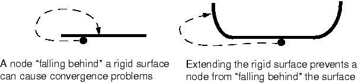

# 12.4 Abaqus/Standard 中刚性表面建模问题

在涉及刚性表面的接触问题建模时，您应该考虑一些问题。这些问题在 ["与 Abaqus/Standard 中接触建模相关的常见困难，" Abaqus 分析用户指南第 39.1.2 节](../usb/usb-link.md#usb-cni-acontacttrouble) 中有详细讨论；但这里描述了一些更重要的问题。
- 刚性表面在接触相互作用中始终是主表面。
- 刚性表面应该足够大，以确保从属节点不会滑离并"落在"表面后面。如果发生这种情况，解决方案通常将无法收敛。扩展刚性表面或在周边包括角（见图 12-11）将防止从属节点落在主表面后面。**图 12-11** 扩展刚性表面以防止收敛问题。
- 可变形网格必须足够细化，以与刚性表面上的任何特征相互作用。如果刚性表面上有 10 mm 宽的特征，而将与其接触的可变形单元跨越 20 mm：刚性特征将只是穿透可变形表面（见图 12-12）。**图 12-12** 建模刚性表面上的小特征。当可变形表面上的网格足够细化时，Abaqus/Standard 将防止刚性表面穿透从属表面。
- Abaqus/Standard 中的接触算法要求接触对的主表面是光滑的。刚性表面始终是主表面，因此应始终进行平滑处理。Abaqus/Standard 不会平滑离散刚性表面。离散刚性表面的光滑度由网格细化程度控制。可以使用 [*SURFACE](../key/key-link.md#usb-kws-msurface) 选项上的 FILLET RADIUS 参数来平滑解析刚性表面，以定义用于平滑刚性表面定义中任何尖角的圆角半径（见图 12-13）。**图 12-13** 平滑解析刚性表面。
- 刚性表面法线必须始终指向与之相互作用的可变形表面。如果不是这样，Abaqus/Standard 将检测到可变形表面上所有节点的严重过盈闭合；模拟可能会因收敛困难而终止。解析刚性表面的法线定义为从形成表面的每条线和圆弧段的起点到终点的向量逆时针旋转 90 度得到的方向（见图 12-14）。**图 12-14** 解析刚性表面的法线。由刚性单元创建的刚性表面的法线由在 [*SURFACE](../key/key-link.md#usb-kws-msurface) 选项上创建表面的面上指定的面定义。

