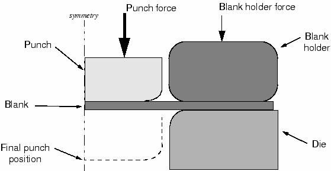
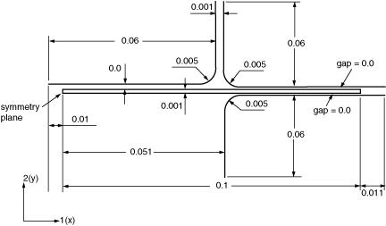
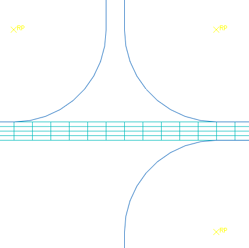
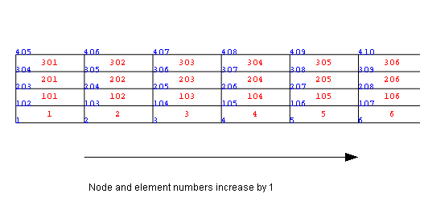
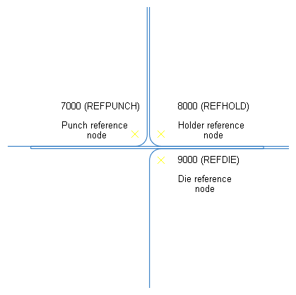
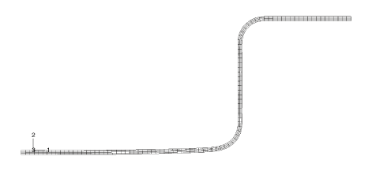
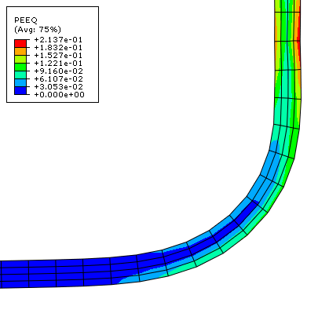
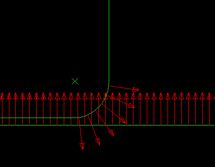
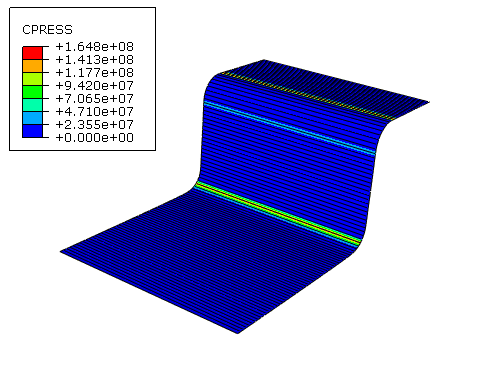

# 12.5 Abaqus/Standard 二维实例：通道成形


该通道成形模拟说明了刚性表面的使用以及 Abaqus/Standard 中成功接触分析通常需要的一些更复杂的技术。

该问题由称为毛坯的可变形材料条和接触毛坯的工具（冲头、凹模和毛坯支架）组成。工具被建模为（解析）刚性表面，因为它们比毛坯僵硬得多。图 12-15 显示了组件的基本排列。

**图 12-15** 成形分析。



毛坯厚度为 1 mm，在毛坯支架和凹模之间被挤压。毛坯支架力为 440 kN。该力与毛坯和毛坯支架之间以及毛坯和凹模之间的摩擦一起，控制着毛坯材料在成形过程中被拉入凹模的方式。您需要确定成形过程中作用在冲头上的力。您还必须评估在这些特定的毛坯支架力和工具与毛坯之间摩擦系数设置下通道成形的效果。

将使用二维平面应变模型。假设模型平面外方向没有应变是有效的，前提是该方向上的结构很长。只需要对通道的一半进行建模，因为成形过程在沿通道中心的平面对称。

模型将使用接触对而不是通用接触，因为在 Abaqus/Standard 中通用接触不适用于解析刚性表面。

各个组件的尺寸如图 12-16 所示。

**图 12-16** 成形模拟中组件的尺寸，单位为 m。



### 12.5.1 坐标系

默认情况下，二维平面应变模型在全局 1-2 平面中定义（如图 12-16 所示）。对于成形模拟，将该平面的原点放置在毛坯的左下角（如图 12-16 所示）。1 方向将垂直于对称平面，该平面位于  处。

### 12.5.2 网格设计

该模拟的网格可分为可变形毛坯和刚性工具。

**毛坯**

再次，应在设计网格之前选择单元类型。用于毛坯的网格应由四行 100 个 CPE4R 单元组成（见图 12-17）。使用四行单元是为了更好地获得毛坯厚度方向变形的分辨率。

**图 12-17** 网格。



图 12-18 中网格的节点和单元编号来自 ["使用 Abaqus/Standard 成形通道，" 第 A.13 节](ap01s13.md) 中给出的该问题的模型。这些节点和单元编号用于下面的讨论。

**图 12-18** 毛坯的节点和单元编号。



**工具**

工具使用解析刚性表面建模。

### 12.5.3 预处理——创建模型

以下步骤假定您可以访问此实例的完整输入文件。该输入文件 `channel.inp` 在 ["使用 Abaqus/Standard 成形通道，" 第 A.13 节](ap01s13.md) 中提供。获取和运行脚本的说明在 [附录 A，"示例文件"](ap01.md) 中给出。如果您希望使用 Abaqus/CAE 创建整个模型，请参阅 ["Abaqus/Standard 二维实例：通道成形，" Getting Started with Abaqus: Interactive Edition 第 12.6 节](../gsa/gsa-link.md#gsa-cnt-exachannel)。

### 12.5.4 检查输入文件——模型数据

我们首先回顾模型定义，包括节点和单元定义，以及截面和材料属性。

**模型描述**

输入文件以 [*HEADING](../key/key-link.md#usb-kws-mheading) 选项中模拟和模型的相关描述开始。

```
*HEADING
Analysis of the forming of a channel
SI units (N, kg, m, s)
```

**节点坐标和单元连接**

检查预处理器是否使用了正确的毛坯单元类型。为单元提供有意义的单元集名称，如 `BLANK`。该模型中的 [*ELEMENT](../key/key-link.md#usb-kws-melement) 选项如下：

```
*ELEMENT, TYPE=CPE4R, ELSET=BLANK

```

模型定义还指定了节点集的创建，以便可以轻松约束和移动模型的各个部分。这些节点位于毛坯的中心线上，并具有对称约束到名为 `CENTER` 的节点集。

```
*NSET, NSET=CENTER
1,102,203,304,405

```

沿薄片中间位于模型左侧（冲头下方）的节点包含在节点集 `MIDLEFT` 中。

```
*NSET, NSET=MIDLEFT
203,
```
同样，这些选项块中的节点编号用于图 12-18 中的模型；您的节点编号可能不同。

将定义两个单元集 `BLANK_B` 和 `BLANK_T`，它们包含毛坯中下面和上面的单元行。这些将用于定义毛坯上的接触表面。

```
*ELSET, ELSET=BLANK_B, GENERATE
1,100,1
*ELSET, ELSET=BLANK_T, GENERATE
301,400,1
```

**毛坯的截面和材料属性**

毛坯由高强度钢制成（弹性模量为 210.0 GPa， = 0.3）。其应力-应变行为如图 12-19 所示。材料在塑性变形时经历相当大的加工硬化。塑性应变可能在此分析中很大；因此，提供了高达 50% 塑性应变的数据。

**图 12-19** 屈服应力与塑性应变的关系。


毛坯将在变形过程中经历相当大的旋转。在随毛坯运动旋转的坐标系中报告应力值和应变值，将使结果更容易解释。因此，应使用 [*ORIENTATION](../key/key-link.md#usb-kws-morientation) 选项创建一个最初与全局坐标系对齐但随元素变形的坐标系。以下输入选项用于定义毛坯的单元和材料属性：

```
*ORIENTATION, NAME=LOCAL
1.,0.,0., 0.,1.,0.
1, 0
*SOLID SECTION, MATERIAL=STEEL, ORIENTATION=LOCAL, 
ELSET=BLANK, CONTROL=EC-1
*SECTION CONTROLS, NAME=EC-1, HOURGLASS=ENHANCED
*MATERIAL, NAME=STEEL
*ELASTIC
2.1E11,0.3
*PLASTIC
400.E6, 0.0E-2
420.E6, 2.0E-2
500.E6,20.0E-2
600.E6,50.0E-2

```

### 12.5.5 接触定义

这里讨论模型每个部分的接触定义。

**刚性表面**

毛坯支架、冲头和凹模使用解析刚性表面建模。创建这些表面时，将为每个表面分配一个刚体参考节点。如果您没有在预处理期间创建这些刚体参考节点，请将以下选项块添加到模型中：

```
*NODE, NSET=REFPUNCH
7000, 0.000, 0.06
*NODE, NSET=REFHOLD
8000, 0.1,0.06
*NODE, NSET=REFDIE
9000,0.1,-0.06
*NSET, NSET=NOUT
REFDIE, REFHOLD, REFPUNCH

```
每个节点被放置在一个节点集中，以使输入文件易于阅读。虽然不熟悉模拟中使用的特定网格的人可能不知道为什么边界条件应用于节点 7000，但他们可能能够猜到为什么边界条件应用于 `REFPUNCH` 节点。所有参考节点也被分配到一个名为 `NOUT` 的集合中，以方便后续的历史输出请求。

为确保解析刚性表面的法线指向刚性表面将接触的可变形表面，组成刚性表面的线段必须按特定顺序定义。例如，要为表面 `PUNCH` 创建正确的法线，应从冲头的右上角到左下角定义表面。以下输入创建表面 `PUNCH`：

```
*SURFACE, TYPE=SEGMENTS, NAME=PUNCH, FILLET RADIUS=0.001
START,0.050, 0.060
LINE, 0.050, 0.006
CIRCL,0.045, 0.001, 0.045,0.006
LINE,-0.010, 0.001
*RIGID BODY, ANALYTICAL SURFACE=PUNCH, REF NODE=7000

```
TYPE=SEGMENTS 参数指定正在定义二维刚性表面。NAME 参数指定表面的名称 `PUNCH`。数据行定义表面的几何形状。第一条数据行始终以"START"开头，后跟表面起点的一和二坐标。后续行定义线段、圆弧和抛物线段。对于此表面，第二条数据行定义从起点位置 (0.05, 0.060) 到 (0.050, 0.006) 的直线。第三条数据行定义从直线终点 (0.05, 0.006) 到 (0.045, 0.001) 的圆弧，圆心位于 (0.045, 0.006)。最后一条数据行定义从圆弧终点到 (0.010, 0.001) 的直线。

此定义应产生光滑的刚性表面，但为安全起见，FILLET RADIUS 参数指定应使用 1 mm 的圆角半径来平滑表面定义中任何不连续处。为任何解析刚性表面的定义添加 FILLET RADIUS 参数始终是好的做法。

[*RIGID BODY](../key/key-link.md#usb-kws-mrigidbody) 选项用于将解析表面绑定到刚体，刚体参考节点由 REF NODE 参数指定，表面由其名称引用，使用 ANALYTICAL SURFACE 参数。

毛坯支架和凹模的刚性表面以类似方式定义。以下选项块定义这些工具上的表面：

```
*SURFACE, TYPE=SEGMENTS, NAME=HOLDER, FILLET RADIUS=0.001
START,0.110, 0.001
LINE, 0.056,0.001
CIRCL,0.051,0.006, 0.056,0.006
LINE, 0.051,0.060
*RIGID BODY, ANALYTICAL SURFACE=HOLDER, REF NODE=8000
**
*SURFACE, TYPE=SEGMENTS, NAME=DIE, FILLET RADIUS=0.001
START,0.051,-0.060
LINE, 0.051,-0.005
CIRCL,0.056,0.,0.056,-0.005
LINE, 0.11, 0.
*RIGID BODY, ANALYTICAL SURFACE=DIE, REF NODE=9000

```

此模拟中的所有刚性表面都延伸到可变形毛坯之外，以确保从属节点不可能滑到任何表面后面。这些表面的初始配置及其参考节点位置如图 12-20 所示。

**图 12-20** 刚体参考节点。



**可变形表面**

使用在毛坯上定义的两个单元集，创建毛坯顶部的接触表面 `BLANK_T` 和底部的接触表面 `BLANK_B`。如果使用自动自由表面生成功能，选项块将如下所示

```
*SURFACE, NAME=BLANK_B
BLANK_B,
*SURFACE, NAME=BLANK_T
BLANK_T,
```

**接触对**

必须在毛坯顶部和冲头、毛坯顶部和毛坯支架之间以及毛坯底部和凹模之间定义接触。在每个接触对中，刚性表面必须是主表面。每个接触对必须引用一个 [*SURFACE INTERACTION](../key/key-link.md#usb-kws-hsurfaceinteraction) 选项，该选项定义控制接触对表面相互作用方式的表面相互作用模型。多个接触对可以引用同一个 [*SURFACE INTERACTION](../key/key-link.md#usb-kws-hsurfaceinteraction) 选项。

在此示例中，我们假设毛坯和冲头之间的摩擦系数为零。毛坯和其他两个工具之间的摩擦系数假定为 0.1。因此，必须在模型中使用两个 [*SURFACE INTERACTION](../key/key-link.md#usb-kws-hsurfaceinteraction) 选项：一个带摩擦，一个不带摩擦。无摩擦接触是 Abaqus 中的默认设置，因此接触对的表面相互作用定义中不需要 [*FRICTION](../key/key-link.md#usb-kws-hfriction) 选项。

模型中定义接触对和表面相互作用的选项块如下

```
*CONTACT PAIR, INTERACTION=FRIC, TYPE=SURFACE TO SURFACE
BLANK_B, DIE
BLANK_T, HOLDER
*CONTACT PAIR, INTERACTION=NOFRIC, TYPE=SURFACE TO SURFACE
BLANK_T, PUNCH
*SURFACE INTERACTION, NAME=FRIC
*FRICTION
0.1, 
*SURFACE INTERACTION, NAME=NOFRIC

```
对于每个接触对，使用了表面-表面接触离散化技术，该技术控制将在何处生成和强制执行接触约束。

### 12.5.6 检查输入文件——历史数据

Abaqus/Standard 接触分析中有两个主要困难来源：组件在接触条件约束它们之前的刚体运动；以及接触条件的突然变化，这会导致严重的不连续迭代，因为 Abaqus/Standard 试图建立所有接触表面的确切状态。因此，只要有可能，采取预防措施避免这些情况。

移除刚体运动并不特别困难。只需确保有足够的约束来防止模型中所有组件的所有刚体运动。这种方法可能意味着最初使用边界条件使组件进入接触，而不是直接施加荷载。使用这种方法可能需要比最初预期更多的步骤，但问题的解决应该更顺利。

或者，可以使用接触控制来自动稳定刚体运动。使用这种方法，Abaqus/Standard 会向接触对的从属节点施加粘性阻尼。但是，必须小心确保粘性阻尼不会显著改变问题的物理特性，如果耗散的稳定能量和接触阻尼应力足够小的话。

模拟将包括两个步骤。由于模拟涉及材料、几何和边界非线性，必须使用一般步骤。此外，成形过程是准静态的；因此，我们可以在整个模拟中忽略惯性效应。与其使用额外的步骤来建立稳固的接触，不如使用如上所述的接触稳定化。

**步骤 1**

在此步骤中，将在毛坯支架和毛坯之间建立接触，同时保持冲头和凹模固定。鉴于问题的准静态性质和非线性响应将得到考虑，需要静态一般步骤。必须在此模拟中考虑几何非线性的影响，因此在 [*STEP](../key/key-link.md#usb-kws-hstep) 选项上将 NLGEOM 参数设置为 YES。将初始时间增量设置为 `0.05`，总时间段设置为 `1.0`。

约束毛坯支架的 1 和 6 自由度，其中自由度 6 是模型平面内的旋转；完全约束冲头和凹模。所有刚性表面的边界条件都应用于它们各自的刚体参考节点。在位于对称平面（节点集 `CENTER`）上的毛坯节点上施加对称边界约束。

回忆一下，在此模拟中所需的毛坯支架力为 440 kN。因此，向集合 `REFHOLD` 施加集中力，并为自由度 2 指定 `440.E3` 的大小。

最后，指定为此步骤每 20 个增量写入预选场输出。此外，请求每增量将冲头参考节点（节点集 `REFPUNCH`）处的垂直反作用力和位移（RF2 和 U2）作为历史数据写入。使用 [*PRINT](../key/key-link.md#usb-kws-hprint), CONTACT=YES 选项将接触诊断写入消息文件。

模型中的完整步骤定义如下：

```
*STEP, NLGEOM=YES
Apply holder force
*STATIC
0.05, 1.0
*BOUNDARY
CENTER  , XSYMM
REFDIE  , 1, 6
REFPUNCH, 1, 6
REFHOLD , 1, 1
REFHOLD , 6, 6
*CLOAD
REFHOLD, 2, -4.4E5
*OUTPUT, FIELD, FREQ=20, VAR=PRESELECT
*OUTPUT, HISTORY, FREQ=1, VAR=PRESELECT
*NODE OUTPUT, NSET=REFPUNCH
RF2, U2 
*PRINT, CONTACT=YES
*END STEP

```

**步骤 2**

向下移动冲头以完成成形操作。

在摩擦滑动、更改的接触条件和非弹性材料行为之间，此步骤存在显著的非线性；因此，将最大增量数设置为较大值（例如，在 [*STEP](../key/key-link.md#usb-kws-hstep) 选项上设置 INC=1000）。将初始时间增量设置为 0.05，总步骤时间设置为 1.0。

为缓解可能因不断变化的接触状态（特别是冲头和毛坯之间的接触）而导致的收敛困难，定义接触控制以为涉及冲头和毛坯的接触对调用自动接触稳定。将默认阻尼系数降低 1000 倍，以最小化稳定对解的影响。

您从上一个步骤的输出请求将传播到此步骤。步骤 2 的输入为

```
*STEP, NLGEOM=YES, INC=1000
Apply punch stroke
*STATIC
.05, 1.0
*CONTACT CONTROLS, MASTER=PUNCH, SLAVE=BLANK_T, STABILIZE=0.001
*BOUNDARY
REFPUNCH, 2, 2, -0.030
*END STEP

```

### 12.5.7 运行分析

将输入保存到文件 `channel.inp`（参见 ["使用 Abaqus/Standard 成形通道，" 第 A.13 节](ap01s13.md)）。

```
abaqus job=channel 
```
在作业运行时检查状态和消息文件，以查看其进度。

**状态文件**

此分析大约需要 180 个增量完成。状态文件的顶部如下所示。

```
  SUMMARY OF JOB INFORMATION:
 STEP  INC ATT SEVERE EQUIL TOTAL  TOTAL      STEP       INC OF       DOF    IF
               DISCON ITERS ITERS  TIME/    TIME/LPF    TIME/LPF    MONITOR RIKS
               ITERS               FREQ
   1     1   1     4     0     4  0.0500     0.0500     0.05000   
   1     2   1     2     0     2  0.100      0.100      0.05000   
   1     3   1     2     0     2  0.175      0.175      0.07500   
   1     4   1     2     0     2  0.288      0.288      0.1125    
   1     5   1     3     0     3  0.456      0.456      0.1688    
   1     6   1     2     0     2  0.709      0.709      0.2531    
   1     7   1     2     0     2  1.00       1.00       0.2906    
   2     1   1U    2     1     3  1.00       0.000      0.05000   
   2     1   2U    4     0     4  1.00       0.000      0.01250   
   2     1   3    29     0    29  1.00       0.00313    0.003125  
   2     2   1     5     0     5  1.01       0.00547    0.002344  
   2     3   1     6     0     6  1.01       0.00781    0.002344  
   2     4   1     9     0     9  1.01       0.0113     0.003516  

```
Abaqus 在步骤 2 的第一个增量中很难确定接触状态。它需要三次尝试才能找到 `PUNCH` 和 `BLANK_T` 表面的正确配置并实现平衡。在这个困难开始之后，Abaqus 迅速将增量大小增加到更合理的值。状态文件的末尾如下所示。
```
   2   167   2     0     4     4  1.95       0.952      0.002239  
   2   168   1     1     3     4  1.96       0.956      0.003358  
   2   169   1     2     2     4  1.96       0.961      0.005037  
   2   170   1     1     3     4  1.97       0.968      0.007556  
   2   171   1     3     3     6  1.98       0.980      0.01133   
   2   172   1U    4     0     4  1.98       0.980      0.01700   
   2   172   2     1     3     4  1.98       0.984      0.004250  
   2   173   1     3     2     5  1.99       0.990      0.006375  
   2   174   1U    4     0     4  1.99       0.990      0.009563  
   2   174   2     3     2     5  1.99       0.993      0.002391  
   2   175   1     1     2     3  2.00       0.996      0.003586  
   2   176   1     4     1     5  2.00       1.00       0.003721  

 THE ANALYSIS HAS COMPLETED SUCCESSFULLY

```

此模拟包含许多严重的不连续迭代。由于分析中的迭代次数，消息文件将相当大。尽管很想限制写入此文件的信息，但通常不应该这样做，因为此信息是 Abaqus 在模拟期间提供的主要诊断数据来源。

### 12.5.8 Abaqus/Standard 接触分析故障排除

接触分析通常比 Abaqus/Standard 中几乎任何其他类型的模拟都更难完成。因此，了解所有可帮助您进行接触分析的选项非常重要。

如果接触分析遇到困难，首先要检查的是接触表面是否正确定义。最简单的方法是运行 **datacheck** 分析并在 Abaqus/Viewer 中绘制表面法线。您可以绘制所有法线，对于变形或未变形图形上的两个表面和结构单元。使用**常规绘图选项**对话框中的**法线**选项来执行此操作，并确认表面法线方向正确。

即使接触表面都正确定义，Abaqus/Standard 可能仍然会与接触模拟存在一些问题。造成这些问题的原因之一可能是默认的收敛容差和迭代次数限制：它们相当严格。在接触分析中，有时最好让 Abaqus/Standard 多迭代几次，而不是放弃该增量并重试。这就是 Abaqus/Standard 在模拟过程中区分严重不连续迭代和平衡迭代的原因。

[*PRINT](../key/key-link.md#usb-kws-hprint), CONTACT=YES 选项对于几乎每个接触分析都是必不可少的。该选项在消息文件中提供的信息对于发现错误或问题至关重要。例如，chattering 可以被识别出来，因为相同的从属节点将出现在所有严重的不连续迭代中。如果您看到这一点，则必须修改该节点周围区域中的网格或向模型添加约束。消息文件中的接触数据还可以识别仅使用单个从属节点与表面相互作用的区域。这是一个非常不稳定的情况，可能导致收敛问题。同样，您应该修改模型以增加这些区域中的单元数量。

### 12.5.9 后处理

在 Abaqus/Viewer 中，检查毛坯的变形。

**变形模型形状和轮廓图**

此模拟的基本结果是毛坯的变形和成形过程中产生的塑性应变。我们可以绘制变形模型形状和塑性应变，如下所述。

**绘制变形模型形状：**

1. 绘制变形模型形状。您可以从显示中移除凹模和冲头，仅可视化毛坯。
2. 在结果树中，展开名为 `channel.odb` 的输出数据库文件下的**单元集**容器。
3. 从可用单元集列表中，选择 **PART-1--1.BLANK**。单击鼠标按钮 3，并从出现的菜单中选择**替换**，以使用所选单元替换当前显示组。如需要，单击  以将模型拟合到视口。结果图如图 12-21 所示。**图 12-21** 步骤 2 结束时毛坯的变形形状。

**绘制等效塑性应变等高线：**

1. 从主菜单栏中，选择 ****绘图****轮廓****在变形形状上**；或从工具箱中单击  工具以显示 Mises 应力等高线。
2. 打开**轮廓图选项**对话框。
3. 拖动**轮廓间隔**滑块，将轮廓间隔数更改为 **7**。
4. 单击**确定**应用这些设置。
5. 从左侧**场输出**工具栏的变量类型列表中选择**主要**，并从输出变量列表中选择 **PEEQ**。PEEQ 是塑性应变的积分度量。塑性应变的非积分度量是 PEMAG。PEEQ 和 PEMAG 对于比例加载是相等的。
6. 如需要，使用  工具放大毛坯中的任何感兴趣区域，如图 12-22 所示。**图 12-22** 毛坯一角标量塑性应变变量 PEEQ 的等高线。

最大塑性应变约为 21%。将此与材料的破坏应变进行比较，以确定材料是否会在成形过程中撕裂。

**毛坯和冲头上反作用力的历史图**

图 12-23 中的实线显示了冲头刚体参考节点处反作用力 RF2 的变化。

**图 12-23** 冲头上的力。


**创建反作用力历史图：**

1. 在结果树中，展开**历史输出**容器。双击 `Reaction force: RF1 PI: PART---1--1 Node *xxx* in NSET NOUT`。出现 1 方向反作用力的历史图。
2. 打开**轴选项**对话框以标记轴。
3. 切换到**标题**标签页。
4. 指定 `Reaction Force - RF2` 作为 *Y* 轴标签，`Total Time` 作为 *X* 轴标签。
5. 单击**关闭**关闭对话框。

冲头力（如图 12-23 所示）在步骤 2 期间迅速增加到约 160 kN，该步骤从总时间 1.0 运行到 2.0。

**稳定能和内能的历史图**

验证接触稳定的存在不会显著改变问题的物理特性非常重要。评估此要求的一种方法是将稳定耗散的能量（ALLSD）与结构内能（ALLIE）进行比较。理想情况下，稳定能量应该是内能的一小部分。图 12-24 显示了稳定能和内能的变化。可以看出，耗散的稳定能量确实很小。

**图 12-24** 稳定能和内能。


**在表面上绘制等高线**

Abaqus/Viewer 包含多种专为后处理接触分析而设计的功能。**显示组**功能可用于将表面收集到显示组中，类似于单元集和节点集。

**显示接触表面法线向量：**

1. 绘制未变形模型形状。
2. 在结果树中，展开**表面集**容器。选择名为 `BLANK-T` 和 `PART---1--1.PUNCH` 的表面。单击鼠标按钮 3，并从出现的菜单中选择**替换**。
3. 使用**常规绘图选项**对话框，打开法线向量显示（**在表面上**），并将向量箭头长度设置为**短**。
4. 如需要，使用  工具放大任何感兴趣的区域，如图 12-25 所示。**图 12-25** 表面法线。

**对接触压力绘制等高线：**

1. 再次绘制塑性应变等高线。
2. 如果尚未选择，从**场输出**工具栏中心的输出变量列表中选择**主要**。
3. 从中心输出变量列表中，选择 `CPRESS`。
4. 从显示组中移除 `PART---1--1.PUNCH` 表面。为了更好地可视化二维模型中基于表面的变量的等高线，您可以通过拉伸平面应变单元来构建等效的三维视图。您可以类似地扫描轴对称单元。
5. 从主菜单栏中，选择 ****视图****ODB 显示选项****。出现**ODB 显示选项**对话框。
6. 选择**扫描/拉伸**选项卡以访问**扫描/拉伸**选项。
7. 在对话框的**拉伸**区域中，切换**拉伸单元**；并将**深度**设置为 `0.05`，以便为显示等高线而拉伸模型。
8. 单击**确定**应用这些设置。使用  工具旋转模型以从合适的视角显示模型，如图 12-26 所示。**图 12-26** 接触压力。


