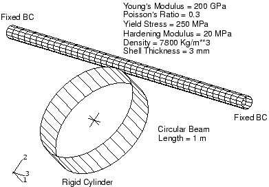

# 13.2 加载速率


物理过程实际花费的时间称为其自然时间。通常，可以安全地假设在准静态过程的自然时间内执行分析将产生准确的静态结果。毕竟，如果现实生活中的事件实际上发生在速度为零的速度达到结论的自然时间尺度内，动态分析应该能够捕获分析实际上已经达到稳态这一事实。您可以提高加载速率，使相同的物理事件在更短的时间内发生，只要解保持与真实静态解几乎相同，且动态效应保持不显著。

### 13.2.1 平滑振幅曲线

为准确性和效率，准静态分析需要尽可能平滑的加载应用。突然、急促的运动会产生应力波，可能导致噪声或不准确的解。以尽可能平滑的方式施加荷载要求加速度在增量之间仅发生很小的变化。如果加速度是平滑的，那么速度和位移的变化也是平滑的。

Abaqus 有一种简单的内置振幅类型，称为 SMOOTH STEP，它自动创建平滑加载振幅。当您使用 [*AMPLITUDE](../key/key-link.md#usb-kws-mamplitude), DEFINITION=SMOOTH STEP 定义时间-振幅数据对时，Abaqus/Explicit 自动将您的每个数据对与曲线连接，这些曲线的一阶和二阶导数是平滑的，并且在您的每个数据点处斜率为零。由于这两个导数都是平滑的，您可以使用 SMOOTH STEP 仅使用初始和最终数据点施加位移加载，介入的运动将是平滑的。使用这种类型的加载振幅允许您执行准静态分析而不会因加载施加速率的不连续性而产生波。例如，对于以下振幅定义，Abaqus/Explicit 创建如图 13-2 所示的振幅曲线：

```
*AMPLITUDE, DEFINITION=SMOOTH STEP
0.0, 0.0, 1.0E-5, 1.0
```

**图 13-2** 使用 [*AMPLITUDE](../key/key-link.md#usb-kws-mamplitude), DEFINITION=SMOOTH STEP 的振幅定义。


### 13.2.2 结构问题

在静态分析中，结构的最低模式通常主导响应。知道最低模式的频率，相应地，知道其周期，您可以估计获得适当静态响应所需的时间。为了说明确定适当加载速率的问题，考虑如图 13-3 所示的刚性圆柱体对汽车车门侧侵入梁的变形。实际测试是准静态的。

**图 13-3** 刚性圆柱体撞击梁。



梁的响应随加载速率变化很大。在 400 m/s 的极高冲击速度下，梁中的变形是高度局部的（如图 13-4 所示）。为了获得更好的准静态解，请考虑最低模式。

**图 13-4** 400 m/s 的冲击速度。


最低模式的频率约为 250 Hz，对应于 4 毫秒的周期。可以使用 Abaqus/Standard 中的 [*FREQUENCY](../key/key-link.md#usb-kws-hfrequency) 过程轻松计算自然频率。为将梁变形所需的 0.2 m 在 4 毫秒内完成，圆柱体的速度为 50 m/s。虽然 50 m/s 似乎仍然是高速冲击速度，但惯性力相对于结构整体刚度变得次要，变形形状（如图 13-5 所示）表明准静态响应好得多。

**图 13-5** 50 m/s 的冲击速度。


虽然整体结构响应似乎是我们在准静态解中期望的，但通常最好将加载时间提高到最低模式周期的 10 倍，以确保解确实是准静态的。为了进一步改善结果，可以逐渐增加刚性圆柱体的速度——例如，使用 SMOOTH STEP 振幅定义——从而减轻初始撞击。

### 13.2.3 金属成形问题

人为增加成形事件的速度对于获得经济的解是必要的，但我们可以施加多大的加速而仍能获得可接受的静态解？如果钣金毛坯的变形对应于最低模式的变形形状，则可以使用最低结构模式的周期作为成形速度的指导。然而，在成形过程中，刚模具和冲头可能以使毛坯变形可能与结构模式不相关的方式约束毛坯。在这种情况下，一般建议是将冲头速度限制在钣金波速的 1% 以下。对于典型过程，冲头速度约为 1 m/s，而钢的波速约为 5000 m/s。因此，此建议建议冲头速度加速的上限因子为 50。

确定可接受的冲头速度的建议方法是以各种冲头速度（范围为 3 到 50 m/s）运行一系列分析。按从最快到最慢的顺序执行分析，因为解时间与冲头速度成反比。研究分析的结果，并了解变形形状、应力和应变如何随冲头速度变化。一些过度冲头速度的迹象是：不切实际的、局部的拉伸和变薄，以及起皱的抑制。如果您从例如 50 m/s 的冲头速度开始并从那里降低，在某些时候解将变得彼此相似——这是解收敛于准静态解的指示。随着惯性效应变得不那么显著，模拟结果之间的差异也变得不那么显著。

随着加载速率被人为增加，越来越重要的是以渐进和平滑的方式施加荷载。例如，加载冲头的最简单方法是在整个成形步骤中施加恒定速度。这样的加载在分析开始时对钣金毛坯施加突然的冲击荷载，在毛坯中传播应力波，可能产生不期望的结果。随着加载速率的增加，任何冲击荷载对结果的影响更加明显。使用平滑步幅曲线将冲头速度从零逐渐增加可以最大程度地减少这些不利影响。

**回弹**

回弹通常是成形分析的重要组成部分，因为回弹分析决定了最终卸载零件的形状。虽然 Abaqus/Explicit 非常适合成形模拟，但回弹带来了一些特殊困难。在 Abaqus/Explicit 中执行回弹模拟的主要问题是获得稳态解所需的时间。通常，必须非常小心地移除荷载，并且必须引入阻尼以使解时间合理。幸运的是，Abaqus/Explicit 和 Abaqus/Standard 之间的密切关系允许更有效的方法。

由于回弹不涉及接触且通常只包含轻微非线性，Abaqus/Standard 可以比 Abaqus/Explicit 更快地求解回弹问题。因此，回弹分析的首选方法是将完成的成形模型从 Abaqus/Explicit 导入到 Abaqus/Standard。您必须创建一个 Abaqus/Standard 输入文件，该文件将导入成形结果并执行回弹分析。使用 Abaqus/Standard 输入文件中的 [*IMPORT](../key/key-link.md#usb-kws-mimport) 选项，您可以指定要导入的单元集。通常，导入整个可变形网格。节点、单元和截面属性是自动导入的，但您必须重新定义材料和边界条件。回弹分析完成后，您可以 将模型导入回 Abaqus/Explicit 以继续另一个成形阶段。


