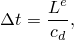

# 13.3 质量缩放

*质量缩放* 使分析能够在不人为增加加载速率的情况下经济地执行。质量缩放是在涉及速率相关材料或速率相关阻尼（如粘滞阻尼器）的模拟中减少求解时间的唯一选项。在此类模拟中增加加载速率不是一种选择，因为材料应变率与加载速率增加相同的因子。当属性随应变率变化时，人为增加加载速率会人为地改变过程。

以下方程显示了稳定时间增量与材料密度之间的关系。如 ["稳定性限制的定义，" 第 9.3.2 节](ch09s03.md#gsk-gen-ovw-definition) 中所讨论的，模型的稳定性限制是所有单元的最小稳定时间增量。它可以表示为

其中  是特征单元长度， 是材料的膨胀波速。对于泊松比为零的线性弹性材料，膨胀波速由下式给出

其中  是材料密度。

根据上述方程，人为增加材料密度  因子  会使波速降低因子 ，并使稳定时间增量增加因子 。请记住，当全局稳定性限制增加时，执行相同分析所需的增量更少，这就是质量缩放的目标。然而，缩放质量对惯性效应的影响与人为增加加载速率的影响完全相同。因此，过度的质量缩放，就像过度的加载速率一样，可能导致错误的解。因此，确定可接受的质量缩放因子的方法类似于确定可接受的加载速率缩放因子的方法。两种方法之间的唯一区别是，质量缩放相关的加速是质量缩放因子的平方根，而加载速率缩放相关的加速与加载速率缩放因子成正比。例如，质量缩放因子 100 恰好对应加载速率缩放因子 10。

有几种方法可以使用输入文件历史定义中的 [*FIXED MASS SCALING](../key/key-link.md#usb-kws-hfixedmassscaling) 或 [*VARIABLE MASS SCALING](../key/key-link.md#usb-kws-hvariablemassscaling) 选项在模型中实现质量缩放。由于该选项是历史定义的一部分，因此可以从步骤到步骤更改，提供了很大的灵活性。详细信息请参阅 ["质量缩放，" Abaqus 分析用户指南第 11.6.1 节](../usb/usb-link.md#usb-anl-amassscaling)。

