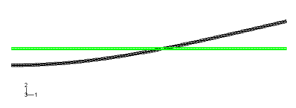
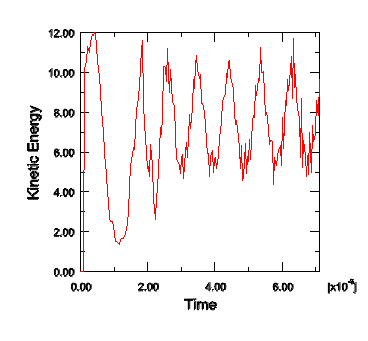
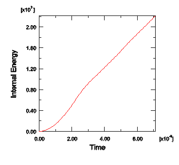
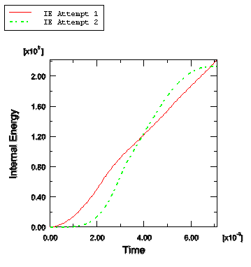
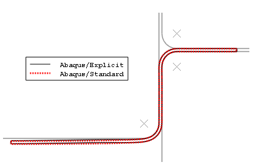
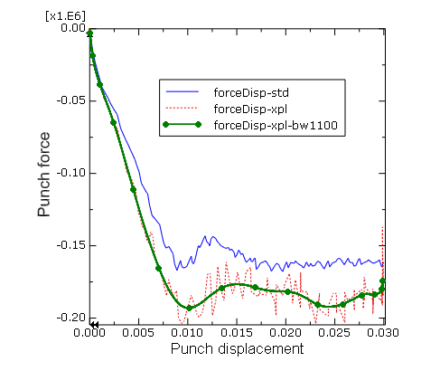
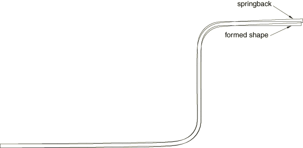

# 13.5 实例：使用 Abaqus/Explicit 成形通道


在此实例中，您将使用 Abaqus/Explicit 求解第 12 章"接触"中的通道成形问题。然后，您将比较 Abaqus/Standard 和 Abaqus/Explicit 分析的结果。

您将对为 Abaqus/Standard 分析创建的模型进行修改，以便能够在 Abaqus/Explicit 中运行。这些修改包括向材料模型添加密度和更改步骤。在运行 Abaqus/Explicit 分析之前，您将使用 Abaqus/Standard 中的频率提取过程来确定获得适当准静态响应所需的时间周期。

### 13.5.1 预处理——使用 Abaqus/Explicit 重新运行模型

在开始之前，将 `channel.inp` 的副本保存为 `channel_freq.inp`。对 `channel_freq.inp` 文件进行所有后续更改。`channel_freq.inp` 也可在 ["使用 Abaqus/Standard 成形通道，" 第 A.13 节](ap01s13.md) 中找到。在本节中，您将修改输入文件以对毛坯进行频率提取 使用 Abaqus/Standard。

**确定适当的步骤时间**

["加载速率，" 第 13.2 节](ch13s02.md) 讨论了确定准静态过程适当步骤时间的程序。如果我们知道毛坯的最低自然频率，即*基本*频率，我们可以确定步骤时间持续时间的近似下界。获取此类信息的一种方法是在 Abaqus/Standard 中运行频率分析。在这个成形分析中，冲头将毛坯变形为与最低模式相似的形状。因此，如果您希望对结构变形而不是局部变形进行建模，成形阶段的时间必须大于或等于最低模式的时间周期。

**执行自然频率提取：**

1. 修改 [*MATERIAL](../key/key-link.md#usb-kws-mmaterial) 选项块以包括 [*DENSITY](../key/key-link.md#usb-kws-mdensity) 子选项：`*DENSITY 7800.,`
2. 删除与模具、支架和冲头相关的所有数据（[*SURFACE](../key/key-link.md#usb-kws-msurface)、[*RIGID BODY](../key/key-link.md#usb-kws-mrigidbody)、[*CONTACT PAIR](../key/key-link.md#usb-kws-hcontactpair) 等）。这些刚性部件对频率分析不是必需的。
3. 删除除第一个之外的所有步骤。将过程类型更改为 [*FREQUENCY](../key/key-link.md#usb-kws-hfrequency)，并将其步骤描述更改为 `Frequency modes`。使用默认 Lanczos 特征求解器请求五个特征值。
4. 删除除应用于集合 `CENTER` 的边界条件之外的所有边界条件。这将使用施加对称边界条件的左端约束毛坯。修订后的历史数据如下。`*STEP, PERTURBATION Frequency modes *FREQUENCY 5, *BOUNDARY CENTER, XSYMM *END STEP`**注意：**由于频率提取步骤是线性扰动过程，非线性材料属性将被忽略。在此分析中，毛坯的左端在 *x* 方向受到约束，不能绕法线旋转；但它在 *y* 方向没有约束。因此，提取的第一个模式将是刚体模式。第二个模式的频率将决定 Abaqus/Explicit 中准静态分析的适当时间周期。
5. 保存 `channel_freq.inp` 输入文件，提交作业进行分析，并监控解决方案进度。
6. 当分析完成时，进入 Abaqus/Viewer 并打开此分析创建的结果数据库文件。从主菜单栏中，选择 ****绘图****变形形状****；或使用工具箱中的  工具。

绘制第一个振动模式的变形模型形状（它是刚体模式）。将绘图提前到毛坯的第二模式。在变形模型形状上叠加未变形模型形状。

频率分析表明毛坯的基本频率为 140 Hz，对应于 0.00714 s 的周期。图 13-8 显示了第二模式的位移形状。我们现在知道成形分析的最短步骤时间为 0.00714 s。

**图 13-8** Abaqus/Standard 频率分析中毛坯的第二模式。



**创建 Abaqus/Explicit 成形分析**

成形过程的目的是用冲头位移为 0.03 m 准静态地成形通道。在为准静态分析选择加载速率时，建议您从较快的加载速率开始，并根据需要降低加载速率以更快地收敛于准静态解。但是，如果您希望在首次分析尝试中增加准静态结果的可能性，您应该考虑比对应于基本频率的时间慢 10 到 50 倍的步骤时间。在此分析中，您将使用 0.007 s 的时间周期进行成形分析步骤，这基于在 Abaqus/Standard 中执行的频率分析，该分析表明毛坯的基本频率为 140 Hz，对应于 0.00714 s 的时间周期。此时间周期对应于恒定冲头速度 4.3 m/s。您将仔细检查动能和内能结果，以确保解不包含显著的动态效应。

在开始之前，将 `channel.inp` 的副本保存为 `channel_xpl.inp`。对 `channel_xpl.inp` 文件进行所有后续更改。`channel_xpl.inp` 也可在 ["使用 Abaqus/Standard 成形通道，" 第 A.13 节](ap01s13.md) 中找到。在本节中，您将修改输入文件以使用 Abaqus/Explicit 执行毛坯的成形分析。此分析还需要材料模型 `Steel` 的密度设置，因此重复 ["实例：使用 Abaqus/Explicit 成形通道，" 第 13.5 节](ch13s05.md) 中的密度规格步骤。

集中力将施加到毛坯支架。为了计算支架的动态响应，必须在其刚体参考点上分配点质量。支架的实际质量并不重要；重要的是质量应该与毛坯的质量（0.78 kg）处于同一数量级，以最小化接触计算中的噪声。选择 0.1 kg 的点质量值。要分配质量，请将以下语句追加到刚性毛坯支架的选项块中。

```
*ELEMENT, TYPE=MASS, ELSET=HOLDER_MASS
8000, 8000
*MASS, ELSET=HOLDER_MASS
0.1,
```

对于此金属成形分析的第一次尝试，您将为毛坯支架力的应用和冲头行程使用默认平滑参数的表格振幅曲线。使用表 13-1 中的数据为毛坯支架力创建名为 `Ramp1` 的表格振幅曲线。使用表 13-2 中的数据为冲头行程创建名为 `Ramp2` 的第二个表格振幅曲线。

**表 13-1** `Ramp1` 的斜坡振幅数据。
| 时间（秒） | 振幅 |
| --- | --- |
| 0.0 | 0.0 |
| 0.0001 | 1.0 |

**表 13-2** `Ramp2` 的斜坡振幅数据。
| 时间（秒） | 振幅 |
| --- | --- |
| 0.0 | 0.0 |
| 0.007 | 1.0 |

斜坡振幅数据在 [*AMPLITUDE](../key/key-link.md#usb-kws-mamplitude) 语句中定义，如下所示。

```
*AMPLITUDE, NAME=RAMP1
0., 0., 0.0001, 1.
*AMPLITUDE, NAME=RAMP2
0., 0., 0.007, 1.
```

与 Abaqus/Standard 分析一样，Abaqus/Explicit 分析也需要两个步骤。在第一个步骤中施加毛坯支架力；在第二个步骤中施加冲头行程。这可以通过修改现有步骤轻松完成。对于每个步骤，将步骤过程替换为显式动力学过程。对于第一个步骤，指定时间周期为 `0.0001` s。此时间周期适用于毛坯支架力的应用，因为它足够长以避免动态效应，但足够短以避免对作业运行时间造成重大影响。将接触对定义从模型数据移动到第一步定义中（但删除每个接触对的 TYPE=SURFACE TO SURFACE 参数，因为它仅与 Abaqus/Standard 相关）。在步骤中，保留边界条件和集中力定义。与集中力关联的振幅曲线应设置为 `RAMP1`。修改冲头参考节点的历史输出请求，以使用内置抗混叠滤波器每 200 个均匀分布的间隔请求输出。

进行这些更改后，第一步定义将出现在输入文件中，如下所示：

```
**
** Step 1 
**
*STEP
Apply holder force 
*DYNAMIC, EXPLICIT
, 0.0001
*CONTACT PAIR, INTERACTION=FRIC
BLANK_B, DIE
BLANK_T, HOLDER
*CONTACT PAIR, INTERACTION=NOFRIC
BLANK_T, PUNCH
*BOUNDARY
CENTER  , XSYMM
REFDIE  , 1, 6
REFPUNCH, 1, 6
REFHOLD , 1, 1
REFHOLD , 6, 6
*CLOAD, AMPLITUDE=RAMP1
REFHOLD, 2, -4.4E5
*OUTPUT, FIELD, VARIABLE=PRESELECT
*OUTPUT, HISTORY, VARIABLE=PRESELECT, FILTER=ANTIALIASING
*NODE OUTPUT, NSET=REFPUNCH
 RF2, U2
*END STEP
```

对于第二个显式动力学步骤，将时间周期设置为 `0.007` s。删除 [*CONTACT CONTROLS](../key/key-link.md#usb-kws-hcontactcontrols) 选项（它仅与 Abaqus/Standard 相关），并修改边界条件以使用振幅曲线 `RAMP2`。第二步如下所示：

```
**
** Step 2
**
*STEP
Apply punch stroke
*DYNAMIC, EXPLICIT
, 0.007
*BOUNDARY, AMPLITUDE=RAMP2
REFPUNCH,2,2,-0.030
*END STEP

```

为了帮助确定分析近似准静态假设的程度，各种能量历史将很有用。特别有用的是将动能与内应变能进行比较。能量历史作为预选历史输出的一部分写入输出数据库文件。

**运行作业**

保存输入文件并提交作业进行分析。监控解决方案进度；纠正检测到的任何建模错误，并调查任何警告消息的原因。

**评估结果的策略**

在查看最终感兴趣的結果（如应力和变形形状）之前，我们需要确定解是否是准静态的。一个好的方法是是将动能历史与内能历史进行比较。在金属成形分析中，大多数内能是由于塑性变形。在这个模型中，毛坯是动能的主要来源（支架的运动可以忽略不计，冲头和模具没有与之相关的质量）。为了确定是否获得了可接受的准静态解，毛坯的动能不应大于其内能的百分之几。为了更准确，特别是在需要准确回弹应力结果时，动能应该更低。这种方法非常有用，因为它适用于所有类型的金属成形过程，不需要对模型中的应力有任何直观的理解；许多成形过程可能太复杂，无法对结果产生直觉。

虽然动能与内能之比是准静态分析质量的一个很好的主要指标，但它本身不足以确认质量。您还应该独立评估两种能量，以确定它们是否合理。当需要准确的回弹应力结果时，评估的这一部分变得更加重要，因为准确的回弹应力解高度依赖于准确的塑性结果。即使动能相当小，如果它包含大的振荡，模型可能正在经历显著的塑性。一般来说，我们期望平滑加载产生平滑结果；如果加载是平滑的但能量结果是振荡的，结果可能不足。由于能量比无法显示这种行为，您还应该研究动能历史本身，以确定它是平滑的还是嘈杂的。

如果动能没有指示准静态行为，查看某些节点处的速度历史可能有助于了解模型在各个区域中的行为。这种速度历史可以指示模型哪些区域正在振荡并导致高动能。

**评估结果**

进入 Abaqus/Viewer，并打开此作业创建的结果数据库（`channel_xpl.odb`）。绘制整个模型动能（`ALLKE`）和内能（`ALLIE`）。

整个模型的动能和内能历史图分别如图 13-9 和图 13-10 所示。

**图 13-9** 成形分析动能历史，第一次尝试。



**图 13-10** 成形分析内能历史，第一次尝试。



图 13-9 所示的动能历史显著振荡。此外，动能历史与毛坯的成形没有明确关系，这表明此分析不足。在此分析中，冲头速度保持恒定，而动能——主要由毛坯运动引起——远非恒定。

比较图 13-9 和图 13-10 表明，动能是内能的一小部分（除了一开始之外的所有部分都小于 1%）。动能必须相对于内能很小的标准已得到满足，即使对于这个严重的加载情况也是如此。

尽管模型的动能是内能的一小部分，但它仍然相当嘈杂。因此，我们应该以某种方式更改模拟以获得更平滑的响应。

### 13.5.2 成形分析——第二次尝试

即使冲头实际上以几乎恒定的速度移动，第一次模拟尝试的结果表明，理想的是使用不同的振幅曲线，以允许毛坯更平滑地加速。在考虑使用哪种类型的加载振幅时，请记住准静态分析的各个方面都很重要。首选方法是尽可能平滑地将冲头移动所需距离，所需时间。

我们现在将使用平滑施加的毛坯支架力和平滑施加的冲头位移来分析成形阶段；我们将把结果与早期获得的结果进行比较。参阅 ["平滑振幅曲线，" 第 13.2.1 节](ch13s02.md#gsk-gen-qsi-smoothampcve)，了解平滑步幅振幅曲线的解释。

修改现有的振幅曲线定义 `RAMP1` 和 `RAMP2`，以便它们定义平滑步幅振幅曲线。您可以通过在每个 [*AMPLITUDE](../key/key-link.md#usb-kws-mamplitude) 选项追加 DEFINITION=SMOOTH STEP 来进行此更改。振幅曲线现在在其一阶和二阶导数中都是平滑的。因此，使用平滑步幅振幅曲线进行位移控制也向我们保证速度和加速度是平滑的。

保存 `channel_xpl.inp` 输入文件并提交进行分析。监控解决方案进度；纠正检测到的任何建模错误，并调查任何警告消息的原因。

**评估第二次尝试的结果**

动能历史如图 13-11 所示。

**图 13-11** 成形分析动能历史，第二次尝试。


动能响应的确与毛坯的成形相关：动能值在第二步中间达到峰值，对应于冲头速度最大的时间。因此，动能是适当和合理的。

第二次尝试的内能（如图 13-12 所示）从零平滑增加到最终值。同样，动能与内能之比很小，似乎可以接受。图 13-13 比较了两次成形尝试中的内能。

**图 13-12** 成形分析内能历史，第二次尝试。


**图 13-13** 两次成形尝试的内能比较。



### 13.5.3 两种成形尝试的讨论

我们评估结果可接受性的最初标准是动能应该与内能相比较小。我们发现，即使对于最严重的情况（尝试 1），这个条件似乎已得到充分满足。平滑步幅振幅曲线的添加有助于减少动能中的振荡，产生令人满意的准静态响应。

其他要求——动能和内能的历史必须适当和合理——非常有用和必要，但它们也增加了评估结果的主观性。在一般情况下执行这些要求可能很困难，因为这些要求需要对成形过程的行为有一些直觉。

**成形分析的结果**

既然我们满意成形分析的准静态解是足够的，我们可以研究一些其他感兴趣的结果。图 13-14 显示了 Abaqus/Standard 和 Abaqus/Explicit 获得的毛坯中 Mises 应力的比较。

**图 13-14** Abaqus/Standard（左）和 Abaqus/Explicit（右）通道成形分析中 Mises 应力的等高线图。


该图显示 Abaqus/Standard 和 Abaqus/Explicit 分析中的峰值应力在彼此的 1% 以内，毛坯的整体应力等高线非常相似。为了进一步验证准静态分析结果的有效性，您应该比较来自两种分析的等效塑性应变结果和最终变形形状。

图 13-15 显示了毛坯中等效塑性应变的等高线图，图 13-16 显示了两种分析预测的最终变形形状的叠加图。Abaqus/Standard 和 Abaqus/Explicit 分析的等效塑性应变结果在彼此的 5% 以内。此外，显式准静态分析结果与 Abaqus/Standard 静态分析结果非常一致。

**图 13-15** Abaqus/Standard（左）和 Abaqus/Explicit（右）通道成形分析中 PEEQ 的等高线图。


**图 13-16** Abaqus/Standard 和 Abaqus/Explicit 成形分析中的最终变形形状。



您还应该比较 Abaqus/Standard 和 Abaqus/Explicit 分析预测的稳态冲头力。

**比较冲头力-位移历史：**

1. 将冲头位移（`U2`）和反作用力（`RF2`）历史数据从 Abaqus/Standard 分析保存为 `U2--std` 和 `RF2--std`。冲头参考节点的编号是 `7000`。
2. 类似地，将冲头位移（`U2`）和反作用力（`RF2`）历史数据从 Abaqus/Explicit 分析保存为 `U2--xpl` 和 `RF2--xpl`。接下来，您将对保存的 *X--Y* 数据进行运算，以创建力-位移曲线。在力-位移图中，我们希望将冲头的向下运动表示为正值；因此，当您创建力-位移曲线时，在位移历史数据前包含一个负号，以便负 2 方向上的运动将为正。
3. 在结果树中，双击 **XYData**；然后在**创建 XY 数据**对话框中选择**对 XY 数据进行运算**。单击**继续**。
4. 在**对 XY 数据进行运算**对话框中，组合来自 Abaqus/Standard 分析的力和位移历史数据，以创建力-位移曲线。对话框顶部的表达式应显示为：`combine ( -"U2-std", "RF2-std" )`
5. 单击**另存为**将计算的位移曲线保存为 `forceDisp-std`。
6. 在**对 XY 数据进行运算**对话框中，组合来自 Abaqus/Explicit 分析的力和位移历史数据，以创建力-位移曲线。对话框顶部的表达式应显示为：`combine ( -"U2-xpl", "RF2-xpl" )`
7. 单击**另存为**将计算的位移曲线保存为 `forceDisp-xpl`。
8. 在视口中绘制 `forceDisp-std` 和 `forceDisp-xpl`。与 Abaqus/Standard 结果相比，Abaqus/Explicit 结果中有更多噪声，因为 Abaqus/Explicit 模拟准静态响应，而 Abaqus/Standard 求解真正的静态平衡。在分析期间，Abaqus/Explicit 模拟的一些噪声已通过在输出请求上指定的内置抗混叠滤波器移除。现在，您将使用 Abaqus/Viewer *X--Y* 数据滤波器从 Abaqus/Explicit 力-位移曲线中去除更多解噪声。Abaqus/Viewer *X--Y* 数据滤波器应仅应用于 *X* 值为时间的 *X--Y* 数据。这避免了关于滤波器截止频率含义的问题，并防止了数据规范化中可能出现问题。因此，您将不过滤 `forceDisp-xpl` 本身，而是在组合它们以创建新的力-位移曲线之前，分别对 `U2-xpl` 和 `RF2-xpl` 进行过滤。最好对将组合的任何两个 *X--Y* 数据对象应用相同的滤波器操作（无论是在分析期间还是在后处理期间）。这将确保对组合数据均匀应用任何由于过滤而产生的失真（如时间延迟）。
9. 在**对 XY 数据进行运算**对话框中，使用截止频率为 1100 Hz 的 Butterworth 滤波器对力历史数据进行过滤。对话框顶部的表达式应显示为：`butterworthFilter(xyData="RF2-xpl",cutoffFrequency=1100)` **注意：**选择适当的滤波器截止频率需要工程判断和对所建模物理系统的良好理解。通常可以采用迭代方法（从相对较高的截止频率开始，然后逐渐降低）来找到合适的截止频率，该截止频率可以在对底层物理解的失真最小的情况下去除解噪声。了解系统的自然频率也有助于确定适当的滤波器截止频率。对于此示例，我们执行了频率提取分析以确定未变形毛坯的基本频率（140 Hz）；然而，成形步骤结束时毛坯的基本频率将相当高。如果您对最终模型配置执行自然频率提取分析，您会发现成形步骤结束时毛坯的基本频率约为 1000 Hz。因此，略大于此值的截止频率是此模型的一个好选择。
10. 单击**另存为**将计算的位移曲线保存为 `RF2-xpl-bw1100`。
11. 类似地，使用截止频率为 1100 Hz 的 Butterworth 滤波器对位移历史数据进行过滤。**对 XY 数据进行运算**对话框顶部的表达式应显示为：`butterworthFilter(xyData="U2-xpl",cutoffFrequency=1100)`
12. 单击**另存为**将计算的位移曲线保存为 `U2-xpl-bw1100`。
13. 组合过滤的 Abaqus/Explicit 力和位移历史。**对 XY 数据进行运算**对话框顶部的表达式应显示为：`combine ( -"U2-xpl-bw1100", "RF2-xpl-bw1100" )`
14. 单击**另存为**将计算的位移曲线保存为 `forceDisp-xpl-bw1100`。
15. 将 `forceDisp-xpl-bw1100` 添加到 `forceDisp-std` 和 `forceDisp-xpl` 的绘图中。自定义绘图外观以获得类似于图 13-17 的绘图。**图 13-17** Abaqus/Standard 和 Abaqus/Explicit 的稳态冲头力比较。

如图 13-17 所示，Abaqus/Explicit 预测的稳态冲头力比 Abaqus/Standard 预测的高约 12%。Abaqus/Standard 和 Abaqus/Explicit 结果之间的差异主要是由于两个因素。首先，Abaqus/Explicit 对材料数据进行了正则化。其次，两种分析产品处理摩擦效应的方式略有不同；Abaqus/Standard 使用罚函数摩擦，而 Abaqus/Explicit 使用运动摩擦。

从这些比较中可以明显看出，Abaqus/Standard 和 Abaqus/Explicit 都能够处理此类困难的接触分析。但是，在选择 Abaqus/Explicit 进行准静态分析时，您应该知道您可能需要迭代适当的加载速率。在确定加载速率时，建议您从较快的加载速率开始，并根据需要降低加载速率。这将有助于优化分析的运行时间。

### 13.5.4 加速分析的方法

既然我们已经获得了成形分析的可接受解，我们可以尝试使用更少的计算机时间获得类似的可接受结果。大多数成形分析需要过多的计算机时间才能以其物理时间尺度运行，因为成形事件的实际时间周期对于显式动力学标准来说很大；以可接受的计算机时间运行通常需要更改分析以降低计算成本。有两种方法可以降低分析成本：

1. 人为增加冲头速度，使相同的成形过程在更短的步骤时间内发生。这种方法称为*荷载速率缩放*。
2. 人为增加单元的质量密度，使稳定性限制增加，允许分析使用更少的增量。这种方法称为*质量缩放*。

除非模型具有速率相关材料或阻尼，否则这两种方法实际上做同样的事情。

**确定可接受的质量缩放**

["加载速率，" 第 13.2 节](ch13s02.md) 和 ["金属成形问题，" 第 13.2.3 节](ch13s02.md#gsk-gen-qsi-metformprob) 讨论了如何确定可接受的加载速率或质量缩放以减少准静态分析的运行时间。目标是在惯性力保持不显著的最短时间周期内建模过程。在获得有意义的准静态解时，可以使用多少缩放是有限制的。

如 ["加载速率，" 第 13.2 节](ch13s02.md) 中所讨论的，我们可以使用相同的方法来确定适当的质量缩放因子，就像我们确定适当的加载速率缩放因子一样。两种方法之间的区别在于，加载速率缩放因子  与质量缩放因子  具有相同的效果。最初，我们假设与毛坯基本频率周期相当的时间周期足以产生准静态结果。通过研究模型能量和其他结果，我们满意这些结果是可以接受的。该技术产生的冲头速度约为 4.3 m/s。现在我们将使用质量缩放加速求解时间，并将结果与未缩放的解决方案进行比较，以确定缩放结果是否可以接受。我们假设缩放只能降低而不能提高结果的质量。目标是使用缩放来减少计算机时间，同时仍产生可接受的结果。

我们的目标是确定哪些缩放值仍产生可接受的结果，以及在什么时候缩放结果变得不可接受。为了查看可接受和不可接受缩放因子的效果，我们研究了稳定时间增量大小从  到 5 的范围内的缩放因子的效果；具体来说，我们选择 、 和 5。这些加速因子分别转换为质量缩放因子 5、10 和 25。

要应用质量缩放 5，请将以下选项添加到历史定义中，

```
*FIXED MASS SCALING, ELSET=BLANK, FACTOR=5
```
并将修改后的输入保存为名为 `channel_xpl_5.inp` 的文件，然后提交进行分析；还创建名为 `channel_xpl_10.inp` 和 `channel_xpl_25.inp` 的输入文件，分别具有质量缩放因子 10 和 25，并提交进行分析。

首先，我们将查看质量缩放对等效塑性应变和位移形状的影响。然后，我们将查看能量历史是否提供分析质量的一般指示。

**评估质量缩放的结果**

此分析的一个感兴趣的结果是等效塑性应变 PEEQ。既然我们已经在图 13-15 中看到了未缩放分析完成时 PEEQ 的等高线图，我们可以将每个缩放分析的结果与未缩放分析结果进行比较。图 13-18 显示了加速 （质量缩放为 5）的 PEEQ，图 13-19 显示了加速 （质量缩放为 10）的 PEEQ，图 13-20 显示了加速 5（质量缩放为 25）的 PEEQ。图 13-21 比较了每种质量缩放情况下的内能和动能历史。质量缩放因子为 5 的情况产生的结果受增加的加载速率影响不显著。质量缩放因子为 10 的情况显示高中能比对，但当与较慢加载速率获得的结果相比时，结果似乎合理。因此，这可能接近此分析可以加速的极限。最后一种情况，质量缩放因子为 25，显示强动态效应的证据：动能与内能比相当高，并且对三种情况的最终变形形状的比较表明最后一种情况的变形形状受到显著影响。

**图 13-18** 加速 （质量缩放为 5）的等效塑性应变 PEEQ。


**图 13-19** 加速 （质量缩放为 10）的等效塑性应变 PEEQ。


**图 13-20** 加速 5（质量缩放为 25）的等效塑性应变 PEEQ。


**图 13-21** 质量缩放因子为 5、10 和 25 的情况（分别对应加速因子 、 和 5）的内能和动能历史。


**加速方法的讨论**

随着质量缩放的增加，求解时间减少。结果的质量也下降，因为动态效应变得更加突出，但通常有一些缩放水平可以提高求解时间而不会牺牲结果的质量。显然，加速 5 对于产生此分析的准静态结果太大了。

较小的加速（如 ）不会显著改变结果。这些结果对于大多数应用来说都是足够的，包括回弹分析。当缩放因子为 10 时，结果的质量开始下降，而结果的大小和趋势总体上保持不变。相应地，动能与内能之比明显增加。此情况的结果对于许多应用来说是足够的，但对于准确回弹分析来说则不够。

### 13.5.5 在 Abaqus/Standard 中进行回弹分析

虽然可以在 Abaqus/Explicit 中执行回弹分析，但 Abaqus/Standard 在求解回弹分析方面效率更高。由于回弹分析只是没有外部荷载或接触的静态模拟，Abaqus/Standard 可以仅用几个增量获得回弹解。相反，Abaqus/Explicit 必须在一个足够长的求解达到稳态的时间周期内获得动态解。为效率起见，Abaqus 具有在 Abaqus/Explicit 和 Abaqus/Standard 之间来回传递结果的能力，允许您在 Abaqus/Explicit 中执行成形分析，在 Abaqus/Standard 中执行回弹分析。

以下步骤假定您可以访问此实例的完整输入文件。该输入文件 `channel_springback.inp` 在 ["使用 Abaqus/Standard 成形通道，" 第 A.13 节](ap01s13.md) 中提供。获取和运行脚本的说明在 [附录 A，"示例文件"](ap01.md) 中给出。

[*HEADING](../key/key-link.md#usb-kws-mheading) 选项之后的第一选项是 [*IMPORT](../key/key-link.md#usb-kws-mimport) 选项，它读取单元定义和来自相应 Abaqus/Explicit 分析的状态。此导入输入文件的开头如下：

```
*HEADING
 Analysis of the forming of a channel -- springback
 Abaqus/Standard springback following channel_xpl_5.inp
 SI units (kg, m, s, N)
*IMPORT, STEP=2, STATE=YES, UPDATE=NO
BLANK,
*IMPORT NSET
CENTER, MIDLEFT

```

将 STATE 参数设置为 YES 会导致导入模型的状态——应力、应变等。将 UPDATE 参数设置为 NO 会导致应变和位移也被导入而不是重置为零。[*IMPORT](../key/key-link.md#usb-kws-mimport) 选项后的数据行提供包含要导入的元素的单元集名称。[*IMPORT NSET](../key/key-link.md#usb-kws-mimportnset) 选项标识要导入的节点集名称。

接下来，创建一个静态一般步骤。将初始时间增量设置为 `0.1`，并包括几何非线性的影响（请注意，Abaqus/Explicit 分析考虑了这些；这是 Abaqus/Explicit 中的默认设置）。回弹分析可能会遇到影响收敛的不稳定性。因此，包括自动稳定以防止此问题。使用耗散能量分数的默认值。

您必须重新定义边界条件，这些条件不会导入。在集合 `Center` 上施加与 Abaqus/Explicit 模型相同的 XSYMM 型位移边界条件。

为了消除刚体运动，有必要固定毛坯中的单个点，例如集合 `MidLeft`，在 2 方向上（这样您就不会施加不必要的约束）。不要在此点施加位移边界条件，而是施加零速度边界条件，以将其固定在成形阶段结束时的最终位置。这将允许模型在可能跟随的任何其他成形阶段中保持毛坯位置的连续性。

完整的历史定义如下：

```
*STEP, NLGEOM=YES 
*STATIC, STABILIZE, ALLSDTOL=0
0.1, 1. 
*BOUNDARY 
CENTER, XSYMM 
*BOUNDARY, TYPE=VELOCITY 
MIDLEFT, 2, 2 
*END STEP
```

将输入保存为名为 `channel_springback.inp` 的文件，并使用以下命令运行分析：

```
abaqus job=channel_springback oldjob=channel_xpl_5
```

**回弹分析的结果**

图 13-22 叠加了成形和回弹阶段后毛坯的变形形状（成形阶段对应于 Abaqus/Explicit 输出数据库文件的最后一帧，而回弹阶段对应于 Abaqus/Standard 输出数据库文件的最后一帧）。回弹结果必然取决于其前面的成形阶段的准确性。事实上，回弹结果对成形阶段的误差高度敏感，比成形阶段本身的结果更敏感。

**图 13-22** 成形和回弹后的变形模型形状。



您还应该绘制毛坯的内能 ALLIE，并将其与消散的静态稳定能 ALLSD 进行比较。稳定能应该是内能的一小部分，以便对结果有信心。图 13-23 显示了这两个能量的图；静态稳定能确实很小，因此，没有显著影响结果。

**图 13-23** 内能和静态稳定能历史。


