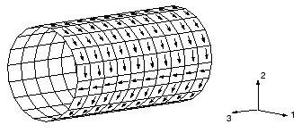
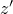
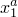
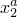
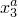
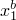
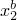
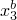
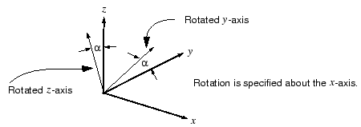

# 5.3 Shell material directions


Shell elements, unlike continuum elements, use material directions local to each element. Anisotropic material data, such as that for fiber-reinforced composites, and element output variables, such as stress and strain, are defined in terms of these local material directions. In large-displacement analyses the local material axes on a shell surface rotate with the average motion of the material at each integration point.

### 5.3.1 Default local material directions

The local material 1- and 2-directions lie in the plane of the shell. The default local 1-direction is the projection of the global 1-axis onto the shell surface. If the global 1-axis is normal to the shell surface, the local 1-direction is the projection of the global 3-axis onto the shell surface. The local 2-direction is perpendicular to the local 1-direction in the surface of the shell, so that the local 1-direction, local 2-direction, and the positive normal to the surface form a right-handed set (see [Figure 5--6](ch05s03.md#gss-localshell)).

**Figure 5–6** Default local shell material directions.


The default set of local material directions can sometimes cause problems; a case in point is the cylinder shown in [Figure 5--7](ch05s03.md#gss-one-direct). 

**Figure 5–7** Default local material 1-direction in a cylinder.



For most of the elements in the figure the local 1-direction is circumferential. However, there is a line of elements that are normal to the global 1-axis. For these elements the local 1-direction is the projection of the global 3-axis onto the shell, making the local 1-direction axial instead of circumferential. A contour plot of the direct stress in the local 1-direction, , looks very strange, since for most elements  is the circumferential stress, whereas for some elements it is the axial stress. In such cases it is necessary to define more appropriate local directions for the model, as discussed in the next section.

### 5.3.2 Creating alternative material directions

The [*ORIENTATION](../key/key-link.md#usb-kws-morientation) option allows you to control the local material directions directly. With it you can replace the global Cartesian coordinate system with a local rectangular, cylindrical, or spherical coordinate system. You define the orientation of the local (, , ) coordinate system by specifying the location of two points, *a* and *b*, as shown in [Figure 5--8](ch05s03.md#gss-coord-system). For example, a local rectangular system is defined with the following option:

```
[*ORIENTATION](../key/key-link.md#usb-kws-morientation), SYSTEM=RECTANGULAR, NAME=LOCALR
<>, <>, <>, <>, <>, <>
```

**Figure 5–8** Definition of local coordinate systems.


The parameter NAME specifies a label for this orientation, and the coordinates of point *a* (, , ) and point b (, , ) are given in the global Cartesian system. The local coordinate system is then referred to by the ORIENTATION parameter on the [*SHELL SECTION](../key/key-link.md#usb-kws-mshellsection) or [*SHELL GENERAL SECTION](../key/key-link.md#usb-kws-mshellgensect) option.

You must still specify another piece of information. Abaqus must also be told which of the local axes corresponds to which material direction. On the second data line following [*ORIENTATION](../key/key-link.md#usb-kws-morientation), specify the local axis (1, 2, or 3) that is closest to being normal to the shell's surface. Abaqus follows a cyclic permutation (1, 2, 3) of the axes and projects the axis following your selection onto the shell region to form the material 1-direction. For example, if you choose the -axis, Abaqus projects the -axis onto the shell to form the material 1-direction. The material 2-direction is defined by the cross product of the shell normal and the material 1-direction. Normally, the final material 2-direction and the projection of the other local axis, in this case the -axis, will not coincide for curved shells.

If these local axes do not create the desired material directions, you can specify a rotation about the selected axis. The other two local axes are rotated by this amount before they are projected onto the shell's surface to give the final material directions. The following option block would create the local system shown in [Figure 5--9](ch05s03.md#gss-rotation):

```
[*ORIENTATION](../key/key-link.md#usb-kws-morientation), SYSTEM=RECTANGULAR, NAME=LOCALR 
<>, <>, <>, <>, <>, <>
1, 
```
Again, it is the rotated - and -axes that Abaqus projects onto the surface of the shell elements. For the projections to be interpreted easily, the selected axis should be as close as possible to the shell normal.

**Figure 5–9** Rotation of the local coordinate system for shell elements.



If the centerline of the cylinder shown in [Figure 5--7](ch05s03.md#gss-one-direct) coincides with the global 3-axis, the following option block could be used to define consistent material directions:

```
[*ORIENTATION](../key/key-link.md#usb-kws-morientation), SYSTEM=CYLINDRICAL, NAME=CYLIND1
0., 0., 0., 0., 0., 1.
1, 0.
```

Points *a* and *b* lie along the centerline of the cylinder. Since the orientation of the cylinder matches the orientation of our newly defined cylindrical coordinate system, the -axis is radial, the -axis is circumferential, and the -axis is axial. The -axis corresponds approximately to the shell normal direction, and a zero rotation is specified; therefore, the projection of the -axis onto the shell's surface is the material 1-direction. Thus, the material 1-direction is always circumferential, and the corresponding material 2-direction is always axial.


