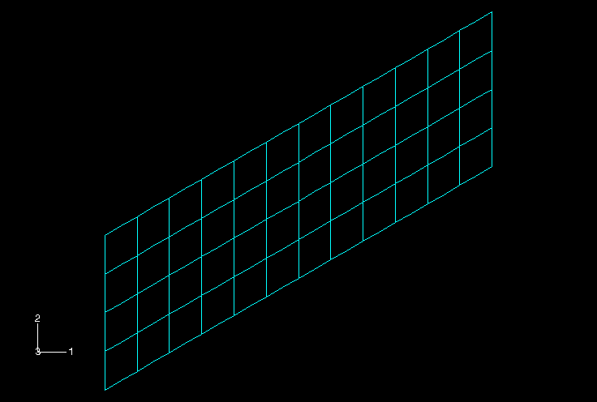
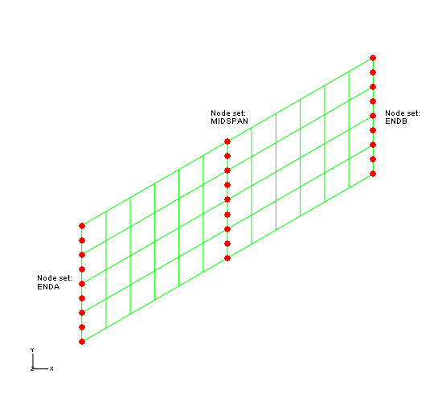
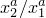
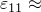
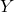
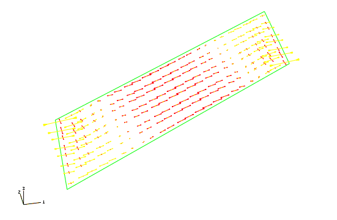
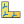
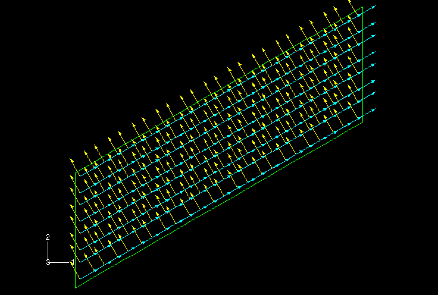

# 5.5 Example: skew plate


You have been asked to model the plate shown in [Figure 5--10](ch05s05.md#gss-skewed-plate). 

**Figure 5–10** Sketch of the skew plate.


It is skewed 30 to the global 1-axis, is built-in at one end, and is constrained to move on rails parallel to the plate axis at the other end. You are to determine the midspan deflection when the plate carries a uniform pressure. You are also to assess whether a linear analysis is valid for this problem. You will perform an analysis using Abaqus/Standard.

### 5.5.1 Coordinate system

The orientation of the structure in the global coordinate system and the suggested origin of the system are shown in [Figure 5--10](ch05s05.md#gss-skewed-plate). The plate lies in the global 1–2 plane. Will it be easy to interpret the results of the simulation if you use the default material directions for the shell elements in this model?

### 5.5.2 Mesh design

[Figure 5--11](ch05s05.md#gss-mesh-design) shows the suggested mesh for this simulation.

**Figure 5–11** Suggested mesh design for the skewed plate simulation.



You must answer the following questions before selecting an element type: Is the plate thin or thick? Are the strains small or large? The plate is quite thin, with a thickness-to-minimum span ratio of 0.02. (The thickness is 0.8 cm and the minimum span is 40 cm.) While we cannot readily predict the magnitude of the strains in the structure, we think that the strains will be small. Based on this information, you choose quadratic shell elements (S8R5), because they give accurate results for thin shells in small-strain simulations. For further details on shell element selection, consult ["Choosing a shell element," Section 29.6.2 of the Abaqus Analysis User's Guide](../usb/usb-link.md#usb-elm-eshellelem).

### 5.5.3 Preprocessing---creating the model

The input file for the skew plate example is `skew.inp`, which is available in ["Skew plate," Section A.3](ap01s03.md). This example uses the mesh shown in [Figure 5--11](ch05s05.md#gss-mesh-design) by creating the node sets shown in [Figure 5--12](ch05s05.md#gss-nodeset), and stores all of the the elements in an element set called `PLATE`. 

**Figure 5–12** Node sets needed for the skew plate simulation.



The following steps in this example describe how the material and history information is defined in this input file. This exercise will give you a better understanding of how the various option blocks combine to define an Abaqus model. If you wish to create the entire model using Abaqus/CAE, refer to ["Example: skew plate," Section 5.5 of Getting Started with Abaqus: Interactive Edition](../gsa/gsa-link.md#gsa-shl-example-skewplate).

Before you start to build the model, decide on a system of units. The dimensions are given in cm, but the loading and material properties are given in MPa and GPa. Since these are not consistent units, you must choose a consistent system to use in your model and convert the necessary input data.

### 5.5.4 Reviewing the input file---the model data

At this point we assume that you have created the basic mesh using your preprocessor. In this section you will review and make corrections to your input file, as well as include additional information, such as material data.

**Model description**

The following would be a suitable description in the [*HEADING](../key/key-link.md#usb-kws-mheading) option for this simulation: 

```
*HEADING
Linear Elastic Skew Plate. 20 kPa Load.
S.I. Units (meters, newtons, sec, kilograms)
```
It clearly explains what you are modeling and what units you are using.

**Element connectivity**

Check to make sure that you are using the correct element type (S8R5). It is possible that you specified the wrong element type in the preprocessor or that the translator made a mistake when generating the input file. The [*ELEMENT](../key/key-link.md#usb-kws-melement) option block in your model should begin with the following:

```
*ELEMENT, TYPE=S8R5, ELSET=PLATE
```
In some examples, the name given for the ELSET parameter is not a descriptive name like `PLATE`. If necessary, you may want to change these values, because meaningful names for node and element sets make input files easy to understand.

**Node sets**

The three node sets shown in [Figure 5--12](ch05s05.md#gss-nodeset) will be useful in completing the model of the plate. These node sets are described in the input file using [*NSET](../key/key-link.md#usb-kws-mnset) option blocks.

**Defining alternative material directions**

If you use the default material directions, the direct stress in the material 1-direction, , will contain contributions from both the axial stress, produced by the bending of the plate, and the stress transverse to the axis of the plate. It will be easier to interpret the results if the material directions are aligned with the axis of the plate and the transverse direction. Therefore, a local rectangular coordinate system is needed in which the local -direction lies along the axis of the plate (i.e., at 30 to the global 1-axis) and the local -direction is also in the plane of the plate.

As you learned in ["Shell material directions," Section 5.3](ch05s03.md), the [*ORIENTATION](../key/key-link.md#usb-kws-morientation) option defines such a local coordinate system. Choose point *a* (see [Figure 5--8](ch05s03.md#gss-coord-system)) to have coordinates (10.0E2, 5.77E2, 0.)—so that  = tan 30—and point *b* to have coordinates  (5.77E2, 10.E2, 0.). You must also specify which axis is not projected onto the shell surface (the -direction in this model) as well as an additional rotation (zero using this method). The following [*ORIENTATION](../key/key-link.md#usb-kws-morientation) option block creates the proper local coordinate system, named `SKEW`:

```
*ORIENTATION, NAME=SKEW, SYSTEM=RECTANGULAR
10.0E-2,5.77E-2,0.0, -5.77E-2,10.0E-2,0.0
3, 0.0
```
Alternatively, you can define exactly the same local coordinate system by choosing point *a* and point *b* to lie on the global coordinate 1- and 2-axes and specifying an additional rotation of 30:
```
*ORIENTATION, NAME=SKEW, SYSTEM=RECTANGULAR
1., 0., 0., 0., 1., 0.
3, 30.
```

**Section properties**

Since the structure is made of a single material with constant thickness, the section properties are the same for all elements. Therefore, you can use the element set `PLATE` (which includes all elements) to assign the physical and material properties to the elements. Since you assume that the plate is linear elastic, the [*SHELL GENERAL SECTION](../key/key-link.md#usb-kws-mshellgensect) option is more efficient than using the [*SHELL SECTION](../key/key-link.md#usb-kws-mshellsection) option. The following element property option block defines the section properties for this example:

```
*SHELL GENERAL SECTION, ELSET=PLATE, MATERIAL=MAT1,
ORIENTATION=SKEW
0.8E-2,
```

The ORIENTATION parameter tells Abaqus to use the local coordinate system named `SKEW` to define the material directions for the shells in element set `PLATE`. All element variables will be defined in the `SKEW` coordinate system.

**Material properties**

The plate is made of an isotropic, linear elastic material that has a Young's modulus of 30.0 GPa and a Poisson's ratio of 0.3. The following material option block specifies this material data:

```
*MATERIAL, NAME=MAT1
*ELASTIC
30.0E9, 0.3
```

**Local directions at the nodes**

While the [*ORIENTATION](../key/key-link.md#usb-kws-morientation) option defines a local coordinate system for elements, you must use the [*TRANSFORM](../key/key-link.md#usb-kws-mtransform) option to define a local coordinate system for nodes. The two options are completely independent of each other. If a node refers to a local coordinate system defined with [*TRANSFORM](../key/key-link.md#usb-kws-mtransform), all data pertaining to the node—such as boundary conditions, concentrated loads, or nodal output variables (displacements, velocities, reaction forces, etc.)—are defined in the transformed coordinate system.

The [*TRANSFORM](../key/key-link.md#usb-kws-mtransform) option has the following format:

```
[*TRANSFORM](../key/key-link.md#usb-kws-mtransform), NSET=*<node set name>*, TYPE=*<axis type>*
<>, <>, <>, <>, <>, <>
```
The data line specifies the coordinates of two points, *a* and *b*, in much the same way as the [*ORIENTATION](../key/key-link.md#usb-kws-morientation) option. The coordinate system defined with [*TRANSFORM](../key/key-link.md#usb-kws-mtransform) does not rotate as the body deforms; it is fixed in the original directions defined at the beginning of the simulation. Rectangular (TYPE=R), cylindrical (TYPE=C), and spherical (TYPE=S) coordinate systems can be specified. Use the NSET parameter to specify the node sets that use this local coordinate system.

As shown in [Figure 5--10](ch05s05.md#gss-skewed-plate), one end of the plate is constrained to move on rails that are parallel to the axis of the plate. Since this boundary condition does not coincide with the global axes, you must transform the nodes on this end of the plate into a local coordinate system that has an axis aligned with the plate. The following [*TRANSFORM](../key/key-link.md#usb-kws-mtransform) option achieves this transformation:

```
*TRANSFORM, NSET=ENDB, TYPE=R
10.0E-2,5.77E-2,0.0, -5.77E-2,10.0E-2,0.0
```
This option block defines the degrees of freedom for node set `ENDB` in a local coordinate system whose -axis is aligned with the long axis of the plate (i.e., the local system is rotated 30 about the global 3-axis). 

### 5.5.5 Reviewing the input file---the history data

We now review the history definition portion of the input file. A single step is needed to define this simulation.

**Step definition**

The [*STEP](../key/key-link.md#usb-kws-hstep) definition specifies a linear, static simulation:

```
*STEP, PERTURBATION
Uniform pressure (20.0 kPa) load
*STATIC
```

The line following [*STEP](../key/key-link.md#usb-kws-hstep), PERTURBATION contains a clear description of the loading applied in this step.

**Boundary conditions**

The nodes at the left-hand end of the plate (node set `ENDA`) need to be constrained completely by the following boundary condition:

```
*BOUNDARY
ENDA, ENCASTRE
```

The nodes at the right-hand end of the plate need to be constrained to model their “rail” boundary condition. Since you have transformed the nodes at this end using [*TRANSFORM](../key/key-link.md#usb-kws-mtransform), you must apply the boundary conditions in the local coordinate system. To allow these nodes to move in the local 1-direction (along the axis of the plate) only, all other degrees of freedom must be constrained as follows:

```
ENDB, 2,6
```
Had you not defined node sets `ENDA` and `ENDB`, you would have had to create a data line for each node.

**Loading**

A distributed pressure load of 20.0 kPa is applied to the plate in this simulation. As shown in [Figure 5--10](ch05s05.md#gss-skewed-plate), the pressure acts in the negative global 3-direction. Pressure loads are applied to the faces of elements with the [*DLOAD](../key/key-link.md#usb-kws-hdload) option ([*DLOAD](../key/key-link.md#usb-kws-hdload) is described in [Chapter 4, "Using Continuum Elements](ch04.md),” for the lug model example). Shell elements have only one face; therefore, the load identifier for pressure is just “P.” A positive pressure on a shell acts in the direction of the positive element normal. The shell elements in the input file from ["Skew plate," Section A.3](ap01s03.md), have normals that align with the positive global 3-axis. Thus, the following input defines the correct pressure loading in that model:

```
*DLOAD
PLATE, P, -20000.0
```
Since element set `PLATE` contains all elements in the model, this option block applies a pressure load to all elements in the model. 

**Output requests**

If the preprocessor has generated default output request options, you should delete them. To create an output database ( `.odb`) file for use with Abaqus/Viewer and printed tables of the element stresses, nodal reaction forces and moments, and displacements at the midspan of the plate, the following output requests are included in the input file:

```
*OUTPUT, FIELD, OP=NEW
*NODE OUTPUT
U, RF
*ELEMENT OUTPUT
S, E
*OUTPUT, HISTORY, OP=NEW
*NODE OUTPUT, NSET=MIDSPAN
U,
*EL PRINT
S,
E,
*NODE PRINT, SUMMARY=NO, TOTALS=YES, GLOBAL=YES
RF,
*NODE PRINT, NSET=MIDSPAN
U,
```

Specifying the [*OUTPUT](../key/key-link.md#usb-kws-houtput) option overrides the default output selections noted in the previous chapters. The option is used with the FIELD and HISTORY parameters to request field and history output to the output database file. In general, field output is used to generate contour plots, symbol plots, and deformed shape plots; history output is used for *X–Y* plotting. In conjunction with the [*OUTPUT](../key/key-link.md#usb-kws-houtput) option, the [*NODE OUTPUT](../key/key-link.md#usb-kws-hnodeoutput) option is used to request output of nodal variables and the [*ELEMENT OUTPUT](../key/key-link.md#usb-kws-helementoutput) option is used for output of element variables.

### 5.5.6 Running the analysis

After storing your input in a file called `skew.inp`, run the analysis interactively. If you do not remember how to run the analysis, see ["Running the analysis," Section 4.3.6](ch04s03.md#gsk-gen-ctm-runninganal). If your analysis does not complete, check the data file, `skew.dat`, for error messages. Modify your input file to remove the errors; if you still have trouble running your model, compare your input file to the one given in ["Skew plate," Section A.3](ap01s03.md).

### 5.5.7 Results

After running the simulation successfully, look at the table of stresses in the data file, `skew.dat`. An excerpt from the table is shown below.

```
   THE FOLLOWING TABLE IS PRINTED FOR ALL ELEMENTS WITH TYPE S8R5 AT THE INTEGRATION POINTS

    ELEMENT  PT SEC FOOT-   S11         S22         S12     
                 PT NOTE 

           1   1  1  OR -4.2759E+07 -9.3051E+06  6.7584E+06
           1   1  3  OR  4.2759E+07  9.3051E+06 -6.7584E+06
           1   2  1  OR -7.4724E+07 -2.7832E+06  1.0599E+07
           1   2  3  OR  7.4724E+07  2.7832E+06 -1.0599E+07
           1   3  1  OR -7.3273E+07 -2.8832E+07  2.1403E+07
           1   3  3  OR  7.3273E+07  2.8832E+07 -2.1403E+07
           1   4  1  OR -8.2885E+07 -1.8951E+07  1.4786E+07
           1   4  3  OR  8.2885E+07  1.8951E+07 -1.4786E+07
           :
           :
         114   1  1  OR -8.2885E+07 -1.8951E+07  1.4786E+07
         114   1  3  OR  8.2885E+07  1.8951E+07 -1.4786E+07
         114   2  1  OR -7.3273E+07 -2.8832E+07  2.1403E+07
         114   2  3  OR  7.3273E+07  2.8832E+07 -2.1403E+07
         114   3  1  OR -7.4724E+07 -2.7832E+06  1.0599E+07
         114   3  3  OR  7.4724E+07  2.7832E+06 -1.0599E+07
         114   4  1  OR -4.2759E+07 -9.3051E+06  6.7584E+06
         114   4  3  OR  4.2759E+07  9.3051E+06 -6.7584E+06

 MAXIMUM                2.3826E+08  1.0326E+08  7.0025E+07
 ELEMENT                        4           4           4

 MINIMUM               -2.3826E+08 -1.0326E+08 -7.0025E+07
 ELEMENT                        4           4           4

 OR: *ORIENTATION USED FOR THIS ELEMENT
```
The second column (SEC PT—section point) identifies the location in the element where the stress was calculated. Section point 1 lies on the SNEG surface of the shell, and section point 3 lies on the SPOS surface. The letters OR appear in the FOOTNOTE column, indicating that an [*ORIENTATION](../key/key-link.md#usb-kws-morientation) option has been used for the element: the stresses refer to a local coordinate system.

Check that the small-strain assumption was valid for this simulation. The axial strain corresponding to the peak stress is  0.008. Because the strain is typically considered small if it is less than 4 or 5%, a strain of 0.8% is well within the appropriate range to be modeled with S8R5 elements.

Look at the reaction forces and moments in the following table: 

```
   THE FOLLOWING TABLE IS PRINTED FOR ALL NODES

       NODE FOOT-   RF1         RF2         RF3         RM1         RM2         RM3      
            NOTE

          1       0.000       0.000      -109.9       1.775     -0.3283       0.000     
          2       0.000       0.000       6.448       7.597      -36.46       0.000     
          3       0.000       0.000       239.9       6.568      -35.46       0.000     
          4       0.000       0.000       455.4       6.806      -88.26       0.000     
          5       0.000       0.000       260.5       6.948      -51.13       0.000     
          6       0.000       0.000       750.8       8.305      -126.5       0.000     
          7       0.000       0.000       73.90       8.749      -62.23       0.000     
          8       0.000       0.000       2286.       31.06      -205.8       0.000     
          9       0.000       0.000       37.19      -1.610      -76.45       0.000     
       1201       0.000       0.000       37.19       1.610       76.45       0.000     
       1202       0.000       0.000       2286.      -31.06       205.8       0.000     
       1203       0.000       0.000       73.90      -8.749       62.23       0.000     
       1204       0.000       0.000       750.8      -8.305       126.5       0.000     
       1205       0.000       0.000       260.5      -6.948       51.13       0.000     
       1206       0.000       0.000       455.4      -6.806       88.26       0.000     
       1207       0.000       0.000       239.9      -6.568       35.46       0.000     
       1208       0.000       0.000       6.448      -7.597       36.46       0.000     
       1209       0.000       0.000      -109.9      -1.775      0.3283       0.000     

 TOTAL          0.000       0.000       8000.      3.7096E-11 -1.8769E-09   0.000    

```
The reaction forces were written in the global coordinate system because of how we requested the reaction force output (GLOBAL=YES on the [*NODE PRINT](../key/key-link.md#usb-kws-hnodeprint) option). Otherwise, the reactions for the nodes would have been written in the local coordinate system. Check that the sum of the reaction forces and reaction moments with the corresponding applied loads is zero. The nonzero reaction force in the 3-direction equilibrates the vertical force of the pressure load (20 kPa  1.0 m  0.4 m). In addition to the reaction forces, the pressure load causes self-equilibrating reaction moments at the constrained rotational degrees of freedom.

The table of displacements (which is not shown here) shows that the mid-span deflection across the plate is 5.3 cm, which is approximately 5% of the plate's length. By running this as a linear analysis, we assume the displacements to be small. It is questionable whether these displacements are truly small relative to the dimensions of the structure; nonlinear effects may be important, requiring further investigation. In this case we need to perform a geometrically nonlinear analysis, which is discussed in [Chapter 8, "Nonlinearity](ch08.md).”

### 5.5.8 Postprocessing

This section discusses postprocessing with Abaqus/Viewer. Both contour and symbol plots are useful for visualizing shell analysis results. Since contour plotting was discussed in detail in [Chapter 4, "Using Continuum Elements](ch04.md),” we use symbol plots here.

Start Abaqus/Viewer by typing the following command at the operating system prompt:

```
abaqus viewer odb=skew
```

By default, Abaqus/Viewer plots the undeformed shape of the model.

**Element normals**

Use the undeformed shape plot to check the model definition. Check that the element normals for the skew-plate model were defined correctly and point in the positive 3-direction.

**To display the element normals:**

1. From the main menu bar, select ****Options****Common****; or use the  tool in the toolbox. The **Common Plot Options** dialog box appears.
2. Click the **Normals** tab.
3. Toggle on **Show normals**, and accept the default setting of **On elements**.
4. Click **OK** to apply the settings and to close the dialog box.

The default view is isometric. You can change the view using the options in the view menu or the view tools (such as ) from the **View Manipulation** toolbar.

**To change the view:**

1. From the main menu bar, select ****View****Specify****. The **Specify View** dialog box appears.
2. From the list of available methods, select **Viewpoint**.
3. Enter the -, - and -coordinates of the viewpoint vector as `0.2, 1, 0.8` and the coordinates of the up vector as `0, 0, 1`.
4. Click **OK**. Abaqus/Viewer displays your model in the specified view, as shown in [Figure 5--13](ch05s05.md#gss-normals-c). **Figure 5--13** Shell element normals in the skew plate model. 

**Symbol plots**

Symbol plots display the specified variable as a vector originating from the node or element integration points. You can produce symbol plots of most tensor- and vector-valued variables. The exceptions are mainly nonmechanical output variables and element results stored at nodes, such as nodal forces. The relative size of the arrows indicates the relative magnitude of the results, and the vectors are oriented along the global direction of the results. The symbol plot legend shows how each arrow color corresponds to a specific range of values. You can plot results for the resultant of variables such as displacement (U), reaction force (RF), etc.; or you can plot individual components of these variables.

Before proceeding, suppress the visibility of the element normals.

**To generate a symbol plot of the displacement:**

1. From the list of variable types on the left side of the **Field Output** toolbar, select **Symbol**.
2. From the list of output variables in the center of the toolbar, select **U**.
3. From the list of vector quantities and selected components, select **U3**. Abaqus/Viewer displays a symbol plot of the displacement vector resultant on the deformed model shape.
4. The default shaded render style obscures the arrows. An unobstructed view of the arrows can be obtained by changing the render style to **Wireframe** using the** Common Plot Options** dialog box. If the element normals are still visible, you should turn them off at this time.
5. The symbol plot can also be based on the undeformed model shape. From the main menu bar, select ****Plot****Symbols****On Undeformed Shape****. A symbol plot on the undeformed model shape appears, as shown in [Figure 5--14](ch05s05.md#gss-displacement).

**Figure 5–14** Symbol plot of displacement.


You can plot principal values of tensor variables such as stress using symbol plots. A symbol plot of the principal values of stress yields three vectors at every integration point, each corresponding to a principal value oriented along the corresponding principal direction. Compressive values are indicated by arrows pointing toward the integration point, and tensile values are indicated by arrows pointing away from the integration point. You can also plot individual principal values.

**To generate a symbol plot of the principal stresses:**

1. From the list of variable types on the left side of the **Field Output** toolbar, select **Symbol**.
2. From the list of output variables in the center of the toolbar, select **S**.
3. From the list of tensor quantities and components, select **ALL_PRINCIPAL_COMPONENTS** as the tensor quantity. Abaqus/Viewer displays a symbol plot of principal stresses.
4. From the main menu bar, select ****Options****Symbol****; or use the **Symbol Options**  tool in the toolbox to change the arrow length. The **Symbol Plot Options** dialog box appears.
5. In the **Color & Style** page, click the **Tensor** tab.
6. Drag the **Size** slider to select `2` as the arrow length.
7. Click **OK** to apply the settings and to close the dialog box. The symbol plot shown in [Figure 5--15](ch05s05.md#gss-vector-plot) appears. **Figure 5--15** Symbol plot of principal stresses on the bottom surface of the plate. 
8. The principal stresses are displayed at section point 1 by default. To plot stresses at nondefault section points, select ****Result****Section Points**** from the main menu bar to open the **Section Points** dialog box.
9. Select the desired nondefault section point for plotting.
10. In a complex model, the element edges can obscure the symbol plots. To suppress the display of the element edges, choose **Feature edges** in the **Basic** tabbed page of the **Common Plot Options** dialog box. [Figure 5--16](ch05s05.md#gss-perimeter) shows a symbol plot of the principal stresses at the default section point with only feature edges visible. **Figure 5--16** Symbol plot of principal stresses using feature edges. 

**Material directions**

Abaqus/Viewer also allows you visualize the element material directions. This feature is particularly useful if you would like to verify that the material directions were assigned correctly in the simulation.

**To plot the material directions:**

1. From the main menu bar, select ****Plot****Material Orientations****On Undeformed Shape****; or use the  tool in the toolbox. The material orientation directions are plotted on the undeformed shape. By default, the triads that represent the material orientation directions are plotted without arrowheads.
2. From the main menu bar, select ****Options****Material Orientation****; or use the **Material Orientation Options**  tool in the toolbox to display the triads with arrowheads. The **Material Orientation Plot Options** dialog box appears.
3. Set the **Arrowhead** option to use filled arrowheads in the triad.
4. Click **OK** to apply the settings and to close the dialog box.
5. Use the predefined views available in the **Views** toolbar to display the plate as shown in [Figure 5--17](ch05s05.md#gss-orientation). In this figure, perspective is turned off. To turn off perspective, click the  tool in the **View Options** toolbar. **Tip:**If the **Views** toolbar is not visible, select ****View****Toolbars****Views**** from the main menu bar. By default, the material 1-direction is colored blue, the material 2-direction is colored yellow, and, if it is present, the material 3-direction is colored red. **Figure 5--17** Plot of material orientation directions in the plate. 

**Evaluating results based on tabular data**

As noted previously, a convenient alternative to writing printed data to the data ( `.dat`) file is to generate a tabular report using Abaqus/Viewer. With the aid of display groups, create a tabular data report of the whole model element stresses (components **S11**, **S22**, and **S12**), the reaction forces and moments at the supported nodes (sets **ENDA** and **ENDB**), and the displacements of the midspan nodes (set **MIDSPAN**). The stress data are shown below.

```
Field Output Report

Source 1
---------

   ODB: skew.odb
   Step: Step-1
   Frame: Increment      1: Step Time =   2.2200E-16

Loc 1 : Integration point values at shell general ... : SNEG, (fraction = -1.0)
Loc 2 : Integration point values at shell general ... : SPOS, (fraction =  1.0)

Output sorted by column "Element Label".

Field Output reported at integration points for part: PLATE-1

  Element    Int          S.S11         S.S11         S.S22         S.S22         S.S12         S.S12
    Label     Pt         @Loc 1        @Loc 2        @Loc 1        @Loc 2        @Loc 1        @Loc 2
-----------------------------------------------------------------------------------------------------
        1      1  -42.7593E+06   42.7593E+06  -9.30515E+06   9.30515E+06   6.75836E+06  -6.75836E+06
        1      2  -74.7242E+06   74.7242E+06  -2.78322E+06   2.78322E+06   10.5987E+06  -10.5987E+06
        1      3  -73.2731E+06   73.2731E+06   -28.832E+06    28.832E+06   21.4032E+06  -21.4032E+06
        1      4  -82.8849E+06   82.8849E+06  -18.9513E+06   18.9513E+06   14.7861E+06  -14.7861E+06
       .
       .
      114      1  -82.8849E+06   82.8849E+06  -18.9513E+06   18.9513E+06   14.7861E+06  -14.7861E+06
      114      2  -73.2731E+06   73.2731E+06   -28.832E+06    28.832E+06   21.4032E+06  -21.4032E+06
      114      3  -74.7242E+06   74.7242E+06  -2.78322E+06   2.78322E+06   10.5987E+06  -10.5987E+06
      114      4  -42.7593E+06   42.7593E+06  -9.30515E+06   9.30515E+06   6.75836E+06  -6.75836E+06

  Minimum         -238.256E+06  -90.2214E+06   -103.26E+06  -10.5215E+06  -18.8595E+06  -70.0247E+06
      At Element             4            54             4            63            81           111
          Int Pt             3             3             1             1             2             2

  Maximum          90.2214E+06   238.256E+06   10.5215E+06    103.26E+06   70.0247E+06   18.8595E+06
      At Element            54             4            63             4           111            81
          Int Pt             3             3             1             1             2             2

```

The reaction forces and moments are listed in the following table: 

```
Field Output Report

Source 1
---------

   ODB: skew.odb
   Step: Step-1
   Frame: Increment      1: Step Time =   2.2200E-16

Loc 1 : Nodal values from source 1

Output sorted by column "Node Label".

Field Output reported at nodes for part: PART-1-1

   Node       RF.RF1       RF.RF2       RF.RF3       RM.RM1       RM.RM2       RM.RM3
  Label       @Loc 1       @Loc 1       @Loc 1       @Loc 1       @Loc 1       @Loc 1
-------------------------------------------------------------------------------------
      1           0.           0.     -109.912      1.77484 -328.266E-03           0.
      2           0.           0.      6.44824      7.59742     -36.4615           0.
      3           0.           0.      239.923       6.5683     -35.4597           0.
      4           0.           0.      455.379      6.80581     -88.2614           0.
      5           0.           0.      260.543      6.94783     -51.1276           0.
      6           0.           0.      750.833      8.30465     -126.458           0.
      7           0.           0.       73.904      8.74902     -62.2273           0.
      8           0.           0.  2.28569E+03      31.0634     -205.759           0.
      9           0.           0.      37.1932      -1.6098     -76.4492           0.
   1201           0.           0.      37.1932       1.6098      76.4492           0.
   1202           0.           0.  2.28569E+03     -31.0634      205.759           0.
   1203           0.           0.       73.904     -8.74902      62.2273           0.
   1204           0.           0.      750.833     -8.30465      126.458           0.
   1205           0.           0.      260.543     -6.94783      51.1276           0.
   1206           0.           0.      455.379     -6.80581      88.2614           0.
   1207           0.           0.      239.923      -6.5683      35.4597           0.
   1208           0.           0.      6.44824     -7.59742      36.4615           0.
   1209           0.           0.     -109.912     -1.77484  328.266E-03           0.

  Minimum         0.           0.     -109.912     -31.0634     -205.759           0.
      At Node   1209         1209            1         1202            8         1209

  Maximum         0.           0.  2.28569E+03      31.0634      205.759           0.
      At Node   1209         1209            8            8         1202         1209

        Total     0.           0.  8.00000E+03           0.           0.           0.
```


