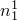
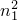
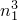
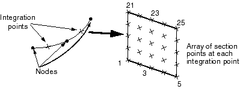
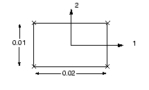
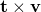
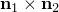
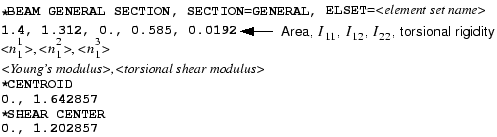

# 6.1 Beam cross-section geometry


You can use the [*BEAM SECTION](../key/key-link.md#usb-kws-mbeamsection) option or the [*BEAM GENERAL SECTION](../key/key-link.md#usb-kws-mbeamgensect) option to define the beam section. With either option you can define the beam cross-section geometrically by specifying the shape and dimensions of the section.  The [*BEAM GENERAL SECTION](../key/key-link.md#usb-kws-mbeamgensect) option can also be used to define the beam section through section engineering properties, such as area and moments of inertia. Alternatively, the beam section can be based on a mesh of special two-dimensional elements for which geometric quantities are calculated numerically.

Abaqus offers a variety of common cross-section shapes, as shown in [Figure 6--1](ch06s01.md#gss-beamsection), should you decide to define the beam profile geometrically. You can also define almost any thin-walled cross-section using the arbitrary cross-section definition. For a detailed discussion of the beam cross-sections available in Abaqus, see ["Beam cross-section library," Section 29.3.9 of the Abaqus Analysis User's Guide](../usb/usb-link.md#usb-elm-ebeamcrosssectlib).

**Figure 6–1** Beam cross-sections.


The basic format of the [*BEAM SECTION](../key/key-link.md#usb-kws-mbeamsection) option is

```
[*BEAM SECTION](../key/key-link.md#usb-kws-mbeamsection), ELSET=*<element set name>*, SECTION=*<section type>*, 
MATERIAL=*<material name>*
*<cross-section dimensions>* 
*<**>*,*<**>*,*<**>*
```
Set the SECTION parameter to one of the cross-sections shown in [Figure 6--1](ch06s01.md#gss-beamsection). Provide the required cross-section dimensions, which are different for each type of cross-section, as specified in ["Beam cross-section library," Section 29.3.9 of the Abaqus Analysis User's Guide](../usb/usb-link.md#usb-elm-ebeamcrosssectlib). The vector on the second data line defines the approximate normal, , which is explained later in this section.

The basic format of the [*BEAM GENERAL SECTION](../key/key-link.md#usb-kws-mbeamgensect) option is

```
[*BEAM GENERAL SECTION](../key/key-link.md#usb-kws-mbeamgensect), ELSET=*<element set name>*, SECTION=*<section type>*
*<cross-section dimensions> or <section engineering properties>* 
*<**>*,*<**>*,*<**>* 
*<Young's modulus (E)>*,*<torsional shear modulus (G)>*
```

To define the section's properties geometrically, set the SECTION parameter to one of the cross-sections shown in [Figure 6--1](ch06s01.md#gss-beamsection). In this case you provide the required cross-section dimensions the same way as you would with [*BEAM SECTION](../key/key-link.md#usb-kws-mbeamsection). The vector on the second data line again defines the approximate normal, . On the third line you enter the elastic material constants, because [*BEAM GENERAL SECTION](../key/key-link.md#usb-kws-mbeamgensect) does not refer to any material option block. If you define the section's properties geometrically with this option, the material behavior must be linear elastic.

The alternative is to set the SECTION parameter to GENERAL or NONLINEAR GENERAL, in which case you provide the section engineering properties (area, moments of inertia, and torsional constants) instead of the cross-section dimensions. These parameters allow you to combine the beam's geometry and material behavior to define its response to loads. This response may be linear or nonlinear. See ["Using a general beam section to define the section behavior," Section 29.3.7 of the Abaqus Analysis User's Guide](../usb/usb-link.md#usb-elm-eusingbeamgensect), for further details.

In Abaqus/Standard you can also define beams with linearly tapered cross-sections. General beam sections with linear response and standard library sections are supported.

Meshed beam cross-sections allow a description of the beam cross-section that includes multiple materials and complex geometry. This type of beam profile is discussed further in ["Meshed beam cross-sections," Section 10.6.1 of the Abaqus Analysis User's Guide](../usb/usb-link.md#usb-anl-ameshedsection).

### 6.1.1 Section points

When you specify [*BEAM SECTION](../key/key-link.md#usb-kws-mbeamsection), Abaqus calculates the beam element's response at an array of section points throughout the beam cross-section. The number of section points, as well as the section point locations, are shown in ["Beam cross-section library," Section 29.3.9 of the Abaqus Analysis User's Guide](../usb/usb-link.md#usb-elm-ebeamcrosssectlib). Element output variables, such as stress and strain, are available at any of the section points; however, by default output is provided at only a select number of section points, as listed in ["Beam cross-section library," Section 29.3.9 of the Abaqus Analysis User's Guide](../usb/usb-link.md#usb-elm-ebeamcrosssectlib). All the section points for a rectangular cross-section (SECTION=RECT) are shown in [Figure 6--2](ch06s01.md#gss-rectbeamelem). 

**Figure 6–2** Integration and default section points in a B32 rectangular beam element.



For this cross-section output is provided at points 1, 5, 21, and 25 by default. The beam element shown in [Figure 6--2](ch06s01.md#gss-rectbeamelem) uses a total of 50 section points, 25 at each of the two integration points, to calculate its stiffness.

When you specify [*BEAM GENERAL SECTION](../key/key-link.md#usb-kws-mbeamgensect), Abaqus does not calculate the beam's response at the section points. Instead, it uses the section engineering properties to determine the section response. Therefore, Abaqus uses section points only as locations for output, and you need to specify the section points at which you desire output. Use the [*SECTION POINTS](../key/key-link.md#usb-kws-msectionpoints) option, which must follow the [*BEAM GENERAL SECTION](../key/key-link.md#usb-kws-mbeamgensect) option, to specify the location of the section points: 

```
[*SECTION POINTS](../key/key-link.md#usb-kws-msectionpoints)
 *<**>*,*<**>*
```

The - and -coordinates are given in the local 1–2 coordinate system of the beam cross-section. For example, if we require stresses at the corners of an element with the rectangular beam cross-section shown in [Figure 6--3](ch06s01.md#gss-sectionpoints), we would use the following option block:

```
[*SECTION POINTS](../key/key-link.md#usb-kws-msectionpoints)
-0.01, -0.005
 0.01, -0.005 
 0.01,  0.005
-0.01,  0.005
```

**Figure 6–3** Section points at the corners of a rectangular beam.



The points you specify are assigned identifying numbers based on the order they are given; i.e., the first point is section point 1, the second is section point 2, etc.

### 6.1.2 Cross-section orientation

You must define the orientation of a beam's cross-section in global Cartesian space. The local tangent along the beam element, , is defined as the vector along the element axis pointing from the first node of the element to the next node. The beam cross-section is perpendicular to this local tangent. The local (1–2) beam section axes are represented by the vectors  and . The three vectors , , and  form a local, right-handed, coordinate system (see [Figure 6--4](ch06s01.md#gss-crosssect-orient)).

**Figure 6–4** Orientation of the beam element tangent, , and beam section axes,  and .


The -direction is always (0.0, 0.0, 1.0) for two-dimensional beam elements.

For three-dimensional beam elements there are several ways to define the orientation of the local beam section axes. The simplest is to specify an extra node on the data line defining the element in the [*ELEMENT](../key/key-link.md#usb-kws-melement) option. The vector, , from the first node in the beam element to this additional node (see [Figure 6--4](ch06s01.md#gss-crosssect-orient)), is used initially as an approximate -direction. Abaqus then defines the beam's -direction as . Having determined , Abaqus defines the actual -direction as . This procedure ensures that the local tangent and local beam section axes form an orthogonal system.

Alternatively, you can give an approximate -direction on the element section option (either [*BEAM SECTION](../key/key-link.md#usb-kws-mbeamsection) or [*BEAM GENERAL SECTION](../key/key-link.md#usb-kws-mbeamgensect)). Abaqus then uses the procedure described above to calculate the actual beam section axes. If you specify both an extra node and an approximate -direction, the additional node method takes precedence. Abaqus uses the vector from the origin to the point (0.0, 0.0, 1.0) as the default -direction if you provide no approximate -direction.

There are two methods that can be used to override the -direction defined by Abaqus. One is to give the components of  as the 4th, 5th, and 6th data values following the nodal coordinates on the data lines of the [*NODE](../key/key-link.md#usb-kws-mnode) option. The alternative is to use the [*NORMAL](../key/key-link.md#usb-kws-mnormal) option. If both methods are used, the [*NORMAL](../key/key-link.md#usb-kws-mnormal) option takes precedence. Abaqus again defines the -direction as .

The -direction that you provide need not be orthogonal to the beam element tangent, . When you provide the -direction, the local beam element tangent is redefined as the value of the cross product . It is quite possible in this situation that the redefined local beam tangent, , will not align with the beam axis, as defined by the vector from the first to the second node. If the -direction subtends an angle greater than 20 with the plane perpendicular to the element axis, Abaqus issues a warning message in the data file.

The example presented in ["Example: cargo crane," Section 6.4](ch06s04.md), explains how to assign the beam cross-section orientation in your model.

### 6.1.3 Beam element curvature

The curvature of beam elements is based on the orientation of the beam's -direction relative to the beam axis. If the -direction and the beam axis are not orthogonal (i.e., the beam axis and the tangent, , do not coincide), the beam element is considered to be curved initially. Since the behavior of curved beams is different from the behavior of straight beams, you should always check your model to ensure that the correct normals and, hence, the correct curvatures are used. For beams and shells Abaqus uses the same algorithm to determine the normals at nodes shared by several elements. A description is given in ["Beam element cross-section orientation," Section 29.3.4 of the Abaqus Analysis User's Guide](../usb/usb-link.md#usb-elm-ebeamcrosssection).

If you intend to model curved beam structures, you should use one of the two methods described earlier to define the -direction directly, allowing you great control in modeling the curvature. Even if you intend to model a structure made up of straight beams, curvature may be introduced as normals are averaged at shared nodes. You can rectify this problem by defining the beam normals directly as explained previously.

### 6.1.4 Nodal offsets in beam sections

When beam elements are used as stiffeners for shell models, it is convenient to have the beam and shell elements share the same nodes. By default, shell element nodes are located at the midplane of the shell, and beam element nodes are located somewhere in the cross-section of the beam. Hence, if the shell and beam elements share the same nodes, the shell and the beam stiffener will overlap unless the beam cross-section is offset from the location of the node (see [Figure 6--5](ch06s01.md#gss-nodaloffset)).

**Figure 6–5** Using beams as stiffeners for shell models: (a) without offset of beam sections; (b) with offset of beam sections.


With beam section types I, TRAPEZOID, and ARBITRARY it is possible to specify that the section geometry is located at some distance from the origin of the section's local coordinate system, which is located at the element's nodes. Since it is easy to offset beams with such cross-sections from their nodes, they can be used readily as stiffeners as shown in [Figure 6--5](ch06s01.md#gss-nodaloffset)(b). (If flange or web buckling of the stiffeners is important, shells should be used to model the stiffeners.)

The I-beam shown in [Figure 6--6](ch06s01.md#gss-ibeam) is attached to a shell 1.2 units thick. The following input is used to orient the beam section as it is shown in the figure:

```
[*BEAM SECTION](../key/key-link.md#usb-kws-mbeamsection), SECTION=I, ELSET=*<element set name>*, MATERIAL=*<material>*
0.6, 2.4, 3.0, 2.0, 0.2, 0.2, 0.2
*<**>*, *<**>*,*<**>*
```

**Figure 6–6** I-beam used as stiffener for a shell element.


The first item on the first data line defines the offset of the beam node from the bottom of the I-section. The offset is one half of the shell thickness or 0.6. The remaining data items are the beam depth, the width of the bottom and top flanges, the thickness of the bottom and top flanges, and the thickness of the web.

You can give the location of the centroid and shear center if you specify the [*BEAM GENERAL SECTION](../key/key-link.md#usb-kws-mbeamgensect) option with the parameter SECTION=GENERAL. The [*SHEAR CENTER](../key/key-link.md#usb-kws-mshearcenter) and [*CENTROID](../key/key-link.md#usb-kws-mcentroid) options allow these locations to be offset from the node, enabling you to model stiffeners readily. For example, the input for the I-beam attached to the shell as shown in [Figure 6--6](ch06s01.md#gss-ibeam) is:



It is also possible to define the beam nodes and shell nodes separately and connect the beam and shell using a rigid beam constraint between the two nodes. See ["Linear constraint equations," Section 35.2.1 of the Abaqus Analysis User's Guide](../usb/usb-link.md#usb-cni-pequation), for further details.


