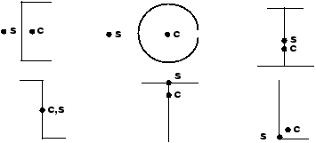

# 6.2 Formulation and integration

All beam elements in Abaqus are “beam-column” elements—meaning they allow axial, bending, and torsional deformation. The Timoshenko beam elements also consider the effects of transverse shear deformation.

### 6.2.1 Shear deformation

The linear elements (B21 and B31) and the quadratic elements (B22 and B32) are shear deformable, Timoshenko beams; thus, they are suitable for modeling both stout members, in which shear deformation is important, and slender beams, in which shear deformation is not important. The cross-sections of these elements behave in the same manner as the cross-sections of the thick shell elements, as illustrated in [Figure 6--7](ch06s02.md#gss-transhellsect)(b) and discussed in ["Shell formulation -- thick or thin," Section 5.2](ch05s02.md).

**Figure 6–7** Behavior of transverse beam sections in (a) slender beams and (b) thick beams.

Abaqus assumes the transverse shear stiffness of these beam elements to be linear elastic and constant. In addition, these beams are formulated so that their cross-sectional area can change as a function of the axial deformation, an effect that is considered only in geometrically nonlinear simulations (see [Chapter 8, "Nonlinearity](ch08.md)”) in which the POISSON parameter on the beam section property option has a nonzero value. These elements can provide useful results as long as the cross-section dimensions are less than 1/10 of the typical axial dimensions of the structure, which is generally considered to be the limit of the applicability of beam theory; if the beam cross-section does not remain plane under bending deformation, beam theory is not adequate to model the deformation.

The cubic elements available in Abaqus/Standard—the so-called Euler-Bernoulli beam elements (B23 and B33)—do not model shear flexibility. The cross-sections of these elements remain perpendicular to the beam axis (see [Figure 6--7](ch06s02.md#gss-transhellsect)(a)). Therefore, the cubic beam elements are most effective for modeling structures with relatively slender members. Since cubic elements model a cubic variation of displacement along their lengths, a structural member often can be modeled with a single cubic element for a static analysis and with a small number of elements for a dynamic analysis. These elements assume that shear deformations are negligible. Generally, if the cross-section dimensions are less than 1/15 of the typical axial dimensions of the structure, this assumption is valid.

### 6.2.2 Torsional response---warping

Structural members are often subjected to torsional moments, which occur in almost any three-dimensional frame structure. Loads that cause bending in one member may cause twisting in another, as shown in [Figure 6--8](ch06s02.md#gss-torsion). 

**Figure 6–8** Torsion induced in a frame structure.

The response of a beam to torsion depends on the shape of its cross-section. Generally, torsion in a beam produces warping or nonuniform out-of-plane displacements in the cross-section. Abaqus considers the effects of torsion and warping only in the three-dimensional elements. The warping calculation assumes that the warping displacements are small. The following cross-sections behave differently under torsion: solid cross-sections; closed, thin-walled cross-sections; and open, thin-walled cross-sections.

**Solid cross-sections**

A solid, non-circular cross-section does not remain plane under torsion; instead, the section warps. Abaqus uses St. Venant warping theory to calculate a single component of shear strain caused by the warping at each section point in the cross-section. The warping in such solid cross-sections is considered unconstrained and creates negligible axial stresses. (Warping constraints would affect the solution only in the immediate vicinity of the constrained end.) The torsional stiffness of a beam with a solid cross-section depends on the shear modulus, *G*, of the material and the torsion constant, *J*, of the beam section. The torsion constant depends on the shape and the warping characteristics of the beam cross-section. Torsional loads that produce large amounts of inelastic deformation in the cross-section cannot be modeled accurately with this approach.

**Closed, thin-walled cross-sections**

Beams that have closed, thin-walled, non-circular cross-sections (BOX or HEX) have significant torsional stiffness and, thus, behave in a manner similar to solid sections. Abaqus assumes that warping in these sections is also unconstrained. The thin-walled nature of the cross-section allows Abaqus to consider the shear strains to be constant through the wall thickness. The thin-walled assumption is generally valid provided that the wall thickness is 1/10 a typical beam cross-section dimension. Examples of typical cross-section dimensions for thin-walled cross-sections include:
- The diameter of a pipe section.
- The length of an edge of a box section.
- The typical edge length of an arbitrary section.

**Open, thin-walled cross-sections**

Open, thin-walled cross-sections are very flexible in torsion when warping is unconstrained, and the primary source of torsional stiffness in such structures is the constraint of the axial warping strains. Constraining the warping of open, thin-walled beams introduces axial stresses that can affect the beam's response to other loading types. Abaqus/Standard has shear deformable beam elements, B31OS and B32OS, which include the warping effects in open, thin-walled sections. These elements must be used when modeling structures with open, thin-walled cross-sections—such as a channel (defined as an ARBITRARY section) or an I-section—that are subjected to significant torsional loading.

The variation of the warping-induced axial deformation over the beam's cross-section is defined by the section's warping function. The magnitude of this function is treated as an extra degree of freedom, 7, in the open-section beam elements. Constraining this degree of freedom prevents warping at the nodes at which the constraints are applied.

So that the warping amplitude can be different in each branch, the junction between open-section beams in a frame structure generally should be modeled with separate nodes for each branch (see [Figure 6--9](ch06s02.md#gss-opensectbeam)).

**Figure 6–9** Connecting open-section beams.

However, if the connection is designed to prevent warping, all branches should share a common node, and the warping degree of freedom should be constrained using the [*BOUNDARY](../key/key-link.md#usb-kws-hboundary) option.

A shear force that does not act through the beam's shear center produces torsion. The twisting moment is equal to the shear force multiplied by its eccentricity with respect to the shear center. Often, the centroid and the shear center do not coincide in open, thin-walled beam sections (see [Figure 6--10](ch06s02.md#gss-shear-centroid)). If the nodes are not located at the shear center of the cross-section, the section may twist under loading.

**Figure 6–10** Approximate locations of shear centers, *s*, and centroids, *c*, for a number of beam cross-sections.

